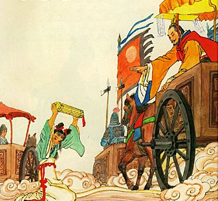

D087缇萦救父

公元前167年，汉文帝在位第13年时，废除了肉刑。肉刑是除死刑外，对罪犯的身体进行残害的处罚方式，通常包括在黥[qíng]刑（也叫墨刑）、劓[yì]刑、刖[yuè]刑等。黥刑就是在脸上刺字并涂上墨，劓刑就是割鼻子，刖刑就是砍脚。

受过肉刑的人，不仅身体的伤害永远无法复原；而且无论他走到哪里，都会被人一眼看出来，被大家歧视和侮辱，再也无法融入社会。仅仅犯了一次错，却要饱受一辈子的痛苦，对一个人而言，实在是太残酷了。

汉文帝怎么会突然要废除肉刑呢？是因为一个叫缇萦[tí yíng]的小女孩。缇萦的父亲叫淳于意，是个齐国人，曾当过管理粮仓的官员，后来跟人学习医术，成了非常有名的医生。淳于意有5个女儿，没有儿子，缇萦是其中最小的一个。

这一年，淳于意被人控告，犯了罪，要押送到都城长安去受刑。从齐国到长安有两千多里地，少说也要走一个多月。临出发时，他的五个女儿，都围在身边，不停地哭哭啼啼。淳于意被哭烦了，说：“哭什么哭？哭有用吗？唉，我怎么就没生个儿子呢？”

几个姐姐听了，就哭得更厉害了。缇萦却站起身来，擦干眼泪，对父亲说：“我和你一起走，路上就让我来照顾你吧？”淳于意看了看她，叹了口气说：“唉，也好吧，除了这个，你还能做什么呢？”在狱卒的催促下，两人动身出发了。

一路艰辛，两人终于到了长安。淳于意被关押起来，等待最后的审判。缇萦想着父亲将要受到肉刑处罚，一辈子再也抬不起头，不由地一阵心痛，忍不住又哭起来。她抱着试一试的想法，写一封信上书给汉文帝。

信上说：“尊敬的皇帝，我的父亲在齐国当官时，大家都说他好。因一时糊涂犯了法，要接受处罚。可是不管哪一种处罚，他都要受一辈子的侮辱。即便他改正错误了，也于事无补。我这个做女儿的，真是心痛啊！我愿意去官府当奴婢，给父亲赎罪。请成全我吧。“

没想到这封信，竟然真的让汉文帝看到了。汉文帝是个非常孝敬长辈的人。在他当皇帝以前，他的母亲曾经得了重病，一病就是三年。他天天在跟前照顾。煮好的汤药，他一定要亲口尝一尝，看看苦不苦，烫不烫，才给母亲喝。

汉文帝看到缇萦的信，心里非常感动。他马上召集大臣们说：”老百姓为什么会犯法呢？那是因为我们教育的不够。现在老百姓犯了错，还没来得及教育，就要接受严厉的处罚，一辈子也无法改过自新。这种既不合情理，效果也不好的作法，应该要改掉！”

大臣们经过仔细商议后，决定把脸上刺字的黥[qíng]刑改为修建城墙、舂[chōng]米（给谷子去壳的过程）等劳役；把割鼻子的劓[yì]刑改为打300大板；把砍脚的刖[yuè]刑改为打500大板。肉刑就正式地被废除了。

缇萦的父亲也就幸运地躲过了肉刑。然而，有的人就没那么幸运了。有的人身体较差，被打了300板、500板后，就被活活打死了。原来的肉刑还能活命的，现在反而加重，变成了死刑。这种情况，真是太出乎意料了。

到汉景帝时，先把300板改200板，把500板改为300板。可是，还是有人会被打死。于是再改，200板改为100板，300板改为200板；而且规定了板子的大小尺寸，板子要平整不能有突起；只能打屁股；打的过程不能换人，等等。从此以后，就再也没有人被打死了。

这次废除肉刑后，在中国2000多年的历史里，虽然肉刑偶尔还有，但再也没有大范围使用了。这是中国的刑罚制度从野蛮走向文明的重要转折点。然而，这样一件造福了千万老百姓的大事，竟然源于一个小女孩的试一试，真是想不到啊。

注：

1、宫刑也是肉刑的一种。汉文帝时期并未废除。史记的作者司马迁，就曾受宫刑。

2、刖刑有砍左脚，砍右脚之分。砍右脚时，通常是左右脚都砍掉，是对更严重罪行的惩罚。汉文帝废肉刑时，将砍左脚改为打500大板，把砍右脚则改为死刑。

你来说说：

如果你知道某个人犯过法，你会歧视、侮辱他吗？你会怎么对待他呢？

