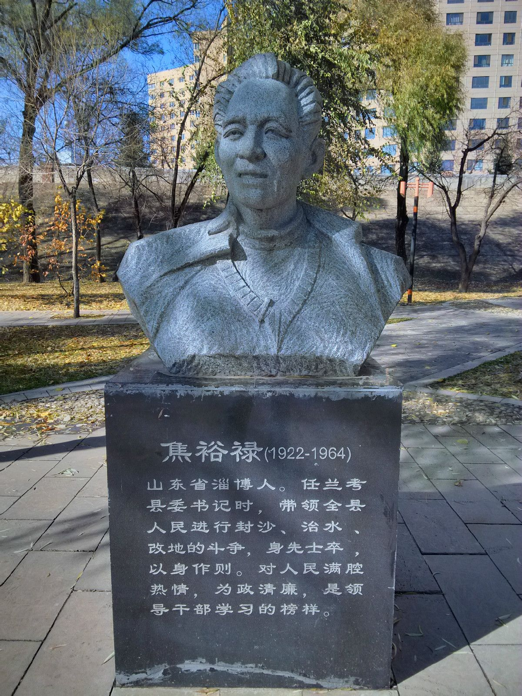

0514焦裕禄

（万象历史特约作者：东西望）

53年前的今天，1964年5月14日，毛主席的好学生，中国最有名的县委书记焦裕禄病逝于郑州

焦裕禄（1922—1964年），山东淄博博山县人。

作为一个南下干部，焦裕禄的履历本不出奇。他在三年困难时期后，出任县委副书记，率领兰考县群众展开生产自救活动，被新华社选作宣传典型，成为中国最出名的县委书记，激励了一代又一代的中国人。

他在兰考担任县委书记时，所表现出来的“亲民爱民、艰苦奋斗、科学求实、迎难而上、无私奉献”的精神，被后人称之为“焦裕禄精神”。2009年，被评为“100位新中国成立以来感动中国人物”。

**人民的儿子**

1922年8月16日，焦裕禄出生于山东淄博博山县北崮村。幼年家贫，仅接受过4年小学教育。1939年（17岁），抗日期间，焦裕禄被日军掳去辽宁抚顺做苦工。1941年（19岁），焦裕禄设法逃出，流落到江苏宿迁。抗战胜利后，回到家乡。

1946年（24岁），焦裕禄在家乡加入中国共产党。1948年（26岁），随南下工作队前往河南省尉氏县。1950年（28岁），焦裕禄被任命为尉氏县大营区委副书记兼区长。

1953年（31岁），焦裕禄升任共青团郑州地委第二书记，同年调任洛阳矿山机器厂临时公路总指挥。1954年8月起，相继在哈尔滨工业大学、大连起重机厂机械加工车间进修。1956年底（34岁），焦裕禄返回洛阳矿山机器厂，被任命为一金工车间主任、调度科长等职。在此期间，焦裕禄患上了肝病。

**兰考书记**

1962年（40岁），三年大饥荒刚刚结束，焦裕禄升任尉氏县委副书记。年底，又升任兰考县委第一副书记。当时兰考内涝、风沙、盐碱三害猖獗，粮食产量全省倒数第一，大量人民靠乞讨生存。当时兰考还没有度过饥饿期，泛黄区满目疮痍。

焦裕禄坚持实事求是、群众路线的领导工作方法，同全县干部和群众一起，与深重的自然灾害进行顽强斗争，努力改变兰考面貌。他身患肝癌，依旧忍着剧痛坚持工作，用自己的实际行动，铸就了“焦裕禄精神”。

1964年5月14日，焦裕禄肝癌病发，逝世于郑州，终年42岁。他临终前对组织上唯一的要求，就是他死后“把我运回兰考，埋在沙堆上。活着我没有治好沙丘，死了也要看着你们把沙丘治好”。焦裕禄因死于任上，获封为革命烈士。

（焦裕禄在田间劳动）

**学习焦裕禄**

1965年底，新华社几位记者来到兰考采访灾区情况，兰考县委副书记张钦礼对记者宣传焦裕禄的光辉事迹。张钦礼后来升任开封地委书记兼兰考县委第一书记，在文革后被判刑。

1966年2月7日，《人民日报》发表长篇通讯《县委书记的榜样——焦裕禄》，全面介绍了焦裕禄的感人事迹，同时还刊登了《向毛泽东同志的好学生——焦裕禄同志学习》的社论。

1966年2月9日，董必武亲笔写五言长诗《学焦裕禄同志》，歌颂焦裕禄同志的革命精神。1966年3月15日，郭沫若写《水调歌头——赞焦裕禄同志》纪念焦裕禄。

1966年9月15日，毛泽东接见了焦裕禄的三女儿焦守云，并合影留念。同年10月1日，毛主席又接见了焦裕禄的大儿子焦国庆。周恩来总理也接见了焦裕禄的大女儿焦守风。

（1966年，毛泽东接见了焦裕禄的三女儿焦守云）

**再学焦裕禄**

1990年5月10日，《人民日报》发表了《领导干部要学焦裕禄》的社论，在神州大地再次掀起学习焦裕禄的热潮。1990年6月15日，邓小平为华夏出版社的纪实文学《焦裕禄》题写书名。

1990年，由李雪健主演的电影《焦裕禄》上演。获得金鸡、百花双料最佳故事片奖，主演李雪健获金鸡最佳男主角奖。

1994年5月和2003年12月，胡锦涛先后两次视察兰考，并为“焦裕禄同志纪念馆”落成剪彩暨焦裕禄铜像揭幕。焦裕禄在兰考担任县委书记时所表现出来的“亲民爱民、艰苦奋斗、科学求实、迎难而上、无私奉献”的精神，被后人称之为“焦裕禄精神”。

（李雪健主演的电影《焦裕禄》剧照）

