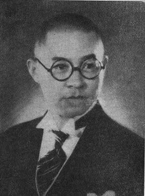
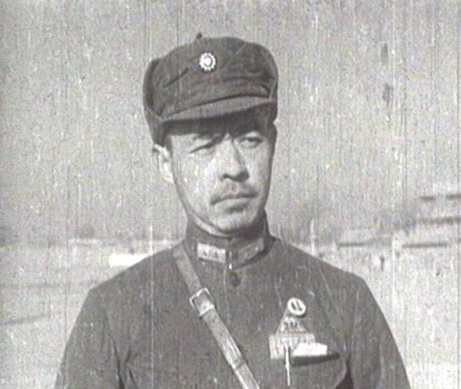

0516张自忠

（万象历史特约作者：东西望）

77年前的今天，1940年5月16日，抗日阵亡的最高将领，集团军总司令张自忠牺牲

张自忠（1891年8月11日－1940年5月16日），中华民国陆军二级上将。原为西北军系将领，中原大战后接受中央政府改编，任国民革命军第二十九军第三十八师师长，曾参与喜峰口战斗。

1935年，冀察政务委员会成立后，曾先后任察哈尔省省主席、天津市市长、北平市市长。曾被邀请到日本访问，被舆论认为是汉奸。

七七事变后，任国民革命军第五十九军军长，后升第卅三集团军总司令、第五战区右翼兵团司令。曾参与临沂保卫战、徐州会战、武汉会战、随枣会战与枣宜会战等。在枣宜会战中战死，张自忠为抗日战争中，中国阵亡的最高将领之一。妻子李敏慧闻耗悲痛绝食七日而死，夫妻合葬。

（《抗战军人忠烈录》（第一辑）中的张自忠烈士遗像）

**投身军营**

1891年8月11日，张自忠生于山东省临清县唐园村。张家为临清望族，父亲曾任江苏省赣榆县知县。张自忠6岁入私塾，后随父至江苏，由父亲教导。1905年（14岁），父亲任上去世，张自忠随母亲返回临清。

1908年（17岁），进入临清高等小学堂就读。1910年，毕业后进入天津市北洋法政学堂。1911年，加入中国同盟会。1914年（23岁），前往奉天（今沈阳）加入军籍，投效第二十师第三十九旅。

1916年（25岁），护国战争爆发，随第三十九旅至湖南长沙镇压护国军。后扩编为湖南陆军第一师，张自忠被委任为军官，任师部幕僚。但该师旋即被湖南护国军击败。张自忠遂改投冯玉祥第十六混成旅，历任排长、连长、营长等职。

（1911年，张自忠就读于天津法政学堂）

**西北军**

1924年（33岁），张自忠任团长，参与第二次直奉战争。1926年（35岁），任第十五混成旅旅长，入山西与晋军作战。因战事不利，恐为其直属长官石友三所害，遂率部入晋（但并未加入晋军）。

1927年4月（36岁），冯玉祥加入国民革命军北伐，张自忠方从山西回归冯玉祥麾下，任集团军总部副官处长。1927年底，任第二十八师师长兼第二集团军军官学校校长。1928年，北伐结束后，任第二十五师师长，该师曾在1929年的全国军风纪考察中列为全国第一。

1930年（39岁），中原大战爆发，张自忠任第六师师长，西北军失败后，率第六师残部入晋追随冯玉祥。1931年1月，接受张学良节制与改编，西北军残部编为东北边防军第三军（后改番号为第二十九军，军长宋哲元），张自忠任第三十八师师长。

（张自忠雕塑）

**喜峰口之战**

1933年3月（42岁），日军占领承德后，继续往南占领长城各隘口。第二十九军奉命到喜峰口阻敌。3月7日，第三十七师（师长冯治安）与第三十八师张自忠在距喜峰口30公里处设立敌前指挥所，开始在喜峰口周边激战。

3月11日夜，由第一〇九旅旅长赵登禹率领，分三路从日军后方突袭阵地；由于西北军的传统，第二十九军士兵均配一副大刀，因此突袭队又称为大刀队。该役共歼敌千余人，此后双方僵持于喜峰口。

不过当冷口为日军突破后，第二十九军为避免腹背受敌，遂向西南方向退却。由于在喜峰口与罗文峪等地的战功，第二十九军的高级军官共11人，在1935年7月获颁青天白日勋章。

**率团访问日本**

长城战役后，第二十九军返回山西，后全军移驻察哈尔省，张自忠仍任第二十九军第三十八师师长，驻宣化。1934年，张自忠率第二十九军营长以上军官至庐山参加庐山军官训练团，张自忠以第一名结训。

1935年6月（44岁），签订何梅协定，国民政府中央军退出河北省，在日军默许下，第二十九军进驻平津。12月，成立冀察政务委员会，由宋哲元任委员长，张自忠任委员，兼察哈尔省省主席。1936年6月，改任天津市长。

1937年3月（46岁），日军突邀宋哲元访日。宋哲元遂命张自忠率团访日。从4月23日至5月29日，张自忠访问了东京、大阪、神户、奈良、名古屋等地。虽然张自忠发表声明称仅考察日本工业，但国内舆论并不相信，自始张自忠被视为亲日派，甚至是汉奸。

（1937夏，张自忠赴日本考察时在东京）

**撤离平津**

1937年，七七事变爆发后，蒋介石在庐山发表谈话，拒绝对日方做进一步的让步。冀察政务委员会中止对日军协商，日军发动攻击。7月28日，第二十九军军部被日军攻破，佟麟阁副军长与赵登禹师长殉国。

于是，宋哲元将第二十九军撤到保定。将冀察政务委员会与北平市长都交由张自忠代理。这么一来，张自忠就成为众矢之的，全国各大报刊纷纷发表痛斥张自忠的文章，报界一度凡提及必称“张逆自忠”。

待第二十九军撤出平津之后，到9月3日，张自忠逃离北平抵达天津。10月10日，在南京与蒋介石见面，之后张自忠以军政部中将部附的身份留在南京。中央政府于12月迁至武汉后，张自忠升任第五十九军军长。

**集团军总司令**

1938年3月，第五十九军参与临沂保卫战，逼退日军第5师团（师团长板垣征四郎）。临沂一战阻隔了日军第5师团与第10师团的联系。后第10师团在台儿庄被重创。张自忠因功升第二十七军团军团长，辖第五十九军与第九十二军。

1938年6月，参加武汉会战。1938年10月12日，张自忠因功升第卅三集团军总司令，仍兼第五十九军军长。11月13日，张自忠又被任命为第五战区右翼兵团总司令。1939年3月，随枣会战击退日军第11军（军长冈村宁次）。

**枣宜会战**

1940年，日军调集6个师团，装甲与航空大队，向枣阳与宜昌一线进攻，拉开枣宜会战序幕。5月8日，日军占领枣阳。5月15日，日军第39师团将张自忠与第七十四师围于宜城南瓜店。

5月16日，张自忠亲率第七十四师与日军激战。国军伤亡殆尽，张自忠中弹身亡。日军发现张自忠遗体，审认无误后，在陈家集征集一口棺木盛殓，并竖木牌，墓碑上书：“支那大将张自忠之墓”；当天深夜，日军设在汉口之广播电台插播张自忠阵亡消息。张自忠成为抗日战争中，中国阵亡的最高将领之一。

**夫妻合葬**

第三十八师师长黄维纲获报后，率便衣队将遗体夺回。5月18日，送回集团军司令部，以上将礼服重殓，经宜昌转送回重庆。民国政府明令褒扬，特予国葬，追赠陆军二级上将。5月28日，灵柩抵达重庆，蒋介石率军事委员会高级将领与国民政府五院院长亲临致祭，蒋介石抚棺痛哭。1940年7月7日，立张自忠墓位于重庆市梅花山麓。

张自忠殉国时，妻子李敏慧在上海疗养，闻耗悲痛绝食七日而死，夫妻二人合葬于重庆梅花山麓。梅花山原名雨台山，冯玉祥学明朝督师史可法在山上种植梅花，将雨台山改名为梅花山，亲书“梅花山”三个大字，刻于墓前石栏。

**纪念英雄**

1940年8月15日，中共在延安为张自忠举行悼念大会。1942年12月31日，国民政府明令张自忠入祀全国忠烈祠。1946年，张自忠获国府颁荣字第一号荣哀状。

1947年3月13日，北平市政府颁令，将铁狮子胡同改为张自忠路，该路名沿用至今。天津、上海、武汉、台湾等地都有张自忠路以示纪念。

1982年4月16日，中华人民共和国民政部追认张自忠为革命烈士。2010年5月16日，重庆市举行仪式纪念张自忠将军殉国70周年。

