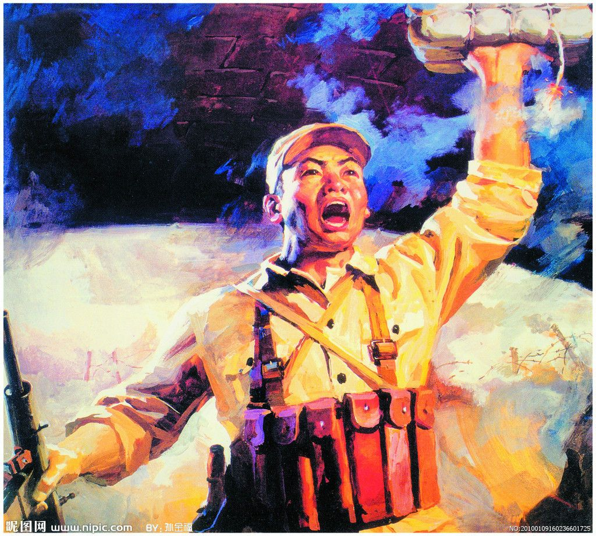
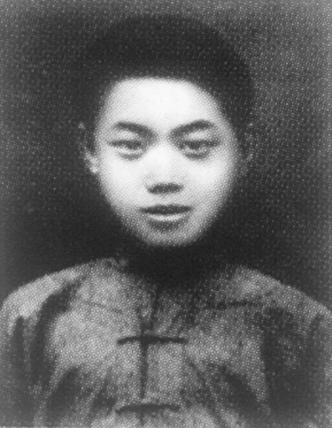

0525董存瑞

（万象历史特约作者：东西望）

69年前的今天，托起炸药包、舍身炸碉堡的战斗英雄董存瑞英勇牺牲

董存瑞（1929年10月15日－1948年5月25日 ），中国河北省怀来县人。解放军东北野战军战士。第11纵队32师96团2营6连6班班长，1948年在第二次国共内战时期在河北省承德市隆化县的隆化战斗中炸碉堡而死亡。

年轻的战士

1929年10月15日，董存瑞生于河北省怀来县的一个贫苦农民家庭。1944年秋（15岁），董存瑞在父母的包办下，同邻村比他大三岁的姑娘卢长岭结了婚。

1945年7月（16岁），参加八路军。1947年3月（18岁），加入中国共产党。1948年，为东北野战军第11纵队32师96团2营6连6班班长。先后荣立大功三次、小功四次，荣获勇敢奖章三枚、“毛主席奖章”一枚。

炸碉堡的英雄

1948年5月25日（19岁），在解放河北省隆化县的战斗中，董存瑞所属连队负责攻击防御重点隆化中学。在冲锋时，遭到一个桥型暗堡的猛烈火力封锁。董存瑞便抱起炸药包，冲至桥下后，因没有地方可以放置炸药包，董存瑞便手托炸药包，与暗堡同归于尽，年仅19岁。

董存瑞牺牲不久，兵团的程子华司令员进城视察战果，在隆化中学前见许多战士哭泣。程司令很奇怪，问他们打了胜仗为什么还哭？战士们介绍了董存瑞的壮举，令身经百战的程将军唏嘘不已。

全国战斗英雄

1948年6月8日，十一纵队党委决定：追认董存瑞同志为战斗英雄，模范共产党员；董存瑞生前所在的六班，改为“董存瑞”班。7月10日，隆化中学改名为存瑞中学。7月11日，冀察热辽党报《群众日报》发表了军区司令员程子华的文章《董存瑞同志永垂不朽》。

1950年9月，董存瑞被追认为全国战斗英雄。1951年，新中国成立两周年之际，毛泽东邀请董存瑞的父亲登上天安门城楼参加国庆观礼。董存瑞的母亲收到成千上万封来自全国各地的信件，信中内容最多的是要求给老人当儿子。

（1958年，董存瑞的父母在河北怀来县家中）

1954年，在隆化县城西北，修建董存瑞烈士陵园，后几次扩建。1957年5月29日，朱德委员长为董存瑞烈士纪念碑写了“舍身为国，永垂不朽”的光辉题词。有一首流传很广的跳橡皮筋歌谣，唱到：“董存瑞，十八岁，为国牺牲炸堡垒，炸到堡垒咯咯脆，全国人民流眼泪。”

电影董存瑞

1955年，长春电影制片厂拍摄了电影《董存瑞》，导演郭维。影片影响很广，是中国战争电影的经典。2006年7月，出版的《大众电影》第8期发表了题为《〈董存瑞〉：“真实”创造的经典》的访问记，84岁的郭维在文章中强调：“没有人亲眼看见董存瑞托起炸药包的情景。”

几天后，8月19日，在中国中央电视台电视专题片《电影传奇——董存瑞》中，接受访问的郭维证明“董存瑞的英勇献身”是事后推测出来的：“以后怎么知道、确定他（董存瑞）是托着炸药包炸的呢？最后有人建议挖这个桥底下。结果最后挖到一定深度的时候，挖出一个袜底来，就是董存瑞媳妇给董存瑞缝的。班里的同志都知道，这是董存瑞的袜底。这么确定这是董存瑞……”

（董存瑞所获得的奖章）

郭维的爆料引起董存瑞生前战友和亲属的强烈不满，并且提出诉讼。新京报《董存瑞炸碉堡遭"戏说" 老战友作证称曾亲眼目睹》一文中，多名战友证实了董存瑞的英雄事迹。

2007年5月24日，董存瑞名誉权案在北京市朝阳区人民法院第一次开庭，有董存瑞部队程抟九、宋兆田和肖泽泉三位高龄战友等人出庭。2009年6月，被告方欲和解，在北京市朝阳区法院调解下，双方在2009年11月初达成和解，以被告郭维及《大众电影》赔付费用人民币3.5万元。

为了新中国，前进！

电影《董存瑞》中，片中的董存瑞高喊：“为了新中国，前进！”据电影编剧赵寰说：“1948年正是解放战争处于大反攻阶段，党中央发出‘五一’号召，提出了‘打倒蒋介石，解放全中国！’的口号，‘为了新中国’那句话就是在这样的背景下创作出来的。”

曾亲眼目睹董存瑞舍身炸碉堡的战友郅顺义回忆说：“(字幕：董存瑞突然身子向左一靠，左手托起炸药包，紧紧贴住桥形碉堡，右手猛地一下拉开了导火索。……我自己也不知道为什么，纵身一跳就朝他奔去，董存瑞看见了，厉声对我喝道：‘卧倒！卧倒！快趴下！’接着一声巨响，天崩地裂，桥型暗堡被炸得粉碎。”

2009年，由八一电影制片厂摄制的20集电视剧《为了新中国前进》，由王宝强饰演董存瑞。2010年，在中央电视台CCTV1套节目黄金档播出。

