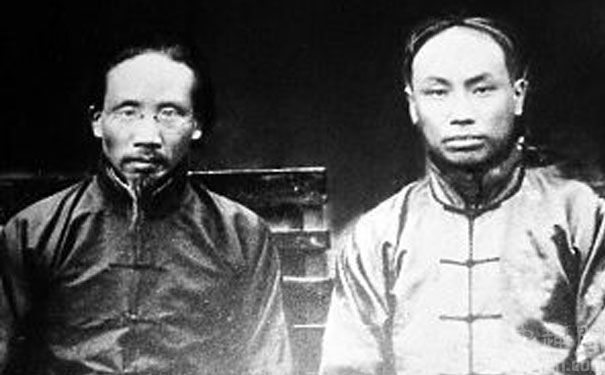
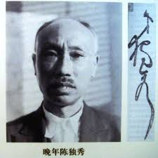

0527陈独秀

（万象特约作者：东西望）

75年前的今天，1942年5月27日，反对武力保卫苏联，被开除党籍的共产党创始人陈独秀病逝

陈独秀（1879—1942），安徽安庆人。主编《新青年》，新文化运动的发起者，五四运动的总司令，马克思主义的积极传播者，中国共产党最重要的创始人和首任总书记，中国托派的精神领袖。

1929年，因中东路事件中苏正在中国东北开战，他反对当时中共提出的“武装保卫苏联”的口号，被开除党籍。不久，成为托派组织的总书记。

1932年，被捕，轰动世界。国内的胡适之、傅斯年、国外的爱因斯坦、罗素等人，都为其说话。大律师章士钊亲自为他免费辩护。他的自辩词和章士钊的辩护词，公开发表，成为法学系的案例。

提前出狱后，心灰意冷，拒绝一切帮助，无钱被赶出医院。听信偏方，水泡已发霉的蚕豆花，喝后中毒，不久病逝。因经济拮据，一时竟无法归葬家乡。

被驱逐回国的留学生

1879年10月9日，陈独秀出生于安徽省安庆市。2岁时，父亲因瘟疫死于苏州。先后由祖父、长兄抚养成人，在家中学习《四书》、《五经》。1896年（17岁），陈独秀通过院试成为秀才，次年赴南京乡试落榜，未能考中举人。

1901年10月（22岁），陈独秀自费留学日本，进东京弘文学院师范科日语专业学习。1902年9月，再赴日本，读东京成城学校陆军科，在日本受到西方社会主义思想的影响。

1903年3月31日夜（24岁），陈独秀、张继、邹容3人强行剪去湖北陆军学生监督姚昱的辫子。事后，清政府照会日本外务部，将三人强行遣送回国。

第3次留学日本

1903年5月17日，陈独秀回到安庆后，发表拒俄演说，创办安徽爱国会。与东京拒俄义勇队互通声息，引起当局不满。陈独秀闻讯逃往上海，和章士钊、张继等人出版《国民日日报》。同年，报纸被查封，又回到安庆。

1904年3月31日（25岁），陈独秀等人创办白话文《安徽俗话报》。报纸在不到半年内，发行量增加到3000份，成为最受欢迎的白话文报纸之一。他使用三爱这个笔名，至少发表了50篇文章。1905年，停刊。

1905年秋（26岁），执教芜湖皖江中学，发起成立反清组织“岳王会”并任总会会长。1907年，陈独秀第三次留学日本，入东京正则英语学校学习，后入早稻田大学学习。1908年，陈独秀从日本回国，在杭州浙江陆军小学任国文史地教习。

（陈独秀手稿，1917年发表在《新青年》上的除夕诗）

6个原则的《新青年》

1911年（32岁），辛亥革命爆发，陈独秀回乡任安徽都督府秘书长。1913年，陈独秀参加反袁世凯“二次革命”，在芜湖一度遭逮捕，后获释。1914年春（35岁），反袁运动失败后，陈独秀再度赴日本，协助章士钊办《甲寅》杂志。第一次使用笔名“独秀”发表文章《爱国心与自觉心》。

1915年夏，陈独秀回到上海，住法租界。9月15日，创办月刊《青年杂志》，次年更名为《新青年》，自任总编辑。陈独秀在创刊号上发表《敬告青年》，提出6个原则：1、自主的而非奴隶的；2、进步的而非保守的；3、进取的而非退隐的；4、世界的而非锁国的；5、实利的而非虚文的；6、科学的而非想像的。

《新青年》宣传倡导“德先生”（指“民主”Democracy）和“赛先生”（指“科学”Science），批判儒教和传统道德，“打倒孔家店”，成为新文化运动的中心。1917年，陈独秀发表《文学革命论》，主张改文言文为白话文，文章内容也要趋向实际。

（《青年杂志》第一期）

被开除的北大教授

1917年1月（38岁），蔡元培就任北京大学校长，聘任陈独秀为北京大学文科学长。他将《新青年》迁到北京。1918年11月27日，和李大钊合办《每周评论》杂志。1919年3月，陈独秀流连妓院被报刊曝光。北大废除学长制，陈独秀被开除。

1919年（40岁），五四运动爆发后，陈独秀在《每周评论》发表《研究室与监狱》，提出入监狱和入研究室，是青年人生最高尚的生活。6月11日，陈独秀在城南新世界游艺场散发《北京市民宣言》后被捕。9月16日，保释出狱。

1919年秋天，陈独秀前往上海，住在法租界。1920年8月，成立中国共产党上海发起组，任书记。8月22日，俞秀松、罗亦农等人在陈独秀家中成立了社会主义青年团。

创立中国共产党

1920年（41岁），陈炯明占领广州，孙中山率国民党中央由上海迁往广州。12月，陈独秀应邀前往广州任广东省教育委员会委员长。1921年7月，中共一大在上海召开，陈独秀没有出席，派包惠僧代表参加。在会议上，陈独秀被缺席选为中央局书记。

9月，陈独秀回到上海。10月4日，被法租界巡捕房逮捕，被判罚100银元。1922年7月，在上海成都路召开中共二大，被选为中央执行委员会委员长。8月9日，陈独秀再次被捕，罪名是家中藏有违禁书籍，判罚大洋400元。

1922年8月20日，迫于共产国际的压力，陈独秀勉强同意与国民党合作。随后陈独秀等人加入了国民党，并前往莫斯科参加共产国际四大。1923年，二七罢工后，陈独秀被吴佩孚通缉。1923年6月12日，陈独秀在广州主持召开中共三大，并再度当选为中央执行委员会委员长。

被停职的总书记

1927年3月21日（48岁），当国民党北伐军占领龙华时，中共在上海发动工人武装暴动，陈独秀发表《告世界工人阶级书》和《告中国工人阶级书》。4月4日，陈独秀与刚从国外回来的汪精卫发表《汪、陈联合宣言》，并一起去武汉。

4月12日，工人纠察队和蒋介石直接冲突，发生四一二政变，国共分裂。4月底，在中共五大仍然当选为总书记，但是已经没有实权了。

7月12日，鲍罗廷遵照斯大林的指示，重新改组中共中央，由张国焘、张太雷等组成临时中央局兼常委。陈独秀被停职，于是给临时中央发了一封辞职信。7月15日，汪精卫发动七一五事变，共产国际和中共在中国的势力中遭到近乎毁灭性的打击。

反对武装保卫苏联

8月7日，新来的共产国际代表罗明那兹在汉口主持八七会议，禁止陈独秀参加。在会议上公开批判陈独秀对国民党妥协退让，犯有严重的“右倾机会主义”错误。此后，陈独秀倾向于托洛茨基的主张。

1929年9月，陈独秀牵头创建托派组织“无产者社”。11月16日，陈独秀因在中东路事件等问题上发表不同意见，反对当时中共提出的“武装保卫苏联”的口号，被开除党籍，后发表《告全党同志书》公开信。

1931年5月（52岁），陈独秀出席中国各托派小组织的“统一大会”，被推选为统一后的托派组织“中国共产党左派反对派”中央总书记。

轰动世界的被捕入狱

1932年10月15日（53岁），在国民党巨额悬赏多年后，陈独秀被上海公共租界巡捕房以创办非法政党的罪名逮捕，随后移交南京政府。已经成为大律师的章士钊主动免费为陈独秀出庭辩护，胡适之、傅斯年等人纷纷出来为其说话。1932年12月8日，德国科学家爱因斯坦去电蒋介石，请求将其释放。此外，知名的学者罗素、杜威等人也向蒋介石做出同样请求，但蒋介石不为所动。

1933年4月（54岁），公开开庭审判，章士钊在法庭慷慨陈词，赢得旁听一片赞誉。结果，陈独秀被“以文字为叛国之宣传”判处有期徒刑13年。囚禁于南京老虎桥第一监狱。此后，其自辩和章士钊的辩护词在天津《益世报》全文登载，其他报纸也纷纷报道，一时轰动全国。甚至被上海沪东大学、东吴大学选为法学系的教材。

在南京狱中，陈独秀大量阅读古今中外的书籍，潜心研究中国古代语言文字、孔子、道家学说等，完成了不少有价值的学术论著。1936年3月，在《火花》发表了《无产阶级与民主主义》。

不再熟悉的创始人

1937年8月23日（58岁），陈独秀提前获释。在与博古、叶剑英的沟通中，陈独秀向中国共产党表示支持、并表示支持抗日民族统一战线，但是在托派问题上不予明确答复。

在苏联共产党清洗托派的情势下，由王明、康生为首，采用苏联把托派打击成法西斯德国间谍的模式，指责说陈独秀接受日本津贴，做“日特汉奸”。陈独秀写信驳斥。

王明失势后，周恩来曾多次托人劝说陈独秀去延安，均被拒绝。陈独秀为此对好友说，党内的熟人都已经离去或逝去，现在对共产党已不熟悉。

拒绝一切心灰意冷

此后他拒绝出任劳动部长，拒绝蒋介石出资让他组织“新共党”，拒绝胡适的邀请去美国，拒绝谭平山要他出面组织第三党的建议。在重庆住院时，拒绝周恩来资助的100银元。实际上，当时他仅靠微薄稿费收入支撑，最后更被赶出医院。

陈独秀隐居在四川江津，以教书为生，保持低调，而且转向了自由主义。此后对文学和民主发展，继续当年在狱中的研究，特别对斯大林时代的反思，也被后人认为难出其右。

1942年5月12日中午，陈独秀用医生介绍的偏方，以水泡制蚕豆花茶水，据称可治高血压。但蚕豆花已发霉，用开水泡过后，汁水呈黑色，陈独秀喝后中毒。1942年5月27日21时40分，陈独秀病逝，享年63岁。

陈独秀逝世后，由于经济拮据，家属无力将其归葬安庆。1947年2月，由三子陈松年，将其归葬于安庆北门叶家冲（现属十里铺）。文化革命后，1979年10月，重修了墓地。后又经多次修缮，建成规模较大的墓园。

