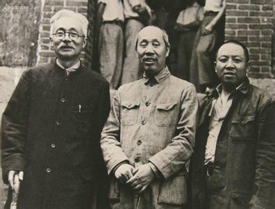

57年前的今天，中共五老之一的林伯渠逝世于北京

万象特约作者：一一

林伯渠（1886年3月20日－1960年5月29日），原名林祖涵，号伯渠，中国湖南省安福县（今临澧县）人，中国共产党重要领导人之一，与董必武、徐特立、谢觉哉和吴玉章并称为中共五老。

他早年追随孙中山，先后加入中国同盟会、中华革命党，并参与创立中国共产党，改组中国国民党，在任国民党农业部长时曾聘请毛泽东为广州农民运动讲习所所长。其后参加北伐战争、南昌起义、长征等重要革命活动，后任陕甘宁边区政府主席。新中国成立后，林伯渠任中央人民政府委员会秘书长，全国人民代表大会常务委员会第一、二届副委员长。
1960年林伯渠先生去世。骨灰安放在八宝山革命公墓。2013年4月2日林伯渠同志骨灰回归故里。

早年生平

1886年3月20日，林伯渠出生于今湖南省临澧县。1902年（16岁），考入湖南公立西路师范学堂。1903年，考取公费生，赴日本留学，入东京弘文学院。1905年8月（19岁），经黄兴、宋教仁介绍，加入中国同盟会，追随孙中山，年底罢学回国。1906年，奉命前往长沙办理振楚学堂，1907年，又以新任吉林省巡抚朱家宝随员身份前往东北，预谋联络当地马匪反清，失败后仍留东北管理学政，直至1911年秋返回上海，随即前往湖南西部争取当地驻防官兵的支持。

1913年袁世凯刺杀宋教仁后，林在湖南参加二次革命，任岳州要塞司令部参谋，失败后逃往日本，加入中华革命党，受到孙中山的赏识。1916年护国战争爆发，林的堂兄林修梅出任湖南护国军参谋长，林任湖南总司令部参议。袁世凯退位后，林留任湖南政务厅长。1917年9月13日，林伯渠参与发动湖南南部衡阳、零陵驻军参加护法战争的行动，10月17日，林被委任为劳军使，赴前线激励士气。11月20日，护法军攻占长沙，林出任湖南财政厅长。1918年3月，长沙复为北洋政府攻占，林伯渠等被迫撤回广州。1919年底，南北议和，谭延闿出任湖南都督，林修梅等湘军将领被迫离开湖南，护法战争在湖南结束。此时，林参与了协助孙中山将中华革命党改组为中国国民党的工作。

第一次国共合作

1921年1月，林经李大钊和陈独秀介绍，在上海加入中国共产党上海党小组，成为中共创始人之一。此后林奉命南下广州，任孙中山军政府参议，10月15日，林修梅病逝于广州。1922年6月16日，陈炯明炮轰总统府，林再度流亡上海。1923年1月2日，林被任命为中国国民党总务部副部长，积极推进国共合作，大力吸收共产党人士加入国民党。1924年1月，林在中国国民党第一次全国代表大会上当选为国民党中央执行委员、农民部长，后前往汉口负责当地的国民党支部活动，6月失败返广州。同年底，林随孙中山北上，次年孙中山病逝于北京，林又随同扶柩至北京西山碧云寺。1925年5月，林回到广州，参加国民党一届三中全会。7月1日，林出任国民政府监察委员。8月，廖仲恺遇刺后，林出任代理中执委常委，兼理秘书处，进入国民党领导核心。
1926年，在中国国民党第二次全国代表大会上，林再次当选为中央执委，并担任财务审查委员会主席，兼农民部长。他在任内聘请毛泽东为广州农民运动讲习所所长。3月20日，中山舰事件后，林被迫辞去农民部长一职，转而全力投入国民革命军第六军的政治工作，7月20日，参加北伐。9月20日，蒋介石邀请林前往北伐军总部工作，林遂随军先后至南昌、九江。

从南昌起义到长征

1927年2月，林返回汉口，其后出任国民党政治委员会委员、军委秘书长。3月26日，林前往南京，拟按武汉国民政府及中央军事委员会密令逮捕蒋介石，不料被南京卫戍司令程潜拒绝。

不久，蒋介石、汪精卫先后在南京和武汉宣布分共，林伯渠被迫退出国民党，前往庐山。8月1日，林参加了南昌起义。10月3日，林伯渠等非战斗人员离开部队，前往香港，后经上海、神户、符拉迪沃斯托克前往莫斯科，入莫斯科中山大学进修。1933年，林回国，前往中央苏区，任中华苏维埃共和国国民经济部部长兼任财政人民委员部部长。1934年10月10日，林参加长征，任总没收委员会主任，负责为中国工农红军筹集军饷，后又担任红军总供给部部长。1935年，红一方面军长征胜利结束，林伯渠转而担任当地政府财政部长。

第二次国共合作

1937年2月24日，林伯渠奉命负责陕甘宁边区政府工作。7月27日，林作为中共代表团一员前往西安，与国民政府展开谈判。国共第二次合作后，9月6日，林正式出任陕甘宁边区主席。1938年4月12日，林又被蒋介石任命为国民参政会参政员。同年10月，被补选为中共中央委员。1940年10月，林返回延安，专注于边区政府工作。1942年2月，林又担任了陕甘宁边区学习指导委员会主任一职，负责在政府系统中开展整风运动，他反对康生发起的抢救运动，争取到了毛泽东“一个不杀，大部不抓”的批示，促使这次抢救运动没有大规模发展。
1944年2月17日，林奉命前往重庆，与国民政府重开谈判。11月，谈判无疾而终，林遂返回延安。1945年，在中国共产党第七次全国代表大会上，林被选为中央委员，其后又进入中共中央政治局。

创立新中国

1948年12月26日，林伯渠调往西柏坡中共中央工作，卸去陕甘宁边区政府主席一职。1949年3月26日，林作为中共谈判团一员，在北平与张治中率领的国民政府代表团进行结束内战的谈判，未果。8月，林又代李维汉负责全国政协的筹备工作，9月30日，林当选为政协全国委员会委员和中央人民政府委员会委员，次日被选为中华人民共和国中央人民政府秘书长。

1954年，当选为第一届全国人大常委会副委员长。1956年，在中国共产党第八次全国代表大会及八届一中全会上再次当选为中央委员和政治局委员。1960年5月29日，在北京病逝，享年74岁。

林伯渠第四任妻子朱明因写揭发江青的匿名信而被定为“18号案件”，1961年自杀身亡。

