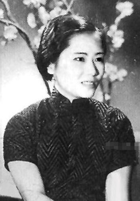

105年前的今天，中国的居里夫人、世界最杰出的女性实验物理学家吴健雄出生

万象特约作者：一一

吴健雄（英语：Chien-Shiung Wu，1912年5月31日－1997年2月16日）是一位在核物理学领域卓有贡献的美籍华裔物理学家，吴健雄在加州大学伯克利分校获得博士学位，其丈夫是同为物理学家的袁世凯孙子袁家骝。

吴健雄在实验物理学方面的造诣常令人将她与居里夫人相提并论。她常被人称作是“中国居里夫人”、“物理研究的第一女士”、“核子研究的女王”以及“世界最杰出女性实验物理学家”。在曼哈顿计划中，她参与研究了如何利用气体扩散法分离铀的两种同位素，铀-235与铀-238。吴健雄其最著名的一项工作是利用实验方法验证宇称不守恒。这项工作令其同事李政道与杨振宁获得1957年的诺贝尔物理学奖，并令其本人获授1978年首次颁发的沃尔夫物理学奖。

早年生涯

1912年5月31日，吴健雄生于中国江苏省太仓县浏河镇。依族谱，她是家族中的“健”字辈。吴健雄与她兄弟的名字都源于“英雄豪杰”这个成语。
吴健雄在她父亲为女童创办的明德学校接受小学教育，1923年11岁时离开家乡前往苏州第二女子师范学校求学。1929年，吴健雄以班级顶尖成绩毕业并被中央大学录取。依据当时政府的规定，想要继续获得大学教育的师范生需要当一年的学校教师。在这一年中，她在中国公学任教。胡适是这所学校当时的校长。吴健雄曾旁听他讲授的课程。

1930年至1934年，吴健雄求学于中央大学，起初主修数学，后来转为主修物理。本科毕业后的两年期间，吴健雄在浙江大学继续进修研究生阶段的物理学课程，第一年，她还担任助教，第二年，她成为中央研究院物理研究所的研究员。她在中央研究院的导师是顾静薇教授，顾静薇在密歇根大学获得哲学博士学位，她积极鼓励吴健雄去海外求学。吴健雄后来被密歇根大学录取，她的留学经费是由她的叔叔提供的。1936年8月，吴健雄乘坐胡佛总统号邮轮启程前往美国。她的父母与叔叔一同为她送行，这也是吴健雄与父母见的最后一面。

伯克利生涯
吴健雄在到达美国后拜访了加州大学伯克利分校，这也是她后来选择进一步深造的地方。在那里，她结识了物理学家袁家骝。他是首任中华民国大总统袁世凯的孙子。
吴健雄听到了密歇根大学对女性不甚尊重的传闻：该校当时由学生捐资建起的学生中心并不允许女学生从其前门进入，这令她决定改在伯克利进修。吴健雄在伯克利的第一学年末申请了奖学金，但由于当时对亚裔学生的歧视，她与袁家骝二人只获得了一个较低薪酬的助教职位。袁家骝后来申请并获得了加州理工学院的一项奖学金。
吴健雄在学业及研究方面成绩斐然。劳伦斯名义上是她的导师。吴健雄于1940年6月获得了哲学博士学位。尽管得到劳伦斯和塞格雷的推荐，她仍是没能在大学中取得职位，所以她继续在放射性实验室中当博士后。

参加曼哈顿计划
1942年5月30日，吴健雄与袁家骝在袁的导师、加州理工当时的校长罗伯特·密立根的家中完婚。双方家长由于太平洋战争爆发都没能出席婚礼。随后夫妇二人移居至美国东海岸。吴健雄成为了史密斯学院的教员。这所学院位于马萨诸塞州北安普敦，是一所声望很高的私立女子学院。吴健雄在工作上遇到一些挫折。她当时只被安排教学工作，没有进行研究的机会。她将这一情况告知劳伦斯。劳伦斯随后为吴健雄向一系列大学发去推荐信。为了挽留吴健雄，史密斯学院准备提拔她为副教授，并增加薪酬。但她选择接受普林斯顿大学的邀请，到那里指导海军军官。

1944年3月，吴健雄加入了位于哥伦比亚大学的曼哈顿计划下属的替代合金材料实验室（英语：Substitute Alloy Materials Laboratories）。这座实验室的职责是协助曼哈顿工程中铀浓缩的气化扩散项目。吴健雄与利奥·雷恩沃特在由威廉·黑文斯领导的小组中工作，负责开发监测放射性的仪器。

验证宇称不守恒定理

在第二次世界大战告终后，吴健雄担任哥伦比亚大学的副研究员。1947年，吴健雄生下儿子袁纬承。他后来继承父母的衣钵成为了一名物理学家。1949年，袁家骝加入位于纽约长岛的布鲁克黑文国家实验室，随后他们一家也搬到了那里居住。吴健雄余下的学术生涯都是在哥大度过的。她于1952年擢升为副教授，1958年升为正教授，后又于1973年开始担任米海洛·卜平物理学教授。她的学生爱把她叫做“龙夫人”。这个绰号来源于连环画《特里与海盗》的一个角色。

李杨二人通过理论计算预测钴-60放出的β粒子的轨迹不对称，也就是说宇称不守恒。吴健雄所进行的实验证实了这一点：宇称在弱相互作用中确实不守恒。Θ+和τ+后来被证明是同一种粒子，也就是K介子，K+。这项结果随后很快又通过不同实验得到进一步的验证。
宇称不守恒是粒子物理学领域一项重要的发现，其对于标准模型的建立非常重要。为了表彰李杨二人做出的理论贡献，他们于1957年被授以诺贝尔物理学奖。

再回大陆

20世纪50年代末至60年代初，吴健雄的哥哥与父母相继去世。但由于美国政府当时对于公民出境的严格限制，她未能回中国参加亲人的葬礼。1972年尼克松访华后，中美两国的关系得到了改善，吴健雄得以于1973年回国访问。此时，她的叔叔和弟弟已因在文化大革命中受到迫害而身故，而她父母的坟墓也遭到毁坏。她受到周恩来的接见。周恩来亲自就上述情况向她致歉。在此次访问后，吴健雄又多次访问中国。
吴健雄于1981年退休，成为荣休教授。她于1997年2月16日因中风去世，享年84岁。依照她的遗愿，她的骨灰葬于她幼时就读的明德学校的院中。

主要荣誉

吴健雄一生获得的奖项众多，荣誉等身。她于1948年被选为美国物理学会会员，并于1975年成为美国物理学会首位女性会长，并于同年获得该学会颁发的颁发的博纳奖。1958年，她成为首位获得普林斯顿大学名誉博士学位的女性。她于同年被选为美国国家科学院院士，并于1964年获得美国国家科学院颁发的科姆斯托克物理学奖。1959年，她获得了美国大学妇女协会功绩奖，并于1962年获得该协会颁发的年度妇女奖。她于1975年获得美国国家科学奖章，并于1978年成为首任沃尔夫物理学奖得主。1974年，她被美国工业研究杂志选为年度科学家。

1990年，一颗小行星以她的名字命名。她是首位在世时享此殊荣的科学家。吴健雄于1994年被选为中国科学院首批外籍院士。她还于1962年获得美国富兰克林学会颁发的魏德瑞尔奖章，于1965年获得台湾嘉新文化基金会颁发的特殊贡献奖，并于1991年获得卜平奖。1986年，美国纽约自由女神像落成一百周年之际，她获得了艾丽丝岛奖章。
1995年，杨振宁、李政道、丁肇中及李远哲四位诺贝尔物理学奖得主在台湾发起创立吴健雄学术基金会。该基金会自1998年起每年会举办吴健雄科学营。1999年，东南大学报请中共中央及中华人民共和国国务院批准，在校园内建造吴健雄纪念馆。纪念馆于2002年落成，设计方案由袁家骝先生亲自选定。纪念馆收藏了袁家骝等人捐献的吴健雄生前所获奖章、奖状及手稿等等遗物。中华民国物理学会自2003年起开始向女性会员颁发吴健雄奖学金。

