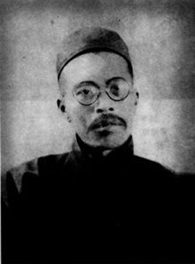
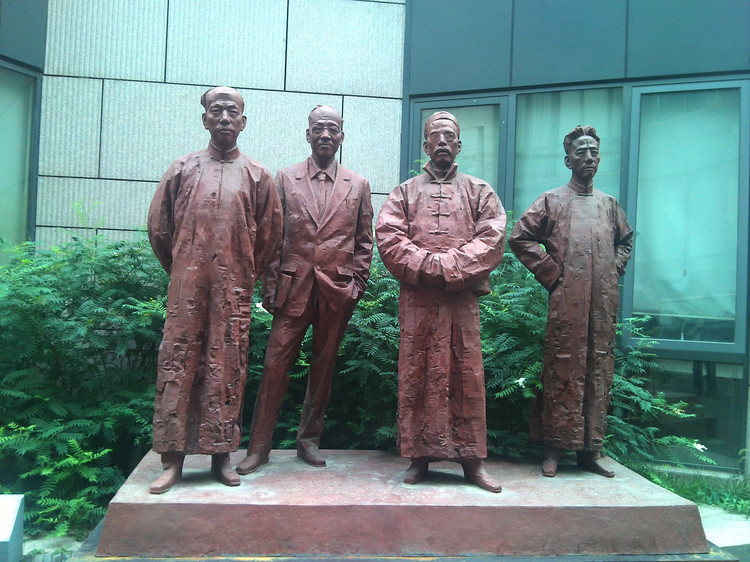
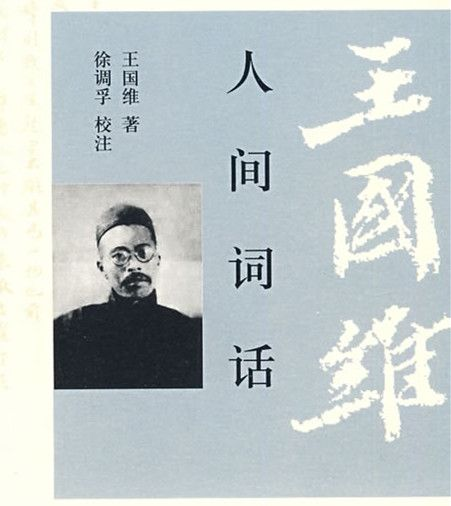
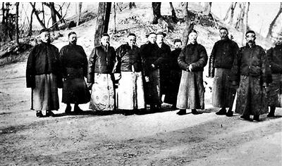

（万象历史特约作者：一一）

90年前的今天，1927年6月2日，

提出人生三重境界、清华国学研究院四大导师之一的王国维在昆明湖投湖自尽

溥仪的帝王师、清华四大导师王国维在颐和园投湖自尽

国学大师王国维不知何故，在颐和园投湖自尽

王国维（1877年12月3日－1927年6月2日），浙江杭州府海宁人，国学大师。王国维与梁启超、陈寅恪、和赵元任号称清华国学研究院的“四大导师”，在文学、美学、史学、哲学、金石学、甲骨文、考古学等领域成就卓著。

王国维的《人间词话》写到：“古今之成大事业、大学问者，必经过三种之境界。‘昨夜西风凋碧树，独上高楼，望尽天涯路’，此第一境也；‘衣带渐宽终不悔，为伊消得人憔悴’，此第二境也；‘众里寻他千百度，回首蓦见，那人正在灯火阑珊处’，此第三境也。”

50岁时，离奇地到颐和园投水自杀，自杀原因至今不明。溥仪赐谥号“忠悫”。晚年胡适曾回忆说：“他的人很丑，小辫子，样子真难看，但光读他的诗和词，以为他是个风流才子呢！”

（清华大学四大导师，右二为王国维）

**海宁四才子之一**

1877年12月3日，王国维出生于浙江海宁。王氏家族世代书香，家学渊源及学人辈出的海宁乡风，对王国维的成长和人生道路产生了深远的影响。7岁，入私塾，接受传统启蒙教育。9岁，王国维全家迁居城内西南隅，今王国维故居纪念馆。

1892年7月（15岁），入州学，参加海宁州岁试，中秀才，被誉为“海宁四才子”之一。同年，赴杭州参加府试，未中。第二年，再次未中。1894年（17岁），赴杭州考入崇文书院。1895年11月（18岁），王国维与莫氏成婚。

（王国维故居）

**人间词话**

1898年正月（21岁），王国维赴上海，入《时务报》馆。随后，入罗振玉所办的东文学社。1900年12月（23岁），赴日本东京物理学校学习。第二年，因病于回国，返家养病。病好后，曾任教于南通师范学校、江苏师范学堂等，学习阅读了大量西方文学作品。

1907年（30岁），北上，任学部图书馆编译、名词馆协修。对美学、词学进行研究，1910年（33岁），写出著名的《人间词话》。

**在日本研究甲骨文**

1911年（34岁），辛亥革命后，清政府解体，王国维携全家随罗振玉东渡日本，侨居了4年。在罗振玉的帮助下，他静下心来做学问，研究方向转向经史、小学。也开始研究甲骨文字。他致力于研究新发现的史料，并以古文字学为基础，研究古史，从古器物到古代书册、服装、建筑，所涉甚广，著述甚丰。在戏曲研究方面有重大的突破，所著《宋元戏曲考》，被誉之为“戏曲史研究上一部带有总结性的巨著”。

他自述此间“生活最为简单，而学问则变化滋甚。成书之多，为一生冠。”。1916年（39岁），他不愿再以全家生活牵累罗振玉，回国在哈同“广仓学窘”《学术丛编》任编辑主任，兼仓圣明智大学教授。主要从事申骨文字及商周历史研究，成就非凡。

（王国维和罗振玉合影）

**溥仪的南书房行走**

1923年春（46岁），经推荐，王国维到北京任逊帝溥仪的南书房行走，成为帝王师。按清代惯例，在南书房工作，大都是进士、翰林以上学问渊博的著名人物。王国维虽只是布衣出身，但他的学识独树一帜。他也有幸得以阅读皇宫的藏书。

1924年冬天（47岁），冯玉祥发动“北京政变”，驱逐溥仪出宫。王国维引为奇耻大辱，愤而与罗振玉等前清遗老相约投金水河殉清，因家人阻拦而未果。

（王国维与宫内同僚们合照）

**清华大学的四大导师**

1925年（48岁），胡适、顾颉刚等人推荐他担任新成立的清华大学国学研究院院长，王国维不任院长，只同意教书。他讲授《古史新证》及《说文》、《尚书》等课程，从事《水经注》校勘及蒙古史、元史研究。

他培养和造就了一批文字学、历史学、考古学方面的专家学者，同时他自身的学术也更加精进，学术成果丰硕，其论殷周、释甲骨、释钟鼎，处处卓绝，语语精到，对古代历史、古代地理等研究做出重大贡献，博得海内外学人的推崇和尊敬。

王国维与梁启超、陈寅恪、赵元任、李济（一说吴宓）被称为“五星聚奎”的清华五大导师（四大导师、五大导师两种说法并存，将前四人称为四大导师的说法更为流行），桃李满天下、弟子遍充中国史学界。

（清华大学四大导师和主任吴宓）

**自杀于颐和园的疑案**

1927年6月2日（50岁），王国维早起到达办公室，认真地给毕业研究生试卷进行评定。然后，与研究院办公处的侯厚培共谈下学期招生事，相谈甚久，然后借了五元钞票。然后，雇了一辆人力车，前往颐和园，在昆明湖的鱼藻轩自沉而死。

事后人们在其内衣口袋内发现遗书，遗书中写道“五十之年，只欠一死。经此世变，义无再辱”，短短数言，却给了后人无数的猜测。清废帝溥仪赐王国维谥号为“忠悫”。悫[què]是诚实、谨慎的意思。

王国维为何自杀，至今仍争论不论。溥仪在其《我的前半生》中认为，是罗振玉索债，令王国维走投无路而自杀。陈寅恪认为是“文化衰落说”，王国维作为东方文化集大成者，眼见国学衰落，愤而自杀。另有“殉北洋说”、“反共及痛恨北伐说”、“性格悲剧说”等。

（王国维自沉的颐和园鱼藻轩）

**人生的三重境界**

王国维提倡用“考古新材料”与“文字史料”相互考证，称为二重证据法。王国维首先用出土甲骨文，考订了商代先公先王的名字和前后顺序，证明了历史记载商朝君主世系的可靠性。二重证据法成为中国史学理论的重大革新。

晚年胡适曾回忆说：“他的人很丑，小辫子，样子真难看，但光读他的诗和词，以为他是个风流才子呢！……旧式学者只剩王国维、罗振玉、叶德辉、章炳麟四人……章炳麟是在学术上已半僵化了，罗与叶没有条理系统，只有王国维最有希望。”

王国维的《人间词话》写到：“古今之成大事业、大学问者，必经过三种之境界。‘昨夜西风凋碧树，独上高楼，望尽天涯路’，此第一境也；‘衣带渐宽终不悔，为伊消得人憔悴’，此第二境也；‘众里寻他千百度，回首蓦见，那人正在灯火阑珊处’，此第三境也。”

（王国维墓）