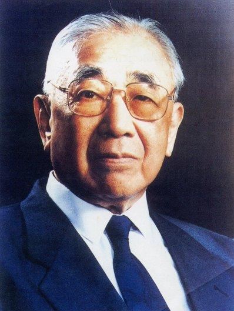
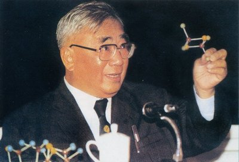

（万象特约作者：一一）

16年前的今天，不敢说自己是台湾人的中国科学院院长卢嘉锡在北京逝世

卢嘉锡（1915年10月26日－2001年6月4日），出生于厦门，化学家。卢家世居台湾台南市赤崁楼附近，是实打实的台湾人。因大陆人歧视台湾人，只好说自己是厦门人。解放后，就更不敢说了，一直到改革开放后，才敢说自己是台湾人。

40岁的卢嘉锡被选为中国科学院院士（化学学部委员），是中国当时最年轻的院士。1978年，改革开放后，以“台湾省代表团”团长的身份参加全国科学大会。1981年起，担任了6年的中国科学院院长。还作为第一位中国科学家，曾当选为第三世界科学院副院长。

来自台湾的世家

1915年10月26日，卢嘉锡出生于厦门。卢家世居台湾台南市赤崁楼附近的米街（现在台南市中西区新美街周围）。父亲是汉学先生（教蒙塾的老师），日本殖民台湾后搬到中国厦门，因“台湾人在大陆被人看不起”，对外宣称是福建龙溪人。卢嘉锡读书以后，因自己出生在厦门，对外说自己是福建厦门人，直到改革开放后，才敢对外自称是台湾人。卢嘉锡幼时随父读书，他禀赋甚高，父母寄予厚望，渊源家学。

（台湾赤坎楼）

最年轻的学部委员

1934年（19岁），卢嘉锡毕业于中国厦门大学化学系。1939年（24岁），获英国伦敦大学学院 (UCL)博士学位后，赴美国加州理工学院工作学习。1944年（29岁），在马里兰研究室参加美国国防研究工作。1945年（30岁），返回中国，在厦门大学任教，后担任副校长等职。

1955年（40岁），被评为中国科学院数理化学部委员（即中国科学院院士）。1960年（45岁），担任福州大学副校长和中国科学院福建物质结构研究所所长、并兼福建省科委副主任、中国科学院福建分院副院长等职。1973年（58岁），在国际上率先提出固氮酶活性中心网兜模型，之后又提出过渡金属原子簇化合物“自兜”合成中的 “元件组装”设想等问题，在化学模拟生物固氮等领域的研究中做出了贡献。

​                                                                              （卢嘉锡1934年毕业照）

中科院院长

1978年（63岁），以“台湾省代表团”团长的身份参加全国科学大会。1979年，被授予全国劳动模范称号。1981年（66岁），出任中国科学院院长。1984年，当选欧洲科学文艺文法学院名誉院士。1985年，当选为第三世界科学院院士，并曾任第三世界科学院理事会理事、副院长等职。

1987年（72岁），卸任中国科学院院长，担任中国科学院特邀顾问、主席团名誉主席等职；同年，获伦敦城市大学名誉科学博士学位，获比利时皇家科学院外籍院士称号。卢嘉锡还曾任中国化学会理事长、中国科协副主席、第八届全国人大常委会副委员长、第七、九届全国政协副主席、中国农工民主党中央主席、名誉主席、中国和平统一促进会会长、欧美同学会会长等职。

2001年6月4日，在福建福州病逝。

