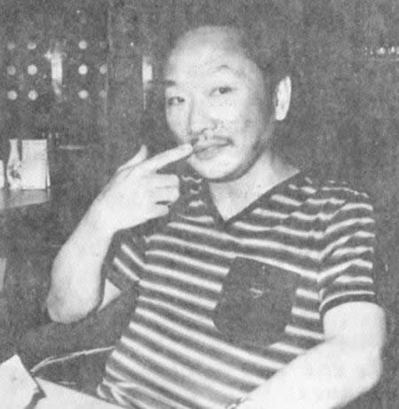
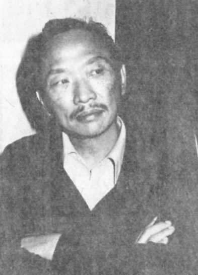

79年前的今天，为了逃避兵役而没有身份证、新派武侠小说四大家之一的古龙出生于香港

小李飞刀成绝响，人间不见楚留香的武侠作家古龙出生

万象特约作者：一一

古龙（1938年6月7日－1985年9月21日），原名熊耀华，籍贯江西南昌，出生于香港。自1960年代起，以笔名“古龙”创作多部脍炙人口的武侠小说，包括《楚留香传奇》、《绝代双骄》、《小李飞刀系列》、《陆小凤传奇》等。历年来古龙的著作屡次改编为电视剧、电影等，对华人影视文化贡献重大，与金庸、梁羽生、温瑞安并称为新派武侠小说四大家。

古龙一生放浪形骸，纵情酒色，终因肝硬化、静脉出血而去世，享年48岁。古龙去世后，乔奇为他写了一副挽联：“小李飞刀成绝响，人间不见楚留香”。古龙的弟子丁情说：“因为古大侠寂寞，所以他便追求新奇，所以他的婚姻不能长久。古大侠生性是浪子。”

（古龙手迹）

金庸对古龙评价道：“古龙的小说没有明确的历史背景，他用一种欧化的、现代人的想法来表达一种武侠世界，另走一条路，他的小说有几部也写得很好。古龙的小说较有深度，范围比较广，想法很新。他是我相当熟的朋友，现已过世。他的个性中有一个缺点是不太能坚持，大部分小说写了一半，就不写了，由别人代写，所以水准不齐，假如是他自己写完了的，当然水准高得多。”

温瑞安评价：“古龙的写法就比较简单，他本身是极有才情的。但古龙的问题在于，他有极高的才华，他也有浪子的个性，所以他的创作是留有余手，不尽全力的。而且古龙又喜欢喝酒，经常喝酒误事，难免就会出现代笔什么的，前后水准参差不齐，这是非常让人惋惜的。”温瑞安坚持认为，“古龙和金庸的地位，绝对应该是并排的。”

浣花洗剑录

由于对日抗战，古龙父母到香港避难。1938年6月7日，古龙生于香港，原名熊耀华。幼年就读于德声教会小学。1950年（12岁），漂洋过海，定居台湾，就读台湾师院附中（今师大附中）初中部。据当时同届三十七班朱邦复说，古龙当时就读卅五班，喜欢上三十七班的古X凤，因此后来笔名取作古龙。

1954年秋，考上成功中学（高中）。古龙在这段时间大量写诗，投稿蓝星诗刊、成功青年等。然而高二时，父亲抛弃妻儿，古龙也曾离家出走，饱经人情冷暖。1957年秋（19岁），古龙进入淡江英专（即淡江大学前身），就读夜间部的英语科，第二年弃学。

为了谋生，他开始从事武侠小说创作。1960年至1963年是古龙的萌发阶段，发表了《孤星传》和《护花铃》等十余部小说。这时，台湾武坛以三剑客卧龙生、司马翎、诸葛青云为尊，古龙特意结交他们，还替他们代笔了几部作品。

（左起：卧龙生、诸葛青云、古龙）

武林外史

1963年起（25岁），第一个妻子郑月霞（莉莉）开始和古龙同居于台北县瑞芳镇。感受家庭温暖的古龙，接连发表了《情人箭》、《大旗英雄传》、《浣花洗剑录》、《名剑风流》、《武林外史》和《绝代双骄》等六部长篇；1967年（29岁），又出版《铁血传奇》（即楚留香传奇），集武侠、文艺、侦探、推理、寓言于一身。以上作品皆接近或超过百万字，质感也明显提升，可视为创作的茁壮阶段。

1964年至1966年，发表的《浣花洗剑录》向《宫本武藏》等日本时代小说取经，探索武道（天道），另辟武侠蹊径。《武林外史》奠定古龙武侠小说的“浪子”风味，强化了《名剑风流》的现代感。《绝代双骄》有明显的寓言化倾向，是颇受到好评的长篇武侠喜剧。附带一提的是，当时香港知名作家倪匡替明报邀稿《绝代双骄》，从此和古龙结为莫逆。

（春风得意的古龙，这是否就是陆小凤的原型呢？）

多情剑客无情剑

1968年起（30岁），《多情剑客无情剑》开启了古龙创作的成熟阶段。《多情剑客无情剑》、《萧十一郎》、《流星‧蝴蝶‧剑》、《欢乐英雄》、《大人物》、《陆小凤》系列、《七种武器》系列、《天涯‧明月‧刀》、《三少爷的剑》、《白玉老虎》、《碧血洗银枪》及《英雄无泪》等作品均广受读者欢迎。

其中《陆小凤》系武坛首席名家金庸封笔后亲自为旗下的明报邀稿，有世代传承的意味。另外《天涯‧明月‧刀》因理念较为前卫，被中国时报腰斩，古龙常引为憾事；中国时报后来又向古龙邀稿，于是就有了《碧血洗银枪》。

楚留香传奇

早在1969年，古龙就替导演徐增宏写过剧本《萧十一郎》，这也是第1部先有剧本再有小说的武侠名著。不过电影于1970年代初上映时不受注目。1976年，香港邵氏推出《流星·蝴蝶·剑》、《天涯‧明月‧刀》，轰动港台及东南亚，古龙小说如日中天，几乎每一部都被改编为影视作品。

（古龙与他的新片《午夜兰花》演员林青霞、郑少秋合影）

以1970年代郑少秋主演的港剧《楚留香传奇》为例，在台湾刮起武侠旋风，盛况空前，“满城争说楚留香”。因此，古龙自1970年代晚期即投入影剧事业，与好友倪匡、导演楚原经常合作，挂名之作品不下数十部，1980年甚至创办了宝龙电影公司。

古龙多部小说极受导演青睐，不断改编成电视、电影，尤其是《楚留香》、《多情剑客无情剑》、《绝代双骄》、《陆小凤》等。古龙一生创作的武侠小说达六十余部，代笔、冒名之伪书可能超过百部。

流星·蝴蝶·剑

古龙因逃避兵役，没有身份证。年轻时与郑月霞同居，生下长子郑小龙，依中华民国当时的民法，这段有公开仪式及两个以上的证人即为有效婚姻。因古龙没有身份证，郑小龙从母姓，后来成为警察，一度是马英九的贴身保镖。

后来古龙又迷上中日混血儿的舞女叶雪，叶雪同样是他明媒正娶的妻子(同样未登记)，不久分手，育有一子。1976年，以假身份证办理再婚，对象是年轻的梅宝珠。宝龙电影公司即取自夫妇之名。但古龙重友情而轻妻儿，不善经营婚姻，几年后便以离婚告终。晚期女友不计其数。

古龙的弟子丁情说：“因为古大侠寂寞，所以他便追求新奇，所以他的婚姻不能长久。古大侠生性是浪子。”古龙自年轻时就嗜色嗜酒，发财后更加无节制。

（轰动一时的风流官司，未成年少女赵姿菁案。赵母牵着女儿赵姿菁的手，在走进法庭之际与古龙相遇，“桃色纠纷案”以赵家提出赔偿500万元私了）

天涯‧明月‧刀

1980年10月22日晚上十时，电影演员柯俊雄和几个朋友，到北投吟松阁旅社212号房间饮酒作乐。此时古龙在207号房间内，因为不愿到隔壁房间向柯俊雄敬酒，柯俊雄的朋友竟蓄意刺伤重残古龙右手，使他无法写作。古龙虽因身边友人帮忙格斗抵抗幸未成残，却因急救输血用的是从卖血的“血牛”身上买来，因而染上肝炎，从此健康更形恶化，“大头、胖子”的体型严重缩减，判若两人。

（古龙和倪匡，于吟松阁事件受伤后）

婚姻的触礁、电影投资的失利，也造成古龙心中的苦闷，忘情于酒，健康不佳。1985年9月21日，因肝硬化引起食道静脉瘤大出血，下午六时即撒手人寰，享年47岁。出殡时，友人王羽、林清玄等人在他的棺材里放了48瓶XO酒陪葬。乔奇为他写了一副挽联：“小李飞刀成绝响 人间不见楚留香”。

（为了取悦洋女子甘愿缩食减肥，古龙的最后一张照片）

