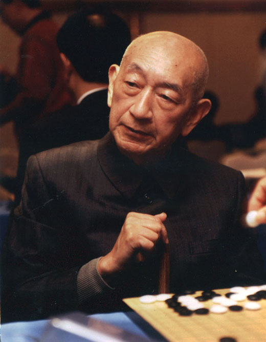

（万象特约作者：一一）

103年前的今天，1914年6月12日，一人战败全日本，围棋史上的最强者吴清源生于中国

吴清源（1914年6月12日－2014年11月30日），出生于中国福建，现代围棋名家。少年赴日本，他打破了日本300年的小目布局传统，开创新布局，一反传统重视角地，改为重视中央势力，开创了现代围棋新时代，被称为“现代围棋第一人”。

二战初期，在日军铁蹄横扫中国和东亚大陆的同时，棋士吴清源在日本本土上孤军奋战，在十次十番棋中，战胜了全日本最顶尖的七位超级棋士，被誉为“昭和棋圣”。虽然吴清源加入了日本国籍，但日本人始终认为他是中国人。这段时期，被称为“吴清源时代”。

在挑战名人本因坊秀哉时，三手棋分别下在三三、星、天元，技惊四座。秀哉被迫多次打挂（中断比赛），与众弟子商议，终于在160手下出妙手，吴清源2目惜败。他曾到访满洲国、日占期间的上海，被人视为汉奸。他战后恢复中国籍，老年再入日本籍，一百岁时病逝。

谁是围棋史上最强者？不少顶尖高手异口同声地回答说是吴清源。也有人认为：“历代的高手们处在不同的年代，要作比较是很困难的。如果非要问谁最强，大致可以列举3位：道策、秀策、吴清源。

去日本的围棋天才

1914年6月12日，出生于福建省闽候县（今属福州市）。七岁起跟爸爸学棋。后到北京，受多名围棋高手指导，如顾水如、刘棣怀、汪云峰。13岁时，让先与当时的名手过惕生对局，半目获胜。当时的北洋政府总理段祺瑞酷爱围棋，曾经赞助他生活费一年，且曾对奕一局。

1927年（13岁），日本的井上孝平五段去北京游访时，让二子与吴清源对弈，结果中盘大败，再改以让先三局，弈成一胜一和一打挂（打挂=上手暂停比赛）。有人将棋谱寄给当时日本的围棋界的长老濑越宪作七段，他认为吴清源是难得一见的天才，决定收他为徒。

1928年10月（14岁），吴清源与母亲、哥哥一起东渡，到了日本后刻苦好学，棋艺越来越精进。从1929年至1932这三年时间，吴段位不高，执黑棋为多，以秀策流为主体，战绩辉煌，获得了“黑先无敌”的美誉。例如1932年的对局成绩是44胜5败1平，升为五段。

（青年时期的吴清源）

突破常规的新布局革命

吴清源段位升高，开始常执白棋。当时，黑棋无贴目，传统的小目定式会让白棋布局落后，吴清源试图打破常规。1933年（19岁），吴清源与另一年轻棋手木谷实作十番棋赛。吴清源执黑棋下出当时极为罕见的对角星布局，木谷实也下出一反传统重视角地，改为重视中央势力的下法。

此后，二人对“新布局”进行热烈地探讨。在秋季大手合（相当于段位赛）中，二人使用新布局，胜率竟意外的高。吴清源名列榜首，木谷紧跟其后为第二名。一时间，新布局名声大振，传统的日本棋界受到巨大震动。

从幕府初期本因坊算砂开始，300余年的小目布局传统模式被打破，新布局让棋手布局的思维方法获得自由。日本著名作家川端康成赞扬说：“木谷实、吴清源创造新布局的时代，不仅是二人盖世天才的青春时代，实际上也是现代围棋的青春时代。”

（吴清源（左）和梅兰芳）

下在天元的名人战

1933年（19岁），读卖新闻主办了“日本围棋选手权战”，吴清源在决胜中打败桥本宇太郎成为优胜者，获得与秀哉名人（第一高手的头衔）对弈一局的荣誉。此时正值日本策划“满洲事件”，中日关系异常险恶，因此这盘棋从始至终笼罩着“中日对抗”的色彩。

布局中，吴清源将黑棋第一、三、五三手，分别下在三三、星、天元。如此匪夷所思的布局，顿时引起轩然大波，社会上的棋迷们议论纷纷。尤其是三三，在本因坊一门中被称为“鬼门”定为“禁手”，若坊门子弟下此手是要逐出师门的。秀哉马上提出打挂，与众弟子商议。

这局棋从1933年10月16日开始，直到次年1月19日宣告结束。从布局到中盘，基本上旗鼓相当，黑棋略微优势，但是在关键时刻，秀哉打了出第160的妙手，吴清源终以二目败而终局。据说秀哉之所以取胜，是因为他的弟子前田陈尔帮他出了一好招，即第160那一子“妙手”。

许多人认为，秀哉屡次提出暂停（打挂），回去和弟子们研究，把一局棋延长三个月，未免不公正。从此，日本棋院规定一日内不能结束的比赛，采用“封棋制”的规定，就是轮到下子的一方将要下子的位置画到棋谱上，交裁判保管，但对手无法得知，继续比赛时放置到棋盘的相应位置继续比赛。

（下在天元的棋谱）

镰仓十番棋

1934年，吴清源晋升六段，作为“日满华围棋友好访问团”去伪满洲国，和当年即位“满洲国”皇帝的傅仪下棋。1936年4月，加入日本国籍。1938年（24岁），秀哉名人引退。1939年，吴清源晋升七段。

名人（即九段）腾出，当时日本棋坛八段以上成为真空，七段位的，除了几位元老级棋士外，年轻的棋士只剩下木谷实和吴清源了。为决定谁是日本棋界的王者，读卖新闻社主办了，“吴清源、木谷实擂争十局棋”。这就是日本围棋史上著名的“镰仓十番棋”。

1939年9月28日，木谷实于“镰仓十局”第一局执黑，占低位坚实取地。吴清源则执白构成大模样，黑棋陷入苦战。谁知吴清源在第120手时走出失著，遭木谷实猛烈反击，造成大劫。此时双方聚精会神下棋，忽然木谷实鼻孔流血侧身昏倒，而吴清源专注思考，竟没有察觉，事后被质问。

打劫的结果白棋净损七目，败局已定。不想，在收官的紧要时刻，木谷实也走出失著，吴清源再次挑起劫争，终于实现逆转，获两目胜。“镰仓十局”至1940年10月第六局下完后，吴清源五胜一败，将木谷实降级为“先相先”（即三局中两局执黑）。至1941年，吴最终以六胜四负战胜木谷实七段。自镰仓十番棋后，日本棋坛进入吴清源时代。

（吴清源（右）与木谷实对弈）

被迷惑的夷化汉奸

1941年（27岁），吴清源与雁金准一八段进行“十番棋”角逐。雁金准一是当时棋界的长老，德高望重，有“力战之雄”的美称。两人以分先对弈，到第5局结束，吴清源4胜1负，遥遥领先。有关人士考虑到雁金先生的名声与健康，决定将以后的对局全部终止。

1942年2月7日（28岁），吴清源跟20岁的中原和子结婚。1942年，曾应汪精卫南京政府顾问邀请，到上海慰问，当时有爱国人士在饭店贴上“杀死夷化汉奸吴清源”的标语。

1942年底，吴清源与藤泽库之助十番棋开始。藤泽的棋风简朴坚实，被赞扬为“黑先无敌”。藤泽只为6段，差两级，按规定藤泽定先执黑。至1944年，吴清源与藤泽库之助的十番棋结束。吴清源四胜六负，手合不变。

此后，吴清源为生活和信仰玺宇教所驱使，颠沛流离于日本各地，完全脱离了棋艺生涯。

（吴清源与吴和子的结婚照）

重出江湖的九段高手

1947年（33岁），《读卖新闻》社派人寻访到吴清源，说服他与桥本宇太郎八段进行“十番棋”。第1局，吴清源执黑先行，但以五目告负。第2局吴清源执白仍不见起色，弈至中盘白棋已呈必败之势，但桥本宇太郎突然于中盘多次下出错招，吴清源终于侥幸获一目胜。从第3局开始，吴清源终于恢复了本来面目，势如破竹，至第八局结束，6胜2负将桥本降级至先相先。

1948年（34岁），吴清源对岩本薰的十番棋，战至第6局时5胜1负，将岩本降级。1949年2月，吴清源取得“中华民国”的国籍。

1949年，藤泽库之助在棋士升段大赛中由八段晋升九段，成为秀哉去世后，日本仅有的九段。而战前吴清源曾将他打败过，于是集中10名高段棋手(4名六段、6名七段)，轮番向吴清源挑战，作为他的“九段升段试验比赛”。

由于日本棋院没有以低段检验高段的先例，此举引起一番争论。按照规定，吴清源除对高川格、前田陈尔两位七段执黑外，对其它8名六七段高手均执白棋，没有贴目。结果：吴清源8胜1负1平，被日本棋院赠授九段，时年36岁。

十番棋之王

1950年（36岁），对桥本宇太郎的第二次十番棋，桥本已降级为先相先，结果吴清源5胜3负2平。1951年（37岁），举办“吴清源对藤泽十番棋”，吴清源7胜2负1平，将藤泽降为先相先。1952年，吴清源与藤泽库之助再次进行十番棋，弈至第6局，吴清源5胜1负，将藤泽降级到定先。

1953年（39岁），吴清源对坂田荣男的“十番棋”，当时的坂田八段正在全盛时期。在这场举世注目的棋战中，吴清源以6胜2负的成绩将坂田降级到定先。1955年，吴清源与高川格的十番棋开始。至1956年，吴清源在前八局中六胜二负，将高川格（七段）降为先相先，最终吴六胜四负。

吴清源自战前的“镰仓十番棋”开始独霸擂台，连续15年的升降十番棋里，将日本所有一流棋士一一降级。这16年，是他的全盛时代，被称为“吴清源时代”。直至后来无人可战，升降十番棋不得不结束。此后，吴被称为“十番棋之王”、昭和棋圣。

（1950年，吴清源（左）与同门师兄桥本宇太郎对弈）

遭遇车祸的最强者

1952年（38岁），中国围棋社邀请吴清源访问台湾，授予“大国手”的称号，并会见蒋介石。此行在台北与年仅十岁的林海峰下测试棋，后收之为徒。

1961年8月（47岁），吴清源正在过马路时被摩托车撞飞，右脚和腰皆骨折，住院两个月，并留下头痛的后遗症。时值第一期名人战期间，吴清源最终排名第二，但之后几期状况持续下滑。

1979年（65岁），吴清源再次加入日本籍。1984年（70岁），吴清源正式宣告隐退。1985年，吴清源实现了战后第一次访问中国大陆。2014年11月30日凌晨1时11分，在日本神奈川县小田原市内去世，享年100岁。

1987年，日本“围棋俱乐部”征求6位超一流棋手加藤正夫、武宫正树、林海峰、赵治勋、小林光一、大竹英雄的意见：谁是围棋史上最强者？赵、林、武宫、加藤4人异口同声地回答说是吴清源。小林和大竹则认为：“历代的高手们处在不同的年代，要作比较是很困难的。如果非要问谁最强，大致可以列举3位：道策、秀策、吴清源。”

（在老人院里的百岁吴清源）