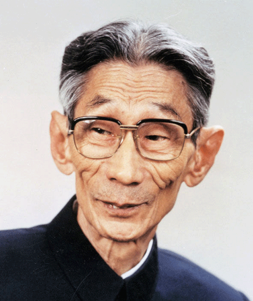
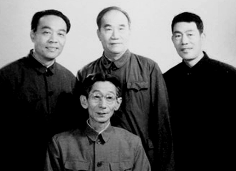
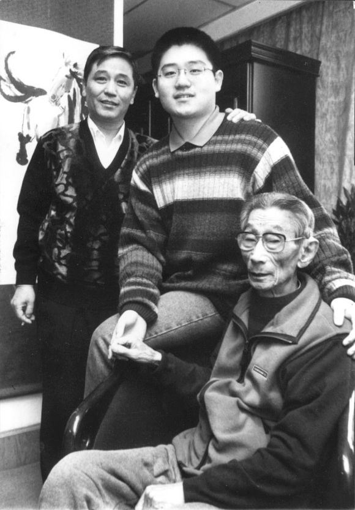
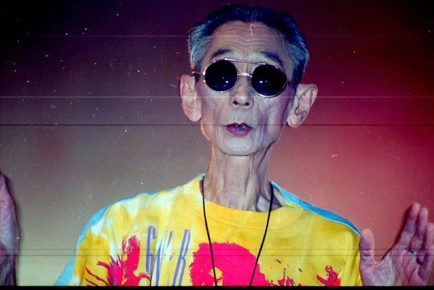
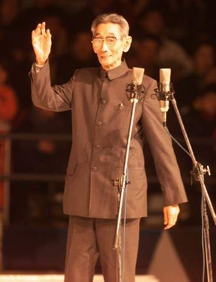

## nnnn姓名（资料）

### 成就特点

- ​
- ​

### 生平

103年前的今天，马大哈买猴逗你玩的相声泰斗马三立出生

【曲艺世家的穷小子】

1914年10月1日，马三立出生于北京，回族，从小生活在天津。家里是曲艺世家，父亲是是“相声八德”之一，母亲唱京韵大鼓。初中毕业后，因家境不好，辍学说相声。

1930年（16岁），马三立开始登台演出，拜周德山为师。经过长期的艺术实践，形成了内紧外松、有条不紊、表演细腻、含蓄隽永的风格。擅演“贯口”和文哏段子，如《夸住宅》、《地理图》、《吃元宵》、《文章会》等。解放前，先后与耿宝林、刘奎珍、侯一尘、张庆森搭档。

1947年（33岁），他登上了被全国的说唱艺人视为大台口的天津大观园剧场，大受观众追捧；第二年，到北京在华声电台和茶社戏园演出，以他风格独特的马家相声在曲艺迷中引起“原子弹爆炸一样”的轰动。

（马三立与刘文亨、侯宝林、杨少华合影）

【给主席总理演买猴】

建国后，马三立积极编演新相声。1950年，回到天津在新声戏院演出。1952年（38岁），马三立主动申请参加赴朝慰问团。回国后加入天津广播曲艺团，致力于相声的整旧创新，后来转到天津市曲艺团。

1956年1月12日（42岁），他给毛泽东演出《买猴》。主席听完他的相声后操着浓重的湖南口音说：“买猴子，买猴子。”在同年的国庆招待晚会上，马三立又把《买猴》这个节目演给周恩来总理。这是马三立最引以为傲的两次演出。

（1956年，马三立与张庆森一起探讨问题）

【拿来凑数的右派】

1958年（44岁），马三立被打成了“右派”。 关于他为何被打成右派，主流的说法是《买猴》中塑造了一个闻名全国的办事马虎、工作不认真的人物形象“马大哈”。但1979年平反时，才发现他的档案里，没有任何“右派”的认定材料，完全是因为右派指标由起初的4个增加到了11个，只好把他报上去凑数。

从1958年到1977年返回市曲艺团，19年间马三立只说了3年相声，相对应的是长达11年的四次下放劳动，以及被关进“牛棚”做了5年的团煤球、打扫卫生等杂役。

（马三立与长子马志明、孙子马六甲合影）

【再度辉煌的老艺人】

平反以后，年届古稀的马三立和王凤山搭档，将《西江月》、《文章会》、《开粥厂》、《卖挂票》等众多拿手绝活再度搬上舞台。尤为难得的是，马三立在无人捧哏的情况下，编创表演了一系列脍炙人口的单口小段：《逗你玩》、《家传秘方》、《检查卫生》、《八十一层楼》、《追》等等。

在掌声中，在人群中，他一次又一次地说：“我不是大师，不是艺术家，我只是个普普通通的老艺人，是个热爱相声、喜欢钻研相声的老艺人。”

【告别舞台80年】

2001年12月8日（87岁），马三立大师在天津人民体育馆举行告别演出，正式隐退，结束了八十年的从艺生涯。马三立当时87岁高寿，仰慕者遍布四面八方。这次告别舞台演出，是文化界特别是相声界的一件大事。

（马三立从艺八十周年暨告别舞台演出）

2003年2月11日6点45分，马三立因病医治无效，告别了他的观众，享年89岁。其葬礼在天津依照穆斯林风俗进行。

（马三立葬礼）

【无派不宗马的艺术家】

马三立创立了独具特色的“马氏相声”，是当时相声界年龄最长、辈分最高、资历最老、造诣最深的“相声泰斗”，深受广大观众的热爱与尊敬。马氏相声雅俗共赏，在天津形成了“无派不宗马”的说法。天津市民曾投票推选出10个地方名人，要在海河边上为他们树立雕像，他们把最多的票投给了马三立。

马三立最后的《遗笔》，写出了他的一生：

弟兄十二我行七（马）
推倒四六二十一（三立）
祖传秘方太找乐
东北买猴乐不疲
包罗万象西江月
入木三分开会迷
老叟从艺八十载
江湖笑面写传奇

（天津街头的马三立铜像）

