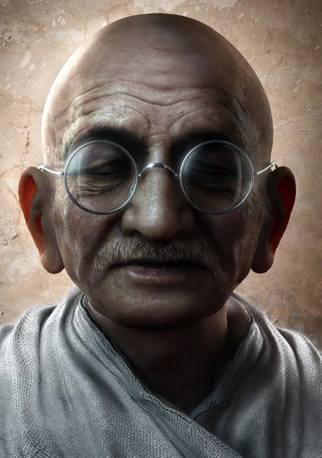
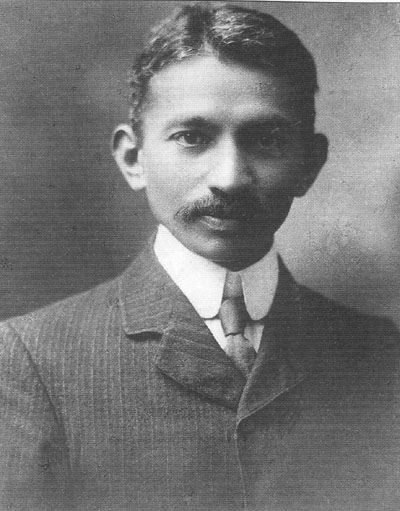
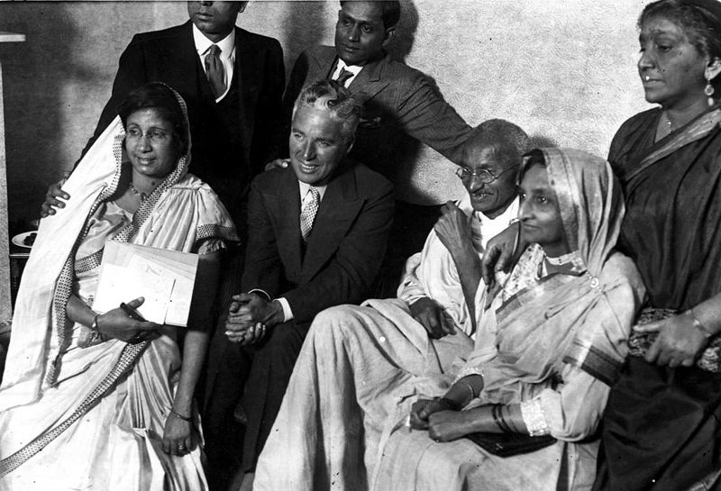
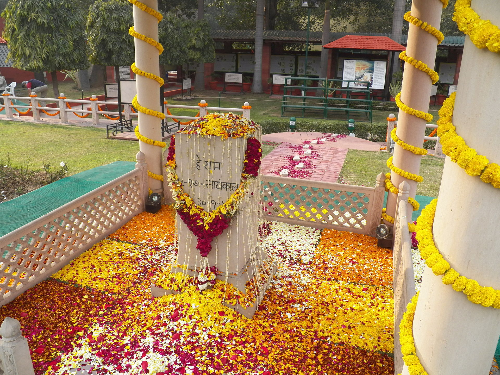

## nnnn姓名（资料）

### 成就特点

- 圣雄甘地
- 带领印度迈向独立，脱离英国殖民地统治
- 非暴力（अहिंसा，ahimsa）哲学思想
- 主要信念是“真理坚固”
- ​

### 生平

148年前的今天，14次绝食4次入狱5次诺奖提名的圣雄甘地出生

【13岁结婚的素食主义者】

1869年10月2日，甘地出生于印度西部。父亲是土邦首相，信奉印度教。

13岁时，结婚，先后生育了4个儿子。19岁，留学英国，在伦敦大学学院学习法律。他不吃荤和不酗酒，成为素食主义者。阅读印度教圣经《薄伽梵歌》，深受影响。回国后，在孟买当律师，并不成功。

（《薄伽梵歌》阿周那与黑天）

【从火车扔出去的南非印度人】

1893年4月（24岁），被派到南非工作。他开始抗议针对南非印度人的法律和种族歧视。据说，他曾买了一张一等车厢的车票，拒绝换到三等车厢，被人从火车中扔了出去。

1903年6月（34岁），甘地组织抗议“黑法令”，这个法令强制所有在南非的亚洲人接受登记。36岁时，他成为一个彻底的禁欲主义者，但是他没有离婚。

1913年9月（44岁），他组织抗议“不按照基督教仪式结婚就无效”的运动。11月6日，在领导印度矿工游行时被捕。在南非的岁月里，甘地的非暴力不合作抵抗的概念开始形成。

（1909年的甘地）

【想要自治的国大党领袖】

1915年（46岁），甘地回到印度后，很快就成为致力独立运动的国大党的领袖。甘地穿着一道缠腰布在印度乡下四处演讲，他鼓励使用手纺车，以抵制对英国纺织工业的依赖，并因此得到大量女性支持。他号召印度人参加英印陆军，投身第一次世界大战，以帮助印度脱离英国，实现自治。

1919年（50岁），英军杀戮上千印度平民的阿姆利则惨案爆发后，甘地支持独立的立场更加坚决。除了抵制英国产品外，他还极力鼓励人们抵制英国学校，法律机构，辞退政府工作，拒绝缴税，抛弃英国给的称号和荣誉。

1920年4月，他当选为印度自治同盟的主席。在他的领导下，国大党重组，制定新的章程。新党章明确目标是争取独立。任何人只要交纳一定的象征性费用就可以入党。国大党由一个精英组织转变成一个大众化政党。

【第1次、第2次被捕入狱】

1922年（53岁），在北方邦发生暴力事件后，甘地第一次宣布停止“非暴力不合作运动”。3月18日，他被英印当局逮捕判刑6年，但事实上只服了2年刑。

1929年（60岁），甘地再次开始非暴力不合作运动。1930年3月21日到4月6日，他领导了一生中最著名的一次运动：为抗议殖民政府的食盐公卖制，甘地游行达400公里，被称之为德里游行（或称“盐队”）。数以千计的人们徒步到海边自己取盐，而不给政府交税。甘地因此第二次被逮捕入狱。

（1931年，甘地会见卓别林等人）

【第3次、第4次被捕入狱】

1933年（64岁），甘地发起第三次“非暴力不合作运动”，在杂志上宣传反暴力、反法西斯、要求独立的愿景，结果杂志被英印当局查封，30000人被逮捕。5月8日，甘地开始为期21天的绝食抗议。甘地因此第三次被逮捕入狱。

1939年（70岁），二战爆发，甘地拒绝参战，他声称：如果战后印度可以独立的话，才会与英国并肩战斗。1942年，日军重挫南亚的英军，并在仰光成印度独立临时政府。甘地趁机起草了一个让英国从印度退出的草案。这个草案立刻引发印度有史以来的最大的一次独立运动。甘地因此第4次被捕入狱。

（1940年，甘地和泰戈尔）

【第14次绝食后的血案】

1944年（75岁），英国殖民当局为稳定局势，以生病名义释放甘地。1946年，印度皇家海军和英属印度陆军发生全面兵变。甘地与最后两任总督合作制定了印度独立和分治方案。

1947年8月15日（78岁），印度正式宣布独立。此时，许多追随者开始尊称他为“圣雄”。在政权交接的那天，甘地没有庆祝印度的独立，而是独自在加尔各答为分治而忧伤。甘地的接班人——尼赫鲁成为独立后的首位印度总理。

然而一些人不接受印巴分治法案，印度教徒和穆斯林发生暴乱冲突，于是甘地开始他的第14次绝食。1948年1月30日（79岁），刚刚结束绝食的甘地在新德里前往一个祈祷会途中，遭到一名印度教狂热分子枪击，中弹死亡。

（新德里甘地遇刺的地方）

（甘地陵）

【诺贝尔和平奖的遗憾】

甘地奉行的个人克己生活制度包括素食，独身，默想，禁欲。他的头衔圣雄（Mahatma）来源于梵语，原意“伟大的灵魂”。甘地崇尚各个宗教彼此尊重，他不歧视、不排斥任何与自己民族不同的信仰。他曾宣称：“我是伊斯兰，是印度教徒，是基督徒，也是犹太人。”

在1937年到1948年之间，他获得过五次诺贝尔和平奖提名，但始终未能得奖。1948年，甘地去世那年，诺贝尔和平奖停止颁发。在1989年，当达赖喇嘛获得诺贝尔和平奖时，委员会主席说：“这个奖的一部分是纪念圣雄甘地”。

2007年，联合国大会通过决议，以圣雄甘地的生日10月2日设立为国际非暴力日。

（美国纽约市中央公园的甘地塑像）

【】

