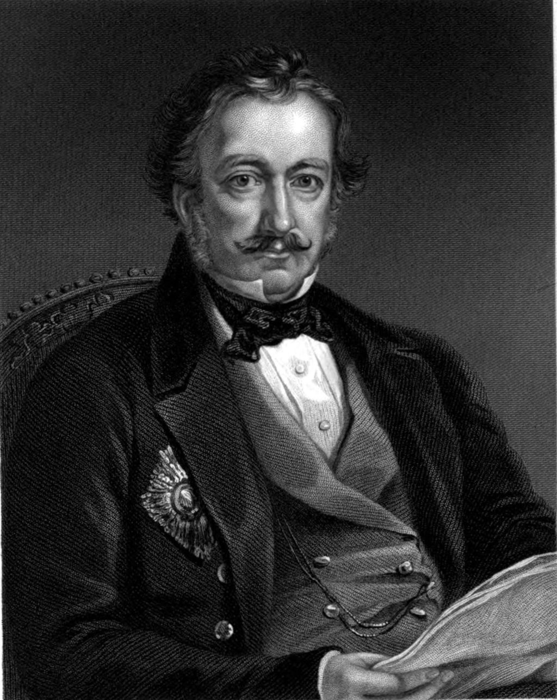
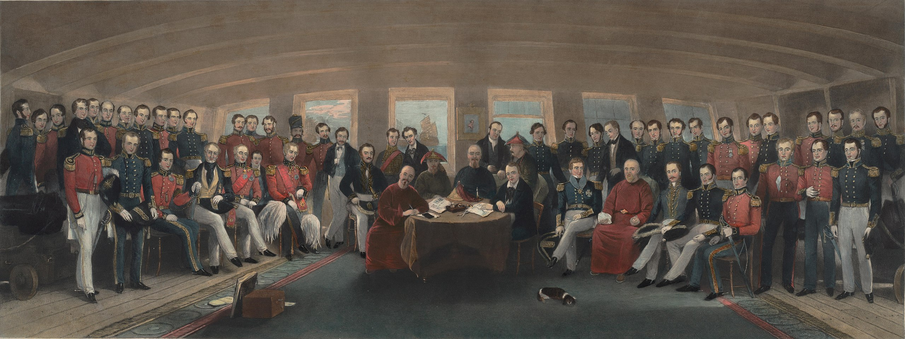

## nnnn姓名（资料）

### 成就特点

- 首任香港总督
- 《南京条约》签订英方代表
- 任期最短的港督

### 生平

陆军中将璞鼎查爵士，Bt，GCB（Sir Henry Pottinger[1]，1789年10月3日－1856年3月18日），香港译作砵甸乍，英国军人及殖民地官员，1843年成为首任香港总督。

1789年10月3日，璞鼎查生于爱尔兰。璞鼎查早年就读于贝尔法斯特皇家学院，后来因为家庭陷入财政拮据而中途缀学，与四名兄长前往东方寻找发展机会。

【印度】

璞鼎查在1804年抵达印度，他先于信德（Sindh，今巴基斯坦境内）参军，后在1806年加入了东印度公司，并曾于1809年以中尉身份在马拉他（Mahratta）参与战事。

其后，他在印度与波斯一带进行探险，打扮成回教商人，学习当地方言（有说是化身马贩进行间谍工作），并在1816年写成《Travels in Beloochistan and Sinde》一书。

璞鼎查在1820年获委任为信德的行政官，据闻在任内促进当地交通；之后他在海得拉巴（Hyderabad，今印度境内）任同职。但后来因为健康理由回国休养，并于1840年4月27日获册立为从男爵。

【鸦片战争】

1840年，清廷与英国爆发第一次鸦片战争，及后英方代表义律与清廷钦差大臣琦善在1841年1月私拟《穿鼻草约》。然而，草约送到伦敦后，时任外务大臣巴麦尊勋爵认为《穿鼻草约》过于宽松，英方得益太小，而条约中割让予英方的香港更被他批评为“鸟不生蛋之地，一间房屋也建不成”。因此责斥义律办事不力，予以撤换，并改派璞鼎查接任。

璞鼎查接任香港的行政官、驻华商务总监及英方全权代表后，在1841年8月抵华，并随即出兵，先后攻占厦门、定海、镇海和宁波等地。道光帝即以身兼协办大学士的皇侄奕经为“扬威将军”还击，但却大败而回。及后，英军在璞鼎查指挥下进犯长江口，攻克吴淞、宝山和上海，至1842年7月又占领镇江，最终在同年8月兵临南京城下。

由于道光帝同意议和，清方代表遂与璞鼎查在南京静海寺议约四次，及后在1842年8月29日与清廷代表，钦差大臣耆英及伊里布等人在英舰HMS皋华丽号（HMS Cornwallis）上签订《南京条约》，正式结束了第一次鸦片战争。

【香港总督】

由于清廷在《南京条约》中有割让香港予英国一款，香港遂成为英国的殖民地。当时仍为英国全权代表的璞鼎查于1842年10月27日在香港发出告示，指“香港乃不抽税之埠，准各国贸易，并尊重华人习惯”。

其后维多利亚女皇在1843年4月5日颁发《英皇制诰》，《制诰》在同年6月抵港，而耆英与璞鼎查于6月26日在香港就《南京条约》换约，璞鼎查遂依据《制诰》，正式成为香港首任总督，到12月2日，大英帝国为表彰其功劳，向璞鼎查颁赠GCB勋衔。

鸦片战争结束后，璞鼎查复以战时英国国民流落台湾被杀为由，要求已改任两江总督的耆英代为“伸冤”。清廷为恐战事再起，派伊里布到广州主理对英交涉事宜，但其后伊里布病故，璞鼎查即扬言率舰北上，续与耆英谈判。清廷得悉后大为紧张，道光帝遂以耆英为钦差大臣，到广州与璞鼎查继续谈判。

结果，耆英到香港顺道就《南京条约》换约外，双方在1843年7月22日在香港签订《中英五口通商章程》，复于同年10月8日在虎门签订《五口通商附粘善后条款》。

璞鼎查上任总督后，随即依据《英皇制诰》成立香港政府，设立了行政局、定例局和最高法院。当中，璞鼎查在1843年8月宣布委任三名官守议员加入定例局。该三名官守议员分别为庄士敦（前护理总督）、摩理臣（商务总监中文秘书兼传译员）及金尼（首席裁判司），因此定例局最初连总督在内，只有四名成员。定例局在1844年1月11日举行首次会议，并在1844年2月26日通过首条香港法例。然而，璞鼎查任内甚少举行会议，因此总督拥有很大的权力。

由于驻港军官不满璞鼎查干预军务，英国商人又不满他严守《南京条约》，不准英商在通商口岸以外的地方走私鸦片。结果璞鼎查备受孤立，终在1844年5月7日卸任总督一职，返回英国，成为任期最短的港督。

【】

璞鼎查返国后受到热烈欢迎，又于1844年5月23日获委任为枢密院顾问官。在1845年6月，英国下议院投票通过终身向他每年发放1,500镑津贴。

璞鼎查后于1847年出任开普殖民地总督，复在1848年至1854年出任马德拉斯总督，并于1851年获擢升为中将军衔。璞鼎查退休后居住在地中海岛国马耳他，于1856年3月18日，准备启程回国前去世，享年66岁。

【】

耆英在签订《南京条约》时，他遂把握机会与璞鼎查建立友谊。例如，有次耆英看到璞鼎查的一张全家幅时，对其儿子大为赞赏，并以自己并无子嗣为理由，希望收养其儿子为养子。由于璞鼎查不希望冒犯耆英，便一一应承，并将其儿子改名为腓特烈·耆英·璞鼎查（Frederick Keying Pottinger）。两人后来又互换礼物，耆英向璞鼎查赠送金手镯，而璞鼎查则回赠了一柄宝剑和腰带一条。自此，耆英更常在信中以“挚友”称呼璞鼎查。

在《南京条约》中，璞鼎查的头衔被清廷译作：大英伊耳兰等国君主特派全权公使大臣英国所属印度等处三等将军世袭男爵璞鼎查。

璞鼎查上任港督时，香港仅有15,000名华人，300多名欧洲人和5,000名驻防军人。

【】

### 照片

