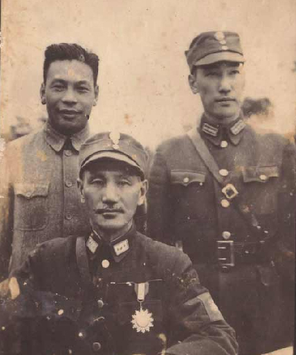

101年前的今天，中日混血、身世成谜的蒋介石“二太子”蒋纬国出生于东京。

万象特约作者：一一

蒋纬国（1916年10月6日－1997年9月22日），身世成谜的蒋介石“二太子”，一般认为他的生父是戴季陶，蒋介石是养父。1964年，蒋纬国旧部赵志华策动了湖口装甲兵事件，叛变未遂后蒋纬国远离权力中心，1997年逝世于台北。

1924年（8岁），蒋介石创立黄埔军校，以校为家，蒋纬国陪伴蒋介石3年。

1934年，蒋纬国在苏州东吴大学就读物理系。

1936年9月，蒋纬国赴欧洲留学。

1937年夏，蒋纬国随蒋百里到德国考察军事，担任少尉副官。4个月后，加入德意志国防军九十八山岳步兵团入伍，然后从二等兵干到实习班长、排长、连长等职。

1938年，正式到慕尼黑军官学校受训。官拜德意志国防军少尉，在德国习得新式战法，夜间则以足球自娱。

1939年，德国与日本、意大利组成轴心国。是年夏天，蒋纬国毕业，原本分发到德国步兵第八师，因为希特勒入侵波兰，欧战爆发，蒋介石命蒋纬国转赴美国，入美国陆军航空队及美国空军参谋大学正科受训，又进美国装甲兵训中心。

1940年冬，他返回中国。蒋纬国参加中国抗日战争和国共战争，往后长期任职中华民国国军。

1946年起，进入装甲部队（战车第一团），任陆军装甲兵司令部参谋长。

1948年12月23日，蒋介石派蒋纬国携带其亲笔信到北平，劝傅作义南撤。12月25日，蒋纬国飞返南京。

1949年2月，蒋纬国晋升为上校副司令，后跟随国民党败退台湾。

1964年，蒋纬国旧部赵志华策动了湖口装甲兵事件，叛变未遂。事件后，蒋介石认为他不善识人，便再未授与军权。

1964年，纬国奉命在三军大学任职，先后任陆军指挥参谋学院院长，后任三大副校长。1969年，创设战争学院，任院长。

1975年，蒋介石去世，纬国晋升陆军二级上将，并担任战争学院院长兼三军大学校长。

1980年，蒋纬国担任联合勤务总司令部总司令。

1984年，蒋纬国卸任联勤总司令，改调国防部联合作战训练部（当时简称为“联训部”；今国防部参谋本部训练参谋次长室（训次室））主任。

1986年，蒋纬国自军中退役，担任国家安全会议秘书长。

1990年，国民大会选举台湾地区领导人时，曾经有国大代表滕杰等人提议林洋港、蒋纬国分别候选候选正、副领导人方式参选，但最后林洋港与蒋纬国都未参选正、副领导人，而由李登辉与李元簇参选并当选台湾地区正、副领导人。

1993年，蒋纬国受聘为中华民国总统府资政。

蒋纬国在民间社团中颇为活跃，是中华战略学会创办人，并任中德文化经济学会理事长、中华民国足球协会理事长、静心小学第一任董事长等；著有《国家战略概说》

1997年9月22日，蒋纬国因糖尿病并发症，于台北荣民总医院逝世。身后安葬于汐止五指山国军示范公墓。

【湖口兵变事件】

1964年1月21日，驻在台湾省新竹湖口的“装甲兵副司令”兼第一师长赵志华，在新竹湖口装甲基地，召集“装甲第一师”军官训话，力斥“政府”和军界贪污无能、生活腐化，号召部队跟他一起开到台北去，“清除蒋总裁身边的坏人”。训话完毕后，赵志华询问台下谁敢跟他一起去，无人回答。赵志华掏出手枪，对空连开两枪，再次询问谁敢跟他一起去，但很快就被周围的人一拥而上抓住送进了司令部。得知这个消息，时任“国防部”副部长的蒋经国当即下令进入战备状态，严阵以待。事后，“陆军总司令”刘安祺自请处分；“装甲兵司令”蒋纬国受牵连，被调职，自此以后也未再授以兵权。一般称之为“湖口兵变”。

这是国民党迁台以来第一次将领号召哗变的事件，因此被视为谋反案处理。兵变的发生让蒋介石对主导装甲部队的蒋纬国有“御下无方”之怨言。在此事件后，蒋纬国的中将军衔被冻结，直到蒋介石过世后五个月，才在蒋经国签署下晋升上将，这段时间蒋纬国自嘲是“炖了14年的中将汤”。

【生父之谜】

蒋纬国到底是谁的儿子在历史上一直是众说纷纭的，有一种较为普遍的说法是戴季陶的儿子。
戴季陶是民国煊赫一时的风云人物，曾被蒋介石称为“笔杆子”，任考试院院长长达 20年之久，还担任过黄埔军校政治部主任、国民党中央常务委员、特种外交委员会委员长、国史馆馆长等高级职务，曾两次出任中山大学校长，后又当上国民党中宣部部长。

蒋纬国小时候在蒋介石安排下，拜戴季陶为义父。其称蒋中正为“父亲”，称戴季陶为“亲爸”。戴季陶，原籍浙江湖州，祖父一代移居四川广汉，湖州人称“义父”为“亲伯”，讹传为“亲爸”。同时戴季陶的儿子戴安国（1913年11月25日－1984年11月11日）拜蒋介石为养父。戴安国为戴季陶与“黑龙社”的津渊美智子所生。蒋纬国一直亲热称“安国哥”，他们情逾手足。蒋纬国曾说:“我与安国,情同手足,血浓于水。” 更是引发怀疑。

蒋纬国早年曾否认自己为蒋介石的养子，晚年时在自传《千山独行——蒋纬国的人生之旅》中表示：生父乃戴季陶，生母为日本护士重松金子（津渊美智子其实是其长兄戴安国之母，重松金子的名字出自蒋介石日记，非常可信）。但还有一种来自戴季陶的说法，是蒋介石的亲生子。

### 

