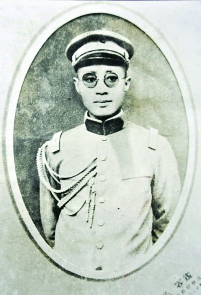
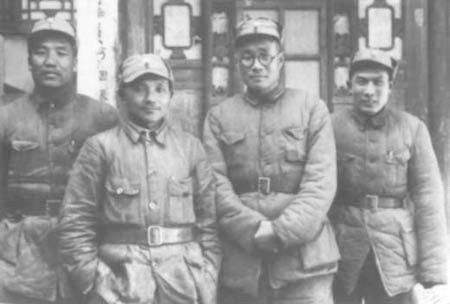
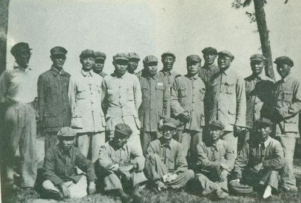
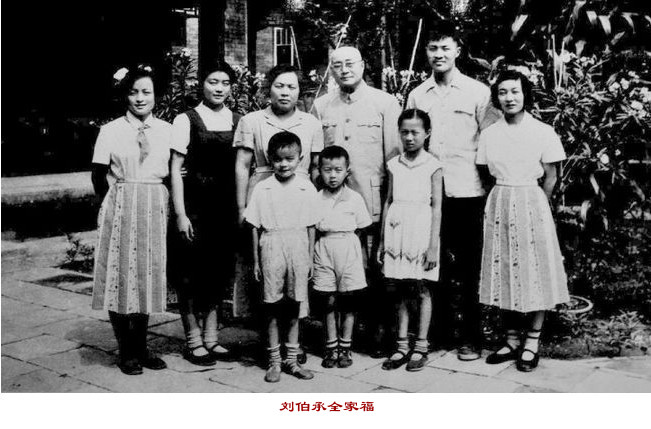
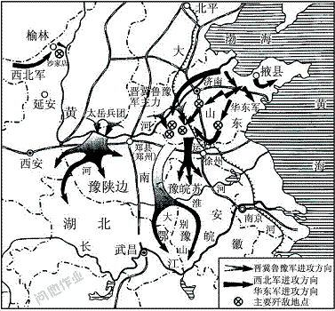

## nnnn姓名（资料）

### 成就特点

- 加入孙中山中华革命党
- 右眼中弹致残
- ​

### 生平

刘伯承（1892年12月4日－1986年10月7日）中国现代军事家、军事理论家。四川省开县（今重庆市开州区）人。

1892年12月4日，刘伯承出生于四川开县（今重庆市开州区）赵家场。5岁读私塾，12岁开始接受新式教育。15岁时因父病故、家庭困难，被迫辍学务农。

1912年，考入蜀军政府陆军将校学堂。1912年底毕业后，被分派到川军第5师熊克武部，先后任司务长、排长、连长。1913年二次革命爆发，参加熊克武四川讨袁军，失败后，流亡上海。1914年，刘伯承在上海加入孙中山中华革命党。

1915年底，奉命从上海返回四川，组建川东地方武装“四川护国军第四支队”。

1916年3月，刘伯承在率部攻占酆都时右眼中弹致残。1917年，刘伯承任川军第五师第九旅参谋长，参加护法战争。其后，他担任四川督军署警卫团副团长。

1920年，刘伯承参加与滇军顾品珍部作战，战后警卫团扩编为第二混成旅，刘伯承任一团团长。

1923年，刘伯承参加讨伐吴佩孚的战争，任熊克武四川讨贼军第一路前敌指挥官，取得了成都龙泉驿等战斗的胜利。

8月，刘伯承在作战中右腿负重伤。在成都养伤期间，认识杨闇公、吴玉章，开始认识中国共产党。1925年，随吴玉章赴广州、上海、北京等地考察。

1926年5月，刘伯承经过两年时间考虑，决定加入中共，经杨闇公、吴玉章正式介绍加入，任中共重庆地委军事委员会委员。

同年12月，与杨闇公、朱德、陈毅等发动泸顺起义，任起义军四川各路总指挥，打击四川军阀刘存厚。后为国民革命军暂编第15军军长 ，率部坚守泸州，抵御刘湘进攻。1927年5月，因泸州内外交困，刘伯承被迫撤离，辗转前往汉口。

1927年7月下旬，刘伯承秘密转赴南昌。8月1日，与周恩来、朱德、贺龙等人发动南昌暴动，任起义总参谋长，率部南下。起义军队在潮汕失败后，刘伯承与吴玉章、林伯渠等赴上海。

1927年11月，与吴玉章等30人赴苏联学习，先后在高级步兵学校学习。

1928年6月，他出席了在苏联召开的中共六大。年底，转入伏龙芝军事学院学习。

1930年8月，从苏联伏龙芝军事学院毕业，任中央军委参谋部部长、长江局军委书记，协助周恩来处理军委日常工作，举办短期军事训练班，并负责讲授暴动方略、游击战、运动战等课程。

1932年1月，刘伯承到达瑞金，被任命为红军学校校长兼政治委员。

1932年10月，任中央军委总参谋长。

1933年，刘伯承协助朱德、周恩来在前方指挥作战，取得第四次反围剿战争的胜利。期间，刘伯承撰写《现在游击队要解答的问题》、《到敌人后方开展游击战争的几个教训》等，并翻译多篇苏军教材和理论文章，促进了红军干部军事素质的提高。

1934年，在第五次反围剿战争中，刘伯承因为与博古、李德等人的意见相左，而被降为红五军团参谋长。

1934年10月，中央红军开始长征。长征初期，刘伯承协助军团长董振堂执行后卫任务。12月，刘伯承复任中央革命军事委员会总参谋长，兼任中央纵队司令员。

1935年1月，指挥先遣部队突破乌江，攻取遵义，随后参与遵义会议。此后指挥了强渡金沙江等战斗。

5月，刘伯承兼任红军先遣队司令，同政治委员聂荣臻率部进入大凉山，与彝族沽基族首领果基约达（小叶丹）在袁居海子（今冕宁县彝海子）结为兄弟，使全军顺利通过彝族聚居区。继而指挥所部在安顺场强渡大渡河。

1935年6月，红一、四方面军会合后，刘伯承随红四方面军行动。因为反对张国焘的南下主张，而被张国焘免去总参谋长职务，改任四方面军红军大学校长。

1936年10月，他随红二方面军到达陕北。12月，刘伯承任中央军委总参谋长兼前敌总指挥部参谋长、抗日军政大学副校长。1937年2月，任援西军司令员，组织指挥增援西路军部队。

1937年，抗日战争全面爆发。根据第二次国共合作双方协议，8月22日，中国工农红军改编为国民革命军第八路军，刘伯承任八路军129师（国民革命军第十八集团军129师）师长，被授予中华民国国民革命军中将军衔。

1937年10月19日，129师769团夜袭山西代县阳明堡日军前线飞机场，炸毁飞机24架。接着，刘伯承率师主力部队挺进到正太铁路以南的平定、昔阳地区，打击沿正太铁路西进的日军，先后取得长生口、七亘村、黄崖底等战斗的胜利。

1938年1月，邓小平调任129师政委。其后，刘伯承与邓小平一起卓有成效地开展了抗日斗争。在随后的13个年头里，两人一直并肩战斗，129师和晋冀鲁豫野战军（即二野、中野）后来也被称为“刘邓大军”而载入史册。

1938年，刘邓二人率军在河北南部的平原地区开辟了抗日根据地，在1至9月间运用刘邓二人共同创造的“麻雀战术”取得了很大的成效。

在太行山期间，刘执行“分兵以发动群众，集中以应付敌人”的方针，扩大并巩固太行山根据地。1938年2月22日，刘指挥部队在长生口设伏，歼灭了日军一个加强中队。3月16日，又在神头岭消灭敌军1500余人。之后，刘率军进一步发展，收复长治、沁县等十八座县城，将日军赶出了晋东南。

其后，刘伯承部署129师主力进军冀南，团结各方势力，开展平原游击战争，并指挥冀南1939年春季战役等作战。

1939年12月，刘伯承指挥部队进行了邯长战役，改变了太行根据地受夹击的局势。

1940年2月，他指挥对国军朱怀冰部的作战。4月，刘伯承在黎城出席中共中央北方局高干会议，在会上作《党军建设问题》的报告，提出了“敌进我进”的作战方针。5月，与邓小平指挥部队进行了白晋战役，挫败日军的“囚笼政策”。

8月，刘伯承与彭德怀等人对日本军队发动百团大战，129师协同晋察冀军区部队破毁正太铁路三分之二以上，攻占沿线大部分据点。9月底，指挥部队进行了百团大战第二阶段榆辽战役，攻占榆社县城等榆辽公路大部分据点。10月，指挥部队进行反扫荡作战，在关家垴歼灭日军一个大队中的400余人。而整个百团大战共毙伤日军4.4万人。

1941年6月，刘伯承与邓小平指示太岳军区派部队进入中条山开辟新的根据地。8月，指挥部队进行邢沙永战役。1942年，刘伯承指挥部队粉碎了日军的多次扫荡。1943年8月，指挥林南战役。9月，刘伯承奉命返回延安，参加中共七大和整风。

1945年，刘伯承出席中共七大，当选中共第七届中央委员。8月10日，与邓小平、滕代远电令晋冀鲁豫各军区迅速夺取日占城市，破坏交通线，准备打击北上抢占华北的国军部队。

抗日战争结束后，中国随即爆发了第二次国共内战。抗战开始时只有9000人的129师，此时已发展成为近30万人的大型野战军。

1945年8月25日，刘伯承返回太行，出任晋冀鲁豫军区司令员。1945年9月，刘邓大军在上党战役中成功运用“围三阙一，网开一面。虚留生路，暗设口袋”的战术歼灭阎锡山的3.5万中华民国国军，随后发起平汉战役，并同样取胜，配合了毛泽东在重庆进行的谈判。

这次战役胜利后，刘邓大军一直休整到1946年夏天。1946年2月，刘伯承曾赴新乡，参加军事调处执行部谈判。

1946年6月，国军大举围攻中原解放区，全面内战爆发。其时，山东局势紧张，刘伯承根据中共中央命令，率军出动至南线作战。之后，刘伯承率军三次出击陇海路，将国军第三师、四十七师、四十一师吸引了过去。刘伯承随后采取各个击破的战术，寻歼国军有生力量，采取打运动战、找弱点的方法，取得定陶战役、滑县战役、巨金鱼战役、豫北战役等作战的胜利，在一年内消灭国军100个旅，取得了内线作战的胜利。虽然内线作战取得了胜利，但同时战争对解放军根据地造成了巨大的消耗，因此，解放军在内线作战取得胜利后决定转入外线作战，将战争引向国民政府控制区。

1947年6月，石林会议之后，刘伯承开始准备率军出击外线。

1947年中旬，解放军转入局部反攻。6月30日，刘邓率军南渡黄河后，刘指挥发起鲁西南战役，歼灭国军9个半旅。此时华东部队因为连续作战十分疲劳，中原野战军遂为了配合华东野战军，开始向大别山跃进，并站稳了脚跟。自此中国人民解放军开始了对中华民国军队的全国性战略进攻。而蒋介石则派白崇禧调集大军围攻大别山。

1948年2月，刘伯承率主力转出大别山地区，进入中原。5月9日，中共中央中原局和中原军区正式成立，刘伯承任中原局常委和中原军区司令员。5月，指挥部队进行宛东战役，歼国军万余人，策应了粟裕兵团南下加入中原作战的行动。6月，为保障华东野战军进行豫东战役，连续组织了三次阻击战。在第二次国共内战其间，刘还负责不同解放区进行有针对性的土地改革和政治改革。

1948年11月，刘伯承指挥中原野战军参与第二次国共内战具有重大意义的淮海战役。淮海战役于1948年11月6日发动。战役第一阶段，刘伯承指挥组中原野战军切断津浦路，攻占宿县。第二阶段，主攻黄维兵团。淮海战役历时65天，消灭国军5个兵团和1个绥靖区的部队，计22个军56个师（内有1个半师倒戈），共55万余人。

此外击退由南京方面来援的第6、第8两个兵团。至此基本攻陷长江以北的华东、中原地区，中华民国首都南京已处于解放军直接威胁之下，中华民国政府已陷入土崩瓦解状态。1949年2月，中原野战军改编为第二野战军，刘伯承任司令员。4月21日，他与邓小平、粟裕指挥的部队渡过长江，旋即占领了中华民国首都南京，并担任南京市军事管制委员会主任。

1949年下半年，刘伯承和邓小平率军进军大西南，通过南泉战役、成都战役等一系列战役，攻下了四川、云南、贵州、西康等西南省份。

1949年底，任西南军政委员会主席。负责西南剿匪、建设和进军西藏。

1951年1月，任中国人民解放军军事学院院长兼政委。主张“治军必先治校”。刘伯承亲自培训师资、撰写审定和翻译教材，通过在军事学院陆续创立海军、空军、炮兵、装甲兵、防化兵、情报等系，繁衍发展了解放军诸军兵种齐全的指挥院校体系。

1954年6月19日，被任命为中央人民政府人民革命军事委员会副主席。10月31日，任训练总监部部长。1955年9月27日，刘伯承被授予中华人民共和国元帅军衔和一级八一勋章、一级独立自由勋章、一级解放勋章。

1956年9月，出席中共八大，当选中共中央政治局委员。1957年9月，调任高等军事学院院长兼政委。1958年，军委召开军委扩大会议，刘被彭德怀等当作军事教条主义的代表受到批判，7月10日，带病的刘伯承被架着在中南海怀仁堂做了检查。之后，9月13日，刘从军事学院领导岗位离任，实际上被闲置起来。11月17日，被免去高等军事学院院长兼政委职务。1959年9月，刘伯承任中共中央军委战略小组组长。1962年中印战争中，刘伯承担任解放军参谋顾问。1966年1月8日，刘伯承被任命为中共中央军委副主席。

1972年，刘伯承左眼失明；1980年以后，刘丧失了自理生活能力。1980年8月17日，五届人大三次会议批准了刘关于辞去人大常委会副委员长职务的请求。1981年，《刘伯承回忆录》出版；11月23日，副总参谋长张震在全军防化战备会议上讲话称：“邓主席去年说，‘那次反教条主义是错误的。’”1982年，刘伯承因年龄和健康原因辞去党、国家和军队领导职务。同年8月6日，中共十一届七中全会通过了《给刘伯承同志的致敬信》。1986年10月7日，刘伯承在北京逝世，享年94岁。

1986年10月8日，新华社发布中国共产党中央委员会讣告，评价刘伯承为“中国人民的伟大战士、中国共产党的优秀党员、中国人民解放军的缔造者之一、伟大的无产阶级革命家、军事家”。10月16日，刘伯承追悼会在人民大会堂举行，邓小平主持追悼会，胡耀邦致悼词。悼词中特别赞誉了刘伯承的指挥艺术、作战谋略和军事论著。1989年11月，刘伯承被中共中央军委确定为中国人民解放军军事家之一。

2011年10月27日，刘伯承的部分骨灰安葬在河北省邯郸市将军岭第一个129台阶。

而对刘伯承的私人评价也以正面居多。1916年3月，刘伯承在指挥攻打丰都县城时，右眼中弹致残。在疗伤过程中，他为了不损害脑神经，强忍钻心的疼痛，坚持不施麻药，被为其主刀的德国医生赞叹为“军神”。

1942年刘伯承五十寿辰时，朱德曾赞誉他“具有仁、信、智、勇、严的军人品质，有古名将风，为国家不可多得的将才”。

陈毅称赞他“论兵新孙吴，守土古范韩”。

1986年10月27日，邓小平在《悼伯承》一文中写道：“伯承同志是我党我军的大知识分子，大军事家。他的军事指挥艺术和军事理论造诣，在国内外屈指可数。”“对于毛泽东军事思想的形成和发展，伯承是有大贡献的。”

甚至原中华民国国防部长白崇禧也称刘伯承为“共军第一号悍将”。

日暮噩耗遍京城，泪雨潇潇天地倾。
垂首山川思梁栋，举目九天觅帅星。
渊渊韬略成国粹，昭昭青史记殊荣。
涂就七言染素绢，十万军帐哭刘公。
徐向前《悼刘伯承元帅》

【】

### 照片

