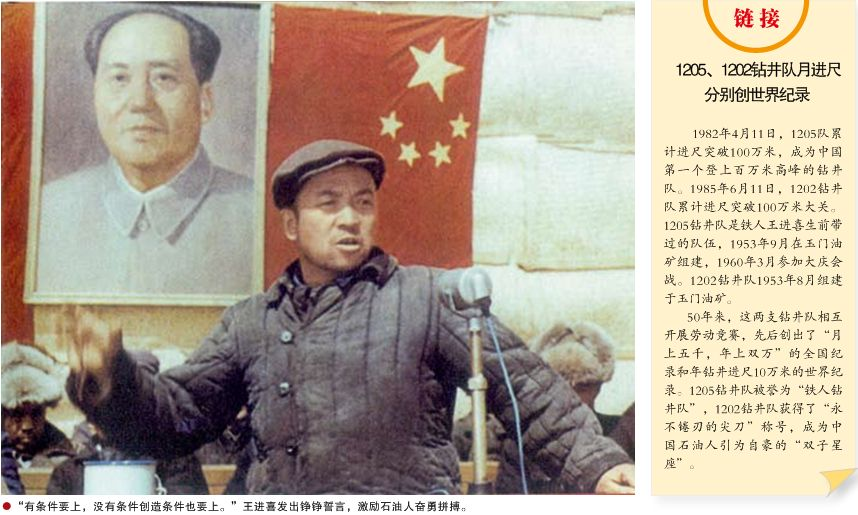
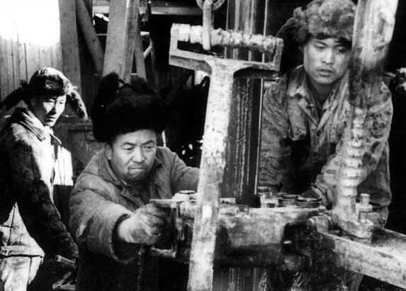

94年年前的今天，豪言“宁肯少活二十年、也让地球抖三抖的”“铁人”王进喜出生

万象特约作者：一一

94年前的今天，当选为中央委员的石油工人，铁人王进喜出生

王进喜（1923年10月8日－1970年11月15日），甘肃玉门人。新中国的第一代钻井工人，获全国劳动模范，得到毛主席接见。后到大庆参加石油会战，被称为“铁人”，驰名全国。曾当选为中共中央委员。

王进喜的名言是：“宁肯少活二十年，拼命也要拿下大油田”、"石油工人一声吼，地球也要抖三抖"。

【见到毛主席的钻井工人】

1923年10月8日，王进喜出生于甘肃省玉门县赤金堡，乳名“十斤娃”。1938年（15岁），王进喜在玉门油矿当徒工。 1950年春（27岁），玉门矿招工，王进喜通过考试成为新中国第一代钻井工人。1956年4月29日，王进喜加入中国共产党。

 6月，任贝乌五队（1205队前身）队长。 1958年9月（35岁），王进喜带领全队月钻井进尺5009.3米，创当时中国大陆最高纪录。 10月，荣获石油工业部颁发的“钻井卫星”红旗。1959年10月1日，王进喜参加建国十周年国庆观礼，第一次见到毛泽东。

（1959年，被誉为“铁人”王进喜（中）和工人们在井架上）

【大庆参加石油大会战】

1958年2月，石油部对松辽平原进行地质普查。11月，石油部批准大庆第一口油井钻探。1959年9月26日，大庆第一口油井：松基三井，喷出了石油。正赶上新中国10年国庆，为纪念这一历史时刻，黑龙江省委将油井所在的大同镇改名为大庆镇，“大庆油田”因此而得名。

从此，中国摘掉了石油工业落后的帽子，结束了贫油国的历史。1960年3月15日，王进喜带领1205队（贝乌五队）从玉门出发，赴大庆参加石油大会战。3月25日，到达大庆萨尔图火车站。

【铁人的第一口井】

1960年4月2日（37岁），“人拉肩扛”安装钻机；用“盆端桶提”的办法运水保开钻；跳进泥浆池，用身体搅拌泥浆压井喷，被称为“铁人”。

（王进喜制伏井喷）

4月9日到11日，大庆油田首次召开座谈会号召向铁人王进喜学习。4月14日，组织全队破冰取水，萨55井开钻。19日完钻。这就是铁人第一口井。

【宁肯少活二十年】

1960年4月29日，王进喜参加“五一”万人誓师大会，喊出“宁肯少活二十年，拼命也要拿下大油田”的口号。7月1日，在油田万人大会上，被树立为“五面红旗”之一。1963年12月，周恩来总理庄严宣布：“我国需要的石油，现在可以基本自给了。”

1964年12月21日（41岁），王进喜出席第三届全国人民代表大会。12月26日，参加毛泽东71岁生日宴会，毛泽东称赞铁人是“工业带头人”。1965年4月，王进喜被任命为钻井党委常委、钻井指挥部副指挥。 7月24日，参加石油工业部政工会，首次提出“全国每人每年半吨油”的奋斗目标。

（邓小平同志视察大庆油田时，听"铁人"王进喜介绍生产情况）

【当选为中央委员】

1966年2月（43岁），被国务院任命为大庆石油会战指挥部副指挥。 4月6日，被石油工业部授予“石油工业部五好标兵”。6月，出访阿尔巴尼亚。 10月1日，登上天安门城楼，参加国庆观礼。 1967年1月4日，王进喜在北京向周恩来当面汇报大庆油田形势。

1968年（45岁），王进喜被推选为钻井革委会副主任、大庆革委会副主任。1969年2月，王进喜担任中共大庆的核心小组副组长。 4月，参加中共第九次全国代表大会，被推选为主席团成员，并被选为中共中央委员。

（1970年，王进喜开刀前与家人在天安门合影）

【铁人并不是铁打的】

1970年3月18日（47岁），王进喜在北京向周恩来汇报了大庆情况。4月19日，在解放军301医院被确诊为胃癌晚期。 10月1日，以中共中央委员身份登上天安门城楼参加国庆检阅。

11月15日，在北京逝世，享年47岁。18日上午，大庆油田举行隆重追悼大会。下午，在北京八宝山公墓举行遗体告别仪式。

