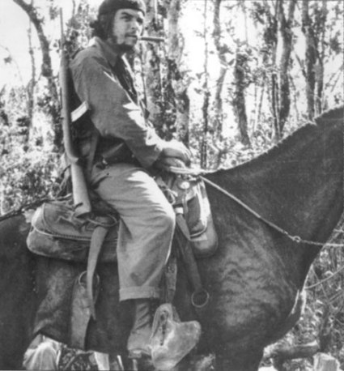
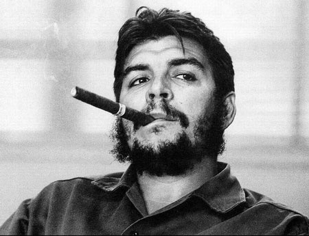
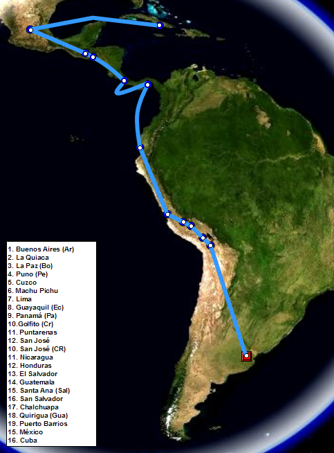
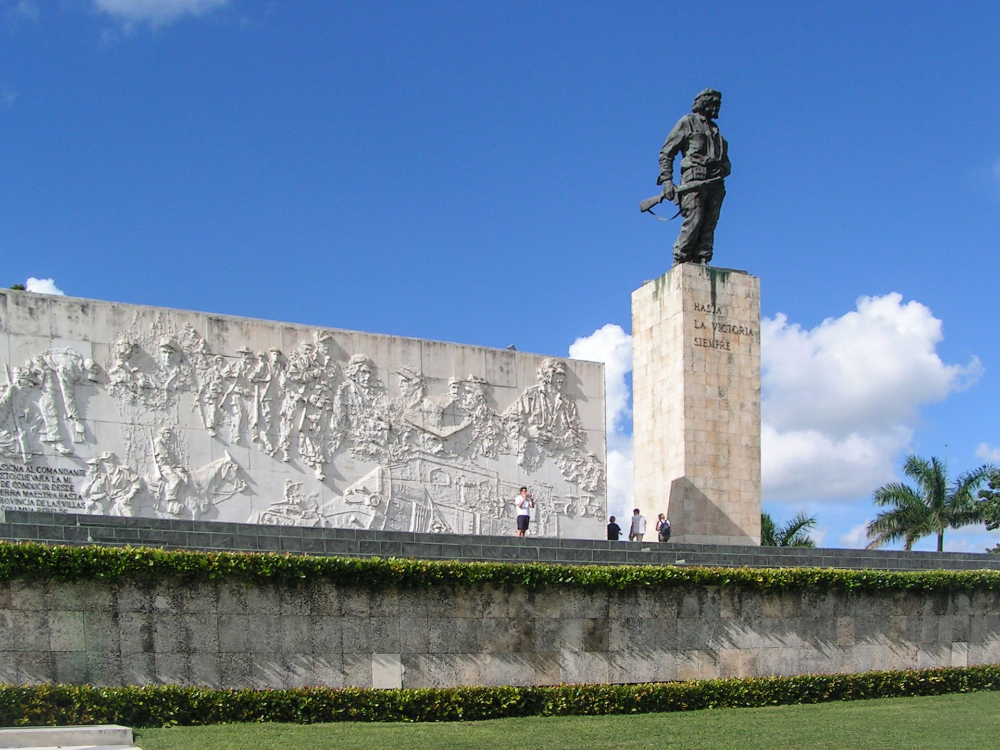
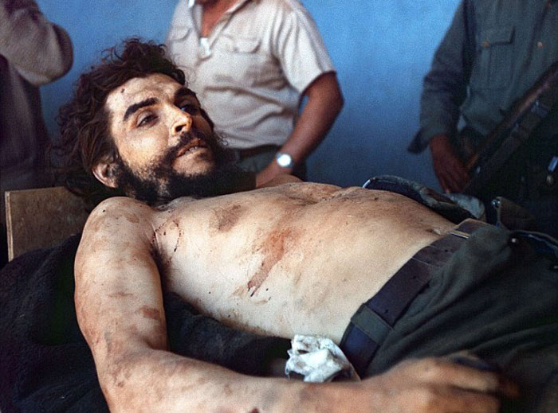
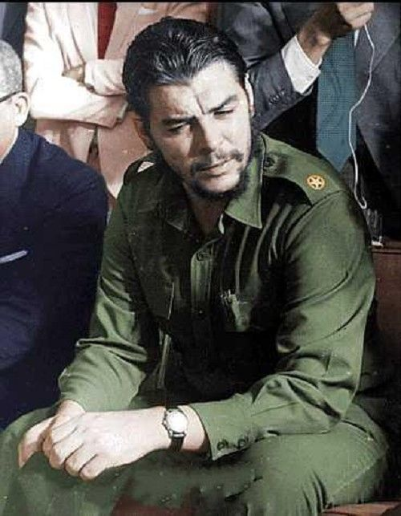
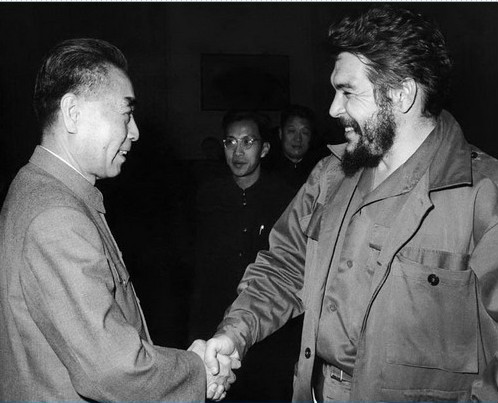

## nnnn姓名（资料）

### 成就特点

- 世上最知名的照片
- ​

### 生平

切·格瓦拉（西班牙语：Che Guevara；1928年6月14日－1967年10月9日），出生于阿根廷。他是古巴革命的核心人物之一，社会主义古巴、古巴革命武装力量和古巴共产党的主要缔造者及领导人，著名的国际共产主义革命家、军事理论家、政治家、医生、作家、游击队领袖。

《时代》杂志将格瓦拉选入二十世纪百大影响力人物，并登上阿尔韦托·科尔达为他拍摄、命名为《英勇的游击队员》的照片，被美誉为“世上最知名的照片”。

1928年6月14日，切·格瓦拉出生于阿根廷罗萨里奥，是这个西班牙和爱尔兰裔家庭的长子。

1948年，他进入布宜诺斯艾利斯大学学习医学，并于1953年3月顺利完成了学业。

【游历】

1950年1、2月暑假时，他游历了阿根廷北部的12个省，走过了约4000多公里的路程。

1951年，他在自己的好友药剂师阿尔贝托·格拉纳多的建议下，决定休学1年环游整个南美洲。他们的交通工具是一辆1939年产的Norton摩托车。

他们于1951年12月29日出发，决定的线路为：沿着安第斯山脉穿越整个南美洲，经阿根廷、智利、秘鲁、哥伦比亚，到达委内瑞拉。在路途的中间他们的摩托车坏掉了。切·格瓦拉还在秘鲁的一个麻风病人村作了几个月的义工。

在这次旅行中，切·格瓦拉开始真正了解拉丁美洲的贫穷与苦难，他的国际主义思想也在这次旅行中渐渐定型，他开始认为拉美各个独立的国家其实是一个拥有共同的文化和经济利益的整体，倘若革命则需要国际合作。离家8个月后，1952年9月，切·格瓦拉乘飞机回到了阿根廷，全家人都去机场迎接他。

在他此时的一篇日记中他写到：“	写下这些日记的人，在重新踏上阿根廷的土地时，就已经死去。我，已经不再是我。	”

1953年6月1日，他正式成为医生。他本可成为一位受人尊敬的医生，可是，这次旅行彻底改变了切·格瓦拉。

【】

由于贝隆政府当时在阿根廷的的独裁统治，担心儿子被征用做军医的母亲让格瓦拉逃离阿根廷。1953年7月7日，格瓦拉开始了他的第二次拉美之旅。

1953年12月24日，格瓦拉到达了危地马拉。当时危地马拉正处于年轻的左翼总统阿本斯的领导下，进行着一系列改革，尤其是土地改革。在危地马拉，他和一些危地马拉劳动党党员结为朋友，并得到了他知名的绰号“切 ”（Che）。“Che”是一个西班牙语的感叹词，在阿根廷和南美的一些地区被广泛使用，是人打招呼和表示惊讶的常用语，也有“朋友”的意思，其他西班牙语系国家的人喜欢昵称阿根廷人为（Che），是"兄弟"的意思。

1954年3月28日，美国中央情报局在洪都拉斯成立了一枝由危地马拉军官阿马斯领导的雇佣军，阿本斯政权很快被推翻，阿马斯成为危地马拉总统，开始对左翼人士进行残酷镇压，几个月之内约9000人被捕或杀害。

从此，格瓦拉坚定了自己的共产主义信仰，认为共产主义是解决目前拉美种种困难的唯一途径。

随后，他前往墨西哥避难，并在此结识了流亡的古巴革命者劳尔·卡斯特罗。不久，劳尔·卡斯特罗又将他引荐给了自己的哥哥、七二六运动领导人菲德尔·卡斯特罗。

【古巴革命】

1956年11月25日，“七二六运动”的82名战士挤在“格拉玛号”小游艇上，从墨西哥韦拉克鲁斯州的图克斯潘出发，驶向古巴。

在战斗中，格瓦拉凭著超人的勇气及毅力、出色的战斗技巧和对敌人冷酷无情而得到了越来越多人的赏识，包括卡斯特罗。他很快成为了卡斯特罗最得力和信赖的助手。

到1958年初游击队员约有280人，在经历了一系列战斗之后，到12月27日，革命军拥有了8000平方公里土地和50万公民支持。1959年1月2日，革命军成功占领古巴首都哈瓦那，巴蒂斯塔出逃。这段经历，被格瓦拉写入了自己1963年出版的《古巴革命战争的回忆》

【古巴任职】

战争结束后，古巴新政府成立并授予格瓦拉“古巴公民”的身份。

首先，格瓦拉被任命为卡瓦尼亚堡军事监狱的检察长，负责对巴蒂斯塔时代的战犯（主要是政客和警察）进行审问和处理。

1959年10月，并不懂经济学的格瓦拉被总理菲德尔·卡斯特罗任命为国家银行总裁，开始对古巴经济体系进行社会主义改造，将企业收归国有，并实行了土地改革。

1960年11月19日，到访中国，得到毛泽东接见。

1961年，格瓦拉又被卡斯特罗任命为工业部长。

格瓦拉帮助卡斯特罗在古巴建立了社会主义制度，在古巴遭到美国经济封锁后，格瓦拉与苏联签定了贸易协定。在这段时间内，他也因为其对美国的强硬态度而逐渐于西方闻名。

【古巴导弹危机】

在古巴导弹危机中，他是1962年赴莫斯科谈判的古巴代表团的成员之一，并最终签署了苏联在古巴部署核武器的计划。格瓦拉认为，安置苏联的导弹将捍卫古巴独立，使古巴免于遭受美国的侵略。

1964年12月，格瓦拉代表古巴出席联合国第19次大会，之后相继访问了阿尔及利亚、刚果民主共和国等8个非洲国家。

当1965年3月14日回到古巴后，他与卡斯特罗在诸如对苏关系、援助第三世界革命等问题上的分歧日趋严重。不久他辞去了自己的职务。

在给卡斯特罗写的告别信中：“他对单一的苏联模式感到不解和失望，对社会主义的前途感到忧虑，因为他发现不少的革命者都是在豪华的汽车里、在漂亮的女秘书的怀抱里丧失了往日的锐气。所以，为保持革命者的完美形象，他只能选择战斗，选择一个凤凰涅槃式的壮美结局”，为防止个人行为对古巴的不利，放弃了古巴公民身份。4月1日他乘飞机离开了古巴，前往刚果。

【走出刚果】

1965年4月23日，格瓦拉从坦桑尼亚穿越坦噶尼喀湖，前往刚果。

格瓦拉向刚果起义军队传授游击战术，他的计划是利用刚果坦噶尼喀湖西岸的解放区作为基地，训练刚果及周边国家的革命武装。此时格瓦拉已经37岁，而且并没有受过正规军事训练的经验（他的哮喘使他免于在阿根廷服兵役），他的战斗经验大都来自古巴革命。

格瓦拉在此役所期许的是能够向当地的辛巴人灌输古巴共产革命思想及游击战术，将他们训练成一批骁勇善战的游击队。

事后格瓦拉在他的《刚果日记》里回忆，当地人组织起来的乌合之众愚笨、漫无纪律、内部纷争不休是导致这次起义失败的主要原因。同年，在非洲丛林吃足了7个月的苦头之后，病弱的格瓦拉沮丧地与他剩存的古巴战友离开刚果（有6个伙伴没能活着离开）。

接下来的六个月里，格瓦拉极其低调的游走于坦桑尼亚首都达累斯萨拉姆、布拉格以及东德。这段时期，格瓦拉除了记载他在刚果的经过外，还开始起草两本书，准备对经济学及哲学加以论述。在卡斯特罗获悉格瓦拉的下落后，极力要求他的老同志回到古巴。格瓦拉则明确地声明，除非是为了在拉丁美洲国家进行革命活动，因地利之便，他会在绝对机密的情况下回到古巴进行筹备工作外，他将不再踏上这片土地。

【】

1966年至1967年间，格瓦拉开始在玻利维亚带领游击队员进行革命活动。当地的玻利维亚共产党成员购买了Ñancahuazú的密林地区移交给格瓦拉用作训练区域。格瓦拉及其古巴伴随亦编改了一些游击队员军队方式。格瓦拉的组织大约有50名游击队员，命名为“玻利维亚民族解放军”，有着精良装备。早期他们在险峻Camiri山区与玻利维亚正规军作战取得了不少胜利。

当美国政府得知他的革命活动地点后，很快便派出了CIA人员进入玻利维亚帮助其政府剿灭游击队。因为美国的援助，玻利维亚军队由美国陆军特种部队顾问训练，当中更包括了一支以应付丛林战而组织的别动队。

10月8日，当格瓦拉在La Higuera附近带领巡逻，特种部队包围了营地并且捉住了他。他在他的腿受伤后投降。

审讯者问，你现在在想什么？格瓦拉回答：“我在想，革命是不朽的。” 

9日下午他便在他的手被绑在板上的情况下被一个抽中签的玻利维亚军队中陆军中士马里奥·特兰（Mario Terán）射杀。

当局在10月11日正式报告了切·格瓦拉在10月9日被杀。10月15日卡斯特罗宣告古巴全国哀悼三天。切·格瓦拉之死被认为代表了当时社会主义革命运动思想遍及至拉丁美洲和其他第三世界国家。

1997年，切·格瓦拉的无手身体骸骨在Vallegrande被掘出，由DNA辨认吻合，并运返古巴。在1997年10月17日，他的遗体以顶级军事荣誉安葬在圣克拉拉一个修造的陵墓，以纪念他在三十九年前赢取了圣克拉拉古巴革命的决战。

【英雄】

切·格瓦拉死后，随着他的尸体的照片的传播，切·格瓦拉的事迹也开始广泛为人所知。全球范围内发生了抗议将其杀害的示威，同时出现了许多颂扬他，和记录他生平以及死亡的文学作品。即便是一些对切·格瓦拉共产主义理想嗤之以鼻的自由人士也对其自我牺牲精神表达了由衷的钦佩。他之所以被广大西方年青人与其他革命者区别对待，原因就在于他为了全世界的革命事业而毅然放弃舒适的家境。当他在古巴大权在握时，他又为了自己的理想放弃了高官厚禄，重返革命战场，并战斗直至牺牲。

特别是在60年代晚期，在中东和西方的年轻人中，他成为一个公众偶像化的革命的象征和左翼政治理想的代名词。阿尔贝托·科尔达在1960年为切·格瓦拉拍摄的相片《英勇的游击队员》迅速成为20世纪最知名的图片之一而；这幅切·格瓦拉的人像，也被简化并复制成为许多商品（比如T恤衫、海报和棒球帽）上的图案。

【评价】

普遍呈现两极化，有理想主义色彩的人会认为他是为改革而生的战士，主流保守派则认为他只是不顾一切的鲁莽反抗者。

而对格瓦拉及格瓦拉主义的革命方式批评来自于已故中国总理周恩来，他在与时任中共中央对外联络部部长的耿飚的谈话中指出：格瓦拉是“盲动主义者”，他“脱离群众，不要党的领导”，在古巴获得偶然性胜利后没有认真进行总结，就跑出去盲目地推销经验。试图“不依靠长期坚持武装斗争，不建立农村根据地，不走以农村包围城市的道路，来逐步取得胜利”，而是“不管有无条件，以为只要放一把火就可以烧起来，这完全是冒险主义和拼命主义”，“主张到处点火。我们说“星星之火”是可以燎原的，但必须那个地方有了燎原之势，才能燎原。”结果给革命造成了重大的损失，害人害己。格瓦拉的英雄形象，很大一部分是由于青年的偶像崇拜心理和知识分子开始时“分辨不清”给抬举出来的。

【】

### 照片

