## nnnn姓名（资料）

### 成就特点

- 1940年和1950年两度获得诺贝尔文学奖的提名
- 英文的“humor”译为“幽默”
- 用英文撰写《吾国与吾民》，《京华烟云》

### 生平

林语堂（1895年10月10日－1976年3月26日），中国文学家、发明家。

122年前的今天，发明中文打字机，两次获诺奖提名的林语堂出生

【牧师家庭的高材生】

1895年10月10日，林语堂生于中国福建省漳州市平和县坂仔镇。父亲是牧师，共有9个小孩，林语堂排行第5。1912年（17岁），林语堂在上海圣约翰大学学习英文，1916年获得学士学位，毕业后在清华大学英文系任教。

1919年（24岁），赴哈佛大学文学系留学，并于1921年获比较文学硕士学位。1920年，与廖翠凤结婚，两人相伴一生。1921年（26岁），转赴德国攻读语言学，先入耶拿大学，后转入莱比锡大学，并于1923年以《古汉语语音学》为论文获博士学位。

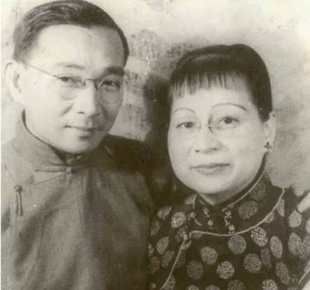

（林语堂夫妻合影）

【以闲适为格调的幽默】

1923年（28岁），回国后任北京大学教授和英文系主任。1924年后，成为《语丝》主要撰稿人之一。他首次将英文的“humor”译为“幽默”。

1926年（31岁），出任北京女子师范大学教务长，同年到厦门大学任文学院长。1927年，到武汉任中华民国外交部秘书。随后的几年，他创办多种文学刊物，提倡“以自我为中心，以闲适为格调”的小品文，对之后的文学界影响深远。

1930年代，林语堂所编著的《开明英文读本》成为全国各校通用教材。

（1933年2月17日，鲁迅（右一）、林语堂（右二）等人欢迎萧伯纳到访）

【英文写中国的畅销书】

1935年后，在美国用英文撰写《吾国与吾民》（My Country and My People，1935年）、《生活的艺术》（1937年）、《京华烟云》（Moment in Peking，1939年）、《风声鹤唳》 （1941年）等作品。

《吾国与吾民》在美国引起了巨大反响。林语堂用坦率幽默的笔调、睿智通达的语言娓娓道出了中国人的道德、精神状态与向往，以及中国的社会、文艺与生活情趣。

1937年，出版的《生活的艺术》再获成功，居美国畅销书排行榜榜首达52周，且接连再版四十余次，被翻译为十余种文字全球发行。《京华烟云》、《风声鹤唳》被《纽约时报》誉为中国的《飘》。

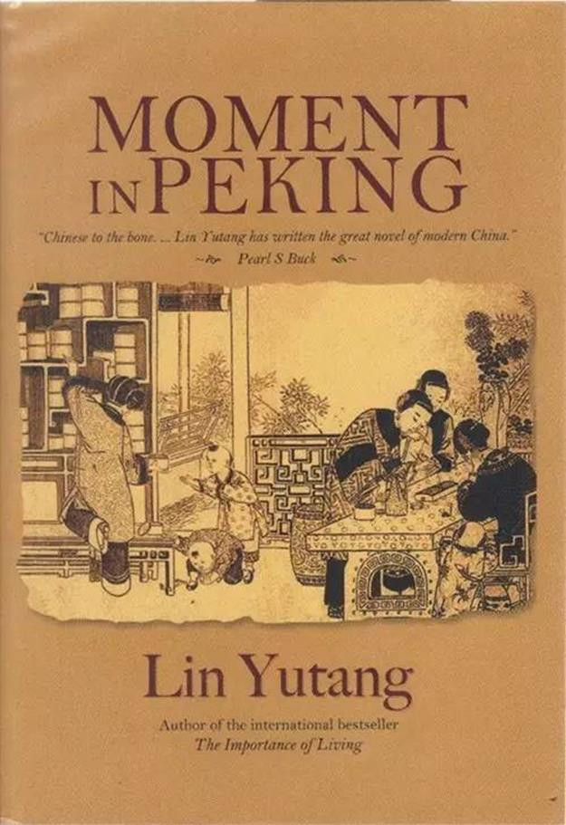

【两次诺贝尔奖提名】

根据诺贝尔奖官方数据库，林语堂曾于1940年、1950年被赛珍珠及斯文·赫定提名为诺贝尔文学奖候选人。

1947年，林语堂任联合国教科文组织美术与文学主任；后到巴黎写小说《唐人街家庭》。1948年，返回美国从事写作。1954年，新加坡筹建南洋大学，受聘担任首任校长，但后来由于经费等问题，与南洋大学董事会意见不合，在大学开学前离职。

【每个人都在用的部首检字法】

他首创了汉字笔划、笔顺、汉字偏旁部首的概念，更在此基础上发明了“上下形检字法”。这套系统性、普适性、操作可行性并具的全新方略，为当时中文输入法的研究开发创造了条件，更被后来者继承改进，而演变成如今全国通用的标准化“部首检字法”。

他曾向另一位语言学家赵元任提议制定一套以罗马字母来标注汉字读音的方法。赵元任定下基本方案后，与林语堂等人，历时两年，创造出“国语罗马字”的汉字注音方法。“国语罗马字”曾被定为国家正式推行的注音方案，对现行通用的“汉语拼音方案”产生了一定程度的影响。

（林语堂书法：听鸟说甚，问花笑谁）

【破产的中文打字机发明者】

林语堂倾家荡产全心研究中文检字法则，历经“汉字索引制”、“汉字号码索引法”、“国音新韵检字”、“末笔检字法”、“上下形检字法”等。终于在1947年（52岁），发明了“明快中文打字机”，这架打字机高9英寸、宽14英寸、深18英寸，储有7000字（常用的汉字约5000字），1952年（57岁）获美国专利。曾授权神通电脑作为其中文电脑的输入法，称为“简易输入法”。

由于研制打字机导致破产，林语堂曾向好友赛珍珠（1938年诺贝尔文学奖获得者）借钱，却遭到拒绝。当时，赛珍珠代理林语堂的书，拿走了高达50%的版税。林语堂说：“我看穿了一个美国人！”

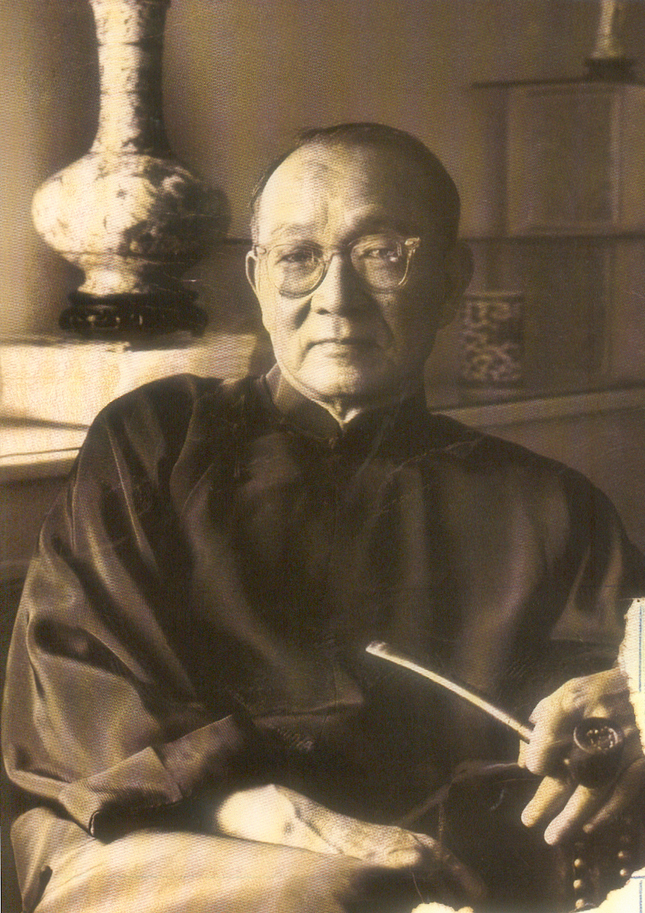

【凝聚心血的当代汉英词典】

1966年（71岁），定居台湾。1967年，受聘为香港中文大学研究教授。1975年（80岁），被推举为国际笔会副会长。

林语堂晚年的心愿是编写一套汉英辞典，将毕生所学凝聚其中。为此，他倾注了大量心血，虽渐年高体弱而未尝放弃，终于在77高龄完成了他最重要的作品之一——《当代汉英词典》。

1976年3月26日（81岁），在香港逝世，葬于台北阳明山仰德大道林语堂故居后园中。

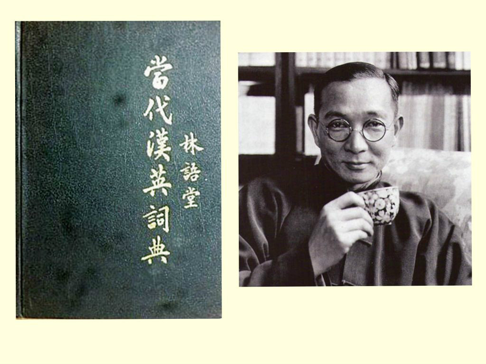

### 照片

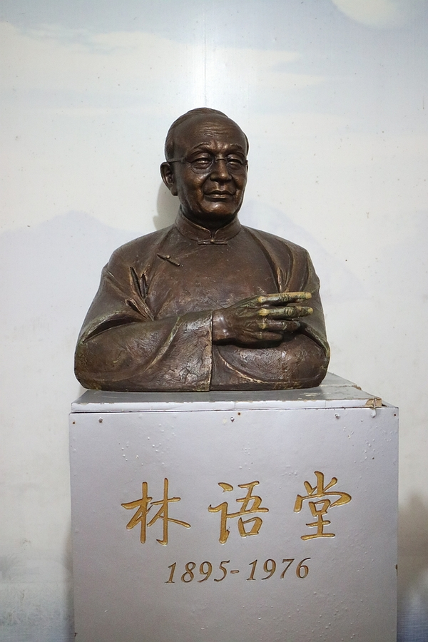

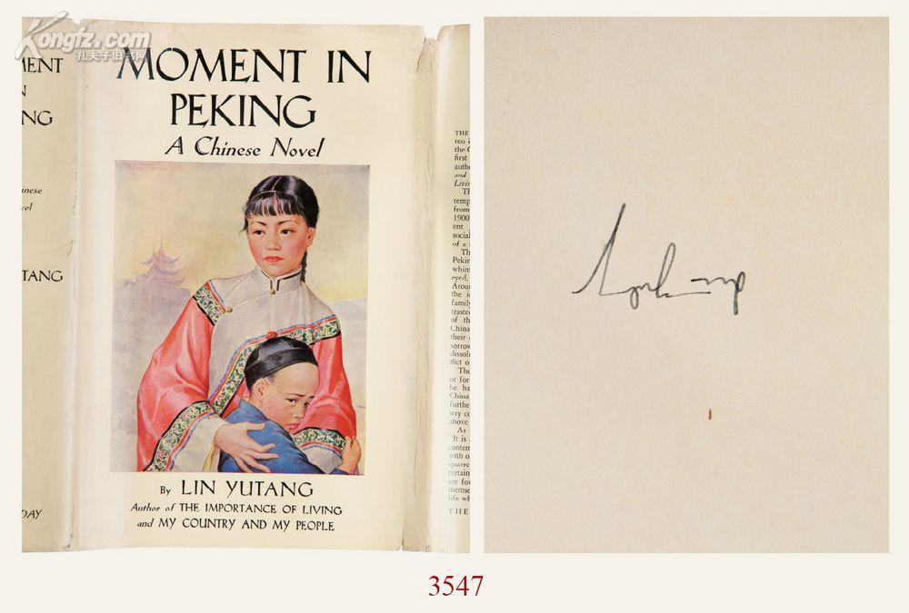

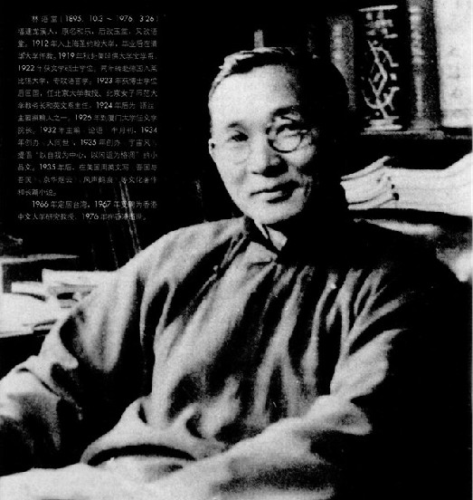

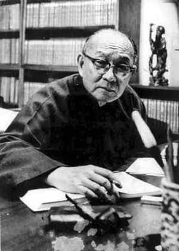

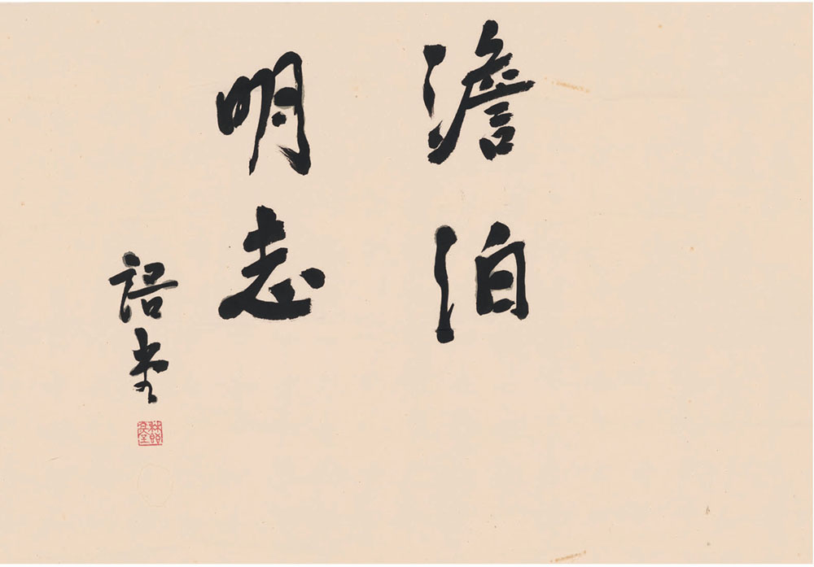

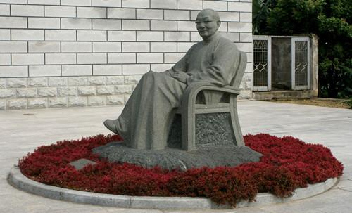

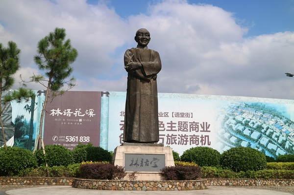

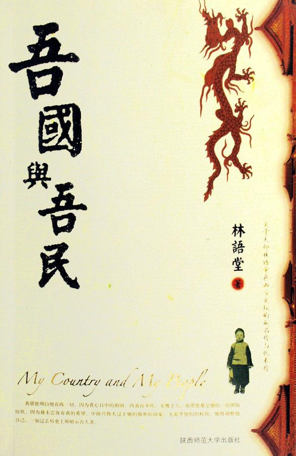

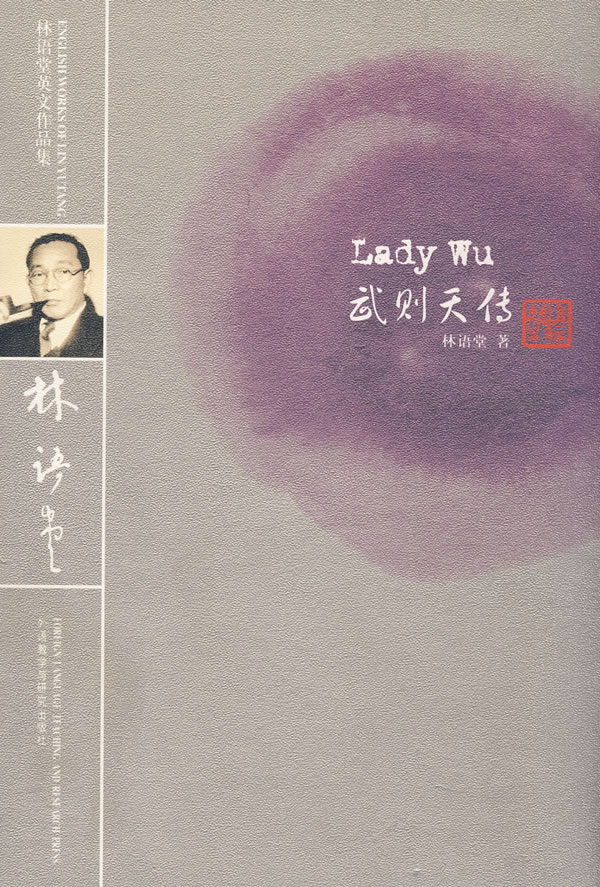

