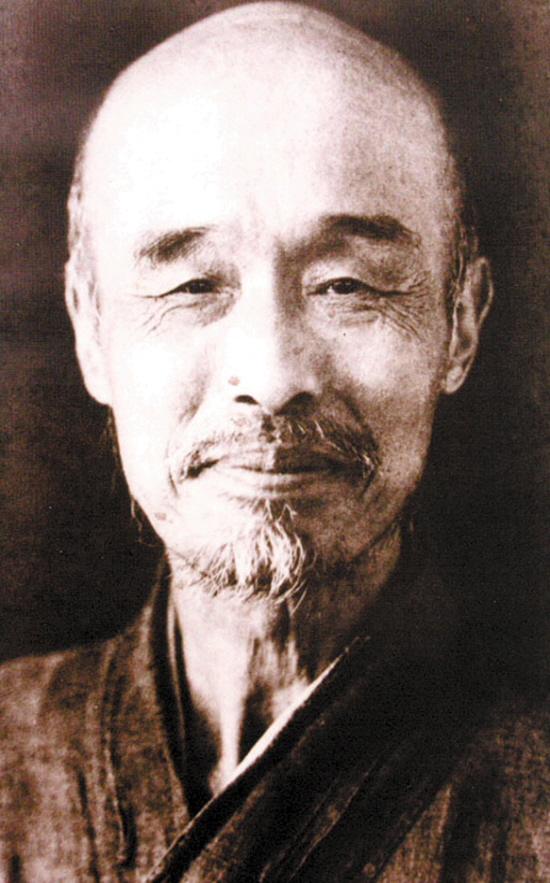
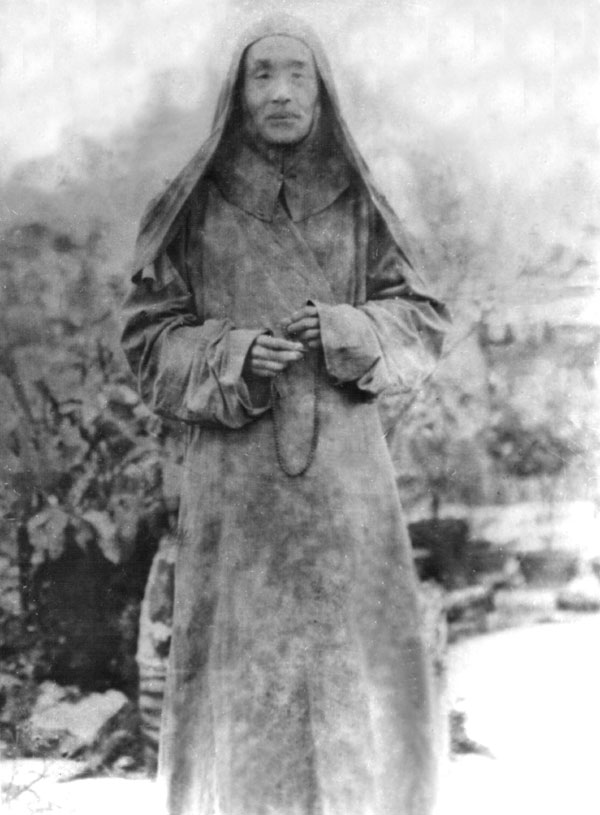
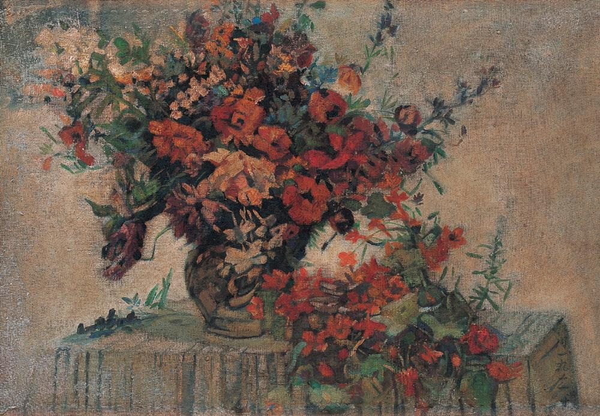

## nnnn姓名（资料）

75年前的今天，从风流才子到一代高僧的弘一法师李叔同逝世

### 生平

李叔同（1880年10月23日－1942年10月13日），出家后法号弘一，晚号晚晴老人，取自诗“天意怜幽草，人间重晚晴”。李叔同为现代中国著名艺术家，出家后中兴佛教南山律宗，为著名佛教僧侣。

在中国近百年文化发展史中，弘一大师李叔同是学术界公认的通才和奇才。他最早将西方油画、钢琴、话剧等引入国内，以擅书法、工诗词、通丹青、达音律、精金石、善演艺而驰名于世。他是中国第一个开创裸体写生的画师，培养出了画家丰子恺、音乐家刘质平等。

李叔同最为当代人所知的作品是歌曲《送别》，“长亭外，古道边，芳草碧连天……”，在中国传唱了上百年，至今依然脍炙人口，传唱不息。

【支持维新的富二代】

1880年10月23日，李叔同出生于天津。父亲是清同治进士，官任吏部主事，又是天津大盐商，兼营银号，家财万贯。母亲是三姨太，本为浙江平湖农家女。李叔同常自称为浙江平湖人。

5岁，父亲去世。后入读私塾，15岁入辅仁书院。1897年（17岁），李叔同奉母命，与天津茶商的女儿俞氏成婚。

他对维新变革感到很兴奋，积极鼓吹新说，并刻了一方“南海康梁是吾师”的印章，以示对变法的支持。维新运动失败后，外界哄传李叔同是康、梁同党。为了避祸，他带着母亲、妻子，迁居到上海的法租界。李叔同在上海有钱庄，手头相当阔绰，他以富家公子身份，与沪上名流交往。

（拆迁之前的天津李叔同故居）

【从风流才子到艺术老师】

1898年，他到上海，参与“上海书画公会”、“沪学会”，曾就读于南洋公学（交通大学前身）。1903年，南洋公学发生罢课风潮，校长蔡元培同情学生运动，自动辞职，全体学生相继退学，李叔同也退学。1905年，母亲病逝，李叔同携眷护柩回津。随后，他把妻子和两个孩子留在天津，自己东渡日本留学。

在日本东京美术学校和音乐学校（东京艺术大学前身），专攻西洋绘画和音乐。1906年，与同学创办业余话剧团体“春柳社”，这是中国的第一个话剧团体。李叔同在话剧《茶花女》中饰茶花女一角，这是中国话剧迈出的第一步。

1907年，与日本房东的女儿福基相爱。福基也是第一个愿意给李叔同做裸体模特的女人，后来成为李叔同的庶妻。1910年，携日本妻子福基回国，之后他在多所学校担任教员，教授图画、音乐。

【从李叔同到弘一法师】

1916年（36岁），因见日本杂志介绍“断食”以修养身心的方法，到杭州虎跑定慧寺，试验断食17日。1918年（38岁），在杭州虎跑寺剃度出家，吃素念佛，弘扬律宗。佛门弟子奉其为中兴南山律宗第11代世祖。他的日本妻子福基在他出家之后回到日本，后不知所踪。

出家后的弘一法师，在艺术方面，只保留了书法，其书法质朴无华，独具一格。

1942年10月10日下午六点（62岁），他于福建泉州的百原寺写下“悲欣交集见观经”几字，将其托付妙莲法师。10月13日，圆寂于泉州不二祠温陵养老院晚晴室。

【从艺术到宗教】

作为衣食无忧的富二代，李叔同在上海租界过了一段潇洒无羁的上流社会生活。但在东渡扶桑后，他成了艺术家和艺术教育家，后半生为芒鞋布衲、苦修律宗的空门高僧。

赵朴初评价大师的一生为：“无尽奇珍供世眼，一轮圆月耀天心。”

林语堂：“李叔同是我们时代里最有才华的几位天才之一，也是最奇特的一个人，最遗世而独立的一个人。”

张爱玲：“不要认为我是个高傲的人，我从来不是的，至少在弘一法师寺院围墙的外面，我是如此地谦卑。”

### 

