## nnnn姓名（资料）

适合所有人的历史读物。每天了解一个历史人物、积累一点历史知识。三观端正，绝不戏说，欢迎留言。  

### 成就特点

- ​
- ​

### 生平

张学良（1901年6月3日－2001年10月14日），乳名小六子，中华民国陆军一级上将。人称“少帅”，奉系军阀领袖张作霖长子，“民国四公子”之一。1936年12月12日，西安事变爆发。张遭软禁长达50余年，直到中华民国李登辉执政，张才获得自由。

1901年6月3日，张学良生于台安县桑林。

1918年，张作霖在军粮城成立奉天陆军总司令部，自任总司令。9月，北京政府任命张作霖为东三省巡阅使。1919年3月，张作霖开办东三省陆军讲武堂。东三省巡阅使署卫队旅第二团团长张学良也被调到讲武堂受训。

1920年，张学良由讲武堂以炮兵科第一名结业。张作霖升他为东三省巡阅使卫队旅旅长。

【第一次直奉战争】

1922年，第一次直奉大战爆发。4月，张作霖即陆续派军入关，奉军号称镇威军，张自任总司令。张学良为东路军第二梯队司令，是第一次直奉大战当中，奉军唯一取胜的部队。

5月10日，北京政府下令张作霖撤职查办，裁撤东三省巡阅使一职；第二天，东三省省议会举张作霖为东三省保安总司令。6月17日，张学良和孙烈臣代表奉军，和直军代表王承斌，在秦皇岛英国军舰上签订停战和约，终结第一次直奉战争。

张作霖为雪此战争失败之耻，回到奉天成立东三省陆军整理处，派孙烈臣为统监，张作相、姜登选为副统监，张学良为参谋长，实际由郭松龄代理。张学良负责整个东北军调整与军纪，史称“整军精武”。经过张学良2年多“整军精武”后，东北军军威大振，张作霖发动第二次直奉战争，直军完败。

【第二次直奉战争】

1924年第二次直奉大战爆发，张学良率领奉军第三军与姜登选的奉军第二军为东北军入关的主力军，经过张学良部队的猛攻，奉军突破山海关，直捣北平。直系全面溃败，全军覆没。奉系由此一战顺利夺取了中央政权，张作霖成为北洋军阀领导人，奉系军事实力此时达到顶点。战后，张学良升为京榆地区戍卫总司令。

1925年11月，郭松龄反奉。郭的部队共5万人，是奉军中最精锐的部队，直取奉天，张作霖猝不及防，准备撤守。郭松龄与张学良在巨流河（沈阳西南）西岸对峙，郭松龄突然遭到日本关东军袭击，攻击失利。12月25日，郭松龄夫妇解往沈阳的途中，被就地枪决。

【皇姑屯、东北易帜】

1928年6月4日凌晨5点30分，张作霖因战事节节失利，无法抵抗国民革命军北伐，宣布由燕京退守山海关关外，乘火车返奉天，途经皇姑屯车站时，被日本关东军炸死，史称皇姑屯事件。

1928年皇姑屯事件后，张学良深怀日本关东军杀父之仇，一方面奉承父亲遗志，坚守中国领土，尽力摆脱日本军政影响；另一方面贯彻自己一贯反对内战，支持三民主义政治理想，宣布东北地区服从国民政府领导，除去北洋政府五色旗，升上南京国民政府青天白日满地红旗，史称东北易帜。此举标志北伐战争正式胜利结束，国民革命军总司令蒋中正形式上统一中华民国。

奉系将领杨宇霆与黑龙江省省长常荫槐，欲合谋夺取军政大权。张作霖被刺杀后，杨宇霆自以为老臣，时常对少主张学良不假辞色，动辄讥讽，诸将深以为大不敬。杨宇霆还逼迫张学良成立“东北铁路督办公署”，以常荫槐主其事。1929年1月10日，杨宇霆、常荫槐被张学良诱杀。

日本历史学家宫胁淳子认为，炸死张作霖事件显然是由张阵营内部人士策划。因此张学良在父亲张作霖过世后隔年正式成为中国国民党党员，却私下杀害同时加入中国国民党之杨宇霆和常荫槐；张学良受过极佳近代教育，认为“中国应该统一”，宣称这两人是间谍，实际上两人可能是炸死张作霖之执行犯。

【中东路事件】

1929年7月，在蒋强力支持下，张执行蒋的“革命外交”政策，意图废除不平等条约，收回国家各项权益，“强硬对抗苏俄”。故提出要取消苏俄在东北特权，查封哈尔滨苏联商业机构，开始着手收回中东铁路。7月10日，蒋在战前强调：“以苏联在国际上的孤立地位，也不必担心中苏开战。纵使万一中苏开战，中央也可出手相助，出兵10万，拨几百万元军费不成问题”。

8月14日，斯大林命令苏联军队沿中东路一线向东北进攻，张领导的东北军败给苏军。张被迫在伯力签订议定书，恢复苏联在中东铁路的特权，一切回到原点。由于中原大战随即发生，蒋为稳住内政，也默许张对苏妥协，以换取其对蒋中原大战的支持。

另外值得注意是，在整个中东路事件过程中，中央未给张事先承诺好的任何援助与补偿，也体现出当时中国内忧外患。

张因此获得中华民国政府颁发第一座青天白日勋章，此勋章是颁授给有功于保家卫国，抵御外敌的军职人员，表扬他保持国家领土与主权完整的贡献。这次挫败，对以后日本发动九一八事变处理方式有影响。

【中原大战】

北伐结束后，蒋见各军阀派系依在，希望削弱中国国民党其他军人兵力。1930年3月，反蒋派联名通电，推举阎锡山为全国陆海军总司令，冯玉祥、李宗仁、张学良为副司令。4月，中原大战爆发。8月，反蒋派在北平召开“中国国民党中央党部扩大会议”，另立“中央”，与南京政府对抗。阎锡山、冯玉祥、李宗仁决意联军合取蒋，双方战斗激烈，死伤惨重。战争僵持阶段，双方试图争取奉系支持。

最终张与蒋协调，选择站在蒋一边。9月18日，张发表“巧电”，宣布反对内战，支持蒋，希望各方立刻停战。张建议被联军拒绝。两日后，张派兵东北军几万人入山海关，武装调停，反蒋联军失败。9月20日，蒋再电张催即日就副司令职。11月4日，阎锡山、冯玉祥通电下野，张收编接管西北军，并入主燕京，进军华北，势力大增，中原大战结束。蒋获胜，对各地军阀控制能力大增，而张奉系对中国影响力也广受人知。

【九一八】

中原大战及万宝山事件发生后，全球经济大恐慌环境下，刚从内战中恢复的华北及东北统一的中国主权和日本南满铁路的特权，冲突可能性升高。1931年5月28日，张因伤寒病住进北平协和医院。

7月6日，张密电东北政务委员会：“此时如与日本开战，我方必败。败则日方将对我要求割地偿款，东北将万劫不复，亟宜避免冲突，以公理为周旋”。9月6日，张从北平发“鱼”电：“查现在日方对外交渐趋吃紧，应付一切，亟宜力求稳健，对于日人无论其如何寻事，我方务当万方容忍，不可与之反抗，免滋事端。希迅即密电各属切实注意为要。”

9月18日，日本关东军发动震惊中外的“九一八”事变，驻守北大营的一万多名东北军将士因遵循张的严令，张本人说“不抵抗”是要表明日本侵略而非维护其南满铁路特权。事变发生后，张要求率领东北军力避冲突，未行军事抵抗，导致东北沦陷，满洲国傀儡政权建立。张率领东北军关内陕西。此时蒋令东北军固守锦州，但张却弃守锦州，带领东北军约40万人退入关内。日军很快侵占东三省全境。

在九一八事发当时，乃是张亲自下达“不抵抗命令”。而蒋迟至9月19日到达南昌后，晚间9至10时才从上海方面得知“事变”消息。张事后自己也说，“是我们东北军自己选择不抵抗的。”

历史学家唐德刚曾当着张面前感慨道：“我们听了五十多年了，都是这个说法呢，都说是蒋公给你的指令呢！”“……都说蒋公打电报给你，说吾兄万勿逞一时之愤，置民族国家于不顾（所谓铣电的关键语句）。又说你拿着个皮包，把电报稿随时放在身上。”张回答说：“瞎说，瞎说，没有这事情。我这个人说话，咱得正经说话。这种事情，我不能诿过于他人。这是事实，我要声明的。最要紧的就是这一点。这个事不是人家的事情，是我自个儿的事情，是我的责任。”

【热河】

1933年2月25日，热河战役爆发，国民政府中央力促张抵抗，并协助调动八个军组编为八个集团军，未料热河省政府主席汤玉麟（国民革命军第五十五军军长，张旗下东北军系）放弃职守，再次不战而退。

3月10日，张发出辞职通电。

1933年5月31日，因为张无心抗日，中华民国被迫与日军签定《塘沽协定》停战。

1933年至1934年间，张学良戒毒、游欧，身形从过去清瘦而增胖。游欧半年回国后，在广州见了胡汉民，胡汉民劝他不要跟蒋介石合作。但当时张学良认为，中国只能有一个领袖，那就是蒋介石。张在旅欧期间，会见希特勒与墨索里尼，欣赏德国与意国全民团结的精神，认为只有法西斯主义才能救中国。

【围剿红军】

1934年2月，张任豫鄂皖三省剿匪总司令部副总司令。

1935年3月，任武昌行营主任。4月，蒋命令张围剿中国工农红军，但却遭到挫折两个整编师被全歼，逐渐对蒋的调遣有所反感。9月20日，蒋在西安设立“西北剿匪总司令部”，统帅陕、甘、宁、青四省军队“围剿”在西北之红军。蒋再次推张到“剿共”第一线，担任西北剿匪总司令部副总司令，代行蒋之总司令职务。

【洛川会谈】

1936年2月26日至2月28日，李克农与王以哲、赵镇藩磋商红军与东北军第六十七军之间合作抗日问题，达成口头协议，主要为：互不侵犯，各守原防；红军同意恢复第六十七军在鄜县、甘泉、延安之交通运输及经济通商；延安、甘泉城内第六十七军人员所需粮草，可向当地苏区群众购买，红军予以便利；双方给予对方采购人员以保护。

1936年3月2日，张学良由南京回到西安，当日即亲自驾机飞到洛川和李克农会谈。

洛川会谈结束后，王以哲送给红军一批七九步枪，子弹数万发，并派少校副官王政用汽车送至红军防地；经过两个月之努力，采购许多重要物资，有印钞机和高级纸张、油墨、无线电器材、医疗器材药品等；这些物资，都由东北军用军用汽车送到洛川，再改用牲口转运到双方防地交界处，移交苏区贸易局运到瓦窑堡；这批物资为苏区解决许多困难，打破中国国民党对陕北苏区之经济封锁

1936年4月6日，毛、彭联名致电张学良，提出：甲、敝方代表周恩来偕李克农于8日赴肤施，与张学良先生会商救国大计。张提出联蒋抗日，为中共中央所采纳，与红军达成“停止内战、共同抗日”协议。会谈一直进行到4月10日晨4时才结束，双方都很满意。

9月，张向红军提供大量过冬棉花，药品、新鲜食物等物资，解决红军过冬燃眉之急。

【西安事变】

1936年12月12日，时任西北剿匪总司令部副总司令的东北军将领张学良和时任国民革命军第十七路军总指挥的西北军将领杨虎城在中国西安发动“兵谏”，扣押时任国民政府军事委员会委员长兼西北剿匪总司令的蒋中正，并杀死保安人员、中央机关人员。最终，蒋中正被迫接受“停止剿共，一同抗日”的主张而获释；从而国民政府放弃“攘外必先安内”基本国策，抗日民族统一战线在形式上建立。

1936年12月30日，国民政府任命李烈钧为审判长，对张学良军法会审。同日，张交付军事法庭审判，判决如下：“张学良首谋伙党，对于上官暴行胁迫，判处有期徒刑十年，褫夺公权五年”。

1937年1月4日，林森主持召开第二十二次国民政府委员会会议，决定对张特赦，发布命令：“张学良所处十年有期徒刑，特予赦免，仍交军事委员会严加管束。”“管束”令宣告张从此失去自由，过着被幽禁之生活。

1949年蒋介石撤退台湾之际，杨虎城全家被杀，张学良则是先押解到台湾。张学良晚年表示，蒋原本是要枪毙他的，是蒋宋美龄求情。

1961年，开始解除“管束”（即软禁），可以外出旅行、购物、上馆子和会客，但皆需事先请示且受到监视。

1964年7月4日，张在台北与赵一荻正式举行婚礼。

1975年4月5日，蒋介石逝世。1988年1月13日，蒋经国逝世。李登辉执政后，仍然扣押张三年。

1990年6月1日，台湾各界人士为张重获自由并于圆山饭店九十寿辰举行隆重庆祝。

1993年12月15日，张学良夫妇定居夏威夷。[4]:4931994年获得绿卡，在那里长居。2000年6月22日，赵一荻夫人逝世，享年八十八岁。

2001年10月14日14时50分（北京时间10月15日8时50分），在美国夏威夷首府檀香山史特劳比医院逝世，享年100岁。

10月19日，总统府明令褒扬，褒扬令全文为：
　　东北耆宿张学良，早预戎行，勇略聿昭，英隽秀发，蜚声于时。民国十七年临危授命，主政东北，怀民族大义，秉爱国志节，勇拒日人威逼利诱，毅然宣布易帜，拥护中央，促成统一，奠定训政时期建设根基。旋于中原大战期间，通电支持国民政府，调停各方，止息战祸，厥功至伟。综其生平，爱国情殷，慷慨贞固；淡泊恬静，寿登期颐。遽闻殂谢，悼惜良深，应予明令褒扬，以示政府笃念耆贤之至意。
总统　陈水扁　

### 照片

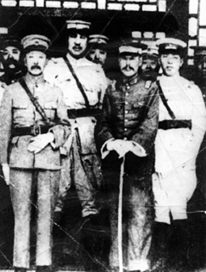

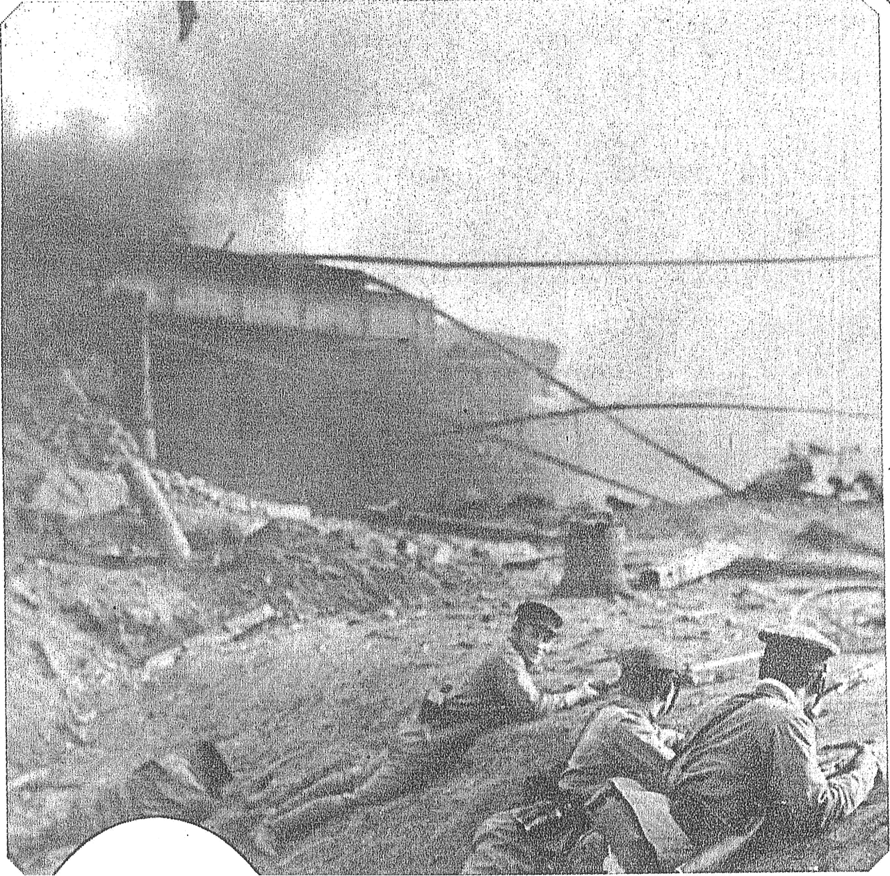

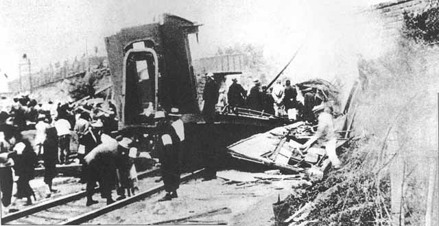

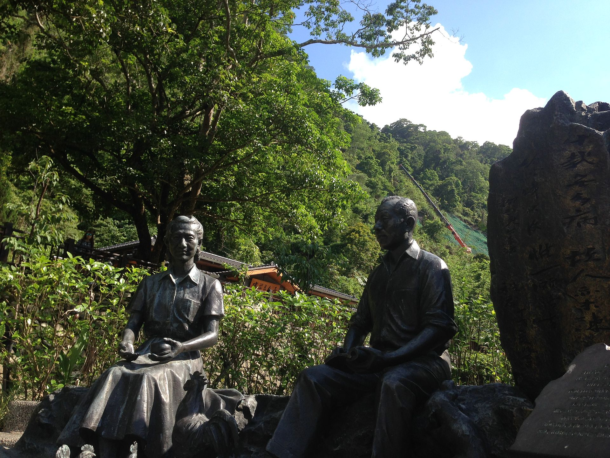

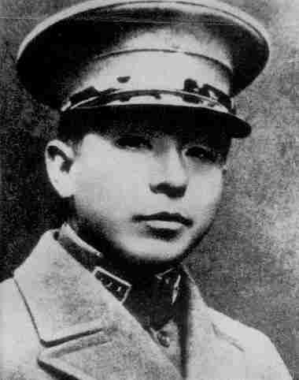

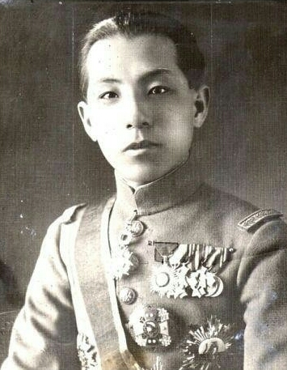

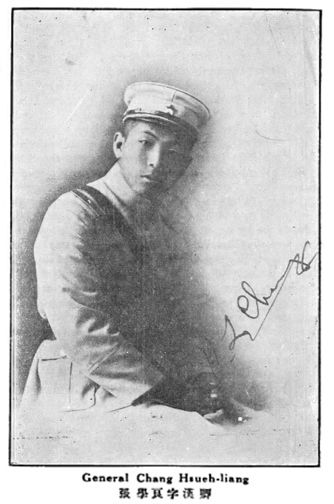

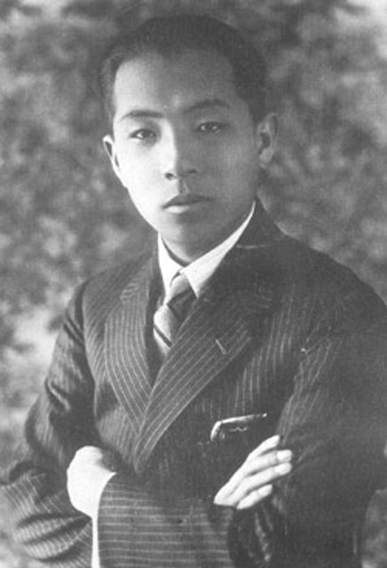

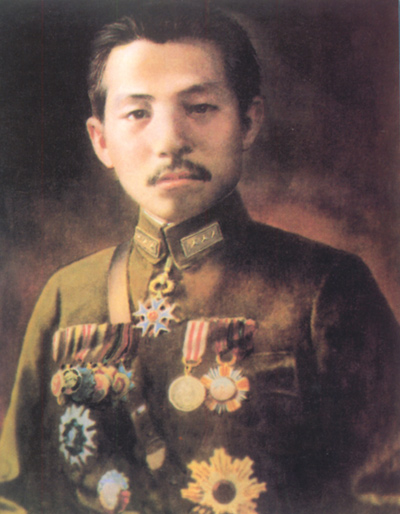

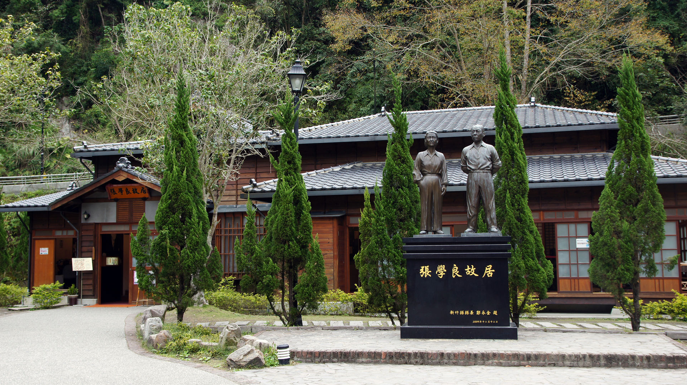

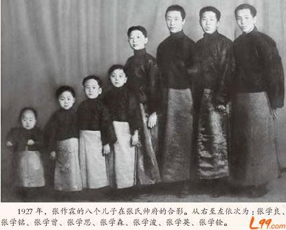

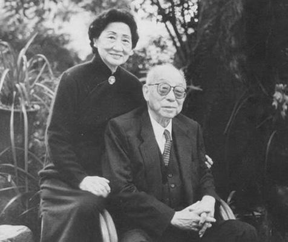