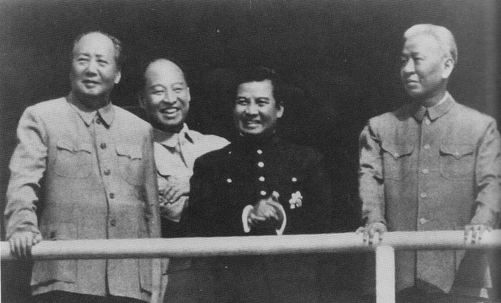
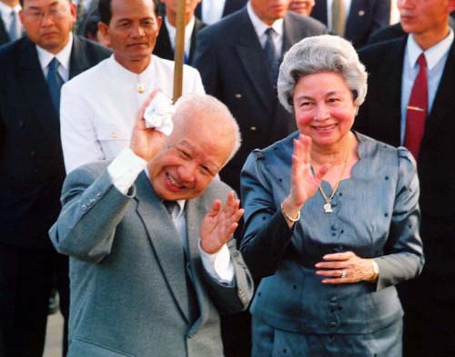
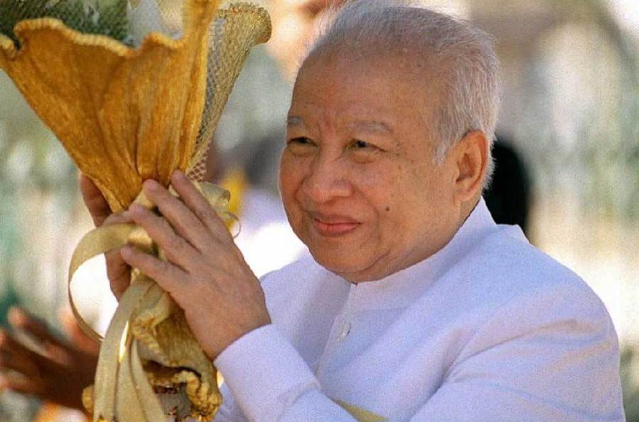
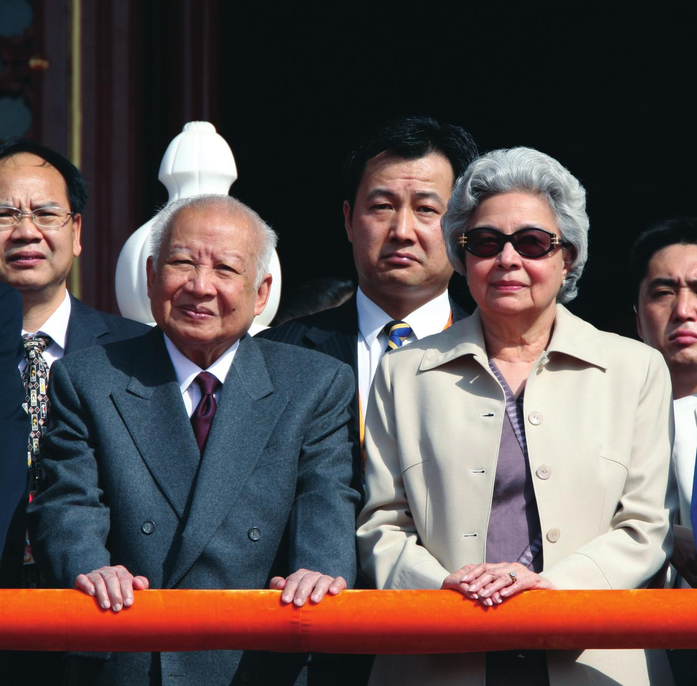
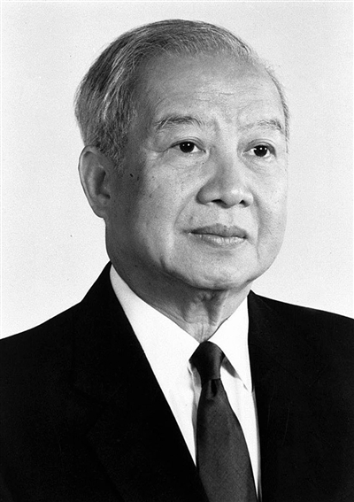
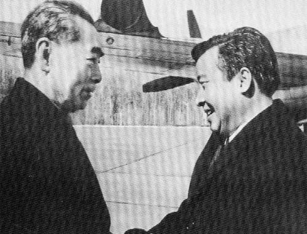

## nnnn姓名（资料）

适合所有人的历史读物。每天了解一个历史人物、积累一点历史知识。三观端正，绝不戏说，欢迎留言。  

### 成就特点

- ​
- ​

### 生平

西哈努克（1922年10月31日－2012年10月15日），柬埔寨国王。

1922年10月31日，生于金边。是诺罗敦和西索瓦两大王族后裔。西哈努克其父诺罗敦一世是安东国王与一名福建后裔王妃所生之长子，有华人血统，1953年至1970年，他是柬埔寨的最高领导人。

1941年，外祖父西索瓦·莫尼旺国王病逝，正在越南西贡市（现胡志明市）留学的西哈努克回国继承王位。

当时，柬埔寨王室分为两支，分别是奉诺罗敦王（在位1840年 - 1904年）为始祖的诺罗敦家系和以西索瓦王（在位1904年 - 1927年，诺罗敦王之弟）为始祖的西索瓦家。西索瓦·莫尼旺国王驾崩之后，两个家族为继承权争执不休，最后在当时实际控制柬埔寨的法属印度支那总督的裁定之下、才最终决定由西哈努克继位。之所以有这样的决定，还是因为西哈努克不仅同时继承了两个家族的血统（西哈努克之父为诺罗敦家族成员，其母则出自西索瓦家族），而且年纪尚轻、更容易为殖民地政府摆布。

1945年3月，日本军队在明号作战中武力占领法属印度支那全境，法国的殖民地政府解体，原本在法属印度支那治下的柬埔寨、越南、老挝相继发布了独立宣言。

在柬埔寨，西哈努克原本希望能够在越南独立的同时发表本国的独立宣言，但由于国内各方联络不畅，结果在越南独立的两天之后即4月13日，柬埔寨才得以独立。在成为法国殖民势力进入中南半岛之前，柬埔寨长时间受到当时越南王国的压迫，故而对越南抱有强烈的对抗意识。

1945年8月15日日本无条件投降，西哈努克一方面宣布3月13日为柬埔寨的独立日，一方面又出于对越南入侵的恐惧、认可了法军的重新回归。此后，西哈努克展开对以美国为首的西方诸国一系列的外交访问，通过国际舆论诉求柬埔寨的独立，终于于1949年获得在法兰西联邦内的独立地位，但同时，警察权和军事权依然掌握在法国手中。

西哈努克对此状况无法满意，并在离宫发表了“在完全独立达成之前绝不返回首都金边”的宣言，终于使得全国范围内的反法示威运动达到高潮。为国王强硬姿态所震惊的法国最后承认了柬埔寨的完全独立，1953年11月9日，新生的柬埔寨王国成立，西哈努克也在国民的欢呼声中返回金边的王宫，被国民尊为“独立之父”。

经历了独立运动的成功，充满信心的西哈努克希望进一步深入参与政治，但在君主立宪制的宪法制约下，国王的活动范围受到很大限制。于是西哈努克于1955年3月3日将王位让予其父诺罗敦·苏拉玛里特，同年4月7日，组建政治团体社会主义人民共同体（高棉语：សង្គមរាស្រ្តនិយម，罗马化：Sangkum）并担任总裁。退位后的西哈努克被国民称呼为“殿下”。

社会主义人民共同体于同年的总选举中获得压倒性胜利，控制了国会中全部议席，西哈努克则出任首相并兼外交大臣。1960年3月，苏拉玛里特国王去世，在王位空缺的情况下，西哈努克又就任新设的“国家元首”之职，成为柬埔寨的最高政治领袖。

西哈努克将自己的政治理念称为“佛教社会主义”：在佛教的保护和君主制的体制下实行社会主义式的政策。同时，在外交上严守中立，在当时冷战愈演愈烈的国际情势下，柬埔寨也得以同时获得东西两阵营的经济援助，并在邻国越南和老挝都陷入内战时，独善其身式地维持了国内的稳定。

然而在这一时期，政府内左右两派的对立不断激化，西哈努克对于左派的态度在重用和弹压之间不断摇摆，最终逼使波尔布特、英沙里、乔森潘等一批左派领导人进入边境丛林区展开武装斗争，为日后红色高棉运动埋下种子。

1970年3月、首相兼国防大臣朗诺将军和副首相施里玛达亲王（西哈努克的表兄弟）趁西哈努克在苏联国事访问期间发动政变，议会解任了西哈努克国家元首的职位，决议废止君主制而建立共和制的高棉共和国，朗诺就任总统。[2][3][4][5]西哈努克被迫流亡中国。[2][3][4][5]

在此次政变前，西哈努克已经被认为是同情北越的亲共主义者。西哈努克对于遍布柬埔寨境内的越共补给基地以及“胡志明小道”都采取默认态度，又对1969年发生的美国对柬轰炸发表公开谴责，并于1970年1月，就美军在越南南方攻击行动中所造成的数千件平民死亡事件发布了政府公报。此外，南越的“被压制民族斗争统一战线（FULRO）”在发动叛乱后，也每每逃入柬埔寨境内逃避追击。这一切都使当时的美国政府逐渐与西哈努克疏远，并尝试支援亲美派的朗诺以期取而代之。

政变后，朗诺政权开始执行激烈的反越南政策，柬埔寨境内的越南裔住民遭到迫害、流放乃至虐杀。此外，朗诺也放任美军及南越军队以“追击越共”的名义侵入柬埔寨境内，美军的轰炸范围也在这一时期扩大到柬埔寨全境。仅仅一年半时间内，就造成了数十万农民的牺牲以及200万难民的产生[6]。农村基础设施遭到大量破坏，也使原本是粮食出口国的柬埔寨转落为粮食净进口国，这一状况使柬埔寨原本的稳定局面受到动摇，也为红色高棉的势力扩大营造了有利环境。

流亡的西哈努克暂住在中国北京，并组建了以推翻朗诺政权为诉求的流亡政府柬埔寨王国民族联合政府。

尽管西哈努克并不喜欢自己过去曾经打压的波尔布特派，但在中国领导人毛泽东、周恩来以及朝鲜领导人金日成的说服下，终于与波尔布特结成统一战线。

西哈努克的这一决定，使得红色高棉在柬埔寨农村地区征招的士兵数量得以大量增加——许多新加入红色高棉的农民士兵并没有为共产主义作战的意识，而只是以为自己在为保卫国王而战，日后（1979年）在谈到自己当时的这一决定时，西哈努克表示他只是一心要为柬埔寨的独立而尽力，“哪怕柬埔寨最后会变成共产国家”。[8]然而，西哈努克名义上虽然是统一战线的领袖，但是对于以彻底破坏封建体制为目标的波尔布特及其党人来说，西哈努克及其政治理念实则与己方水火不容。因而，双方的关系自联盟结成之始就处于紧张状态。

1975年，红色高棉终于占领柬埔寨全境，朗诺政权崩溃。西哈努克以国家元首的身份宣布社会主义国家民主柬埔寨成立，并由平壤归国。在民主柬埔寨执政期间，西哈努克表面上是国家的最高领导人，但并无任何实权，日常生活除去由柬共安排的地方视察之外，即是被软禁在王宫之中。被允许与西哈努克共同居住的，仅有其第六位夫人莫尼克王妃和两位王子。

至于其他尚留在国内的王室成员则被全体流放至地方，西哈努克的五个儿子和十四个孙子在此过程中被虐杀。甚至在一段时期，西哈努克自身都身处被处决危险之中，只是在中国政府向波尔布特政府施压后才幸免于难。此后西哈努克以患病为由希望能够出国疗养，但遭到政府拒绝。1976年4月，西哈努克辞去国家元首之职，随即被幽禁在王宫中，与外界失去联系。

1979年1月7日，柬埔寨遭到越南入侵，越南军队逼近金边。波尔布特重新找到西哈努克，请求其参加联合国安全理事会，向大会控诉越南军入侵的不正当性。西哈努克终于得以与家人和亲信一同离柬出国。同年，越南在柬埔寨建立傀儡政府并成立柬埔寨人民共和国，此后的十多年，西哈努克创建了奉辛比克党，出任流亡政权民主柬埔寨的首脑，并接受美国的有限援助。

1992年3月，联合国驻柬埔寨临时权力机构维和行动开始。1993年4月至6月，柬埔寨在联合国监督下进行选举，结果由西哈努克的次子诺罗敦·拉那烈领导的奉辛比克党成为第一大党，但未能取得过半数议席，后与柬埔寨人民党组建联合政府。同年9月，制宪议会颁布新宪法，确认柬埔寨重新实行君主立宪制，诺罗敦·西哈努克再次复位

1994年，柬埔寨发生未遂政变，事件最终以王子诺罗敦·夏卡朋遭流放而告终，在整个政变过程中，西哈努克国王都在北京接受住院治疗。

2004年10月29日西哈努克国王再次退位，王子诺罗敦·西哈莫尼继位。退位后西哈努克身体状况不佳，往返于中国与柬埔寨之间接受治疗。

柬埔寨王国政府2012年10月15日晨发布官方公告：柬埔寨前国王诺罗敦·西哈努克当天凌晨在北京逝世，终年89岁。

1970年后因政变长期流亡在中华人民共和国，一直受到元首级礼遇，长期居住在东交民巷15号（晚年常在附近的卫生部北京医院治病）。

1993年9月24日，柬埔寨恢复君主立宪制，西哈努克重登王位。王后为诺罗敦·莫尼列·西哈努克。

西哈努克于2004年10月7日正式宣布退位，被尊称为“王父”（中国官方则称其为“太皇”），

2012年10月15日于卫生部北京医院逝世。

【】

### 照片

.jpg)

