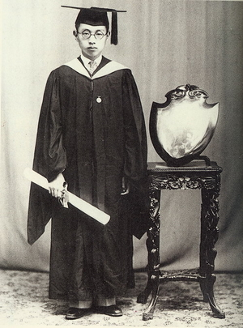
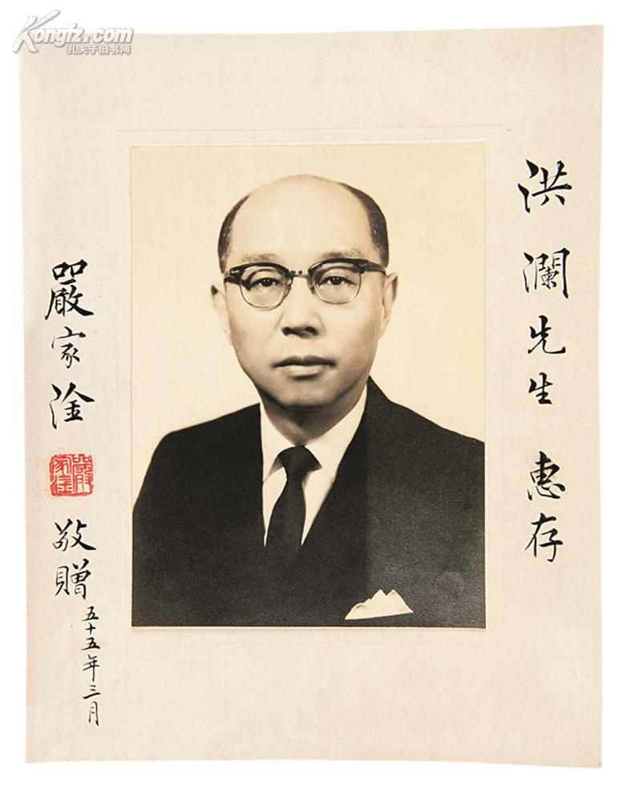
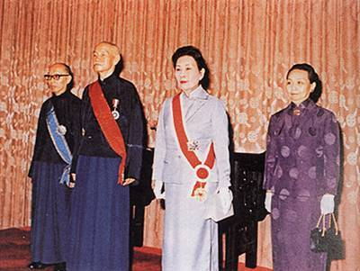
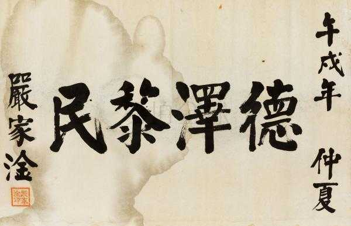

## nnnn姓名（资料）

适合所有人的历史读物。每天了解一个历史人物、积累一点历史知识。三观端正，绝不戏说，欢迎留言。  

### 成就特点

- ​
- ​

### 生平

112年前的今天，中华民国的第一位文人总统严家淦出生

严家淦（1905年10月23日－1993年12月24日），今江苏苏州市人，在蒋介石之后任3年总统，是中华民国的第一位文人总统。

他最大贡献的是确立新台币政策、实施9年国民义务教育，对台湾的发展打下重要的基础。被经济学家称为“新台币之父”。

.jpg)

（在苏州的严家花园，严家淦故居）

【圣约翰大学的高材生】

1905年10月23日，严家淦[gàn]出生于今江苏苏州。早年就读于今江苏省木渎实验小学，1926年（21岁）毕业于上海圣约翰大学。

1931年（26岁），曾任京沪杭甬铁路管理局材料处长。1938年（33岁），任福建省政府建设厅长，次年任财政厅长，负责筹措战时财政。为解决粮食供应问题和法币通胀问题，首创“田赋征实”制度。

（严家淦圣约翰大学毕业照）

【接收日本资产的处长】

1945年（40岁），出任战时生产局采办部长，办理美国租借法案和中英、中加借款案。

1945年10月25日，时任台湾省交通处处长的严家淦，参加在台北市公会堂（今中山堂）举行的日本投降签字仪式。1946年，任台湾省财政处处长，负责接收日产，重建省内财政的工作。

.jpg)

（1945年，日本在台北公会堂的投降仪式）

【躲过大劫难的厅长】

1947年（42岁），震惊中外的二二八事件爆发，严家淦被指责为陈仪身边的“四凶”之一，被指名要求严办。幸好，严家淦正好在台中出差，躲入朋友家中逃过一劫。

1947年4月29日，行政院首次政务会议，严家淦当选为台湾省政务委员兼财政厅长。严家淦鉴于当时台湾财政混乱，采取了许多措施整顿财政，收效明显。

（1947年2月28日，台北火车站前面正集结准备前往行政长官公署请愿的群众）

【发行新台币的部长】

1949年6月15日（44岁），新台币正式发行，以4万元旧台币换1元新台币，切断台湾与大陆财政联系，有效降低通货膨胀及物价混乱。他一手策划了新台币的发行，被经济学家称为“新台币之父”。

12月7日，国民政府撤退来台。严家淦与多位厅长一同请辞。1950年3月，任财政部部长，任内与国防部协商，节制军费。

【担任财长10年的院长】

1954年6月（49岁），台湾省政府改组，严家淦为台湾省政府主席兼保安司令，主持台湾省政府迁往南投，仿照伦敦新市镇造镇模式，开辟建设中兴新村，顺利完成台湾省政府的疏迁工作。

1958年3月（53岁），严家淦回任财政部部长，此后在任5年9个月，连同之前4年2个月的任期，担任财长长达约10年之久。

1963年12月（58岁），出任行政院院长。

86岁生日,严家淦前往祝贺.jpg)

（1965年9月11日，严家淦祝贺孔祥熙86岁生日）

【与美国科技交流的副总统】

1966年3月（61岁），在国大会议中，当选为副总统，也是中华民国首位文人副总统。

1967年5月（62岁），访问美国，争取到美援停止之后的各项经济合作计划，使美方同意加强科技交流。于是在行政院之下，成立国家科学委员会，以促进产业升级。

1972年3月21日（67岁），连任副总统，并将担任了8年多的行政院长一职交由蒋经国接任。

（1972年，台湾总统蒋介石夫妇和副总统严家淦夫妇）

【中国民国的第1位文人总统】

1975年4月5日（70岁），蒋介石病逝，依中华民国宪法，由副总统严家淦继任总统。4月6日上午11时，严家淦宣誓就任总统。严家淦成为中华民国首位文人总统。任内台湾经济发展相当蓬勃，社会秩序相对稳定。

1978年5月20日（73岁），严家淦正式卸下总统职务，由蒋经国继任。

（严家淦宣誓继任台湾总统）

【88岁离世的老人】

此后担任中华文化复兴运动推行委员会会长、国立故宫博物院管理委员会主任委员等名誉职务。

1986年9月间，严家淦在主持会议当中脑溢血突发，送医急救。1993年12月24日晚上，因心脏衰竭病逝于台北荣民总医院，享年88岁。葬于今新北市汐止区的五指山国军示范公墓特勋区。

（严家淦书法）

