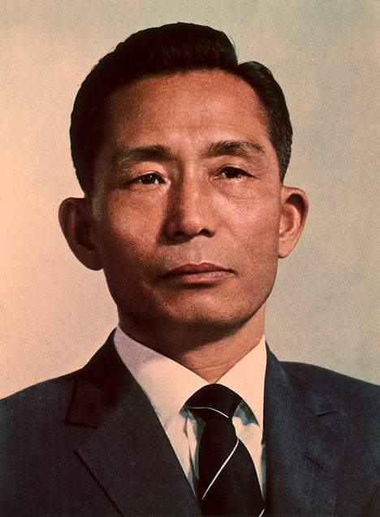
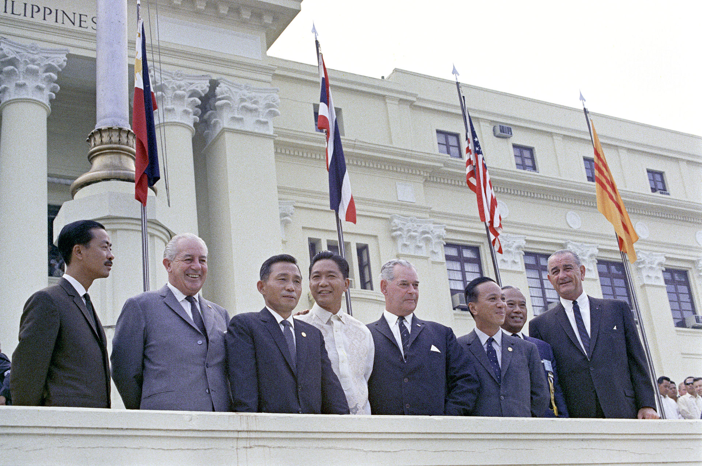
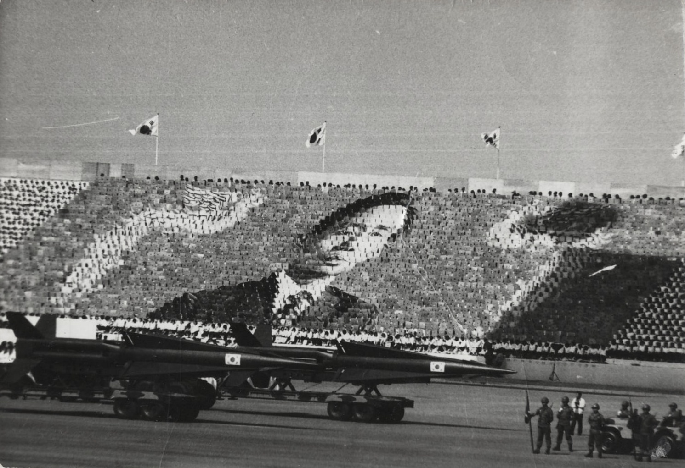
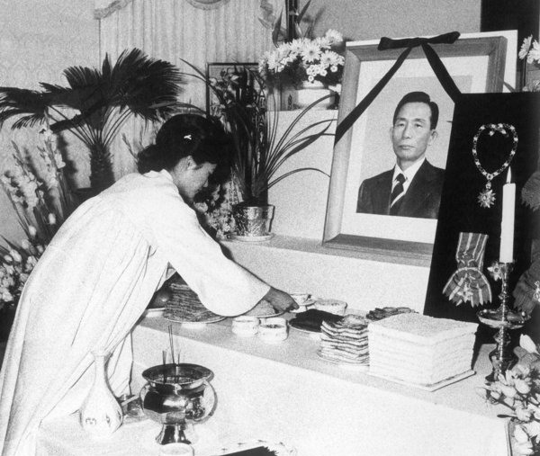

## nnnn姓名（资料）

适合所有人的历史读物。每天了解一个历史人物、积累一点历史知识。三观端正，绝不戏说，欢迎留言。  

### 成就特点

- ​
- ​

### 生平

38年前的今天，连任5届总统，带领韩国经济腾飞的朴正熙被意外枪杀

朴正熙（1917年11月14日－1979年10月26日），韩国第5至9届总统，是韩国宪政史上执政时间最长的总统，亦是韩国第18任总统朴槿惠的父亲。

朴正熙是一位颇具争议性的韩国总统。在其执政期间（1961年到1979年），韩国从一个贫穷的农业国发展成为中等发达国家，人均国民生产总值增长了20倍，从82美元增加到1644美元。他被誉为“汉江奇迹的缔造者”。另一方面，他实行铁腕统治，而被称为独裁者。

【喜欢军事的穷小子】

1917年11月14日，朴正熙出生于今韩国庆尚北道善山郡一个贫苦佃农家庭。9岁时上小学，学校离家很远，朴正熙每天都要凌晨起床，跑20里路去上学。

1932年（15岁），朴正熙小学毕业后，考入大邱师范学校。这是所日式学校，实行全面军事化管理。朴正熙的文化课成绩很差，但军训非常努力，教官有川大佐非常喜欢他。1937年3月（20岁），朴正熙从大邱师范学校毕业，在一家小学教书。但不久，他因蓄长发，被学校开除。

【满洲国的军校优等生】

他试图报考满洲军校，但因年龄过大而落榜。1939年（22岁），他再次报考，并附上“一死以テ御奉公”的血书。该血书被满洲国日文报纸《满洲新闻》刊登，轰动一时。他昔日的军训教官有川大佐，正在满洲关东军当指挥官，推荐他考入了满洲军官学校。

1942年3月（25岁），朴正熙以第一名的成绩毕业，并从满洲国皇帝溥仪那里得到了一块金表作为奖励。他被保送到日本陆军士官学校（第57期）深造。1944年，朴正熙以全校第三名的成绩从日本陆军士官学校毕业，被授予满洲军少尉军衔，调至满洲国军步兵8团。

【朝鲜战争的炮兵司令】

日本无条件投降后，经过千辛万苦回到汉城。1946年9月24日，朴正熙成为“警备士官学校”二期学生。1947年9月27日起，他开始担任第8团警备士官学校连连长。1948年8月1日，朴正熙晋升为少校。8月15日，大韩民国正式成立。

1950年（33岁），朝鲜半岛局势愈发紧张，最终爆发战争。战争不到1年，朴正熙就升为上校。1953年初，出任第3军炮兵司令，后赴美国陆军炮兵学校深造。回国后，他相继担任第5师师长，第7步兵师师长和第6军副军长。1958年，朴正熙晋升为少将并担任第1军参谋长。1959年，任第6军管区司令。

【夺取政权的政变】

1960年8月（43岁），以民主党为首的第二共和国成立。但由于以尹潽善为代表的民主党旧派势力和以张勉为代表的新派势力之间的内斗，社会局势依然动荡不安。

1961年5月16日凌晨（44岁），朴正熙率领大约3500名政变队伍向汉城进军。除在汉江桥与宪兵队发生短暂交火外，整个政变过程几乎没遇到阻力，迅速占领了汉城所有的重要战略地点。尹潽善总统拒绝美军干涉，政变得到承认。

【连任5届的韩国总统】

1962年3月22日，尹潽善辞去总统，朴正熙以议长的身份代行总统职权。1963年10月15日，韩国举行了“归还民政”的总统选举，朴正熙当选为韩国第五届总统。

朴正熙是韩国宪政史上任职时间最长的总统。从1963年至1979年，他连任5届（5-9届）韩国总统，统治韩国长达16年。朴正熙认为韩国在独立后照搬西方民主的做法是错误的。他认为在经济落后，工业生产水平低，传统文化势力强，农村存在大量文盲，城市存在大量失业和社会不满的韩国推行民主政治，只能被腐败的政客所利用。在其统治期间，他奉行牺牲民主的专制制度来追求经济的高速增长。

【大权集为一身的独裁者】

1969年10月17日，举行了全民公决，允许总统“三连任”宪法修定案获得通过。1971年，朴正熙在第7届总统选举中，以不到100万张选票的微弱优势险胜金大中，再次当选韩国总统。

1972年10月17日，朴正熙以实现朝鲜半岛统一为由，发布《非常戒严令》，宣布全国戒严，现行宪法作废，解散国会，禁止一切政治活动，史称“十月维新政变”。10月27日，朴正熙政府颁布了《志在祖国和平统一的宪法修正案》，即《维新宪法》。

1972年12月23日，朴正熙作为唯一的总统候选人被选举为韩国第8任总统。通过十月维新，朴正熙将国家元首、政府最高长官、内阁主席、国军统帅、国家安全委员会主席、统一主体国民会议议长等大权集为一身。1978年7月6日，朴正熙再次毫无悬念地当选韩国第九届总统。

【意料之外的枪击】

1979年4月30日，韩国国会取消了反对派金泳三的国会议员资格，韩国政坛掀起轩然大波。金泳三的政治根据地釜山、马山和昌原等地爆发大规模的示威游行，即“釜马事态”。

1979年10月26日，朴正熙与中央情报部部长金载圭、警护总长车智澈一起晚餐，期间将“釜马事态”归咎于金载圭。金载圭恼羞成怒竟开枪杀死了朴正熙和车载澈，朴正熙享年72岁。

1979年11月3日，韩国为朴正熙举行了国葬。

### 

