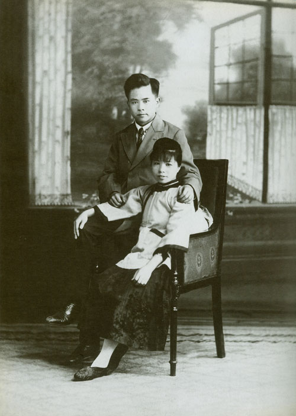
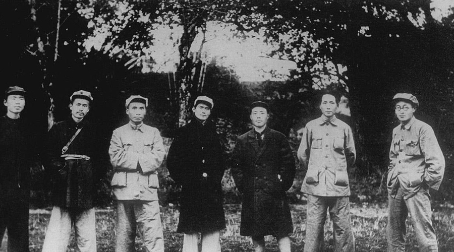
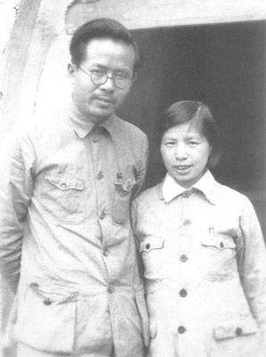
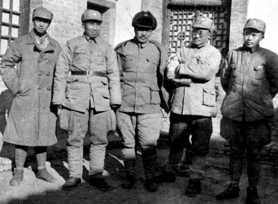
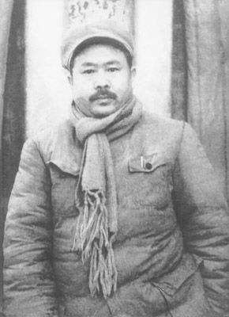
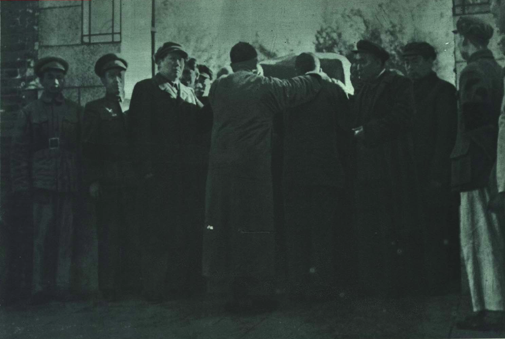

## nnnn姓名（资料）

适合所有人的历史读物。每天了解一个历史人物、积累一点历史知识。三观端正，绝不戏说，欢迎留言。  

### 成就特点

- ​
- ​

### 生平

67年前的今天，新中国第一次降半旗，人民的骆驼任弼时病逝

【留学苏联的革命小伙】

1904年4月30日，任弼时出生于今湖南汨罗市弼时镇。父亲是乡村教师，幼年随父亲读小学。1918年（14岁），考入长沙上中学。1920年（16岁），参加毛泽东等筹建的俄罗斯研究会，并由该会推荐赴上海入“外国语学社”作留俄学习准备。在上海加入社会主义青年团。

1921年5月，与刘少奇、萧劲光等人乘船离开上海，绕道日本，经海参崴，抵达苏联，进入莫斯科东方大学学习。1922年（18岁），加入中国共产党。1924年7月（20岁），任弼时毕业回国，在上海大学教授俄语，并给进步刊物供稿。

（1921年8月，任弼时在莫斯科东方大学学习）

【共青团的总书记】

1925年1月（21岁），任弼时出席青年团第三次全国代表大会，当选为团中央执行委员会委员。后任团中央局常委，任团组织部主任等职。5月6日，张太雷调离，任弼时任团中央代理总书记，领导五卅运动。1926年4月，与指腹为婚的陈琮英在上海结婚，相伴终生。

1927年（23岁），先后发生四一二事变、七一五事变，第一次国共合作彻底结束。8月7日，中国共产党在汉口举行紧急会议，任弼时与瞿秋白、毛泽东站在一起，反对陈独秀，主张发动土地革命。

（任弼时与陈琮英的结婚照）

【两次不长的牢狱之灾】

1928年4月（24岁），因中共代表分批赴莫斯科出席中共六大，任弼时受命留守上海。他起草的《军事工作大纲》是最早的红军建设纲领。

1928年10月15日，在安徽省南陵县香油寺前，为参加共青团的一个集会，不幸被捕入狱。年底，在律师辩护下，暗中营救出狱，回到上海休养；然而妻子因颠沛流离，他们的长子因肺炎夭折。

1929年1月，任江苏省委常委、宣传部长。8月13日，代理江苏省委书记，筹建《今日新闻》、《教育周刊》、《上海日报》。11月17日，在组织机关会议中，他再次被捕。请律师辩护，判刑40天，关入提篮桥监狱。

【中央苏区的浮沉】

1930年4月（26岁），他任中共湖北省委书记。1931年2月，前往中央苏区。11月7日，参加中华苏维埃第一次全国代表大会，当选为中央执行委员。12月，任弼时任中共苏区中央局副书记、组织部长、党校校长。

1932年7月（28岁），他担任代理苏区中央局书记。10月上旬，苏区中央局召开宁都会议，决定以病假方式撤销毛泽东军权，转给周恩来。1933年5月，因博古等人执行王明路线，任弼时被免去了苏区中央局组织部部长职务，任湘赣苏区省委书记。

（1931年11月，中共苏区中央局委员合影，左二为任弼时）

【与贺龙的红二、六军团】

1934年8月（30岁），他同红六军团长萧克、政委王震等一起，率红六军团及湘赣军区先遣西征，接连突破数层国军防线，跨越江西、湖南、云南、贵州四省。10月24日，在贵州印江木黄与红三军会合；红三军改编为红二军团，贺龙任军团长、任弼时兼任政治委员，两人统一指挥红二、六军团。

1934年11月，部队攻入湖南，并建立湘鄂川黔边革命根据地。1935年1月，蒋介石率领国民革命军采用分进合击进攻湘鄂川黔边。1935年11月，他与贺龙、关向应等统一指挥红二、六军团突围国军封锁，继续长征。

【红二方面军的长征终结者】

1936年2月（32岁），两军团创建川滇黔边根据地。7月2日，红二、六军团到达四川甘孜，与张国焘、徐向前的红四方面军会合。红二、六军团及红三十二军组成红二方面军，任弼时任红二方面军政治委员。

中共中央批准成立中共中央西北局，任弼时任副书记。10月，红二方面军与红一方面军在将台堡会师，长征结束。

【驻共产国际的中共代表】

1937年8月25日（33岁），红军改编为八路军，任弼时任政治部主任。9月初，与朱德、左权、邓小平等率八路军总部开赴山西抗日前线。

1938年3月（34岁），受中共中央委派，赴莫斯科向共产国际交涉。7月，正式接替王稼祥任中国共产党驻共产国际代表。1940年3月（36岁），回到延安，参加中共中央书记处工作，分管中共中央组织部、青委、妇委。9月，开始负责领导陕甘宁边区工作。

（1938年，任弼时与朱德、贺龙等人合影）

【中共五大书记之一】

1941年7月（37岁），任中共中央秘书长。1943年3月（39岁），任弼时与毛泽东、刘少奇组成中央书记处，并为中央组织委员会成员，具体负责陕甘宁和晋西北的工作。

1945年3月（41岁），任弼时当选为中央政治局委员、中央书记处书记，中央秘书长。为中共五大书记之一，党内排名仅次于毛泽东、刘少奇、周恩来、朱德四人。11月下旬，经苏联医生检查，发现任弼时病情已较严重。

【带病工作的骆驼精神】

1947年3月底，和毛泽东、周恩来留在陕北主持中央工作，任弼时任中央支队司令，负责土地改革以及陕北部队作战指挥；并指挥各地区土地改革和经济工作。1948年，出席西柏坡会议。随后，任弼时抱病协助指挥辽沈战役、淮海战役、平津战役等。

1949年4月，在北平西郊玉泉山休养；11月，经批准去苏联就医。1950年5月，任弼时在得知朝鲜战争爆发后，抱病回国恢复工作。10月1日，登上天安门，参加中华人民共和国国庆一周年庆典。10月27日，因带病研究朝鲜战局，疲劳过度引起脑溢血而病逝，享年46岁。

【新中国第一次降半旗】

新中国第一次降半旗致哀。遗体在家中入殓；毛泽东、刘少奇、周恩来、朱德、彭真扶灵。10月30日，追悼会在劳动人民文化宫太庙前举行，由彭真主持。1951年7月18日，任弼时安葬仪式在北京八宝山革命公墓举行，因当时未强制火葬，以土葬形式，葬于八宝山。

叶剑英元帅曾称“他（任弼时）是我们党的骆驼，中国人民的骆驼，担负着沉重的担子，走着漫长的艰苦的道路，没有休息、没有享受、没有个人的任何计较。”骆驼精神成了任弼时的代名词。

【】

### 照片
