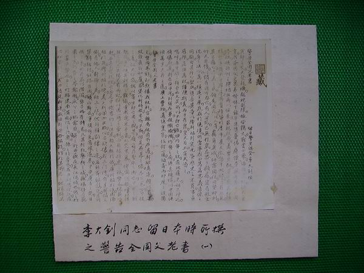
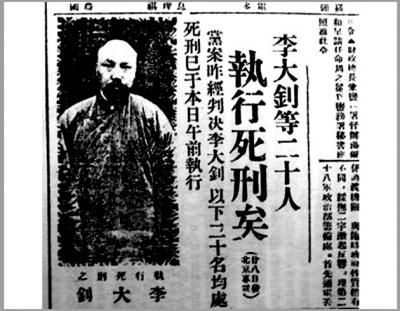
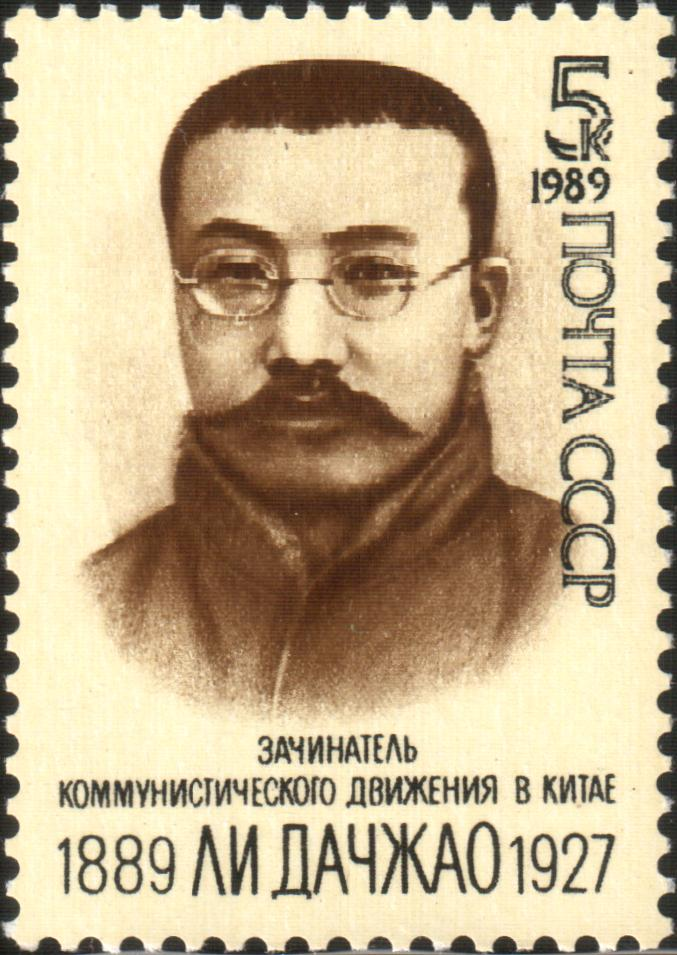

## nnnn姓名（资料）

适合所有人的历史读物。每天了解一个历史人物、积累一点历史知识。三观端正，绝不戏说，欢迎留言。  

### 成就特点

- ​
- ​

### 生平

128年前的今天，中国最早的马克思主义者李大钊出生

【避难家乡的中国社会党员】

1889年10月29日，李大钊出生于河北乐亭。

1913年8月（24岁），从天津北洋法政专门学校毕业，在校期间加入中国社会党。毕业后，到北平参加中国社会党活动。同年，中国社会党因涉嫌参加二次革命被袁世凯政府取缔，李大钊逃离北平，回到家乡避难。

【反对二十一条的通电】

不久，得到资助，赴日本留学，入读早稻田大学政治科。1914年，组织神州学会，进行反袁世凯活动。

1915年（26岁），日本提出“二十一条”，李大钊以留日学生总会名义发出《警告全国父老书》通电，号召国人以“破釜沉舟之决心”誓死反抗。该通电传遍全国，他也因此成为著名爱国志士。

【相约建党的革命佳话】

1916年5月，回到中国，在北京创办《晨钟报》，任总编辑。不久辞职，任《甲寅日刊》编辑，为主要撰稿人之一，推动新文化运动。1918年，任北京大学图书馆主任，后担任过经济系、历史等系教授，参与编辑《新青年》，并和陈独秀创办《每周评论》，推动共产主义。

1920年，和陈独秀在北京和上海分别活动，筹建中国共产党。3月，李大钊在北京大学组织中国第一个马克思学说研究会。10月，和邓中夏等一同建立北京共产主义小组。“南陈北李，相约建党”，成为中国革命史上的一段佳话。 

【国共合作的领导人】

1922年，李大钊多次赴上海会见孙中山，商讨国共合作事宜。1924年1月，李大钊作为大会主席团五位成员之一，出席了国共合作的国民党第一次全国代表大会，以个人身份加入国民党，任国民党第一届中央执委。此后，直接担负国共两党在北方的实际领导工作。

1925年，上海五卅运动爆发后，李大钊与赵世炎等人在北平组织5万余人的示威。李大钊因“假借共产学说，啸聚群众，屡肇事端”而被北洋政府下令通缉，逃入东交民巷苏联兵营。

【天安门前的三一八惨案】

1926年3月12日，冯玉祥的国民军与奉系军阀作战期间，日本军舰掩护奉军军舰驶进天津大沽口，与国民军发生冲突。日本联合英美等八国于16日向段祺瑞政府发出最后通牒，提出撤除大沽口国防设施等要求。

1926年3月18日，由李大钊主持，组织五千余人在天安门集会抗议，要求政府拒绝八国通牒。段祺瑞执政府下令开枪，当场打死几十人，其中包括著名的刘和珍等人，李大钊受伤。

【和苏俄里通外国的罪名】

1927年4月6日（38岁），在西方国家驻华公使团的授权下，张作霖派军警突袭搜查苏联大使馆，李大钊全家被捕。事关重大，张作霖给政府前方将领如张学良、张宗昌、孙传芳等六位发电征询意见，除阎锡山没有回复，其余将领都主张立即正法。南方的蒋介石也发来密电，建议“速行处决，以免后患。”

4月28日，李大钊等20名国共人员被以“和苏俄里通外国”为罪名绞刑处决，时年38岁。

【为革命而奋斗的一生】

李大钊被处决后，灵柩多年停放在宣武门外的一个庙宇内，直到1933年4月23日，他的家属和许多社会知名人士，为他举行葬礼，将灵柩安葬于香山万安公墓。由于家属缺钱，北京大学教授为其葬礼捐款，一些社会人士也有捐助，如汪精卫一人就捐了1000元。

在北平地下党组织的安排下，李大钊出殡成了声势浩大的政治示威。送葬队伍最前面是用白纸黑字写的一副巨大挽联，上联是“为革命而奋斗，为革命而牺牲，死固无恨”，下联是“在压迫下生活，在压迫下呻吟，生者何堪”，横批是“李大钊先烈精神不死”。

【永垂不朽的烈士】

1983年，万安公墓中辟出了李大钊烈士陵园，供人瞻仰。绞死李大钊的绞刑架，1949年被送入天安门广场东侧的北平国家博物馆（中国历史博物馆）展览大厅里，列为国家一级文物，编为0001号。

曾判处李大钊死刑的中华民国法官王振南，1955年12月被中华人民共和国政府以反革命罪逮捕，1957年12月13日，由上海市第一中级人民法院判处死刑。

