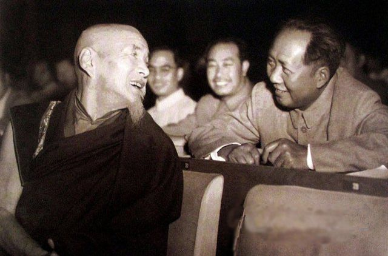
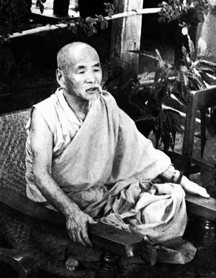

## nnnn姓名（资料）

### 成就特点

- ​
- ​

### 生平

【1968年11月1日】49年前的今天，迎请佛牙舍利的藏传佛教高僧喜饶嘉措逝世

喜饶嘉措（1884年－1968年11月1日)，著名的藏族大格西。格西是藏传佛教格鲁派僧侣，经过长期的修学而获得的宗教学位，地位很高。曾任中国佛教协会会长、中国佛学院院长、青海省副省长等。

（1955年4月，喜饶嘉措在仰光）

【天天向上的藏传僧侣】

1884年，喜饶嘉措出生于青海循化一个藏族贫民家庭。约7岁时，在古雷寺，授沙弥戒，正式剃度出家，起法名"喜饶嘉措"，意为智慧海。

喜饶嘉措在古雷寺，学习藏文语法、因明、律经等。14岁时，前往拉卜楞寺的闻思学院深造，完成了因明、般若等课程，成绩非常出色，受具足戒。

1904年冬（20岁），喜饶嘉措在经师的资助下，到达拉萨，进入哲蚌寺郭莽扎仓，潜心研习中观、俱舍、戒律等的各种论著。在辩经场上，才思敏捷的喜饶嘉措更是出了名，被任命为扎仓的复诵师。

【刻经授法的大格西】

1916年（32岁），喜饶嘉措在拉萨三大寺的轮番辩经中，获得考取拉仁巴格西的资格。在随后的拉萨大祈愿法会上，喜饶嘉措立宗应辩，获得第一名拉仁巴格西。而后喜饶嘉措进入哲蚌寺的上密院、下密院学习。

1918年起（34岁），应十三世达赖喇嘛之邀，喜饶嘉措在罗布林卡宫用六年时间完成了29函《布敦全集》的校勘刻印工作，颇受好评。而后又用八年时间，主持校刻布达拉宫版的大藏经·甘珠尔。

期间，喜饶嘉措撰有十余种著作。同时，在三大寺巡回讲授五部大论，座下的弟子无数。

【大学的汉藏文化讲师】

1934年秋（50岁），曾任西宁道道尹12年的黎丹组织"西藏巡礼团"到达拉萨，向喜饶嘉措学习佛法。应黎丹的请求，喜饶嘉措着手编纂《藏汉大辞典》。后由黎丹推荐，中华民国政府聘请喜饶嘉措，担任国立五大学的西藏文化讲座、汉藏文化讲师。

1937年春（53岁），喜饶嘉措取道印度，到达南京，受到蒋介石、林森等国民党要员的接见。在中央大学、上海大菩提学会等处，喜饶嘉措作了多场报告，介绍宗喀巴大师、道次第、格鲁派历史等。他在各高校的授课，受到好评。

（1955年4月，喜饶嘉措率中国佛教代表团访问缅甸）

【抗日救国的宣传员】

1937年，喜饶嘉措加入国民党，并任国民参政会参政员。抗日战争全面爆发后，1939年，喜饶嘉措前往甘肃、青海一带，积极宣传救国抗日。1940年，因其"护国精诚，深堪嘉尚"，国民党册封喜饶嘉措为"辅教宣济禅师"，并授大小银印两枚。

1941年，西藏政局突变，汉藏关系恶化。1943年（59岁），蒋介石派喜饶嘉措前往拉萨协调，但止步于藏北边境，未能进藏。1945年，任国民代表大会代表。1947年7月，任蒙藏委员会副委员长。

【青海省的副主席】
中华人民共和国成立后，应青海军政季员会邀请，喜饶嘉措从海南兴海县赛宗寺返回西宁，开始与共产党合作。1949年12月（65岁），青海省人民政府成立，喜饶嘉措出任副主席。

1951年，西藏和平解放。喜饶嘉措进京，受到毛泽东、周恩来的接见，毛泽东还送他一部小汽车和几台收音机。

1952年，西康白马地区发生骚乱，喜饶嘉措发表了《驳波地白马噶圣地记》、《驳假预言，扫除黑迷雾的智慧太阳之光》、《先行的书信——甘露珠》等文章，协助政府宣传政策。

（第一届全国人民代表大会喜饶嘉措与毛泽东合影）

【迎请佛牙舍利的领袖】

1952年11月（68岁），喜饶嘉措与圆瑛、赵朴初等人发起成立中国佛教协会。1953年5月底，中国佛教协会在北京成立，圆瑛当选会长，喜饶嘉措任副会长。9月，圆瑛逝世，喜饶嘉措任代会长。1955年，正式出任会长。1956年9月（72岁），中国佛学院成立，喜饶嘉措兼任院长，为佛学院学生授课。

1960年（76岁），国务院为表彰喜饶嘉措的功绩，将明朝的一口2000多公斤大铜钟，赠送给喜饶嘉措，派专车运至青海循化古雷寺。喜饶嘉措积极从事藏文的翻译工作，参加了《毛泽东选集》的翻译和审订。

1961年6月，以喜饶嘉措为首的佛牙护侍团，应邀前往斯里兰卡，迎请佛牙回到北京。这是佛教界轰动一时的盛事。 

（喜饶嘉措率领弟子奉迎佛牙舍利）

【突然遭到的批判】

1964年10月（80岁），在北京佛学院召开了批判喜饶嘉措的大会，喜饶嘉措被安上了种种罪名，被隔离审查。年底，被遣送回青海，继续被批斗。在西宁还举办了“喜饶嘉措反党叛国集团罪行展览”，喜饶嘉措收藏的经卷、佛像、穿过的袈裟、用过的法器等，都被作为罪证而作展览。

1968年11月1日，喜饶嘉措去世，享年84岁。

1979年，喜饶嘉措被平反，10月6日，青海省政府在西宁举行了喜饶嘉措追悼大会。

