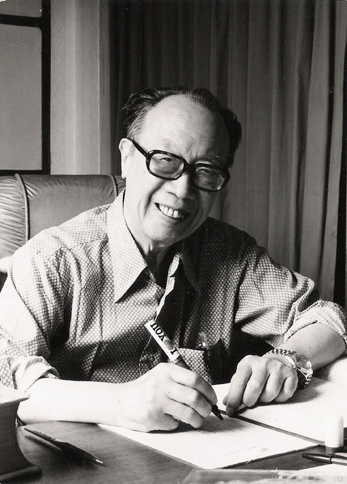
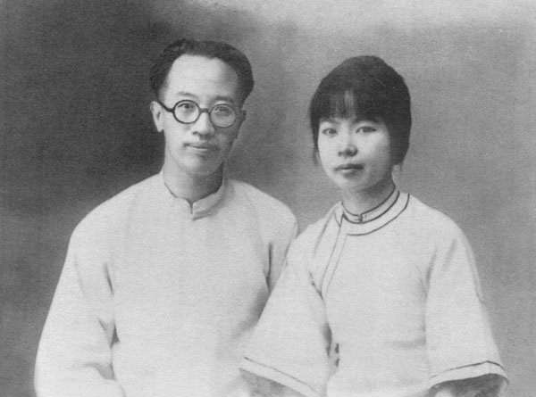

## nnnn姓名（资料）

### 成就特点

- ​
- ​

### 生平

【1987年11月3日】30年前的今天，与鲁迅论战了8年的散文大师梁实秋病逝台北

【11个兄妹中的才子】

1903年1月6日，梁实秋出生于北京内务部街。祖父是四品官，父亲毕业于京师同文馆，任职京师员警厅。梁实秋有11个兄弟姐妹，他排行老四，上有3个兄姐，下有7个弟妹。

1915年夏（12岁），梁实秋考入清华学校留美预备班（即今清华大学前身）。1919年（16岁），五四运动爆发后，梁实秋是学校运动积极分子，但当同寝室的章宗祥的儿子，受到运动牵连并在不久害病死去，便开始沉寂反思。

1921年11月（18岁），与好友闻一多合作出版了《冬夜草儿评论》一书，得到远在日本的郭沫若来信称赞。

（后排右二为闻一多，前排右二为梁实秋）

【3年拿硕士博士学位】

1923年8月（20岁），赴美留学，在科罗拉多学院学习。1924年夏，进入哈佛大学攻读研究生，研究方向是西方文学和文学理论，受白璧德新人文主义的影响颇深，先后获哈佛大学文学硕士学位，哲学博士学位。

1926年回国后（23岁），先后任教于国立东南大学、青岛大学、北京师范大学；1927年，与徐志摩、闻一多创办新月书店。

（1926年，梁实秋与原配程季淑婚前合照）

【与鲁迅的8年论战】

1927年到1936年间，梁实秋先后发表了数篇文学论文，翻译了不少名著如《呼啸山庄》等。他认为，永恒不变的人性是文学主题，否认文学有阶级性，不主张把文学当作政治的工具；批评鲁迅翻译外国作品的“硬译”，不同意鲁迅翻译的苏俄“文艺政策”。

因此引发了和鲁迅的论战，及左翼作家的围攻，被批为“丧家的资本家的乏走狗”。1936年10月19日，鲁迅不幸逝世，这场持续了8年的论战方才结束。

【为资产阶级文学服务的代表人物】

1937年，七七事变之后，梁实秋只身赴后方。抗战时，曾居重庆北碚的雅舍，任国民参政会参政员、国立编译馆编纂，写了大量散文。

1938年，梁实秋在《中央日报》副刊上发表《编者的话》，写到：“现在抗战高于一切，所以有人一下笔就忘不了抗战。我的意见稍为不同。于抗战有关的材料，我们最为欢迎，但是与抗战无关的材料，只要真实流畅，也是好的，不必勉强把抗战截搭上去。至于空洞的‘抗战八股’，那是对谁都没有益处的。”

此言论被批判者称为“抗战无关论”，再次受到左翼文人抨击。梁实秋与左翼作家群体的矛盾，也使他与共产党关系不佳。1942年，毛泽东在《延安文艺座谈会上的讲话》中把梁实秋定为“为资产阶级文学服务的代表人物”。

【一个人翻译的莎士比亚全集】

1949年5月，因国共内战移居台湾，先后任国立编译馆馆长、台湾省立师范学院英语系主任、国立台湾师范大学文学院长、大同大学董事。

梁实秋自1930年开始规划的翻译《莎士比亚全集》。1967年，经过30多年，这个大计划终告完成，他以一人之力完成整部全集的翻译，震惊世界。

 此后，梁开始又一项巨大写作项目：写一部全面的英语文学史。10多年后，1979年，完成了三册本的著作，同时还有三册的中译《英国文学选》。

【出自雅舍的散文大师】

但梁实秋的声誉主要来自于他数百篇关于日常主题的散文，以《雅舍小品》为名结集出版。梁实秋的散文，风格旷达，幽默风趣，读者广泛，影响很大。他一生给中国文坛留下了两千多万字的著作，其散文集创造了中国现代散文出版的最高纪录。

1987年11月3日，病逝于中华民国台北市。

