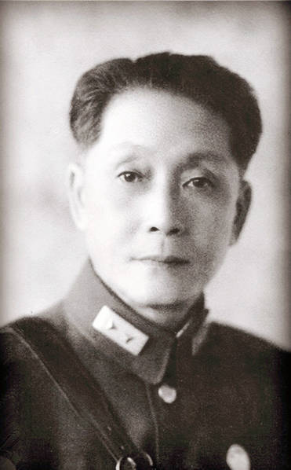
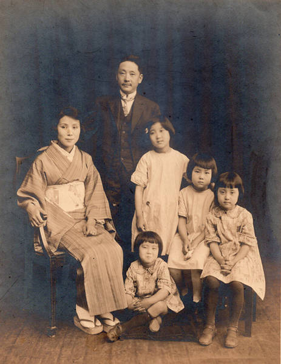
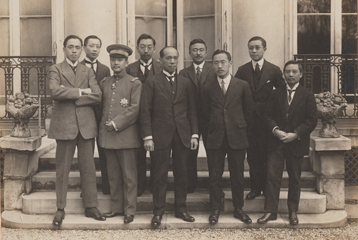
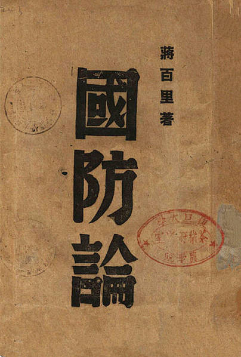
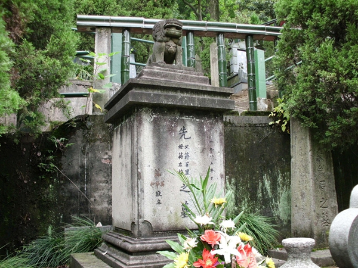

## nnnn姓名（资料）

### 成就特点

- ​
- ​

### 生平

【1938年11月4日】79年前的今天，预言长期抗战，中国必胜的蒋百里逝世

【留学日本和德国的秀才】

1882年，蒋百里出生于浙江海宁。幼年读私塾，1898年（16岁），通过科举乡试成为秀才，1899年，入浙江求是书院。

1901年（19岁），获地方官员赏识，资助他留学日本，先后入成城学校、陆军士官学校 (日本)第十五期学习。期间组织浙籍留日学生成立同乡会，编印刊物《浙江潮》，任首届主编。《浙江潮》颇为流行，鲁迅、章太炎等人都是刊物的读者和投稿人。

1906年（24岁），蒋百里回国，不久转去德国留学4年。1911年，任东三省督练公所总参议，与张作霖等人结怨颇深。武昌起义后，士官学校同学任浙江都督，邀请蒋百里任浙江都督府总参议。后来，得以被推荐给袁世凯。

（1906年夏，蒋百里（右一）与友人在日本合影）

【自杀的军校校长】

1912年（30岁），任保定陆军军官学校校长。1913年6月18日，由于从陆军部拿不到经费，蒋百里召集全校师生紧急训话。他说：“我要你们做的事，你们必须办到；你们希望我做的事，我也必须办到。你们办不到，我要责罚；我办不到，也要责罚。”随后，蒋百里掏出手枪，对自己胸口开了一枪。

事件引发舆论哗然。幸运的是，蒋百里竟奇迹般生还，并与看护他的日本女子相好。两人最终成为夫妻，相伴一生。这位日本护士改名为蒋左梅。二人共有5个女儿，其中蒋英是著名音乐家，为中国导弹之父钱学森的妻子。

（蒋百里全家福）

【失去靠山的蔡锷之死】

1913年（31岁），任袁世凯总统府军事处一等参议，著书《孙子新释》。1916年（34岁），袁世凯称帝，蒋百里反对，流亡到广东，响应蔡锷兴兵讨袁，出任两广护国军都司令部出师计划股主任。

袁世凯死后，蔡锷生病，蒋百里陪同蔡锷一起到日本就医。不久，蔡锷不治身亡。蒋百里失去了好友，也失去了政治靠山。

往后数年间，蒋百里公职清闲，担任一些杂志的编辑、组织诗社等。1917年，任黎元洪总统府顾问，著书《军事常识》。1918年底，随梁启超赴欧洲考察，1920年回国，投入新文化运动。

（1919年，中国欧洲考察团在巴黎的合影，左二为蒋百里、左三为梁启超）

【受到牵连的被捕入狱】

1925年（43岁），至汉口任吴佩孚军总参谋长，主张联络广东国民革命军讨伐张作霖，不被吴佩孚接纳。1926年，蒋百里辞职回上海，转投孙传芳。不久，孙传芳投靠张作霖，只好再次离去。

1929年（47岁），唐生智参加中原大战，拥兵反蒋介石。蒋百里在保定军校任校长时，唐生智为其学生，过从甚密。1930年1月，蒋百里受到牵连，被蒋介石关入监狱。1931年，“九一八”事变后获释。

【日本必败的国防论】

1933年（51岁），赴日考察，认为中日大战不可避免，他拟就多种国防计划，呼吁当局备战。1935年，任国民政府军事委员会高等顾问。次年春，赴欧洲考察，回国后倡议发展空军，建设现代国防。1936年12月，西安事变时，蒋百里在西安调解张学良。

1937年夏（55岁），出版代表作《国防论》，认为唯有长期抗战，才能把日本拖垮。9月，以蒋介石特使身份访问意大利、德国。回国后发表《日本人》及《抗战的基本观念》，进一步阐明日本必败，中国必胜。

【等待胜利的上将】

1938年8月（56岁），代理陆军大学校长，11月4日，病逝于广西宜山，葬于当地。中华民国政府追赠为陆军上将。

1947年，好友陈仪等协助迁葬，起棺时，竟然尸身不朽。生前至交竺可桢大哭道：“百里，百里，有所待乎？我今告你，我国战胜矣！”一时众人泣不成声，遗骸火化后迁葬西湖。

（改迁后的蒋百里墓，位于今浙江省杭州市南山陵园）

