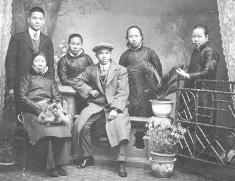
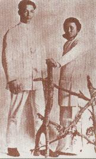
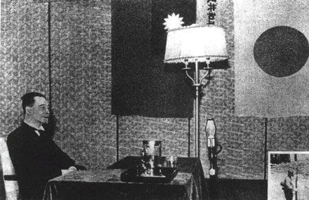
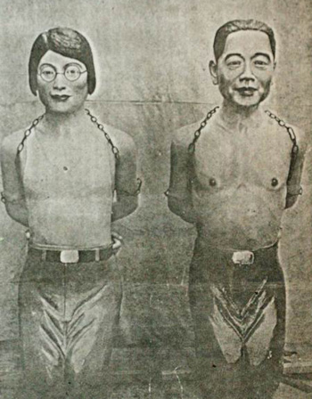

## nnnn姓名（资料）

适合所有人的历史读物。每天了解一个历史人物、积累一点历史知识。三观端正，绝不戏说，欢迎留言。  

### 成就特点

- ​
- ​

### 生平

【1891年11月5日】126年前的今天，与汪精卫一起暗杀摄政王的陈璧君生于马来西亚

【最年轻的同盟会会员】

1891年11月5日，陈璧君生于马来西亚槟城一个南洋华侨富商家庭，原籍广东新会。

15岁时，陈璧君在当地华侨小学毕业，进入璧如女校读书。1908年（17岁），陈璧君加入中国同盟会，并在新加坡拜见了孙中山。陈璧君是同盟会中最年轻的会员。不久，说服母亲也加入了同盟会，并与访问槟城的汪精卫结识。

（1907年，同盟会成员合影，左一汪精卫，右二陈璧君，左二陈母（坐））

【刺杀摄政王的革命夫妻】

1910年（19岁），陈璧君随汪精卫到北京，开办守真照相馆，暗中策划暗杀清朝摄政王载沣。4月，暗杀计划暴露，汪精卫被捕，判处无期徒刑。汪精卫狱中赋诗“引刀成一快，不负少年头”。

1911年10月，武昌起义爆发。清政府被迫宣布开放党禁，汪精卫被释放出狱。经过这一番生死之恋，两人的感情有了进一步发展。1912年初，两人在上海举行了婚礼。

（1910年的陈璧君与汪精卫）

【支持孙中山的夫妻】

1912年8月（21岁），夫妇二人同赴法国留学，期间汪精卫曾多次回国。1917年（26岁），为支持孙中山的护法运动，夫妇二人回国。1925年（34岁），孙中山在北京病倒，汪精卫负责处理政务，陈璧君则帮助宋庆龄看护病重的孙中山。

1926年1月，孙中山病逝后，在广州召开中国国民党第二次全国代表大会，陈璧君当选中央监察委员、常务委员。在汪精卫开始反蒋介石运动后，陈璧君一直在幕后支持丈夫。

,陈璧君(左一)游览衡山2.jpeg)

（1935年，汪精卫(后排左二),陈璧君(左一)游览衡山）

【丈夫的左臂右膀】

1938年（47岁），抗日战争爆发后，国民政府迁往重庆。12月，汪精卫夫妇等人经河内逃往上海。1939年8月，汪精卫召开了中国国民党第六次全国代表大会，陈璧君当选中央监察委员会常务委员。1940年3月，南京国民政府（汪精卫政权）成立。

在南京国民政府中，陈璧君等人形成了“公馆派”，重用褚民谊控制政局。汪精卫的许多决策，陈璧君起着关键作用。有人说：“汪先生没有璧君不能成事，没有璧君亦不能败事”。

（汪精卫在办公室）

【丈夫去世的落寞】

1944年3月（53岁），汪精卫赴日治疗。11月10日，汪精卫去世。11月23日遵其遗愿，归葬中山陵之侧的梅花山。

1945年8月25日，日本投降后，陈璧君被重庆国民政府逮捕。1946年1月21日，何应钦奉命将汪精卫墓炸毁。1946年4月，被江苏高等法院判处无期徒刑。陈璧君表示，自己不服判决，但上诉没有意义，故不再上诉。

【为了国家也算汉奸？】

她问检察官：“说汪先生卖国，重庆治下的地区，由不得汪先生去卖；汪政权治下的地区，是中国的沦陷区，也就是日军的占领区，并无一寸之土，是由汪先生断送的。在沦陷区是沦陷了的土地，只有从敌人手中争回权利，还有什么国可卖？日军攻粤，广州高级长官闻风先逃：几曾尽过守土之责？我们赤手把沦陷区收回，而又以赤手治理之，试问我们收回后怎样能交还重庆，重庆又怎样能来接收？”

她又说：“今天，你们以胜利者的姿态来审问我，为什么不想一想？假如当年日本的炸弹，不投于珍珠港而投之于西伯利亚，今天将又是怎样的一个局面？若说为了国家的利益，不得不与他国出之以盟好的手段，这样而就被认为汉奸。那末，中国的汉奸应该不止亲日的汪先生一人。我等为救民而死，我死也甘心了。”

（浙江泰顺首府罗阳的汪精卫夫妇跪像）

【都是为人民服务】

1949年（58岁），中华人民共和国成立后，陈璧君继续被收监。

1950年春，上海提篮桥监狱召开大会要陈璧君当众“悔过”，陈璧君说：“如其中共与苏联友好，是为了国家的前途，那末，在当年抗战形势不利于我的情况下，汪先生的离渝与日人周旋，彼此又何能分其泾渭？假如说中共政权的建立，是为了为人民服务，那汪先生才是真为沦陷区哀哀无告的人民服务。我是最知道汪先生的人，我有为汪先生表明其心迹的责任。”

1959年6月17日（68岁），陈璧君在上海提篮桥监狱内的医院逝世。

（抗战期间温州人民广场的汪精卫夫妇跪像）

