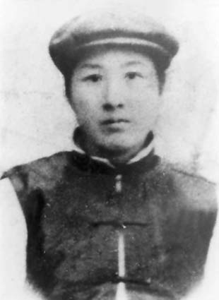
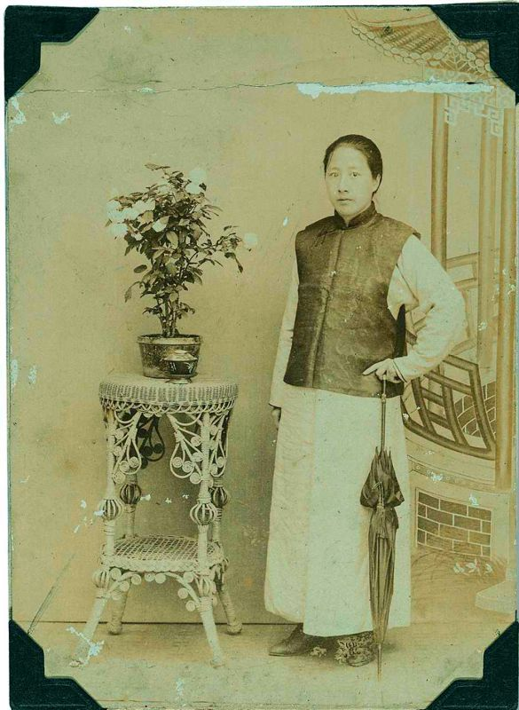
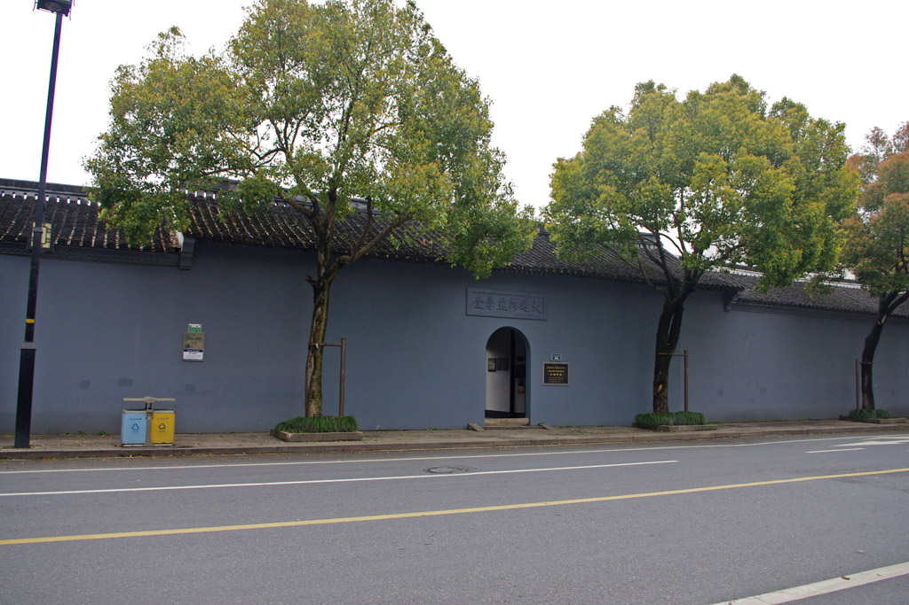
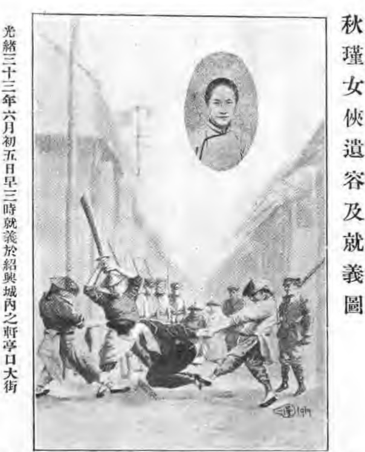

## nnnn姓名（资料）

适合所有人的历史读物。每天了解一个历史人物、积累一点历史知识。三观端正，绝不戏说，欢迎留言。  

### 成就特点

- ​
- ​

### 生平

【1875年11月8日】142年前的今天，秋雨秋风愁煞人的鉴湖女侠秋瑾生于厦门

【嫁到湖南的官宦女子】

1875年11月8日，秋瑾生于福建省厦门，祖籍浙江绍兴。父亲先后在福建、台湾、湖南等地任职。

1894年（19岁），父亲任湖南省湘乡县督销总办时，将秋瑾许配给湘潭县荷叶乡王廷钧为妻。1896年（21岁），两人结婚。王廷钧在湘潭开设“义源当铺”，秋瑾大部分时间住在湘潭。1897年（22岁），生子。1901年（26岁）生女，父亲去世。

【女扮男装的离婚妇女】

1903年（28岁），王廷钧花钱捐了个户部主事的官职，秋瑾随丈夫迁到北京。秋瑾与丈夫同事的夫人吴芝瑛，成为知己。吴芝瑛夫妇思想较开明，颇为崇拜革命党人，秋瑾深受影响。

这年中秋，秋瑾身着男装到戏院看戏，轰动一时。不久，秋瑾和丈夫发生了婚姻危机，然后离婚。1904年（29岁），秋瑾变卖首饰东渡日本，先后入国语讲习所（日语讲习所）、实践女学校学习。

【革命党人中的白纸扇】

秋瑾积极参加留日学生的革命活动，与陈撷芬发起共爱会，和刘道一等组织十人会，加入冯自由在横滨成立的三合会，并受封为“白纸扇”（即军师）。

1905年（30岁），秋瑾回国省亲，由徐锡麟介绍加入光复会。7月15日，再次东渡日本，经冯自由介绍在黄兴寓所加入了，刚刚创立半个月的中国同盟会。

【投降就吃我一刀的老师】

1905年，日本文部省颁发《清国留日学生取缔规则》，留学生组织抗议。写《猛回头》《警世钟》的陈天华留下《绝命书》后，跳海自尽。回国前，秋瑾在陈天华追悼会上发言，非常激动，随手从靴筒取出倭刀，插在讲台上说：‘如有人回到祖国，投降满虏，卖友求荣，欺压汉人，吃我一刀。’”

1907年1月，在上海创办《中国女报》，只出版两期。3月，回绍兴，与徐锡麟等创办明道女子学堂。不久又主持大通学堂（1905年徐锡麟等创办，后作为绍兴光复会总机关）体育专修科，并任学堂督办。

（绍兴大通学堂旧址）

【秋风秋雨愁煞人的侠女】

7月1日至7月4日，武义、金华、永康等地先后发生光复军起义，但均告失败。7月6日，徐锡麟在安庆刺杀安徽巡抚恩铭，刺杀失败被捕杀害。徐锡麟的弟弟供词牵连出秋瑾，但秋瑾拒绝离开绍兴，认为“革命要流血才会成功”。

7月14日，山阴县令带兵查抄大通学堂。军士破校门而入，师生四散而逃。秋瑾穿着长袍立在屋脊上，听县令喊话便脱下长袍，军士见是女子，没有射击。随后秋瑾和8名学生被捕。

被捕后，秋瑾的口供只有一句话：“秋风秋雨愁煞人”。7月15日凌晨，秋瑾于浙江省绍兴古轩亭口被五花大绑处斩，年仅31岁。

【西泠桥畔的巾帼英雄】

秋瑾死后由同善堂收殓，草葬于卧龙山麓。之后，其灵柩数迁。1912年，秋瑾遗骨迁回浙江杭州西湖西泠桥畔。同年12月10日，孙中山亲至墓前祭悼，并撰题挽联：“江户矢丹忱，重君首赞同盟会；轩亭洒碧血，愧我今招侠女魂。”

1965年1月28日，胡乔木表示秋瑾墓是“土偶妖骸”，当晚杭州市园林管理局工人将钢筋混凝土砌成的秋瑾墓炸毁。1981年，秋瑾墓在西泠桥另一端重建，塑汉白玉全身像，并镌有孙中山的手迹“巾帼英雄”。

