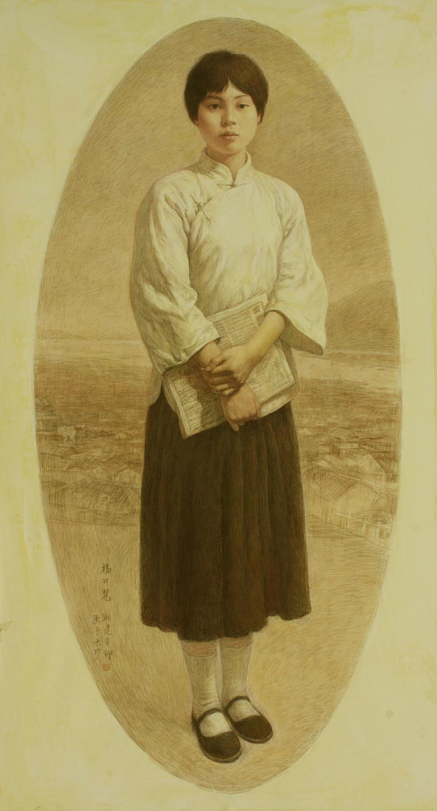
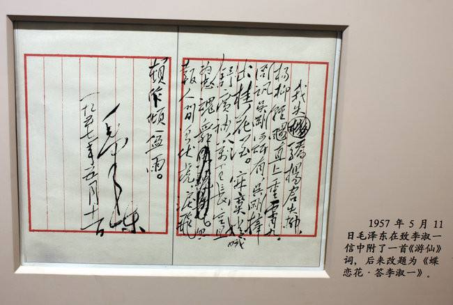
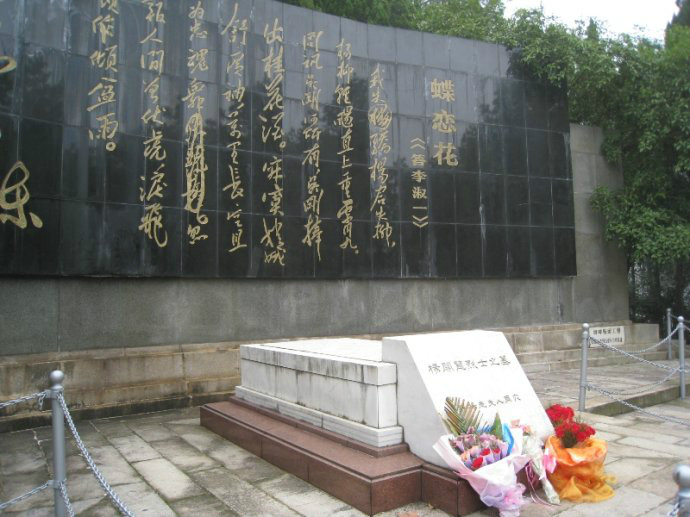
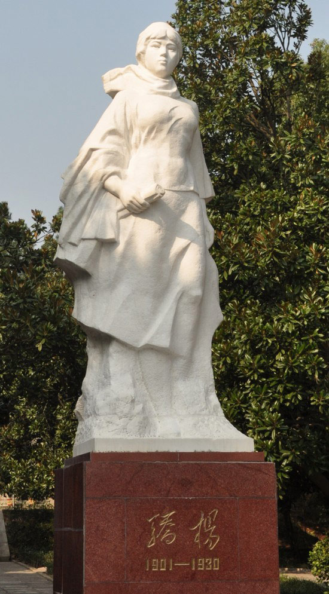
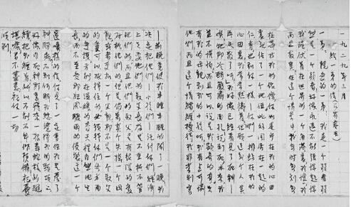
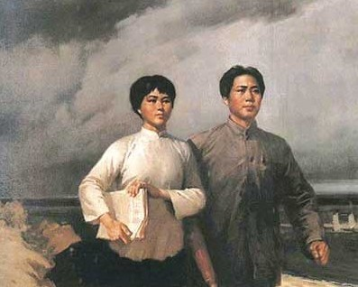

## nnnn姓名（资料）

适合所有人的历史读物。每天了解一个历史人物、积累一点历史知识。三观端正，绝不戏说，欢迎留言。  

### 成就特点

- 毛泽东的妻子
- ​

### 生平

【1930年11月14日】87年前的今天，与母亲同葬一穴，毛泽东的妻子杨开慧牺牲

【爱上父亲学生的少女】

1901年11月6日，杨开慧出生于今湖南省长沙县开慧乡。杨开慧出生不久，父亲杨昌济出国留学，直到1913年才回国。1918年（17岁），杨昌济应聘为北京大学教授，全家北迁。

同年，经杨昌济介绍，他的学生毛泽东在北京大学图书馆做管理员，旁听北大课程。在此期间，毛泽东与杨开慧相恋。1920年1月（19岁），杨昌济病逝，杨开慧和母亲回到湖南，进入教会开办的福湘女中。同年底，毛泽东与杨开慧结婚。

【三个儿子的母亲】

1920年，杨开慧加入社会主义青年团。1921年，加入中国共产党。1922年（21岁），毛泽东抄写唐朝诗人元稹的诗歌《菟丝》 给杨开慧，“人生莫依倚，依倚事不成。君看菟丝蔓，依倚榛和荆。下有狐兔穴，奔走亦纵横。樵童砍将去，柔蔓与之并。”暗喻杨开慧就像菟丝一样粘他。

此后，杨开慧随毛泽东在上海、韶山、武汉等地开展政治活动。两人共有三个儿子，分别为毛岸英（1922）、毛岸青（1923）及毛岸龙（1927）。

【惟愿丈夫早日成功】

1927年（26岁），毛泽东准备组织秋收起义，后上井冈山，杨开慧携带三个儿子回长沙板仓乡下老家躲避。1928年，毛泽东与贺子珍在井冈山结婚。

1930年（29岁），毛泽东率领中共红军第二次进攻长沙。10月，杨开慧被湖南省政府主席何键的部下逮捕；杨开慧拒绝退党或声明与毛泽东脱离关系，并称“死不足惜，惟愿润之革命早日成功” 。11月14日，杨开慧被刑决。当时在江西指挥反围剿的毛泽东得知后，寄信给杨家：“开慧之死，百身莫赎。”

1949年后，她的家乡改名为开慧乡。

【情意浓浓的思念】

1957年，毛泽东写了首《蝶恋花 答李淑一》。“我失骄杨君失柳，杨柳轻飏直上重霄九。问讯吴刚何所有，吴刚捧出桂花酒。寂寞嫦娥舒广袖，万里长空且为忠魂舞。忽报人间曾伏虎，泪飞顿作倾盆雨。”

1982年，中共湖南省文物保护委员会修葺杨家故居，从旧墙夹缝中拆出杨开慧的遗稿，其中有五言长诗《偶感》。共分为五章，第一章：“天阴起朔风，浓寒入肌骨。念兹远行人，平波突起伏。足疾已否痊，寒衣是否备？孤眠谁爱护，是否亦凄苦？书信不可通，欲问无人语。恨无双飞翮，飞去见兹人。兹人不得见，惆怅无已时。” 

【与妈妈永远相伴】

1950年，杨开慧的母亲80大寿，毛岸英代表毛泽东亲赴长沙看望。毛泽东与江青联袂写了贺寿信：“欣逢老太太八十大寿，因令小儿岸英回湘致敬，并奉人参、鹿茸、衣料等微物以表祝贺之忱，尚祈笑纳为幸。”

1962年11月，杨开慧的母亲92岁在长沙谢世，毛泽东寄去500元钱作悼仪。信中写道：杨老夫人葬仪“可以与杨开慧同志我亲爱的夫人同穴。我们两家同是一家，是一家，不分彼此”。1969年，新建的合葬墓落成，碑文“杨开慧烈士之墓”。

### 照片

