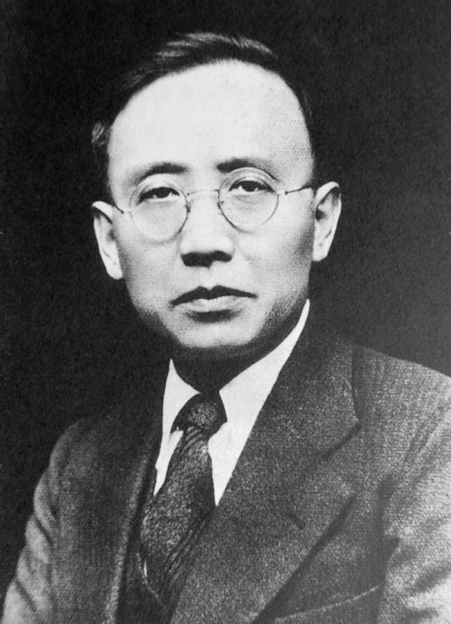
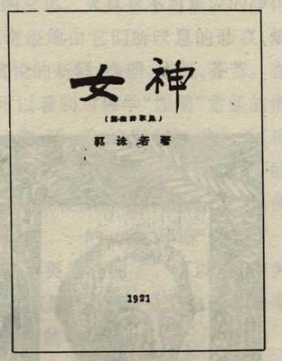

## nnnn姓名（资料）

适合所有人的历史读物。每天了解一个历史人物、积累一点历史知识。三观端正，绝不戏说，欢迎留言。  

### 成就特点

- ​
- ​

### 生平

晚三天参加南昌起义

【1892年11月16日】125年前的今天，晚三天参加南昌起义，一辈子做好学生的郭沫若出生

【写新诗的医学生】

1892年11月16日，郭沫若出生于四川乐山。少年曾就读于成都石室中学。1914年（22岁），郭沫若留学日本，在九州帝国大学学医。

1921年（29岁），休病假3个月，在京都帝国大学旁听文科，发表第一本新诗集《女神》，书中洋溢着强烈的浪漫主义气息，是中国新诗的奠基之作。他与郁达夫等人一同创立了“创造社”，是新文化运动的重要旗手。

1923年（31岁），他获得九州帝国大学医学学士学位。

【晚三天的南昌起义】

1926年3月（34岁），回国后就任广东大学文科学长。在恽代英的建议下，郭沫若去黄埔军校做宣传工作。北伐战争开始后，北伐军攻克武昌，郭沫若升任国民革命军总政治部副主任，中将军衔。

1927年，蒋介石发动四·一二政变，着手清党，郭沫若躲藏在朱德家里。1927年8月4日深夜，郭沫若抵达南昌，参加八一南昌起义，被推举为革命委员会委员和七人主席团成员。1927年9月初，南昌起义军到达瑞金，在一所小学里由周恩来作介绍人，郭沫若加入了中国共产党。

【流亡日本的10年】

1927年12月23日（35岁），蒋介石政府下令通缉郭沫若。1928年2月24日，在周恩来的劝说下，郭沫若化名吴诚，从上海乘船赴日避难。在流亡日本期间，郭沫若开始研究甲骨文、金文。发表了《古文字研究》、《殷周青铜器文字研究》、《金文丛考》、《卜辞通纂》，轰动了学界，与王国维、罗振玉、董作宾并称甲骨四堂。

1930年（38岁），撰写了《中国古代社会研究》，依据马克思主义关于人类社会学发展规律的论断，证明中国同样经历过原始社会、奴隶社会与封建社会。郭沫若由此开创了中国的唯物史观派，该学派长期占据了中国大陆学术界的主流地位，影响深远。

1937年7月（45岁），七七事变爆发后，蒋介石撤销了对郭沫若的通缉令。此时，郭沫若有一日本妻子佐藤富子（郭安娜），生育有5个子女。郭沫若不辞而别，化装乘船回国。

【鲁迅的继承者】

1937年7月27日下午，郭沫若登陆上海，随后创办《救亡日报》为淞沪抗战鼓动宣传。他前往南京拜谒蒋介石，发表了一篇《蒋委员长会见记》，对蒋介石进行歌颂。不久，也拜见了汪精卫。

淞沪会战失败后，陈诚邀请他就任军事委员会政治部三厅厅长。中共长江局于是决定把三厅作为抗日统一战线的机构，动员安排了大量文艺界抗日人士包括：胡愈之、阳翰笙、郁达夫、徐悲鸿、沈钧儒、田汉、冼星海、洪深、冯乃超等在三厅任职。

1938年夏天，中共中央决定：郭沫若应成为鲁迅的继承者、中国革命文化界的领袖。1939年1月，周恩来在重庆主持了郭沫若与女演员、书画家于立群的婚礼。婚后，于立群成为郭沫若的秘书，两人共育有6名子女。

【50岁生日的全国庆典】

1941年（49岁），为庆祝郭沫若五十诞辰和创作二十五周年纪念，周恩来安排把庆祝搞成全国性的政治活动。活动约请了孙科、邵力子、陈布雷、张治中、张道藩、冯玉祥、沈钧儒等各方面的代表人物。

1941年11月16日作为庆祝日，《新华日报》头版刊载了周恩来的专文《我要说的话》：“郭沫若创作生活二十五年，也就是新文化运动的二十五年，鲁迅自称是革命军马前卒，郭沫若就是革命队伍中人。鲁迅是新文化运动的导师。郭沫若便是新文化运动的主将。鲁迅如果是将没有路的路开辟出来的先锋，郭沫若便是带着大家一道前进的向导。”

该日下午，在重庆举行茶话会，参加者两千余人，由冯玉祥主持，老舍、张道藩、黄炎培、张申府、周恩来、沈钧儒等大会发言；并展览郭沫若25年来专著、译本，以及各个时期的工作和生活照片。当天，昆明、延安、桂林、香港、新加坡等地也举办了文化界的庆祝活动。

（日本友人贺寿送的巨笔）

【全明星打造的历史剧】

庆祝活动期间，重庆上演了郭沫若早年的话剧《棠棣之花》。话剧采取“全明星”制，配角都由第一流演员担任，郭沫若亲身参加排演与修改剧本。公映后在重庆引起轰动，《新华日报》出专刊评论。

这次大庆祝也激发了郭沫若的创作热情。1942年1月，仅用9天完成五幕话剧《屈原》的剧本，并由重庆话剧界全明星制排演。 1942年2月，创作五幕历史剧《虎符》。6月，创作五幕历史剧《高渐离》。9月，创作历史剧《孔雀胆》。1943年4月，创作历史剧《南冠草》。

郭沫若也继续从事历史研究，先后发表《殷周是奴隶社会考》、《墨子的思想》、《述吴起》、《秦汉之际的儒者》、《公孙尼子与其音乐理论》、《吕不韦与秦代政治》、《青铜时代》和《十批判书》等。

【送给毛主席的手表】

日本宣布投降后，1945年9月3日，与文化界人士拜会参加重庆谈判的毛泽东。郭沫若看到毛泽东用旧怀表，便把自己手上的表送给了毛泽东，此后毛泽东长期戴这块手表。

1946年5月8日（54岁），全家乘飞机去上海。1947年11月，举家搬到香港，担负中华全国文艺界协会香港分会的领导工作。期间，日本前妻郭安娜闻讯带儿女到香港，被安排到大连定居。1948年11月，郭沫若乘船离开香港，抵达辽东，到沈阳，1949年2月25日乘火车进京。

（1948年，郭沫若与夫人于立群及子女在香港合影）

【科学院院长和文联主席】

中华人民共和国建国后，郭沫若长期担任中国科学院院长、中国文联主席两职位。1958年，郭沫若重新加入中国共产党。1959年（67岁），郭沫若先后创作了历史剧《蔡文姬》与《武则天》。1962年，为了纪念郑成功逝世三百周年，郭沫若创作了电影剧本《郑成功》。

1966年初（74岁），“文化大革命”正式爆发前夕，郭沫若以中国文联主席身份发表讲话，自我批判：“拿今天的标准来讲，我以前所写的东西，严格地说，应该全部把它烧掉，没有一点价值。”，令全国知识分子惊讶恐慌。“文革”初期，郭沫若被批判，很快就得到了特别保护。

【做一辈子毛主席的好学生】

1967年6月5日（75岁），郭沫若在纪念毛泽东《在延安文艺座谈会上的讲话》25周年讨论会上，致闭幕词《做一辈子毛主席的好学生》，并且朗诵一首诗“献给在座的江青同志，也献给各位同志和同学”。

1976年5月12日（84岁），郭沫若写了《水调歌头·庆祝无产阶级文化大革命十周年》。5个月后，四人帮被捕，文革结束，他立即又赋一首《水调歌头·粉碎四人帮》抨击“四人帮”。

1978年6月12日（86岁），郭沫若在北京逝世。根据其遗嘱，骨灰洒在山西省昔阳县大寨人民公社的梯田中。1979年2月25日，妻子于立群自缢身亡。

（大寨郭沫若纪念碑）

