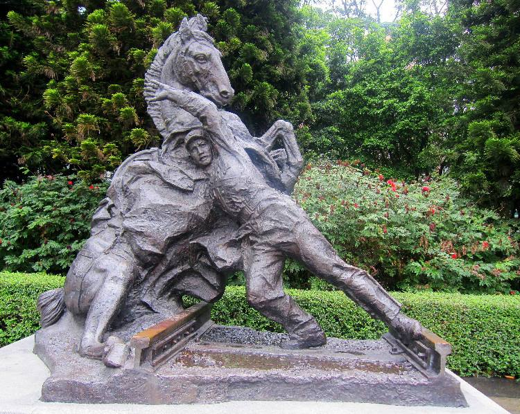
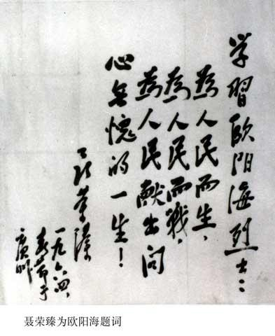
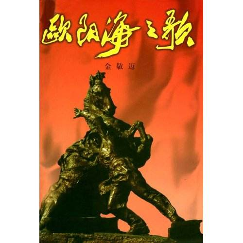
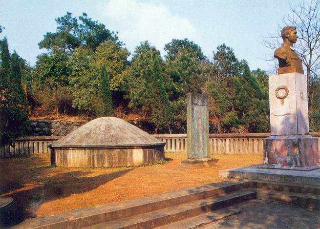
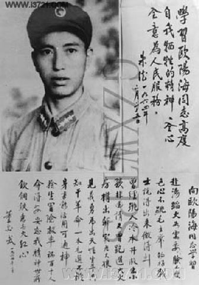

## nnnn姓名（资料）

适合所有人的历史读物。每天了解一个历史人物、积累一点历史知识。三观端正，绝不戏说，欢迎留言。  

### 成就特点

- ​
- ​

### 生平

欧阳海（1939年10月23日－1963年11月18日），中国湖南桂阳人，中华人民共和国革命烈士。

【1963年11月18日】54年前的今天，拦惊马救列车的英雄欧阳海壮烈牺牲

【当女孩子养大的男孩】

1939年10月23日，欧阳海出生于湖南桂阳县一个贫农家里。新生的儿子，没有给父母带来喜悦，不仅愁吃愁穿，还愁“两丁抽一”。有了欧阳海，欧阳海的哥哥就会被抓去当壮丁。父母给他取了个女孩的名字—欧阳玉蓉，从小男扮女装。但是不久，事情败露，欧阳海的哥哥还是被抓走了。

1959年（20岁），欧阳海于应征参军，在衡阳服役，同年加入中国共产主义青年团。第二年，加入中国共产党。欧阳海在军队中认真学习，多次因为勤奋劳动和刻苦训练而立功受奖。他曾两次抢救溺水儿童，一次参加灭火，并救出一位老人，三次荣立三等功，多次被树为标兵。1962年，任班长。

【拦惊马救列车的英雄】

1963年11月18日凌晨，欧阳海随部队出发野营训练，途中路过京广线时，一辆载着五百多名旅客鸣笛驶来，驮着炮架的一匹军马猛然受惊，窜上铁道，眼看一场车翻人亡的事故就要发生。欧阳海毫不犹豫地冲上，用尽全力把惊马推离了铁轨，自己则被列车撞成重伤，不幸牺牲，年仅24岁。

欧阳海是继雷锋之后，涌现出的又一名人民解放军英雄。1964年，广州军区追授欧阳海一等功和“爱民模范”荣誉称号。1月22日，国防部命名他生前所在的班为“欧阳海班”。3月19日，朱德、董必武、贺龙、徐向前、聂荣臻、叶剑英等人为其题词，号召全国人民向欧阳海学习。

【影响一代人的欧阳海之歌】

1966年，彭德怀被安排到西南三线建设委员会任职，他在成都新华书店也买了一本《欧阳海之歌》。令人吃惊的是，这本书彭德怀一共读了三遍。全书共444页，他用红笔划了线的就有148页，写了批注的有80页。

欧阳海的故事一度入选小学语文教材，影响了一大批中国人。2009年9月，欧阳海被评为"100位新中国成立以来感动中国人物"之一。

.jpg)

### 照片

