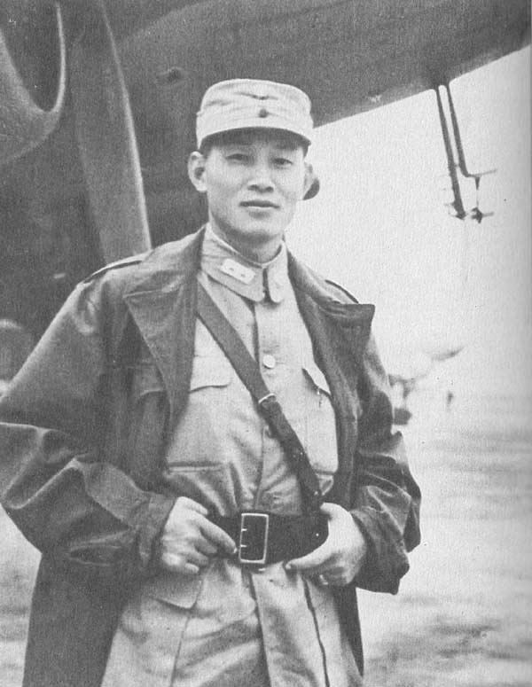
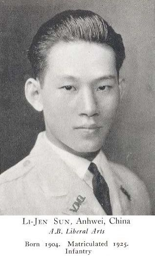
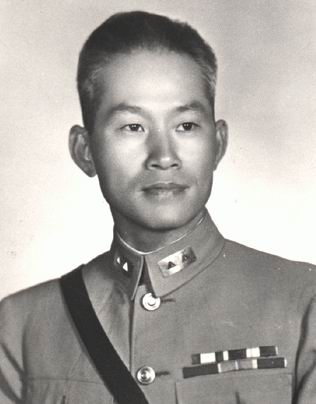
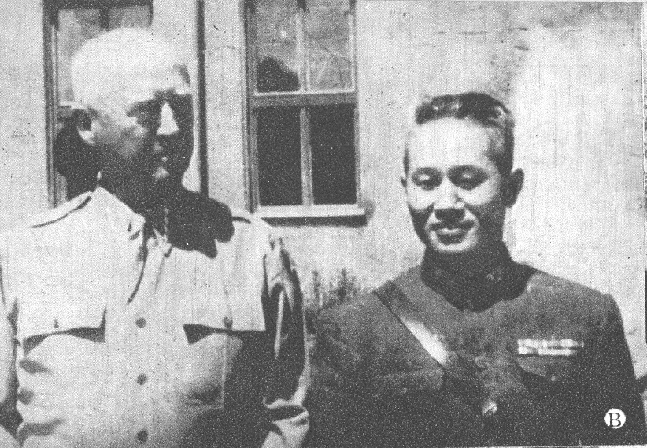
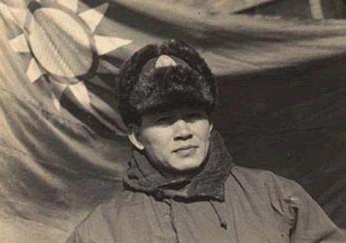
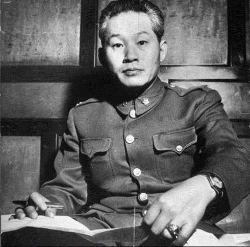
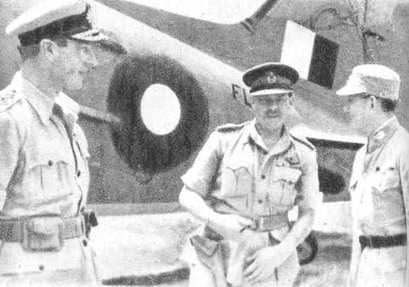
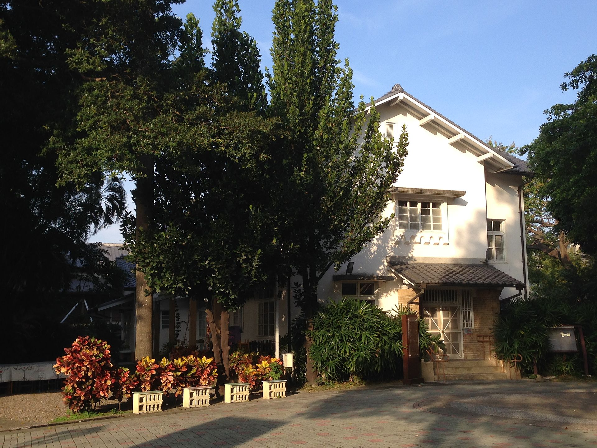
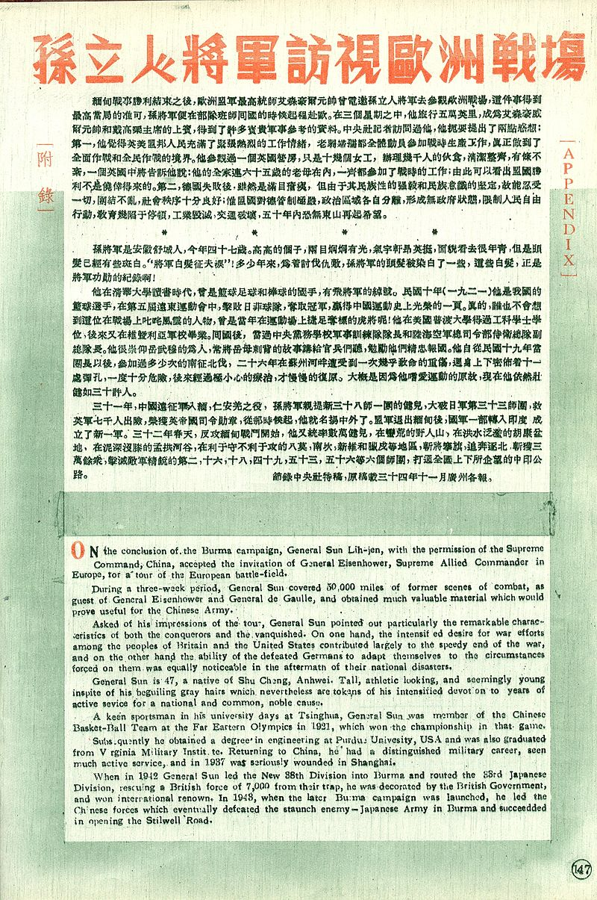

## nnnn姓名（资料）

适合所有人的历史读物。每天了解一个历史人物、积累一点历史知识。三观端正，绝不戏说，欢迎留言。  

### 成就特点

- 清华大学9年，国家篮球队
- ​

### 生平

27年前的今天，日军眼里的中国军神孙立人去世后身上覆盖三旗

【清华读9年的篮球冠军】

1900年12月8日，孙立人出生于安徽庐江县。1914年，孙立人以安徽省第一名的成绩考取清华学校（今清华大学）庚子赔款留美预科，开始接受8年的留美预备训练。孙立人进清华后，因玩跷跷板受伤休学一年，故在清华9年，于1923年毕业。

孙立人十分热衷篮球运动，1920年（20岁），任清华篮球队队长，率队击败当时称霸京津篮坛的北京高等师范学校，获得华北大学联赛冠军。1921年，入选中国国家男子篮球队，参加了在上海举行的第五届远东运动会，以32-29击败日本，再以30-27击败菲律宾，获得篮球冠军，这是中国在国际大赛中第一次获得的篮球冠军。

【一个团防一个师】

1923年（23岁），清华毕业后，赴美留学，直入普渡大学三年级修土木工程学，1925年取得学士学位。1926年，孙立人进入维吉尼亚军校，接受军事训练，因已有学士学位，直入三年级学习，1927年毕业后，游历欧洲。

1928年（28岁），孙立人回国，在国民党中央党务学校（今国立政治大学），任军训队长。1930年，在陆海空军总司令部侍卫总队任副队长。

1932年（32岁），调财政部税警总团第四团团长。税警总团由财政部部长宋子文一手创建，武器从德国购买，排以上军官大部分由留美学生担任。1933年，孙立人随税警总团调往江西剿共，他以一个团接下一个师的防地，获得不菲的战绩。

（孙立人与夫人张晶英）

【淞沪会战中的硬骨头】

1937年10月（37岁），孙立人率税警总团第四团参加淞沪会战，与日军血战两周，七次击退强渡苏州河的日军。这是淞沪会战中，日军伤亡最重的战场。孙立人为夺回友军失去的阵地，遭迫击炮弹攻击，身受十三处伤，昏厥了三天，被送往香港接受治疗。

次年伤愈后，孙立人返回武汉，加入财政部重组的缉私总队，担任总团长。参加了保卫武汉的战斗，之后率部到贵州都匀练兵两年。1941年12月，为支援抗战，缉私总队重组为新编第三十八师，孙立人晋任少将师长，隶属于第六十六军。

【中国远征军的第一个胜仗】

1942年2月（42岁），中华民国组成远征军，下辖第五军、第六军和第六十六军。4月，孙立人率新三十八师于进驻缅甸。4月14日，英国缅甸军被日军包围于仁安羌，粮尽弹缺，水源断绝，陷于绝境。

孙立人派113团星夜驰援，18日凌晨向日军发起猛烈攻击，到中午攻克日军阵地，歼敌一个大队，解除了七千英军的包围，并救出被日军俘虏的美国传教士、各国新闻记者及妇女五百余人。

仁安羌大捷是中国远征军入缅后第一个胜仗。蒋中正给他颁发四等云麾勋章，美国罗斯福总统授予他丰功勋章，英王乔治六世授予他大英帝国司令勋章。

【不走野人山的大撤退】

仁安羌战后，英国决定弃守缅甸，撤往印度，新三十八师奉命掩护。由于英军的溃退，导致了中国远征军陷入日军包围。中国远征军第一路军副司令官杜聿明，决定经野人山北上撤回云南。

孙立人则认为野人山难以穿越，决定率新三十八师向西撤往印度。新三十八师顺利撤到印度，而杜聿明所率的第五军因遭到日军追击，丧失了穿越野人山的最好时机，半数葬送在野人山中。这次分歧，也使得后来杜聿明处处为难孙立人。

（1842年，全副美式装备的新一军）

【对第一流敌人的持久进攻】
1942年8月，到达印度的中国远征军新三十八师和新二十二师，番号改为中国驻印军，又称新一军，开始装备美械和训练。1943年10月，中国驻印军开始向缅北反攻。战役发动后，孙立人指挥新三十八师进攻胡康河谷，新一军战车第一营立下辉煌战绩。至1944年3月，日军号称“丛林作战之王”的第18师团死伤过半，狼狈逃出胡康河谷。

此后，发动连续进攻，至8月，中国驻印军给日军王牌第18师团等部予毁灭性打击，歼灭日军2万多人，一雪两年前退兵缅甸的耻辱。史迪威称此战为“中国历史上对第一流敌人的第一次持久进攻战”。随后，部队进行休整扩编，新一军扩编成两个军，即新一军和新六军，孙立人任新一军军长。

（缅北战场上的孙立人与史迪威）

【日军眼里的中国军神】

1944年10月，反攻缅北的第二期战斗开始。中国驻印军向南进攻。1945年1月27日，新一军与滇西中国远征军联合打通了中印公路。随后，孙立人指挥新一军各师团继续猛进，消灭中缅印边界所有的日军部队。

孙立人因战功获颁青天白日勋章。孙立人在远征缅甸的战斗中，屡克强敌，战功卓著，有“东方隆美尔”之誉；而被打败的日军尊称他为“中国军神”。

1945年5月，孙立人率新一军返抵广西南宁，准备反攻广州。8月15日，侵华日军投降。9月7日，新一军进入广州，接受日军第二十三军投降。此后，新一军进行了休整和扩充，成为国军五大主力之一，号称“蓝鹰部队”、“天下第一军”。

（孙立人赴欧考察欧洲战场时，与乔治·巴顿将军合影，摄于1945年）

【只用3天攻克四平】

1945年8月，日本投降后，苏联红军迅速占领东北，把日本关东军的军火装备转交给中共。把投降的满洲国20万军队也交给中共整编，使得林彪的军队从最初的6万人迅速发展到30万，成为作战能力最强的部队。 

1946年3月下旬，新编第一军乘美舰在秦皇岛登陆，孙立人被派往美国参加联合国军事参谋团会议。4月，国共双方在吉林省四平开始主力决战。因战况不佳，蒋介石十分焦急，急电孙立人返国。

5月15日夜，孙立人赶到新一军军部，连夜制定攻击计划。 5月18日，分别突破四平东北防线，城南防线，林彪弃守四平。久攻不下的四平，孙立人等将领只用3天便攻克了，打破了杜聿明5个月来与林彪对峙的僵局。

（东北战场上的孙立人）

【让蒋介石后悔的停战】

随后，孙立人一路前进，强渡辽河，攻击公主岭，五日内攻陷长春，随后取回农安、德惠等战略要地，进展顺利。此时距哈尔滨仅六十公里，位在哈尔滨的中共党政军组织均已做好撤退准备。

但此时，正值马歇尔来华调停。1946年6月6日，蒋介石下停战令；国共停战。蒋介石后来在他撰写的《苏俄在中国》写到：“可说这第二次停战令之结果，就是政府在东北最后失败之唯一关键。

【从东北全身而退】

1947年，林彪为打破杜聿明的先南后北的作战方针，先后发动了三下江南、四保临江作战。1947年1月5日，孙立人的1个营被东北民主联军第3师包围，被全歼。但孙立人却一直坚守松花江南岸，没有给林彪以更大的战果。但杜聿明屡次发电给蒋介石，批评孙立人作战不力，骄横跋扈。

蒋介石鉴于孙立人和杜聿明不和，4月26日，改任孙立人为东北保安副司令官的虚职。7月，蒋介石将孙立人调离东北，在南京成立陆军训练司令部，负责全国国防新军训练。消息一传到哈尔滨后，毛泽东开庆祝会道：“我们唯一的敌人被杜聿明赶走了，东北将是我们的天下了。”

【被软禁33年的总司令】

1947年11月，孙立人将陆军训练司令部迁到台湾，在台湾建立新军。1949年9月1日，孙立人就职台湾防卫司令，参加金门战役。1950年，任陆军总司令。1951年5月，孙立人晋升陆军二级上将。

1955年5月25日，孙立人旧部属郭廷亮被捕，遭严刑拷问，引发“郭廷亮匪谍案”。孙立人被牵连，被解除职务，软禁在家，被特务监视。1988年，蒋经国去世后，才下令解除了孙立人长达33 年的软禁，恢复自由。

（孙立人与林旺一同合影，摄于1947年）

【身盖三旗的二战英雄】

1990年11月19日，孙立人病逝于台中寓所，享寿90岁。宋美龄致送花圈，总统李登辉颁发褒扬令。灵柩由清华大学校旗、维吉尼亚军校校旗、中华民国国旗覆盖，备极哀荣。遗体安葬台中市北屯区大坑东山墓园。

孙立人对二次大战的贡献，也获得国际肯定。在维吉尼亚军校校史馆中，孙立人同马歇尔、巴顿并列，永久展览孙立人生前所用的军服、军帽、马靴、马鞭、缴获的日军军旗、毕业证书和画像。

（台湾台中孙立人墓）

### 照片

