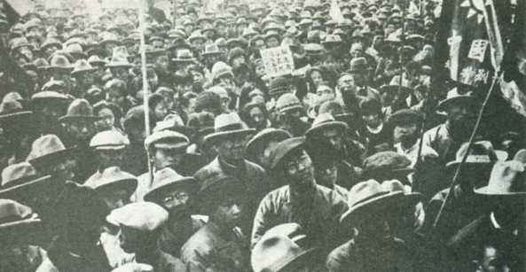
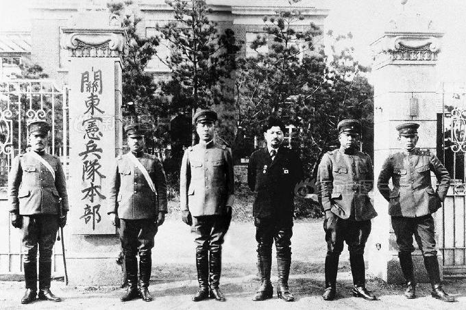
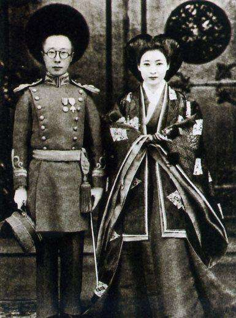

## nnnn姓名（资料）

适合所有人的历史读物。每天了解一个历史人物、积累一点历史知识。三观端正，绝不戏说，欢迎留言。  

### 成就特点

- ​
- ​

### 生平

【1945年11月20日】72年前的今天，九一八事变和侵占东北的策划者本庄繁切腹自杀

【中途退学参加日俄战争】

1876年5月，本庄繁生于日本兵库县。1897年（21岁），毕业于日本陆军士官学校第9期步兵科，是第9期的六大将之一。

1904年2月（28岁），从日本陆军大学第19期中途退学，到中国参加日俄战争，任步兵第20联队中队长，在战斗中负伤。1906年3月，回到陆军大学学习。1907年11月30日，毕业。

（日俄战争中的日本士兵）

【张作霖的军事顾问】

1908年4月（32岁），进入日军参谋本部任职。12月，到中国，驻北京、上海从事情报活动。1909年5月，晋升少佐。1913年1月（37岁），回国任参谋本部支那课科员。1915年6月，晋级中佐后，到欧洲出差。

1918年（42岁），晋升大佐，任参谋本部支那班长，“满蒙”班长，专门研究对中国的战略。1919年4月，任步兵第11联队长，出兵西伯利亚，参与协约国对苏联十月革命的干预。

1921年起（45岁），成为东北王张作霖的军事顾问。1922年，晋升为少将。随后任驻华公使馆武官，先后驻北京、上海。

（任张作霖军事顾问时的本庄繁）

【刘和珍君的遇难】

1926年3月（50岁），冯玉祥的国民联军，与张作霖的军队在平津一带不断作战。在张作霖的请求下，本庄繁急电日本参谋本部，派日本军舰联合奉系军舰驶抵天津大沽口，炮击国民军阵地。

被击溃后，以国民军击伤日本军舰为借口，纠合美、英等八国列强，向北洋政府提出撤除大沽口防备的要求。进而引发了，刘和珍君遇难的三·一八惨案。

本庄繁一手制造了" 大沽口事件"，得到军部赏识 。1927年3月，晋级为陆军中将。1928年2月，被任命为第十师团长。

（聚集在天安门前反对大沽口事件的群众）

【死罪的九一八事变】

他前后在中国20余年，是“中国通”，主张武力征服“满蒙”，提出《满蒙共和国统治大纲》、《满蒙自由国家方案》等。1931年8月1日（55岁），出任关东军司令官，15日抵达旅顺。9月初，关东军进行了针对偷袭沈阳城的一系列军事演习。

9月18日，九一八事变爆发。这个事变的计划，其实是关东军参谋坂垣征四郎和石原莞尔，本庄繁并不知情。直到事变发生，关东军开始进攻北大营，他才得知。按照日本陆军刑法，未经许可向外国开战是死罪。本庄繁犹豫后，最终同意了石原的作战计划。

（1931年，在奉天关东宪兵队本部，右三为关东军司令官本庄繁）

【四个月沦陷的东北】

9月19日凌晨2时，本庄繁立即发出了关于“部队迅速向沈阳集中，进攻沈阳、占领营口、安东”等8项命令。19日中午，关东军司令部从旅顺移驻沈阳，指挥日军向东北全境发动全面进攻。

19日午后5时40分，本庄繁给日本军中央打电报，请求增援。9月21日，本庄繁又不等请示日本军部，命令第二师团向吉林省城吉林市进攻。当时东北军无心抵抗，不到4个月，东北沦陷。

（国联调查团调查九一八事变，图为本庄繁与国联调查团成员合影）

【满洲国的建国之父】

1931年12月15日，在关东军司令部内，成立关东军统治部，下设行政、产业、财务、交通、交涉五个课。本庄繁也从一个单纯关东军司令官，成为具有殖民统治者的双重身份。日本朝野上下称本庄繁为满洲“建国之父”。

1932年3月9日（56岁），在日本军队的撺掇下，末代皇帝溥仪，从天津秘密潜逃至东北，在长春成立了傀儡政权—伪满洲国。

（1932年5月，日本关东军司令官本庄繁（左）在绥化）

【给皇弟当媒人的大将】

1932年7月（56岁），调回日本任军事参议官。1933年4月，晋升大将，任天皇身边的侍从武官。1935年，受封男爵。

1936年11月（60岁），本庄繁充当“媒人”角色，为溥仪的弟弟溥杰在日本公卿华族出身的女子中择偶，为满洲国皇帝谋求继任者，他不顾溥仪的反对，促成了这桩政治婚姻。正如溥仪所言：“关东军要的是一个日本血统的皇帝。” 

1942年（66岁），满洲国“建国”十周年时，本庄繁以“满洲会”会长身份，到长春参加庆祝活动。

（在本庄繁的撮合下，溥杰与日本人嵯峨浩结婚）

【切腹自杀的甲级战犯】

1945年8月（69岁），日本无条件投降后，本庄繁第二批被定为甲级战犯。1945年11月20日，在发出逮捕令的第二天，他跑到陆军大学校的一间空屋里切腹自杀。

他留下遗书，大意说：满洲事变关东军是自卫，没有天皇和政府的命令，全部责任由自己一人承担；最后谨祝国家复兴，天皇万岁等等。

【】

### 照片

