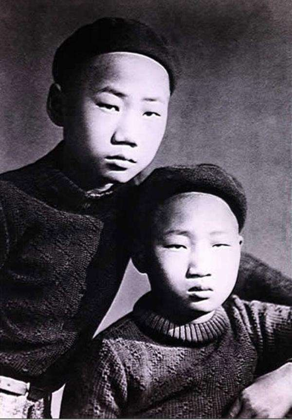
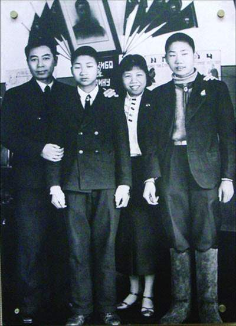
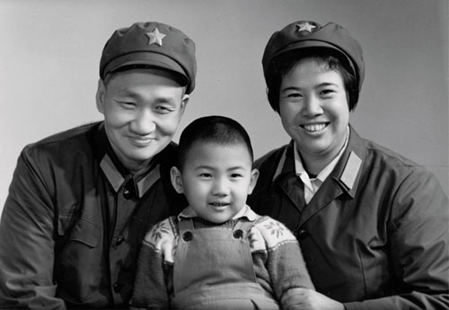
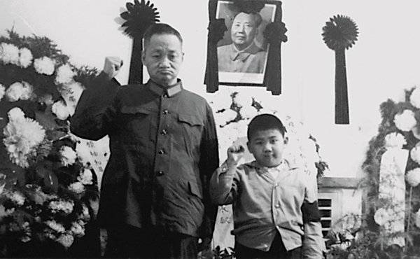
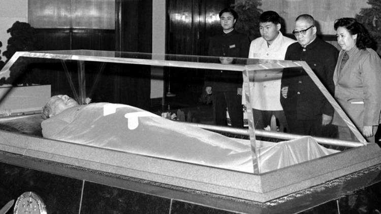
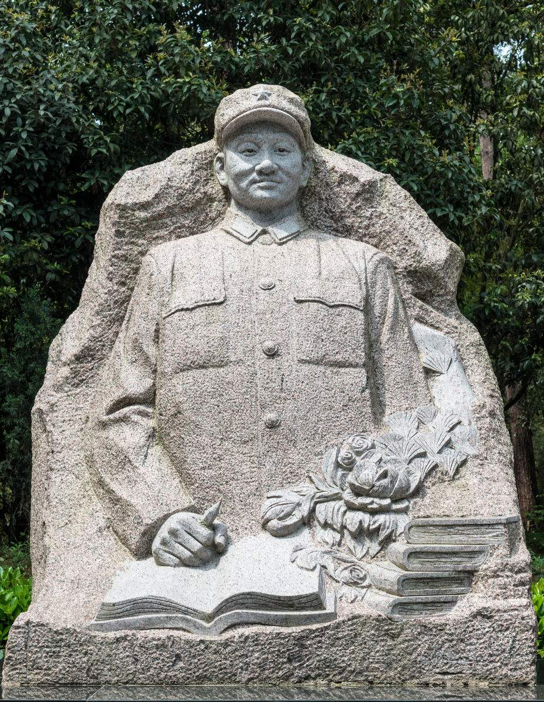

## nnnn姓名（资料）

适合所有人的历史读物。每天了解一个历史人物、积累一点历史知识。三观端正，绝不戏说，欢迎留言。  

### 成就特点

- ​
- ​

### 生平

【1923年11月23日】94年前的今天，毛泽东唯一活下来的儿子，与世无争的毛岸青出生

【母亲杨开慧牺牲】

1923年11月23日，毛岸青出生于湖南长沙具有美国教会背景的湘雅医院，父亲是毛泽东、母亲杨开慧。毛岸青幼年头部受伤，患有精神上的疾病。

1927年，湖南开始清党，杨开慧带着3个儿子（毛岸英、毛岸青与毛岸龙）到乡下躲避。1930年11月14日（7岁），杨开慧被捕牺牲，毛岸英兄弟被保释出狱，由外祖母抚养。

【寄居上海的日子】

1931年（8岁），兄弟三人被护送到上海毛泽民处，不久毛岸龙夭折。毛岸英、毛岸青进入中共秘密领导的中国革命互济会主办的大同幼稚园，幼稚园负责人是董健吾牧师。1932年3月，大同幼稚园保育员外出办事时失踪，幼稚园解散。

毛岸英、毛岸青暂时寄养于董健吾家里。1932年9月（9岁），兄弟俩被送到董健吾前妻黄慧光家中生活。当时上海的白色恐怖非常严重，黄慧光怕毛岸英兄弟引起怀疑，很少让他俩出去，并多次搬家。

（1930年上海大同幼稚园合影，中排左一为毛岸英，右一为毛岸青，右二为毛岸龙）

【街头流浪的孤儿】

1933年初，党中央机关转移去江西瑞金苏区，上海地下党组织又遭严重破坏；此时董健吾又被教会辞去牧师职务，无固定经济来源，已无力照管黄慧光的生活。黄慧光自己有4个孩子，一家生计只靠长子维持，生活极其困苦。

1935年（12岁），毛岸英、毛岸青离家出走，街头流浪。当时的上海特科几乎动用了全部的力量进行查找。从1935年秋开始，到1936年夏天，终于在一个破庙里，找到了兄弟两人。

（刚到苏联的毛岸英、毛岸青）

【张学良的帮忙】

1936年1月（13岁），宋庆龄安排董健吾（以家庭牧师“王牧师”的身份），前往西安，联系陕北的中共中央。到达西安后，董健吾拜会了张学良，后在张学良的安排下，前往陕北。3月，回到上海。

董健吾获悉上海地下党已经找到了在街头流浪的毛岸英兄弟，便请求张学良帮忙。张学良安排奉军将领李杜以考察为名，去苏联召集东北抗日义勇军旧部，带毛岸英、毛岸青、董寿琪（董健吾的儿子），乘法国“康脱罗梭号”邮轮带前往法国马赛。

,毛岸青(中)与蔡和森女儿蔡妮(右)在莫斯科合影.jpeg)

（毛岸英(左),毛岸青(中)与蔡和森女儿蔡妮(右)在莫斯科合影）

【用俄语给毛泽东写信】

在巴黎等待了几个月后，苏联驻法国大使馆只同意毛岸英、毛岸青入境，不准其他人入境。毛岸英、毛岸青被送到苏联大使馆，在那里见到了专程到巴黎迎接中共驻共产国际代表团副团长康生。然后，前往苏联莫斯科，进入国际第二儿童院（莫尼诺儿童院），分别起名毛岸英、毛岸青。

由于毛岸英、毛岸青在上海的五年多，一直没有入校读书，不会中文读写。后来给毛泽东写信，只能用俄语，毛泽东找人翻译后才能读懂。1947年（24岁），毛岸青返回中国，加入中国共产党。

（周恩来和邓颖超到苏联看望毛岸英、毛岸青）

（毛岸青在北京）

【毛泽东的唯一孙子】

回国后，在黑龙江省齐齐哈尔市克山县进行土改工作。1949年7月抵北京，中华人民共和国成立后，加入人民解放军，挂阶中校，在军事科学院从事编译工作，后在中宣部马列著作编译室任俄文翻译。毛岸青没有卷入新中国的政治中。

1950年11月25日，毛岸英在朝鲜战争中牺牲。1960年1月（37岁），毛岸青在大连疗养期间，在毛岸英的丈母娘张文秋的撮合下，将正在北京大学上学的次女邵华介绍给毛岸青。两人一见如故，聊得很是投机，4月两人在大连结婚。1970年1月17日（47岁），诞下毛泽东的唯一孙子：毛新宇。

（1974年毛岸青、邵华、毛新宇全家合影）

（1976年9月9日，毛岸青、毛新宇在毛主席灵堂前守灵）

【低调的人生】

毛岸青晚年居于北戴河总参疗养院，十分低调，基本没有关于他的新闻。只在1998年9月9日悼念毛泽东逝世22周年纪念活动时，坐轮椅出席。

2007年3月23日凌晨（84岁），毛岸青在北京301医院逝世。随后葬于八宝山革命公墓。2008年12月21日，骨灰迁葬于湖南杨开慧烈士陵园内，紧邻母亲杨开慧。2008年，位于克山县的毛岸青纪念馆开馆。

（1983年，毛岸青一家瞻仰毛泽东遗容）

（90年代初，毛岸青一家举杯共祝合家欢）

【】

### 照片

,毛岸青在莫斯科.jpeg)

