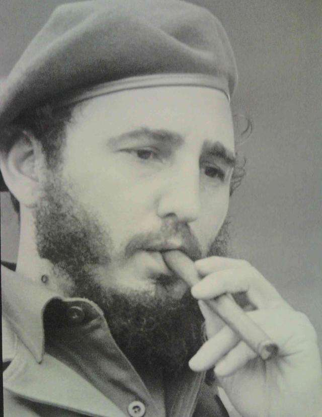
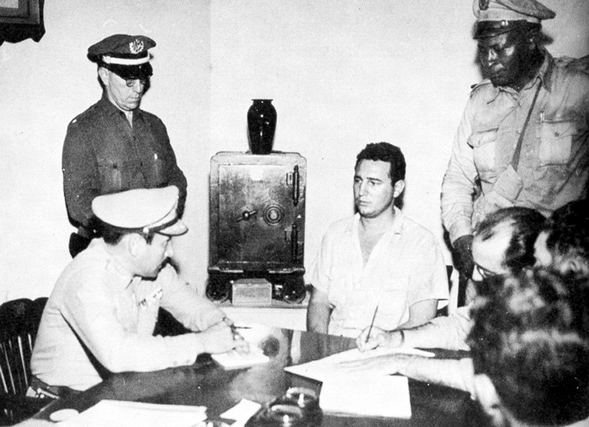
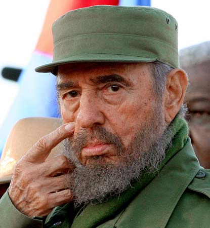
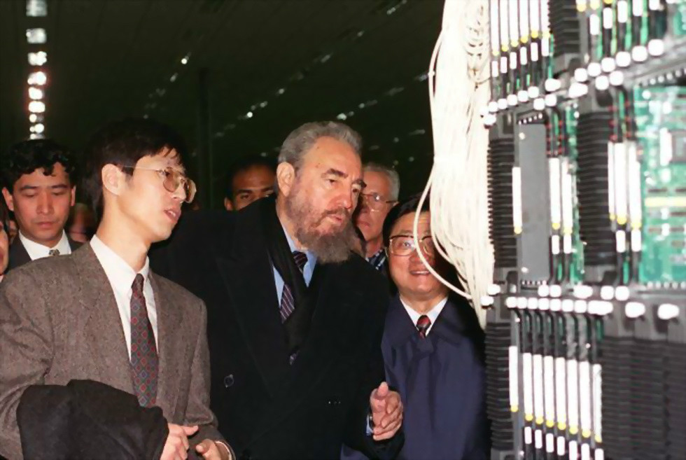

## nnnn姓名（资料）

适合所有人的历史读物。每天了解一个历史人物、积累一点历史知识。三观端正，绝不戏说，欢迎留言。  

### 成就特点

- ​
- ​

### 生平

【2016年11月25日】1年前的今天，12人绝地反击，被暗杀638次的古巴总统卡斯特罗逝世

【参加政治的大学生】

1926年8月13日，卡斯特罗出生于古巴的一个甘蔗农场里。父亲是西班牙移民，因种植甘蔗颇为富有，母亲是家佣。1945年（19岁），读完耶稣会的学校后，进入哈瓦那大学法律学院学习。

那时的古巴政局动荡不安，校园里也弥漫着浓厚的政治气氛，成立了许多政治帮派。1947年（21岁），卡斯特罗加入了古巴人民党（即正统党），积极参与政治活动。

【在哥伦比亚的学生暴动】

1948年（22岁），卡斯特罗前往哥伦比亚首都波哥大，参加反帝反殖学生大会，恰逢第九届泛美联盟会议也在波哥大召开。于是学生们利用这个契机，散发反对美国的传单，结果触发了一场大规模的暴动。

许多学生在这场暴乱中被捕，卡斯特罗在暴动中充当了重要的角色，列入被捕名单中。他只好逃到古巴大使馆避难，得以送回了古巴。经过这次暴乱，卡斯特罗体验到群众暴动的力量，对他影响很大。

【想要革命的律师】

1950年（24岁），从哈瓦那大学毕业，获得法学博士学位，然后开始了律师生涯。卡斯特罗因他的激进民族主义观点和对美国干涉古巴内政的强烈不满，而在国内外闻名。

1952年（26岁），当选为古巴国会议员的候选人，准备参加选举进入国会。这时，巴蒂斯塔在美国的支持下，通过军事政变，建立了独裁统治。卡斯特罗失望地脱离了古巴人民党，搜集证据要控告政府违反宪法。然而毫无效果，于是转而寻求革命手段。

【历史将宣判我无罪】

1953年7月26日（27岁），以卡斯特罗为首的约160名革命者，发动起义，结果失败被捕。在受审期间，他发表了著名的辩词《历史将宣判我无罪》。

1955年获释后（29岁），卡斯特罗离开古巴到墨西哥成立七二六运动，成员包括弟弟劳尔·卡斯特罗、著名的游击队员阿根廷医生切·格瓦拉。

【12个人的绝地逆袭】

1956年11月25日（30岁），卡斯特罗率领82名革命者乘坐游艇格拉玛号从墨西哥向古巴进发，史称“格拉玛号远征”。登陆时，遭到政府军伏击，经过三天血战，仅剩12人进入山区。幸存者在山区建立了根据地，并同城市的革命者建立了联系。

根据地巩固后，起义军对政府军发动数次攻击，还联络美联社记者进行实地报道，博得国际的广泛同情。1958年（32岁），起义军发展到400多人，逐渐掌握了军事上的主动。1959年1月，巴蒂斯塔逃走，起义军攻入哈瓦那，建立了美洲首个社会主义政权。卡斯特罗出任古巴总理和古巴革命武装力量总司令。

（1959年1月8日，卡斯特罗率领着革命队伍推翻了巴蒂斯塔军事独裁政权）

【美国中情局的638次暗杀】

他希望能与美国保持密切关系，1960年访问美国，与时任总统艾森豪和副总统尼克松会面。他在联合国大会上发表演讲，历时4小时29分，是联合国大会历史上演讲时间最长的人物。

然而，1961年美国中情局协助逃亡美国的古巴人，试图从古巴的猪湾登陆，被卡斯特罗指挥击败。从此，古巴断绝了与美国的双边关系，转而投向苏联。1962年，发生震惊世界的古巴导弹危机，古美关系更加恶劣。

此后，美国中情局对卡斯特罗进行了一系列暗杀事件，共计638起。卡斯特罗因而成为：“世界上被暗杀次数最多的人物”，该项记录在2011年载入吉尼斯世界纪录。

（卡斯特罗（右）在猪湾附近的坦克里指挥战斗）

【反对个人崇拜的领导人】

卡斯特罗跟其它社会主义国家的领导人很不一样，他非常反对个人崇拜。古巴境内看不到他的铜像、雕像，他的头像也不出现在邮票、钱币、衣物或纪念品上面。卡斯特罗的月薪只有40美元左右（不包括他作为国家元首享受的医疗等服务，以及外访经费）。

1985年，基于健康和安全考虑，卡斯特罗告别了长年陪伴的雪茄，成功戒烟，结束多年来抽雪茄吞云吐雾的豪迈形象。1995年，卡斯特罗第一次踏上了中国的土地，对我国进行了长达8天的国事访问。

2016年11月25日，菲德尔·卡斯特罗逝世，享年90岁。

（1995年，图为卡斯特罗（中）参观上海贝尔公司）

【】

### 照片

