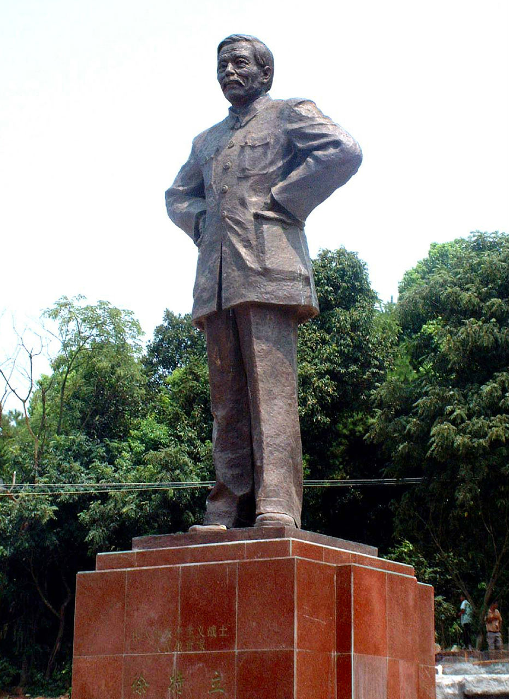
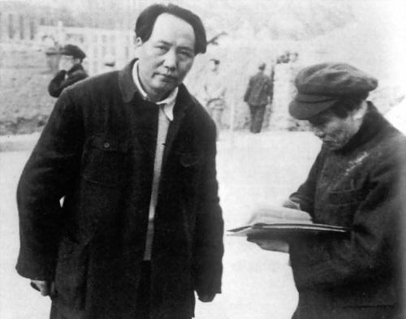

## nnnn姓名（资料）

适合所有人的历史读物。每天了解一个历史人物、积累一点历史知识。三观端正，绝不戏说，欢迎留言。  

### 成就特点

- 毛泽东和田汉等著名人士的老师
- ​

### 生平

【1968年11月28日】49年前的今天，破产读书，断指写血书的延安五老之一徐特立逝世

【破产的读书计划】

1877年2月1日，徐特立出生于今湖南长沙县。4岁时，母亲逝世。8岁时，入私塾读书。18岁，在家乡开馆教书。

1897年（20岁），徐特立去拜访长沙城的举人陈云峰，陈云峰告诫他“读书贵有师，尤贵有书”，并且推荐他去阅读张之洞的《书目问答》和《輏轩语》。徐特立阅读完这两本书后，觉得自己以前读书的方法是错误的，决心从头读书。徐特立卖掉家中30亩水田，买了大量书籍，制定了十年的读书计划，被称为“破产读书”。

1905年（28岁），清政府取消了八股文考试制度，取而代之的是考经义、历史、地理等，地点是岳州，徐特立参加了这场3000多人的考试，名列第19名。徐特立考入长沙宁乡速成中学，毕业后在长沙周南女校任教。他热心于新办私学，如梨江学校、长沙平民夜校等。

【断指血书的老师】

1909年（32岁），江苏省咨议局议长张謇发表《请速开国会建设责任内阁以图补救书》，呼吁各省联合起来，向清政府请愿，尽早召开国会。

1909年12月8日，徐特立在湖南修业学校作报告时，痛诉种种外交失败，慷慨激昂，当场断一指，写下血书：“请开国会，断指送行”八个字，为湖南代表送行。上海《申报》等刊登此事，徐特立顿时蜚声全国，被视为最有血性的激进人物。血书原文，藏于国家博物馆。

【42岁的欧洲留学生】

1911年（34岁），辛亥革命爆发，被选为湖南临时议会副议长。第二年，任省教育司的科长，创办长沙县立师范（今长沙师范学校的前身）。1913年春，毛泽东考入五年制的湖南省立第四师范学校预科，两人成为师生。

1919年（42岁），已过不惑之年的徐特立远赴法国勤工俭学，在巴黎大学学习自然科学，并考察了比利时和德国的教育。

1924年夏（47岁），徐特立回到长沙，创办长沙女子师范（1926年并入长沙县立师范），担任校长，同时兼任湖南省立第一女子师范校长。

【恐怖时刻坚定的“老”党员】

1927年（50岁），大革命失败，白色恐怖泛滥成灾，在不少共产党员叛变脱党时，徐特立却以50岁的高龄，毅然加入了中国共产党。随后，徐特立参加南昌起义，担任革命委员会委员、第二十军第三师党代表兼政治部主任。

1928年（51岁），起义失败后，徐特立被派往苏联莫斯科中山大学学习。他学通俄语后，系统研究了马列主义，并同吴玉章、瞿秋白共同研究了汉语拉丁化拼音。

1930年末，徐特立回国，在江西的中华苏维埃政府任教育部副部长，苏维埃大学副校长。 1934年（57岁），徐特立参加长征。

【老当益壮的延安五老之一】

到达陕北后，中共中央曾为他庆祝60岁大寿，毛泽东写信致贺，称徐特立“今后还将是我的先生”。1937年，徐特立任中共中央驻湘代表、八路军高级参议，在湖南开展统战工作。

1940年，徐特立在延安任自然科学研究院院长。时人把他和吴玉章、林伯渠、谢觉哉、董必武誉为“延安五老”。据曾在陕北和他一起生活过的人说，他六十岁之后，仍常常跳到大河里游水数小时之久。

【朱德题词当今一圣人】

1947年，中央为他庆贺70岁诞辰，毛主席的题词是“坚强的老战士”，朱总司令的题词则是“当今一圣人”。1949年，中华人民共和国成立后，徐特立任中共中央宣传部副部长，但不久因身体原因请辞。

1968年11月28日，徐特立在北京逝世，享年91岁。

