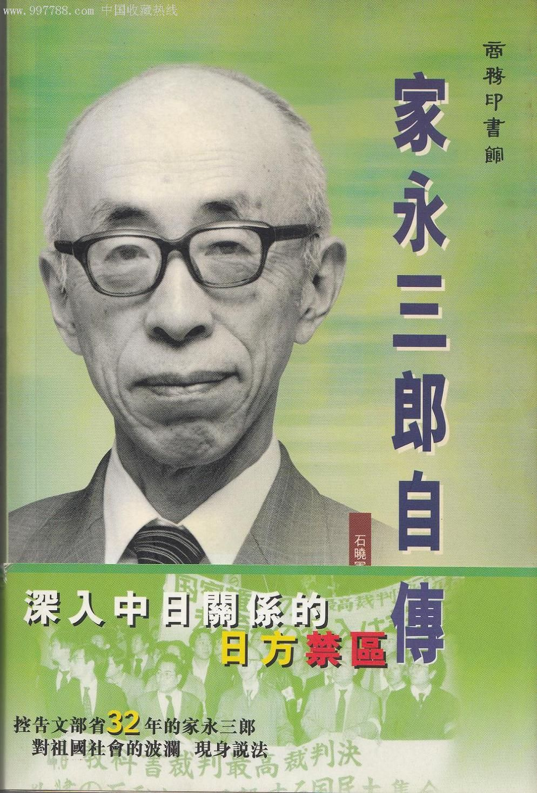
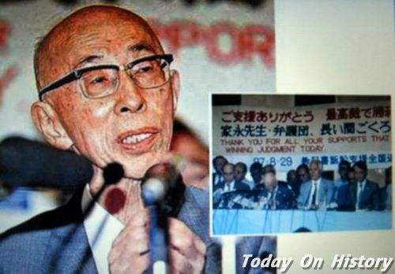

## 15年前，反对军国主义、坚持日军实施南京大屠杀的日本历史学家家永三郎逝世

适合所有人的历史读物。每天了解一个历史人物、积累一点历史知识。三观端正，绝不戏说，欢迎留言。  

【2002年11月29日】15年前的今天，坚持南京大屠杀，与日本政府打32年官司的家永三郎逝世

### 

家永三郎（1913年9月3日－2002年11月29日），日本历史学家、教育家，曾为日本皇太子讲授日本史。

家永所编的高中教材《新日本史》，多次被日本文部省审定为“不合格”，要求他修改。他不满审核意见，坚持要将日军南京大屠杀、731部队等事实写入书中。

1965年起，家永开始控告日本政府和文部省，诉讼长达32年，最终取得“部分胜诉”。该诉讼案件被称为“家永教科书诉讼”，为日本宪法史上重要案例，也是吉尼斯世界纪录确认的史上耗时最久的民事诉讼。

【成为历史学家】

1913年9月3日，家永三郎出生于日本名古屋的军人家庭。父亲虽然为军校高材生毕业，但在官场并不如意，升至少将后便早早退休了。三郎自幼体弱多病，家人也经常进出医院，家庭的开销很大，生活并不富裕。

家永三郎自小不擅长运动，却酷爱阅读，曾立志要成为作家。后来进入了东京帝国大学国史科攻读日本史学，对日本历史产生了浓厚的兴趣，做不成作家了，却成了历史学家。

【32年与政府打官司】

1945年（32岁），受文部省嘱托，编撰历史教科书《国家历程》。1952年（39岁），独自编写高中历史教科书《新日本史》。家永所编的高中教材《新日本史》，多次被日本文部省审定为“不合格”，要求他修改多处，特别是关于二战期间日军暴行的描述。

1965年（42岁），家永开始控告日本政府和文部省，诉讼长达32年，家永多次取得“部分胜诉”。该诉讼案件被称为“家永教科书诉讼”，为日本宪法史上重要案例，也是吉尼斯世界纪录确认的史上耗时最久的民事诉讼。

【部分胜利也是胜利】

1997年8月（84岁），日本最高法院对此案作出了终审判决。认定文部省做出的“南京大屠杀”、“七三一部队”等4处的审定意见为违法。责令国家赔偿40万日元。经过3次提诉，10次判决，前后历时长达32年的“家永教科书诉讼”最终以家永三郎取得部分胜利而划上了句号。

本案中最大的争议焦点为“教科书检定是否违反宪法规定”。对此，最高法院判决认为“（教科书检定）没有妨碍普通图书的出版发行，也并非出于禁止发表的目的或者在发表前的审查，因此并不构成检阅”，判定教科书检定制度符合宪法精神。另一方面，最高法院支持了家永的部分主张，判定政府存在滥用裁量权的行为。

【承认南京大屠杀的教科书】

以民告官，在日本鲜有胜诉的例子。家永三郎提出的教科书诉讼，在日本国内引起了巨大的震动，日本舆论也认为，这一诉讼给当局敲响了警钟。

日本的历史教科书到1997年出现了这样的一个状态：当时日本有23种高中历史教科书，7种初中历史教科书，几乎都写了日本军队制造南京大屠杀以及对妇女暴行的问题，有的书写了731细菌部队的问题。日本的教科书和战前比，还是有很大的变化的。

【伟大之处在于坚持正义】

对这一判决，家永三郎是不满意的。当有人问他是否还会提出第四次诉讼时，已经80多岁的家永三郎不无遗憾地表示：“以我的年龄来论是不做此想了，在我有生之年还会继续战斗下去，但是已经没有力气再写教科书了。”

32年的漫长诉讼，拖垮了他的身体，却没有拖垮他的精神，一位作家说：“家永三郎以一人之身向国家的宣战，伟大之处不在他的勇气而在他坚持的正义。”

2002年11月29日晚，家永三郎在东京的家中吃晚饭时心脏病突发，送院后不久逝世，享年89岁。次日，家永三郎的葬礼在只有家人的情况下低调地举行。

### 

