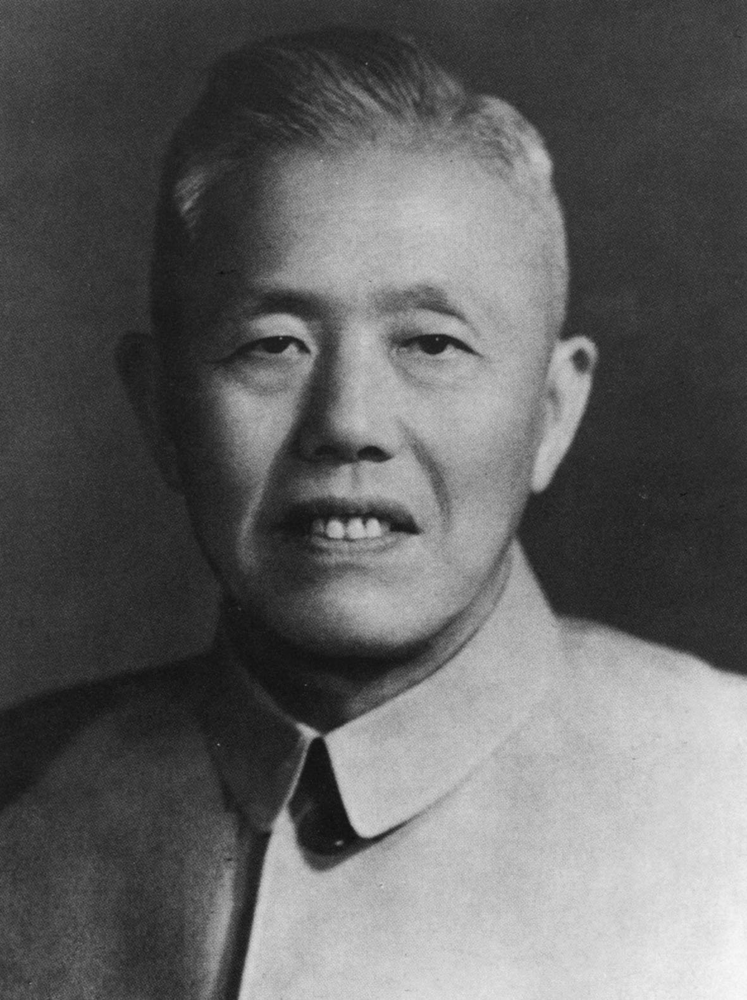
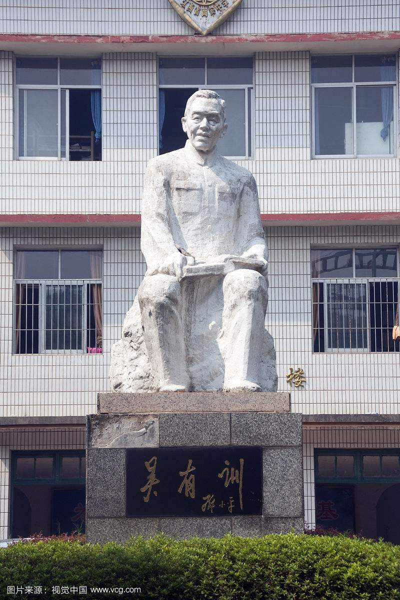
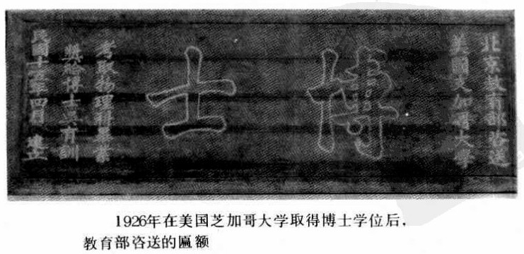
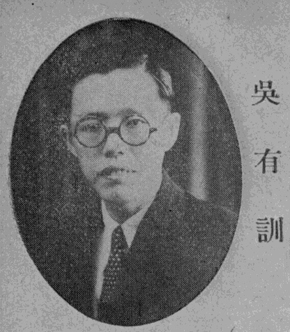
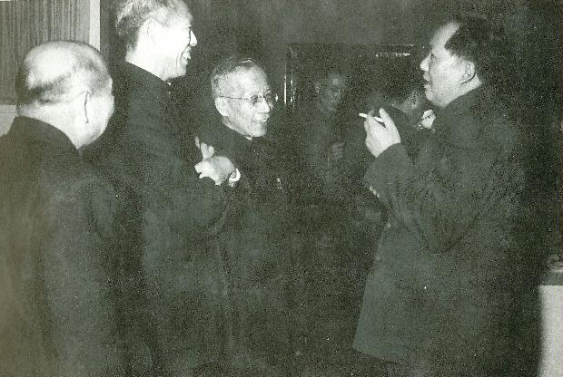
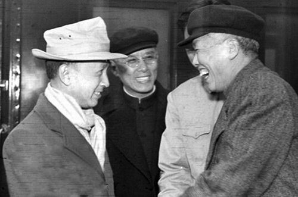

## nnnn姓名（资料）

### 成就特点

- ​
- ​

### 生平

【1977年11月30日】40年前的今天，中国物理学研究的开山祖师吴有训逝世

【获诺贝尔奖的导师】

1897年4月2日，吴有训生于江西省高安市石溪吴村。曾就读于高安瑞州中学、南昌第二中学。1916年（18岁），考入南京高等师范学校理化部，师从胡刚复等人。1920年毕业，先后在南昌第二中学、上海公学任教。

1922年1月（25岁），吴有训以优异成绩考取江西省官费留学，赴美国芝加哥大学物理系学习，师从阿瑟·康普顿。期间实验验证“康普顿效应”，1925年，以“康普顿效应”为博士论文，获物理学哲学博士学位。康普顿在1927年获诺贝尔物理学奖。

【中国物理学研究的开山祖师】

1926年（29岁）回国，参与江西大学的筹备工作。1927年8月，任第四中山大学（后更名国立中央大学）物理系副教授，兼系主任。1928年，任清华大学物理系教授，后兼系主任、理学院院长。

1929年，吴有训在清华大学建立起中国第一个近代物理研究实验室，进行国内X射线问题的研究。开创了中国物理学研究的先河，被称为中国物理学研究的“开山祖师”。

1930年，吴有训在美国著名的《自然》杂志发表了他回国后的第一篇理论文章：《论单原子气体全散射X射线的强度》。1932年，吴有训在美国《物理学评论》上发表了《双原子气体X射线散射》。

【第一个外国院士】

1936年（39岁），被德国哈莱(Halle)自然科学研究院推举为该院院士，成为第一位被西方国家授予院士称号的中国人。

1938年，抗战开始后，清华大学和北京大学、南开大学组成西南联合大学，吴有训任理学院院长。1945年，出任国立中央大学校长。1949年，担任上海交通大学校务委员会主任（相当于校长）。

（西南联大期间，吴有训（右一）与梁思成、林徽因等人合影）

【科技界15名代表之一】

1949年9月（52岁），吴有训作为科技界15名代表之一，参加中国人民政治协商会议第一届全体会议，期间受到毛泽东接见。1950年，赴北京任中国科学院近代物理研究所所长，副所长是他的学生钱三强。

同年12月，任中国科学院副院长。1951年，吴有训率团赴东北。10月，提出了设立中国科学院东北分院的初步方案。1955年（58岁），被选聘为中国科学院学部委员（院士）。

1977年11月30日，在北京逝世，享年80岁。

【值得纪念的物理学界前辈】

吴有训中国物理学会的创始人之一。曾任中国物理学会会长、中国科学技术协会副主席、《中国科学》和《科学通报》主编等。

2000年，中国物理学会为纪念胡刚复等五位物理学界前辈，设立了胡刚复、饶毓泰、叶企孙、吴有训、王淦昌物理学奖，其中吴有训物理奖授予原子核物理方面有突出成就的物理学家。

（1955年10月，吴有训等人迎接刚回国的钱学森）

【做出重大贡献的华人科学家】

吴有训全面验证了康普顿效应，并发展了该理论。康普顿效应，也被称为“康普顿-吴有训效应”，是量子力学的重要奠基发现。康普顿效应被验证后，康普顿以该理论成就获得1927年诺贝尔物理学奖。吴有训对X射线散射效应及量子力学的贡献，因此被公认为首位对世界现代科学做出重大贡献的华人科学家。

吴有训在清华大学建立起中国第一个近代物理研究实验室，开创了中国物理学研究的先河。吴有训长期从事教育工作，先后培养了王淦昌、钱三强、钱伟长、邓稼先、杨振宁、李政道、冯端等一大批著名的科学家。

（右起叶企孙、冯友兰、吴有训、梅贻琦、陈岱孙、潘光旦、施家炀）

