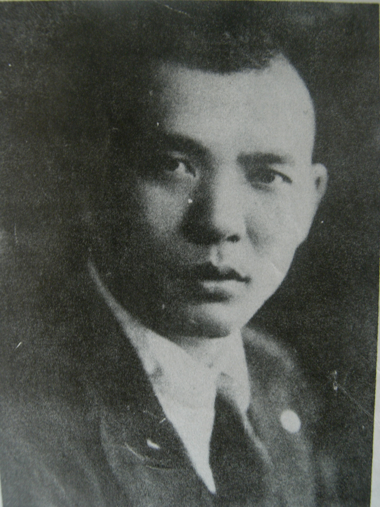
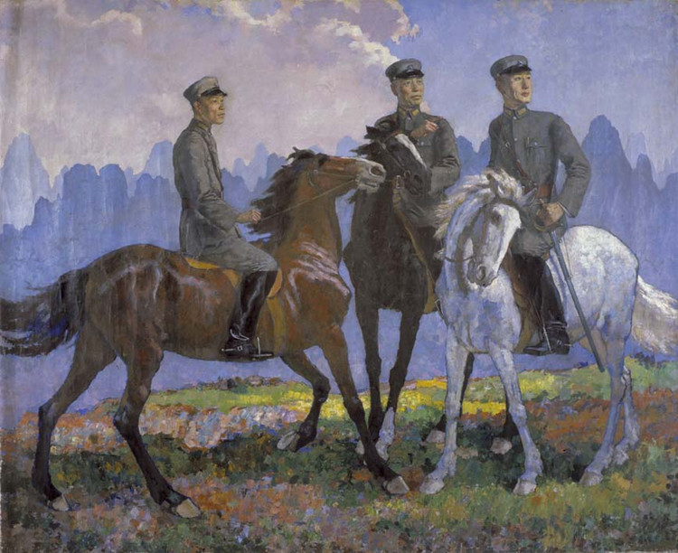
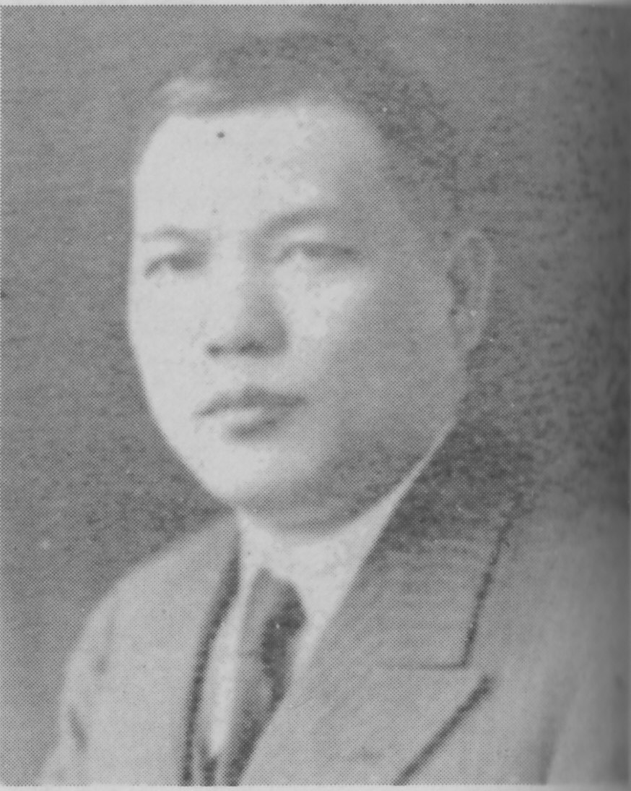
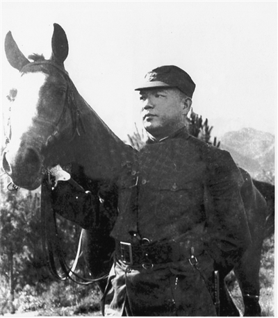
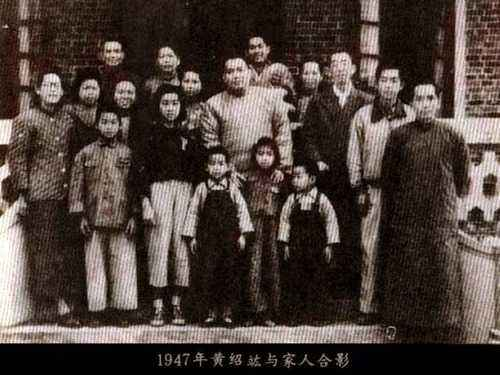

适合所有人的历史读物。每天了解一个历史人物、积累一点历史知识。三观端正，绝不戏说，欢迎留言。 

（万象特约作者：一一）

【1895年12月1日】122年前的今天 ，把蒋介石赶下台的新桂系三巨头之一黄绍竑出生

黄绍竑（1895年12月1日－1966年8月31日），广西容县人，他与李宗仁、白崇禧号称新桂系三大巨头。他先从军后从政，为新桂系开创了广阔的政治空间，曾任广西省主席、浙江省主席、湖北省主席、国民政府内政部部长、交通部长、监察院副院长等。任广西省主席期间创办了广西大学。

1949年和谈之际，他再次施展谋略，意图保住桂系20万军队，却被白崇禧拒绝，最终没能挽救新桂系的覆灭。随后他发表声明脱离国民党，出席北京的人民政治协商会议第一届全体会议。1957年被划为右派分子，1966年在文革风暴中自杀。

【不读无用书的小孩】

1895年12月1日，黄绍竑出生于广西容县。黄家是容县知名望族，父亲是前清举人，思想开明，曾说：“儿童读书不可开始过早，又不可督教过严。过早过严易伤身心，丧个性，长大必无所成。应等他年龄稍长，智识稍开，然后随其所喜，而善加诱导，才能收到事半功倍之效。”

黄绍竑启蒙后两三年间，仅读了几篇三字经和一本《史鉴节要》，其余的经书，父亲认为无用，不强迫他读。1910年春（15岁），黄绍竑考取桂林陆军小学第四期。武昌起义爆发后，陆小学生组织敢死队随军北伐，黄绍竑参加并任班长，之后进陆军第二预备学校，1915年升入保定军官学校第三期步兵科。

【带资入股的广西三杰】

1916年冬（21岁），毕业后回广西陆军陆荣廷部第1师任排长。1917年夏，广西当局以马晓军为营长创办陆军模范营，黄绍竑在营中任连附，次年升连长。1921年（26岁），马晓军被委为田南警备司令，下有两个统领，黄绍竑任第一统领。不久因第二统领白崇禧足伤，所部皆为黄绍竑一人统率。

马晓军率军往广州不再回来，黄绍竑便将“马”字军旗改为“黄”字军旗，并拟率部回老家容县休整。途中驻玉林的粤桂边防军第3路司令李宗仁邀他率队合作，走投无路的黄绍竑立即决定“带资入股”，从而改变了他一生的命运，也改写了一部广西民国史。

（徐悲鸿1935年的作品《广西三杰》。画中右边是白崇禧，中间是李宗仁，左边是黄绍竑）

【统一广西的三巨头】

1923年2月（28岁），黄绍竑占领梧州后成立广西讨贼军总指挥部，所部扩编为3个团。1924年5月，与李宗仁、白崇禧部联合作战，6月攻占省府南宁，并将省长蒙仁潜击毙。李宗仁的定桂军和黄绍竑的讨贼军组成定桂讨贼联军，次年2月占领桂林，7月击退入桂滇军唐继尧、龙云部，实现广西统一。

1926年3月（31岁），广西军接受广州国民政府改编为国民革命军第7军，李宗仁任军长，黄绍竑任党代表。同年6月，李宗仁率军向湖南出发参加北伐，黄绍竑任国民党广西省务会议主席，长期经营广西。

1927年冬，黄绍竑主持创办广西大学，校址勘定在梧州的蝴蝶山，聘马君武为校长。

【对蒋介石的连续失败】

1929年3月（34岁），蒋桂战争爆发，李宗仁、白崇禧被迫潜逃香港，后转至黄绍竑老家容县，召集新桂系唯一剩下的军队反蒋。1929年11月，李、黄、白与张发奎联合反蒋，在广西组成护党救国军，黄绍竑任副总司令。黄绍竑指挥军队与粤军决战中伤亡惨重。

1930年4月，中原大战爆发，桂系失败后黄绍竑去香港闲居，并逐渐从军事转入政治领域。1931-1936年间，先后被国民政府任命为内政部部长、浙江省主席、湖北省主席等职位。1933年，国民党中央派黄绍竑宣慰内蒙，初步解决了内蒙自治的问题。

抗战后任第二战区司令长官，往山西襄助阎锡山作战，授中将加上将衔。

【三巨头赶蒋介石下台】

1947年4月（52岁），蒋介石改组南京政府，黄绍竑出任监察院副院长。1948年，黄绍竑出任李宗仁竞选副总统的参谋长，黄绍竑充分运用他的关系网和谋略为李宗仁竞选拉得大量选票，使李宗仁多出孙科143票当选副总统。

李宗仁当选副总统后，蒋介石害怕这三个桂系巨头在中央合伙整他，要黄绍竑出任安徽省主席，将白崇禧外放到武汉担任华中剿总司令。

最终在徐蚌会战的关键时间，白崇禧见死不救， 最终导致蒋的嫡系主力被歼灭，蒋介石被迫下野，由李宗仁代总统。

【文革中自杀】

李宗仁代总统后，黄绍竑往香港，与中共会谈和平事宜，但李宗仁坚持划江而治，最终和谈破裂。黄绍竑发表声明脱离国民党，旋出席中国人民政治协商会议第一届全体会议。

1957年（62岁），黄绍竑被划为右派分子。文化大革命时受到严重冲击，1966年8月31日下午（71岁），黄绍竑前往李宗仁宅，当日，黄绍竑在北京以剃刀刎颈自杀而死。

1980年，中国国民党革命委员会为其平反，并恢复名誉。

### 

