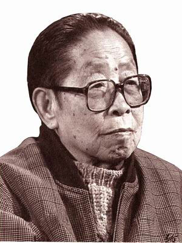
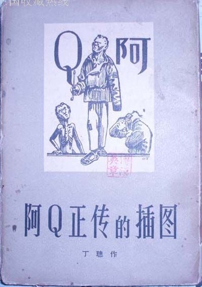
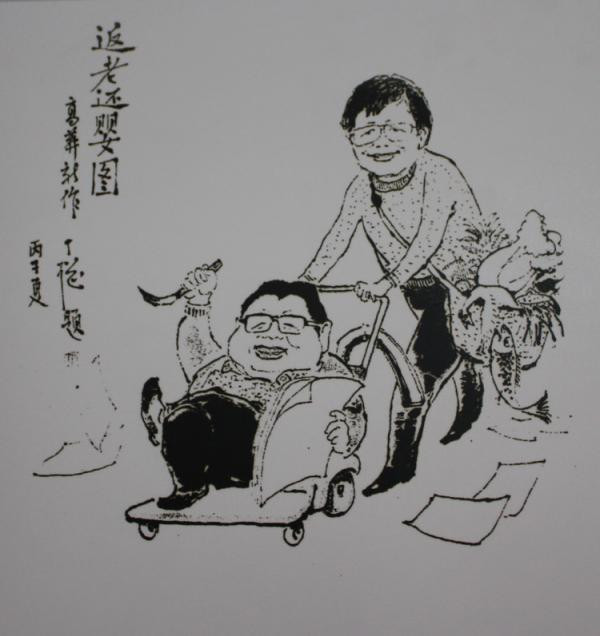
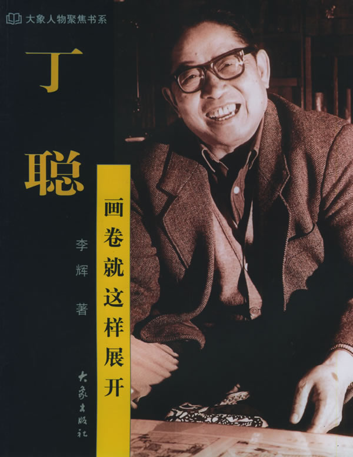
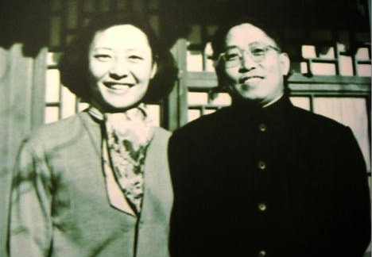
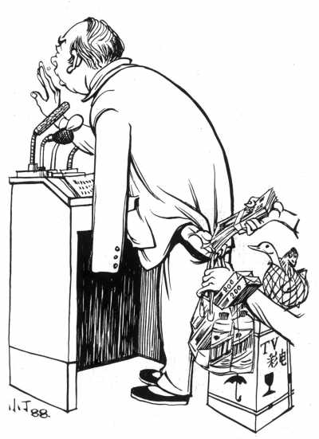

## 101年前的今天，在《读书》杂志连载30年的漫画家丁聪出生

适合所有人的历史读物。每天了解一个历史人物、积累一点历史知识。三观端正，绝不戏说，欢迎留言。  

【1916年12月5日】101年前的今天，40岁娶妻，20年运动员，30年勤耕不辍的漫画家丁聪出生

### 

丁聪（1916年12月5日－2009年5月26日），上海人，笔名小丁，著名漫画家、插画家，以讽刺性漫画为主。曾任《人民画报》副总编辑。

他40岁方才娶妻，妻子是1946年圣诞前夜，美军强奸北京女大学生事件的当事人。在随后的20年里，丁聪成为历次政治运动的受害者，被称为“运动员”。

停了20多年，重新恢复画漫画。丁聪以超常精力，创作了大量的作品，其数量大超过以前作品的总和。从1979年《读书》创刊起到2009年去世，他的漫画专栏，30年始终没有中断。

【笔名叫小丁的漫画家】

1916年12月5日，丁聪出生于上海，祖籍上海金山区枫泾镇。1930年代初，丁聪开始发表漫画，以创作讽刺性漫画为主。抗日战争后为《救亡漫画》杂志作画，给《良友》、《大地》、《今日中国》等画报供稿。

漫画原本用丁聪的本名，但“聪”字笔画太多，做版后，小了看不清，大了占画面太多，不好看。后朋友建议：“你爸叫老丁，你就叫小丁好了”。从此，丁聪就用“小丁”作笔名。

【抗战电影的美术师】

1940年（24岁）到重庆，任中国电影制片厂美术师，曾为话剧《雾重庆》设计布景。1942年，在桂林、重庆、成都、昆明等地，担任《钦差大臣》、《正气歌》、《北京人》等美术设计，曾在重庆举办个人画展。

1944年（28岁），参加中国民主同盟。抗战胜利回到上海，继续从事讽刺漫画的创作和舞台美术设计。1947年，一度移居香港。

【被美军强奸的妻子】

1949年（33岁），中华人民共和国成立后，任《人民画报》副总编辑。1956年（40岁），丁聪与夫人沈崇结婚。沈崇是1946年沈崇案的当事人。

1946年12月24日晚，圣诞节前夜，美国驻华海军陆战队士兵在东单广场，强奸19岁的北京大学女学生沈崇。该事件成为中共领导的反美运动的导火线，造成国民政府与美国关系紧张。此后，美军陆续撤离北京、天津、青岛等地驻军，并停止对华援助。

（沈崇和丁聪合影）

【20年的政治运动员】

1957年，丁聪被打成右派。此后的20多年间，丁聪成为一位资历颇深的“运动员”——在历次政治运动中被打击。丁聪最初被送往北大荒，后来去了天津团泊洼干校。文化大革命中，被送到黄村干校养猪。

直到1979年春节（63岁），丁聪才得到平反。停了20多年，丁聪又画起讽刺漫画来。为了弥补失去的时间，他以超常精力，创作了大量的作品，其数量大超过以前作品的总和。有《鲁迅小说插图》、《丁聪插图》及讽刺画集《昨天的事情》、《古趣集百图》等。

1979年《读书》创刊起，他的漫画专栏，始终没有中断过，一直连载了30年。2009年5月26日，因脑血栓引发肺部感染，在北京去世，享年93岁。

（2005年，《读书》编辑部为丁聪庆90大寿）

【丁聪漫画欣赏】

