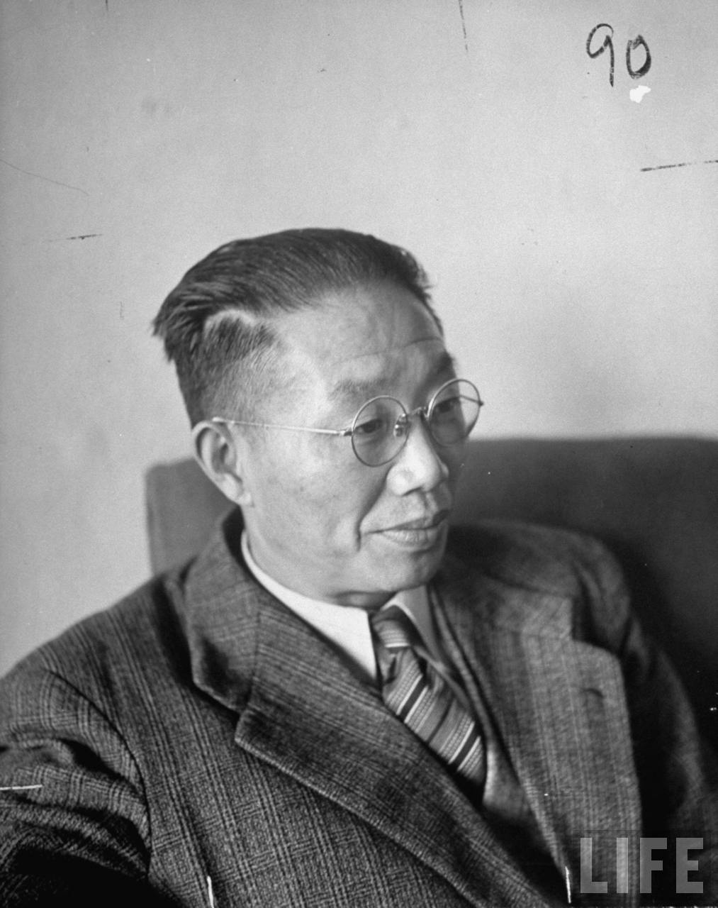
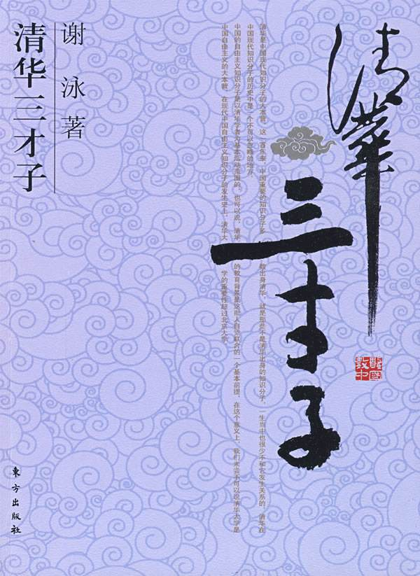
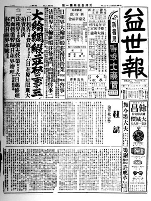
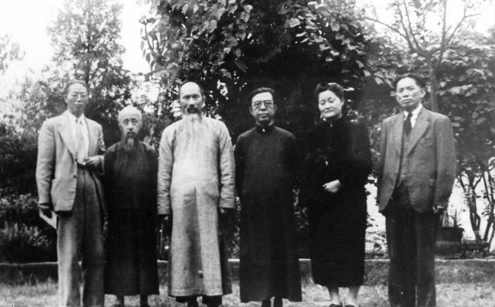
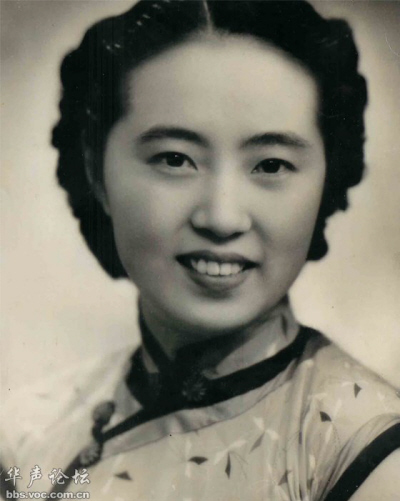
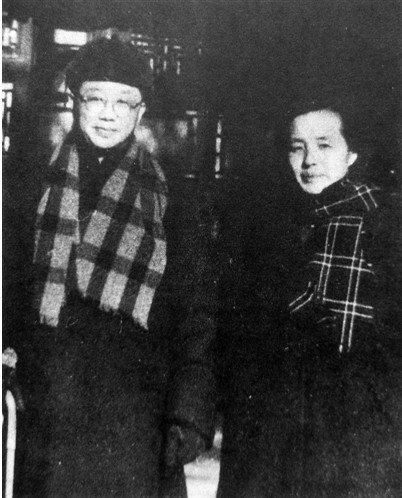

## nnnn姓名（资料）

适合所有人的历史读物。每天了解一个历史人物、积累一点历史知识。三观端正，绝不戏说，欢迎留言。  

【1965年12月7日】52年前的今天，只和名女人谈恋爱，得不到平反的大右派罗隆基去世

罗隆基（1896年7月30日－1965年12月7日），著名学者，中国民主同盟创始人之一。1957年主张“成立平反委员会”，它与章伯钧的“政治设计院”，储安平的“党天下”一起被称为最著名的三大右派言论。直到文革之后，最终也没有得到正式平反。

曾娶过两个妻子，但最终都离异。后妻王右家是民国大美女、交际花，也是曹禺《日出》的主要人物陈白露的原型。他一生曾先后跟多位知名女性，如史良、刘王立明、浦熙修、杨薇、罗仪凤等恋爱，但都没有结果，也没有留下子嗣。

【清华园里的罗疯子】

1896年7月30日，罗隆基出生于江西省吉安市安福县枫田镇。罗隆基自幼受父亲熏陶，爱好古文及古典诗词，天资聪颖，有神童之称。

1913年（17岁），罗隆基以江西总分第一，考入北京清华留美预备学校。在“五四运动”时期，罗隆基以清华大学辛酉级学生领袖的身份，冲杀在示威队伍的最前列。他不经学校同意，把李大钊《庶民的胜利》全文抄写，张贴于学校走廊上，受到学校的警告，同学称他为“罗疯子”。

（清华三才子：闻一多、吴景超、罗隆基）

【留学美国的政治学博士】

1921年（25岁），赴美留学，先后入威斯康辛大学和哥伦比亚大学攻读政治学，后赴英国伦敦政治经济学院，获得政治学博士学位。

1928年回国，任教于上海光华大学（今华东师范大学），参与创办《新月》杂志，担任主编。因发表反对国民党一党专政的言论，被逮捕。被光华大学开除之后，到中国公学任教。

【中国民主同盟的创始人】

1931年（35岁），九一八事变后，罗隆基主张抗日，在《益世报》上积极发表政治主张，抗战后转移到后方。1941年起，罗隆基积极参加发起创建中国民主政团同盟（中国民主同盟的前身），任中央常务委员兼宣传部长。

抗日战争胜利后，罗隆基全力从事民主运动，他在重庆、南京和上海期间，与周恩来、董必武等来往密切，在重大问题上和中国共产党密切合作，因此上了国民党保密局行刺名单中，后经国民党起义将领杨虎、阎锦文保护下脱险。

（右起章伯均、史良、左舜生、张澜、沈钧儒、罗隆基）

【三大右派政治理论之一】

1949年9月（53岁），以民盟代表的身份，出席中国人民政治协商会议第一届全体会议。后任民盟中央副主席、森林工业部部长、全国政协常务委员、全国人大常委会委员等职。

1957年5月22日（61岁），中共中央统战部举行座谈会。罗隆基在会上发言，建议由全国人民代表大会、中国人民政治协商会议成立一个委员会，检查“三反”、“五反”、“肃反”运动中的失误偏差。而该委员会须由执政党、民主党派和无党派民主人士三方面组成。

这就是著名的“成立平反委员会”的主张，它与章伯钧的“政治设计院”，储安平的“党天下”一起被毛泽东称为三大右派政治理论。

【得不到平反的头号大右派】

1957年6月（61岁），被划为“右派”。1958年1月26日，被撤消民盟中央副主席职务，31日被撤消全国人大代表资格与森林工业部部长职务。工资从四级降到九级。

1965年12月7日子夜（69岁），因心脏病在北京去世。

他和章伯钧被划为头号大右派，称为“章罗联盟”。由于是右派之首，1980年时没有得到平反。1986年10月24日，中国民主同盟中央隆重纪念罗隆基90周年诞辰，中共中央统战部部长阎明复在会上肯定其革命贡献。

【没有子嗣的交际花妻子】

1928年（32岁），罗隆基与在英国相识的法律系学生张舜琴结婚，并一同回上海生活，翌年诞下一女（一个月后夭折）。1931年（35岁），跟张舜琴离婚。

1938年（42岁），与小12岁的民国大美女、交际花王右家结婚，1945年（49岁）抗战胜利后离婚。1947年，王右家嫁给已故电影演员阮玲玉的丈夫唐季珊，后离婚。曹禺《日出》的主要人物陈白露原型便是王右家。

【只和知名女人谈恋爱】

他一生曾先后跟多位知名女性恋爱，但终没有结果。包括：史良、刘王立明、浦熙修、杨薇、罗仪凤等。

史良（小4岁），抗日救国会“七君子”之一，中华人民共和国司法部首任部长，中国民主同盟两届中央主席。1950年，促使新中国第一部法律《中华人民共和国婚姻法》出炉。

刘王立明（同岁），1938年丈夫刘湛恩遭日伪特务暗杀身亡，民盟重要成员，中华妇女节制会主席，世界妇女节制会副主席，二、三、四届全国政协常委。

浦熙修（小14岁），彭德怀夫人浦安修的姐姐，1936年起在南京《新民报》当记者，战后的政协会议期间写了许多漂亮的人物访谈记，被称为是后方新闻界的“四大名旦”之一。后任上海《文汇报》副总编辑。1957年7月，浦熙修公开“揭发”罗隆基，指其为“披着羊皮的狼”，与其断绝关系。罗隆基被划成“右派”之后，浦熙修也成了“右派”。

（1949年，罗隆基与浦熙修）

杨薇（小23岁），北京人艺的头牌演员。

罗仪凤（小18岁），康有为的外孙女，1974年于北京病逝，终身未嫁。

（北京人艺演员杨薇出演《日出》的陈白露）

