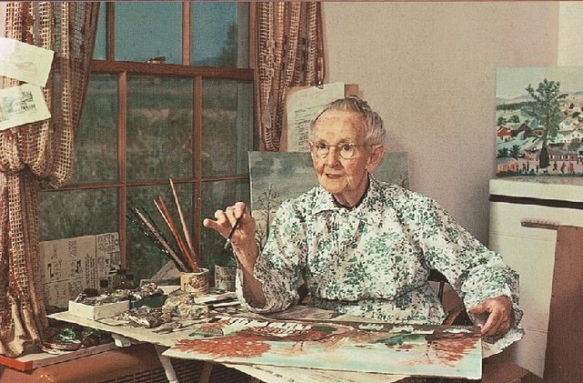
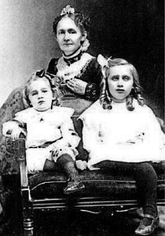
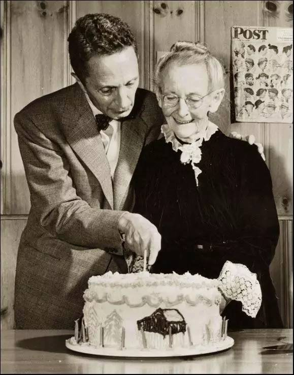
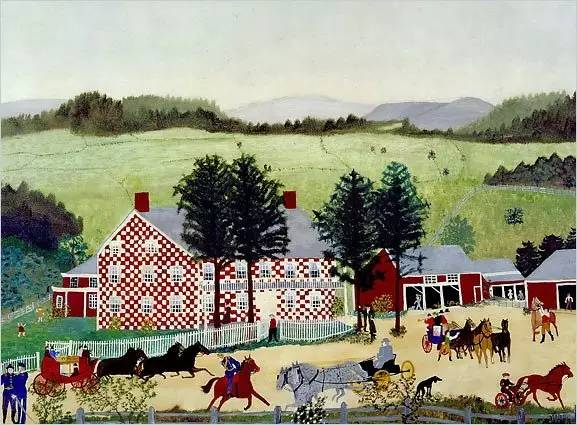

## 56年前，善于描绘永恒和怀旧的风俗画画家摩西奶奶去世

适合所有人的历史读物。每天了解一个历史人物、积累一点历史知识。三观端正，绝不戏说，欢迎留言。  

【1961年12月13日】56年前的今天，76岁开始新的人生，最励志的老太太摩西奶奶去世

摩西奶奶（Grandma Moses，1860年9月7日——1961年12月13日）是一位美国女画家。常被当作自学成才、大器晚成的代表。

她出生农家，受到过很少的教育。她七十多岁时，因关节炎放弃刺绣，开始绘画。她共作画一千多幅，作品主要描绘的是农场景色以及她的生活。

她的作品无意间被发现，受到大量艺术家和美国民众的热捧，大获成功。当时世界陷于战乱之中，摩西奶奶的作品，或许可以让人暂时忘记丑恶的战争。她是二战前最令人尊敬的民间艺术家，也是最知名的女性艺术家。

【10个孩子的农家妇女】

摩西奶奶是安娜·玛丽·罗伯逊·摩西的流行名。她1860年9月6日生于纽约州格林威治村的一个农场，成了一个贫穷农夫的女儿。她是十个孩子中的一个，毕生在农场度过。

1887年，27岁的她嫁给Thomas Moses。他也是农场的工人，来自弗吉尼亚州，他们在一个农场上工作。后来她重回纽约州，在离出生地不远处生活，以刺绣乡村景色为乐。

摩西像她母亲一样，也生了10个孩子，整天被擦地板、挤牛奶、装蔬菜罐头等琐事所占有。

（童年的摩西）

（摩西奶奶和她的孩子）

【一个没有太晚的开始】

直到76岁，摩西因关节炎不得不放弃刺绣，开始绘画。她小时候，只是作过浆果和葡萄的素描练习，这是她第一次拿起画笔和油彩。

她的女儿将她的一幅画带到镇上的杂货铺里。一天，陈列在杂货店橱窗中的作品引起了艺术收藏家Louis J. Cal－dor的留意。他买了这幅画，并想办法联系到了摩西。他把摩西的作品带到纽约，引起画商Otto Kallir的注意，从此摩西的画被挂到了Kallir的画廊里，被介绍到艺术界。

（摩西家壁炉上的画作）

【轰动世界的老太太】

1940年，80岁的摩西在纽约举办个人画展，引起轰动。此后她的作品成为艺术市场中的热卖点，赢得了很多奖项。最热门的畅销书、电台与电视台的采访，使她深入到美国家庭中。她的质朴、诚实、丰富多彩的晚年生活，无疑是解除冷战时代人们焦虑症的一管清新剂。

她的作品开始在美国及欧洲畅销。她爆发了惊人的创作力，在二十多年的绘画生涯中，她共创作了1600幅作品。在她100岁的时候，纽约州将她生日那天命名成"Grandma Moses Day”。在她100岁以后，还继续画了6幅作品。

（时代周刊上的摩西奶奶）

（摩西奶奶的百岁生日）

【人生随时可以重来】

1961年12月13日，摩西奶奶在纽约逝世，终年101岁。

2014年11月，中国大陆首次出版摩西奶奶图书《人生永远没有太晚的开始》。2015年3月，国内出版了首部全面介绍摩西奶奶的书籍《人生随时可以重来》。

【摩西奶奶作品欣赏】

