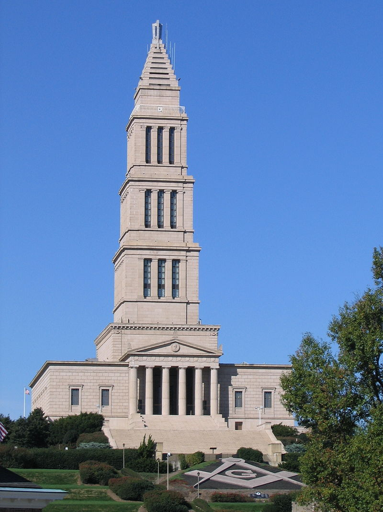
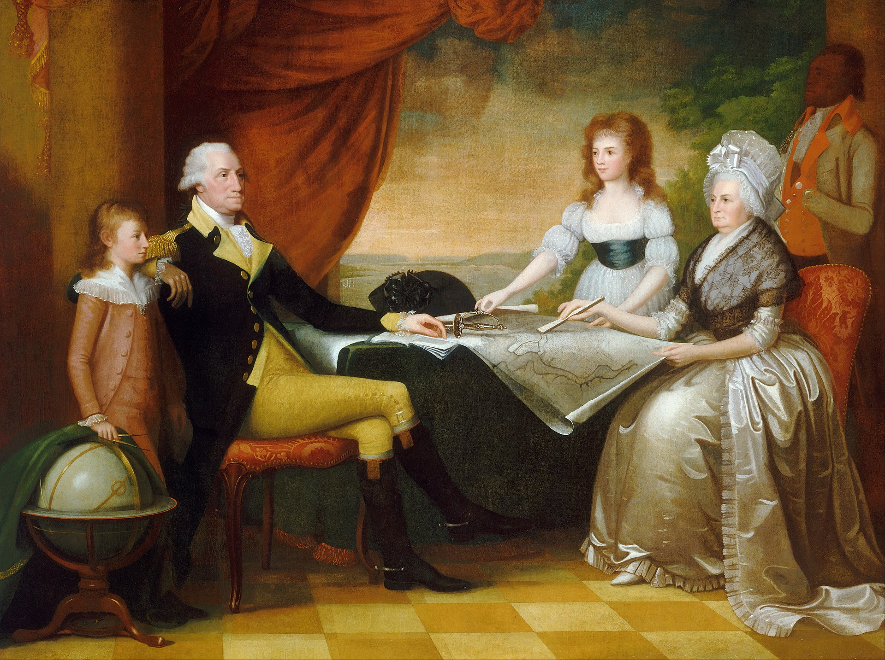
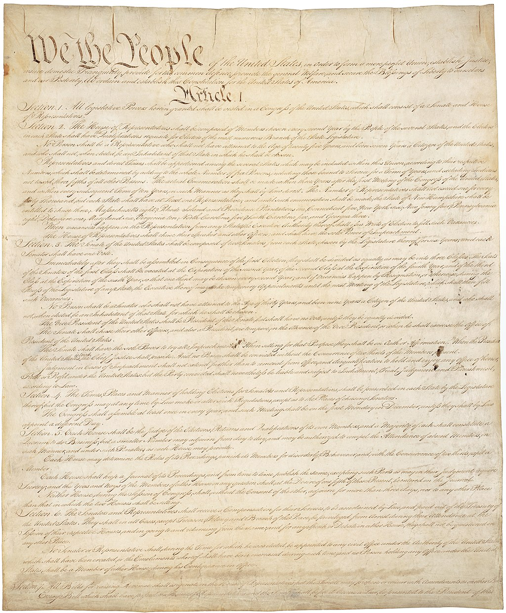
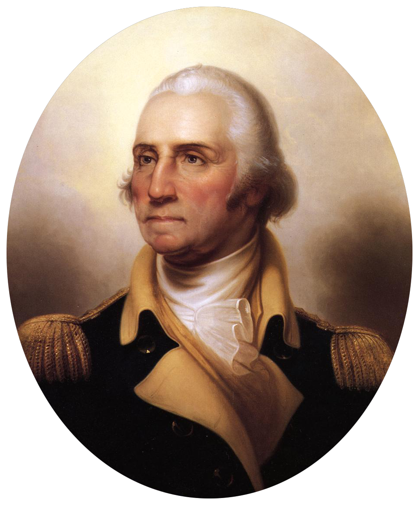
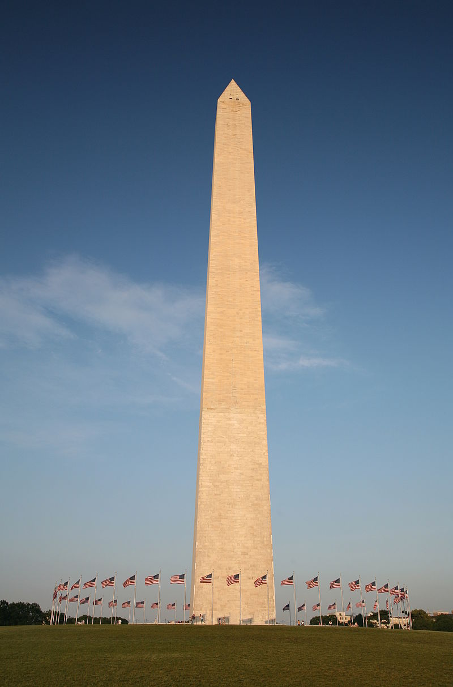

## 218年前的今天，美国国父、唯一一个无党籍的美国总统华盛顿逝世

- ​

【1799年12月14日】218年前的今天，一个不完美的神，无党派的美国国父华盛顿逝世

乔治·华盛顿（英语：George Washington，1732年2月22日－1799年12月14日）

华盛顿曾是支持英国的殖民军军官。在美国独立战争中，率领大陆军团抗击英军，经历了初期惨败和佛吉谷的惨淡冬天后，最终在法国帮助下赢得了美国独立。他拒绝建立军事政权的提议，1783年回到庄园恢复了平民生活。

1787年，华盛顿主持了制宪会议，他没有参加讨论，但他的威严使得会议在激烈争执下，制定了现在的美国宪法。1789年，他经过全体选举团无异议的全票通过，成为美国第一任总统。他在两届任期中，设立许多持续到今天的政策和传统。

在两届任期结束后，他自愿放弃权力，不再谋求续任。最多连任两届，成为美国总统的“潜规则”，只有罗斯福打破了这个规则。罗斯福死后这个惯例正式写入了宪法。他也是唯一一个不属于任何党派的美国总统。

华盛顿被称为美国国父，同时作为大奴隶主，曾大量蓄黑奴，有人评价他是“一个不完美的神”。2005年，美国在线选出《最伟大的美国人》，华盛顿名列第4位。

（自左上顺时针：约克镇围城战役、特伦顿战役、邦克山战役、长岛会战、吉尔福德县府战役）

【顶替哥哥的农场主之子】

1732年2月22日，华盛顿出生美国弗吉尼亚州威斯特摩兰县。华盛顿的父亲是大农场主，但不算非常富有。

华盛顿15岁前，没有接受过正规教育。而父亲的去世让家族陷入经济困难，华盛顿没能像两名哥哥一样前往英格兰接受教育。华盛顿一生都没有去过欧洲。

华盛顿在哥哥劳伦斯介绍下，担任测量师的工作，薪水丰厚。不久，劳伦斯死于肺结核，华盛顿接替哥哥成为弗吉尼亚民兵的少校。

（乔治·华盛顿共济会国家纪念堂）

【引发大战的签字】

1754年（22岁），在与法国争夺殖民地的一场战斗中，华盛顿被捕，并被迫签下一份承认他"刺杀"法军指挥官朱蒙维拉的文书（因为这份文书用法文写成，华盛顿根本看不懂）。这份文书成为法国印地安人战争的起因。

这场战争是七年战争的一部分，当时世界上的主要强国都参与七年战争，影响覆盖欧洲、北美、中美洲、西非海岸、印度及菲律宾。

华盛顿一直渴望加入英国军队。1755年终于等到机会，但他在英国军队里一直未获升迁。1759年，他辞去军职，与一名已经育有两个小孩的富有寡妇结婚。新婚后他们搬到弗农山居住，过着绅士的生活。华盛顿一生都没有自己亲生的孩子。

【殖民地军的总指挥官】

他是弗吉尼亚当地的下议院议员。1774年（42岁），华盛顿被选为弗吉尼亚州的代表前往参加第一届大陆会议。

由于波士顿倾茶事件，1775年4月，殖民地与英军零星开战后，华盛顿是唯一穿着军服出席第二届大陆会议的代表。马萨诸塞州的代表便推荐他担任所有殖民地的总指挥官，并经大会选举无异议通过。华盛顿宣称除了必要的开支外，不须付给他任何额外报酬。

（波士顿茶叶事件）

【佛吉谷的黑暗时刻】

1776年（44岁），华盛顿进攻，将英军逐出波士顿。英军撤回到加拿大，华盛顿挺进到纽约。8月，拥有压倒性军力的英军展开反攻，华盛顿在输掉长岛战役等几次战役后，仓促撤离新泽西州，境况非常糟糕。

1777年夏天，英军发动了三路并进的攻势，华盛顿撤往南方。9月11日，在布兰迪万河战役、日耳曼敦战役中，华盛顿遭受惨败，只得撤回环境恶劣的佛吉谷，艰难的渡过冬天。

1778年是大陆军战况和士气最恶劣的时刻，大陆军战争损失惨重、生活环境非常恶劣。但华盛顿依然坚定着指挥军队，并持续向后方的殖民地大会要求更多补给，使大陆军能克服寒冷的冬天，逐渐回复士气。

（华盛顿横渡德拉瓦河的情景）

【接过投降之剑】

1778年6月28日，华盛顿接着率领军队在蒙茅斯战役中，攻击从费城前往纽约的英军，获得胜利。情势逐渐好转，法国决定正式与美国结盟。

1781年（49岁），英军副总司令康沃利斯在约克镇被美军、法军包围，华盛顿迅速前往南方，直接指挥作战，直至康沃利斯投降。10月19日，他接过康沃利斯的投降宝剑。尽管战争持续到1783年，这场战役是独立战争中最后一场重要战斗。

1783年，随着巴黎条约的签署，英国承认美国的独立。华盛顿解散他的军队，在新泽西州的洛基山，向追随他多年的士兵们发表了一场精彩的告别演说。

（华盛顿在约克镇接受康瓦利斯率领英军投降的情景）

【战术平庸的杰出战略家】

应该指出的是，华盛顿指挥战斗的能力较为平庸，而且在许多次战役中都犯下大错。但他仍被奉为战争英雄，支持他的人们认为，是他使得美军能够战争中存活并持续战斗，直至获得胜利。

华盛顿一直躲开与英军直接冲突，避免发生决战。他了解自身的弱点，限制过于冒险的行动。同时，以他勇敢的人格和号召力激励军队，并赢得了殖民地各阶层的信任，这些都是独立战争能够成功的因素。

（美国著名画家本杰明·韦斯特笔下的巴黎和约）

【辞去总司令回家】

1783年12月23日，华盛顿向邦联议会辞去总司令的职务。这对于新生国家而言，是至关重要的，他避免军人政权的出现。

华盛顿返回弗农山的庄园。在门口欢迎他的，是曾向其许诺过8年内回家的妻子，以及4个从没见过、已经能够走路的孙子孙女。

（《华盛顿一家》，爱德华·萨维奇绘制）

【制定美国宪法的威望】

1787年（55岁），华盛顿主持在费城举行的制宪会议。他并没有参与讨论，但他的威望维持会议的秩序，并让代表团能专注于讨论上。在会议后，他的威望也使得许多人相信会议的成果，而支持美国宪法。

1789年，华盛顿在经过选举团投票无异议的（获得全部的选举人票）当选总统，他是历史上唯一一个无异议投票当选的总统（并在1792年再次达成）。

妻子玛莎对他当选总统相当失望，她只希望能和华盛顿在弗农山维持平静的生活。不过她还是承担起第一夫人的职责，开放客厅并负责安排每周和达官显贵的晚宴。

（美国宪法第一页）

【不当第三任总统的惯例】

1794年（62岁），在征召一万多名民兵后，他直接带兵前往镇压因增加蒸馏酒的货物税率而引起的暴动，使得他成为唯一一个亲自率领军队的美国总统。这也是联邦宪法颁布以来，联邦政府首次动用军队维持地方秩序。

尽管华盛顿相当不情愿，他还是被选为第二任总统。不过华盛顿坚持拒绝担任第三任总统，这也成为不成文惯例。这个惯例一直到1940年才被罗斯福所打破，但在罗斯福死后这个惯例正式的被写进美国宪法第二十二修正案里面。

（华盛顿表态拒绝第三届任期时的情景，由吉尔伯特·斯图尔特所绘）

【最有影响力的演说】

1797年（65岁），华盛顿任期届满，他发表的离职演说成为美国历史上最富影响力的政治演说之一。在演说中他呼吁人们抛弃党派之争，团结起来为增进公众利益而努力；主张美国应该避免受到他国的干涉，美国应该只专注于美国人的利益；建议与世界上其他国家保持友谊和贸易关系，应该避免牵扯进欧洲的战争；认为应该避免与某国家保持长期的同盟关系。

华盛顿的离职演说成为美国人对政治的准则。每当发生关于美国的外交政策的争论时，华盛顿的演说便成为主张维持中立者最有力的引言，一直到1949年美国开始主导与其他国家结盟为止。

之后，华盛顿拒绝离开总统办公室，直到副总统亚当斯到达，树立只有正副总统都到齐时才能让出总统职位的惯例。接着，华盛顿步出办公室，回复平民的身份，回到弗农山。

（悬挂于白宫内的华盛顿官方肖像）

【永远的第一人】

1799年，华盛顿染上感冒，恶化为喉头炎和肺炎，又因采用放血疗法医治不当，12月14日去世，享年67岁。遗体葬在弗农山当地。

华盛顿死后，他昔日的革命战争伙伴，国会议员哈利·李对他的称赞相当著名：“他是一个公民，他是战争中的第一人，也是和平时代的第一人，也是他的同胞们心目中的第一人。

（华盛顿纪念碑）

