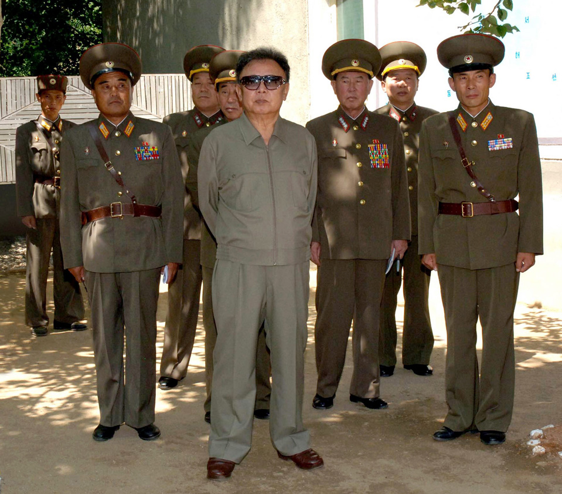
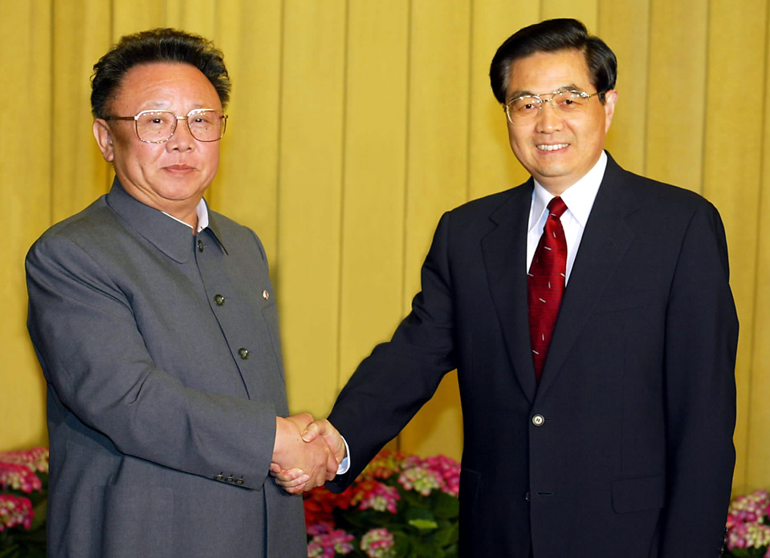
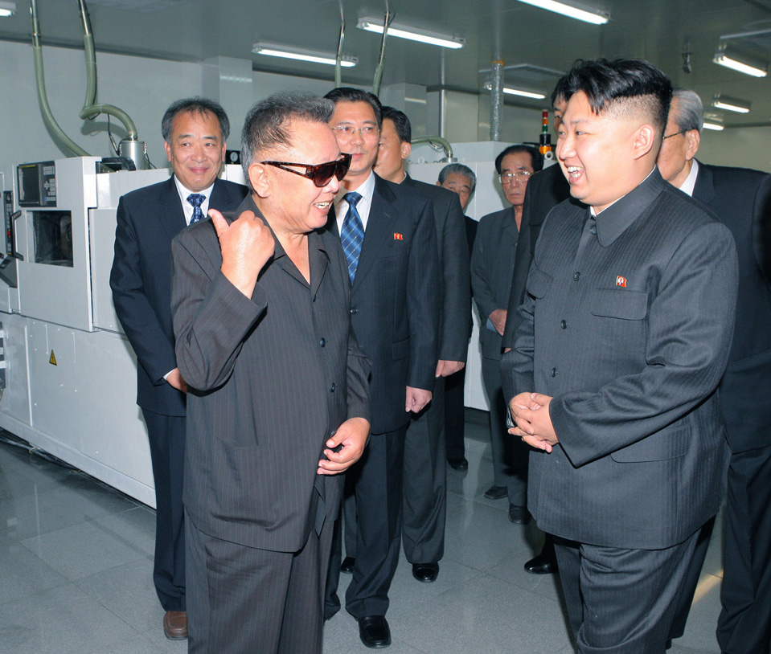
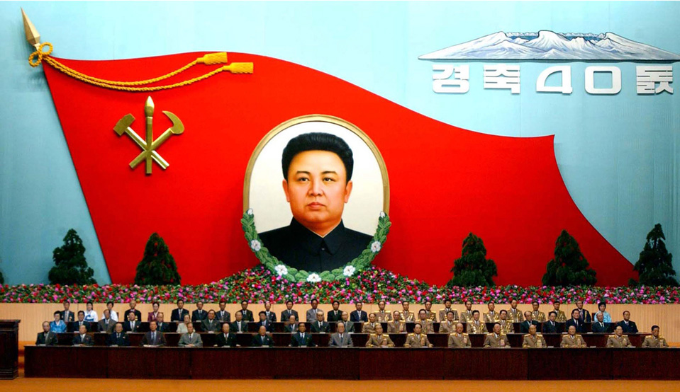

## 16年前的今天，创作六部歌剧的“永远的总书记”金正日逝世于平壤

- ​

适合所有人的历史读物。每天了解一个历史人物、积累一点历史知识。三观端正，绝不戏说，欢迎留言。  

【2011年12月17日】16年前的今天，让朝鲜核试验获得成功，永远的总书记金正日逝世

金正日（1941年2月16日－2011年12月17日），朝鲜建国领导人金日成长子，1993年起担任最高领导人，领导朝鲜长达17年。

1992年，被授予共和国元帅称号。2012年，在金日成去世后，再追授“大元帅”称号。2012年，朝鲜劳动党的最高领导人改称“第一书记”，金日成成了“永远的总书记”，随后又成为“永远的委员长”。

（金日成和金正日父子铜像）

【生于苏联的小胖子】

朝鲜政府声称，金正日于1942年2月16日出生于朝鲜长白山密营。然而根据苏联的记录，他是1941年2月16日，在苏联远东地区伯力附近的军营中出生的。

当时金日成任苏联第二远东方面军独立第88步兵侦查旅（又称东北抗日联军教导旅）第一营上尉营长，这支军旅由撤至苏联的东北抗日联军余部组成。金正日把出生年份报小一年，可能是为了使人认为他是在金日成30岁那年出生。

1945年11月，金正日随母亲金正淑乘船回到朝鲜。1950年10月起，由于朝鲜战争爆发，金正日在中国吉林读书。1952年11月22日，11岁的金正日回到朝鲜。

【年轻的接班人】

1960年（19岁），金正日升入金日成综合大学，学习经济系政治经济学专业。1961年，加入朝鲜劳动党，1964年（23岁），大学毕业后，金正日被指派到朝鲜劳动党中央委员会任职。

1972年（31岁），金正日当选为党中央委员会委员。1974年（33岁），被推戴为金日成的接班人。同年，金正日在全国党的宣传工作者讲习会上，把金日成革命思想正式确定为主体的思想，并宣布实现“全社会主体思想化”，是朝鲜劳动党的最高纲领。

【退出核不扩散的委员长】

1990年5月（49岁），当选为朝鲜国防委员会第一副委员长。1991年，金正日把8月28日定为青年节，并向全国青年致函《青年要做无限忠于党和领袖的先锋》。同年，在金日成的提议下，金正日被推举为朝鲜人民军最高司令官。

1993年3月12日（52岁），朝鲜政府发表声明，宣布退出不扩散核武器条约。4月9日，在金日成的提议下，金正日被推戴为朝鲜国防委员会委员长。

（1983年9月，金正日与父亲金日成一同在平壤出席一个庆祝朝鲜建国的大型集会）

【推行先军政治的大孝子】

金日成于1994年7月8日去世后，金正日为父守孝三年，朝鲜劳动党总书记和委员长的职务因此空缺三年。1997年10月8日（56岁），金正日当选为朝鲜劳动党总书记。同年发动为期4年的“深化组事件”，进行清洗运动，令2万人受到迫害，数千人致死。

1998年9月5日（57岁），通过了新宪法，把国防委员会的权能规定为“是国家主权的最高军事领导机关，是全盘的国防管理机关”，并由金正日任国防委员会委员长。1999年初，金正日向国内外宣布：朝鲜劳动党的领导就是先军领导，政治就是先军政治。

【核试验下的频繁访问中国】

2006年10月14日（65岁），朝鲜成功进行了第一次核试验。中国、俄罗斯、美国一起在联合国安理会投赞成票，一致通过谴责并制裁朝鲜的联合国安理会第1718号决议。

2009年（68岁），朝鲜第二次核试验成功，联合国安理会再次通过制裁朝鲜的决议。从2000年到2011年期间，金正日先后五次访问中国。

金正日和金日成一样害怕炸弹暗杀而不愿坐飞机，去外国时一般坐防弹列车。他乘坐飞机的明确纪录只有1965年随金日成访问印尼。

【联合国的1分钟默哀】

朝鲜中央电视台2011年12月19日正午报道，70岁的金正日在乘火车视察地方的途中，因急性心肌梗死并发心源性休克于2011年12月17日上午8点30分去世，宣布从12月17日至29日全国哀悼。在金正日生前已经预定由三子金正恩接班。

收到金正日逝世的消息后，中国共产党中央委员会、全国人大常委会、国务院、中央军事委员会共同向朝鲜当局发唁电，对金正日的离世表示沉痛悼念。而联合国在大会上按照惯例，全体为他默哀一分钟（美、日、韩国、欧盟等退席）。

（2011年9月，金正日携金正恩在平壤参观MokranVideo公司）

【无上的荣誉和神奇的传说】

金日成先后四次被授予“朝鲜民主主义人民共和国英雄”称号，先后四次被授予金日成勋章，两次授予金日成奖（1973年和2012年）。

1992年，被授予共和国元帅称号。2012年，在金日成去世后，再追授“大元帅”称号。2012年，朝鲜劳动党的最高领导人改称“第一书记”，金日成成了“永远的总书记”，随后又成为“永远的委员长”。

另据媒体报道，金日成出生3周后能走路，8周能说话。大学时期，3年写了1500本书，创作“音乐史上最了不起”的歌剧6部。之后转战体育界，94年第一次手握高尔夫球杆，就11次1杆进洞，38次低于标准杆的惊人纪录。

（2004年，在为庆祝金正日加入朝鲜劳动党中央委员会40周年而举行的劳动党全国会议）