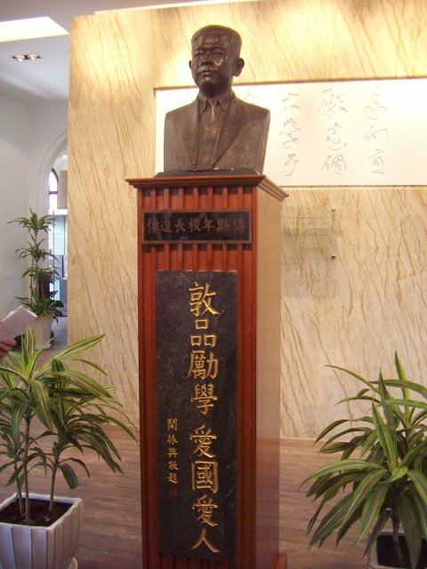

## nnnn姓名（资料）

适合所有人的历史读物。每天了解一个历史人物、积累一点历史知识。三观端正，绝不戏说，欢迎留言。  

傅斯年小传：将孔祥熙、宋子文轰下台的民国“大炮”，一天只有21个小时

【1950年12月20日】67年前的今天，我们只是陈胜吴广，动手动脚找东西的民国魏征傅斯年病逝

傅斯年（1896年3月26日－1950年12月20日），山东聊城人。五四运动学生领袖之一、中央研究院历史语言研究所创办者。曾任国立北京大学代理校长、国立台湾大学校长。他提出“上穷碧落下黄泉，动手动脚找东西”之原则影响深远。

傅斯年为人性格耿直，嫉恶如仇，抗日战争期间踏入政坛，成为国民参政会参政员。1944年以“美金公债案”公开炮轰当时的“皇亲国戚”孔祥熙，将孔赶下台；后于1947年的“抢购黄金风潮”中，炮轰有发国难财之嫌的行政院长宋子文，再将宋赶下台。时人称其为“傅大炮”，或比喻他为民国时期的魏征。

胡适曾评价傅斯年：“他的感情是最有热力，往往带有爆炸性的；同时他又是最温柔，最富于理智，最有条理的一个可爱可亲的人”、“他能做最细密的绣花针功夫，他又有最大胆的大刀阔斧本领。他是最能做学问的学人，同时又是最能办事，最有组织才干的天生领袖人物。”

，胡祖望.jpg)

（胡适与傅斯年(左一)，胡祖望合影）

【北京大学的学生领袖】

1896年3月26日，傅斯年出生。幼年丧父，由祖父及母亲抚育成人，15岁结婚。1913年考入北京大学预科，1916年进入北京大学。1918年，与罗家伦等20余人组织新潮社，提倡新文化，与北京大学国粹派论战。傅斯年也因此成为著名学生领袖。

1920年（24岁），他去欧洲，在伦敦大学研习三年半后，后转赴柏林大学，游学时间长达六年。1926年10月，应中山大学的聘用回国。1928年，积极筹划创建了著名的中央研究院历史语言研究所。后任中央研究院总干事。

1934年（38岁），和元配离婚后迅速与同学的妹妹俞大彩在北平结婚。

（傅斯年考入北大预科时，与弟弟傅斯严合影）

【死磕皇亲国戚的傅大炮】

1944年（48岁），傅斯年在参政会上向行政院院长孔祥熙发难，揭发他贪污舞弊，骂他是皇亲国戚。孔祥熙的妻子是宋霭龄，与蒋介石、宋子文是姻亲。

事后蒋介石亲自请他吃饭，问他：“你信任我吗？”傅斯年答：“我绝对信任。”蒋介石说：“你既然信任我，那么就应该信任我所任用的人。”傅斯年立刻说：“委员长我是信任的，至于说因为信任你也就该信任你所任用的人，那么，砍掉我的脑袋我也不能这样说。”

1947年（51岁），傅斯年分别发表了两篇文章：《这样的宋子文非走开不可》和《宋子文的失败》，痛批当时行政院长宋子文：“自抗战以后，所有发国难财者，究竟是哪些人？照客观观察，套购外汇和黄金最多的人，即发财最多的人。”硬是把宋子文逼下台。

（傅斯年在《世纪评论》抨击宋子文）

【陈胜吴广和项羽刘邦】

抗日战争后期，国共两党也开始考虑未来国家的执政问题。此时，中国民主同盟的一些成员希望未来由三方共同执政，因此决定前往延安说服中共。1945年7月1日，褚辅成、黄炎培、左舜生、章伯钧、傅斯年、冷遹一行六人，乘专机到达延安，毛泽东、朱德、周恩来等中共领导人亲自到机场迎接。

基于“北大情结”，毛泽东单独拿出一个晚上与傅斯年进行交谈，当毛泽东谈及傅斯年曾在五四运动大出风头，为反封建与新文化运动作出伟大贡献时，傅斯年回应道：“我们不过是陈胜、吴广，你们才是项羽、刘邦。”

傅斯年在返回重庆之前，请毛泽东题字留念，对方慨然允之：竹帛烟销帝业虚，关河空锁祖龙居。坑灰未烬山东乱，刘项原来不读书。

（1945年，傅斯年一行访问延安）

【开除自己老师的北大校长】

1945年，抗战即将胜利，傅斯年出任北京大学代理校长。他坚持“民族气节”，对于汪精卫时期北京大学的教职员全都开除，学生学籍和学历都不予承认，要先补习考试才能进新北大。对他自己的老师周作人，也一视同仁，予以开除。

周作人写的“仓卒骑驴出北平，《新潮》余响久消沉，凭君箧载登莱腊，西上巴山做义民”和“次有齐鲁民，生当靖康际，沿途吃人腊，南渡作忠义，……，讲学称贤良，闻达参政议，千年诚旦暮，今古无二致，旧事倘重来，《新潮》徒欺世，自信实鸡肋，不足取一胾”，对学生傅斯年怨恨讽刺也不是偶然。

1946年9月6日，傅斯年将北京大学校长一职交给先前在美国办外交的候任校长胡适。

【为学生拼命的台大校长】

1949年1月，傅斯年搭机飞到台北，任国立台湾大学校长。傅斯年受命于危乱之际，他积极“替台大脱胎换骨”。台大面貌为之一新，形成了一个蓬勃向上的局面。据说，傅斯年常去找蒋中正要办学经费，他每去一次阳明山，必定是“满载而归”。

傅斯年试着在中国国民党的白色恐怖和多元学风中取得平衡。1949年4月6日，台湾大学和师大发生“四六事件”，傅斯年对当局不经法律程序直接闯入校园逮捕师生非常不满，他警告台湾警备总司令部司令彭孟缉说：“若有证据该抓就抓，若无证据就不能随便进学校抓学生！我有一个请求，你今天晚上驱离学生时，不能流血，若有学生流血，我要跟你拚命！” 。

（傅斯年与蒋介石合影）

【台大傅钟响二十一声】

晚年傅斯年身体肥胖，患有高血压，又患有胆结石。1950年12月20日上午，傅斯年在台湾省议会答复教育行政质询时，过度激动，“突患脑溢血逝世于议场”，享年55岁。

新闻公布时说“傅斯年先生弃世”，因台语口音而被其学生听成了“傅斯年先生气死”，引发小规模学潮，直到官方出面解释才平息。

傅斯年逝世后，葬于台湾大学校园，校内设有希腊式纪念亭傅园及“傅钟”；其中，傅钟启用后成为台湾大学的象征，每节上下课会钟响二十一声，因傅斯年曾说过：“一天只有二十一小时，剩下三小时是用来沉思的。”

（台湾大学校史馆中傅斯年校长的塑像）

