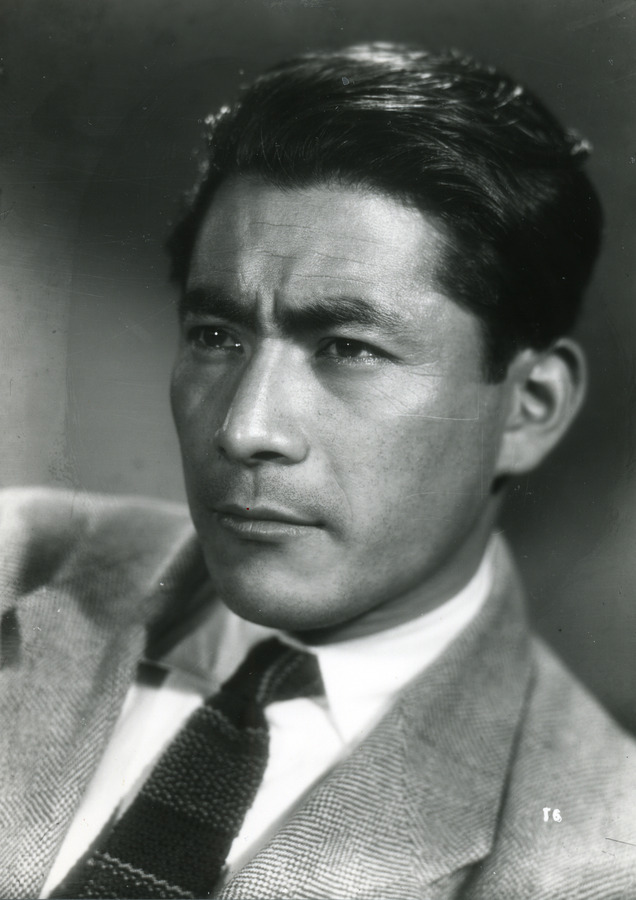
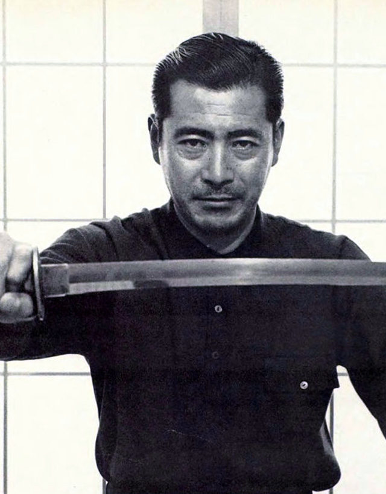
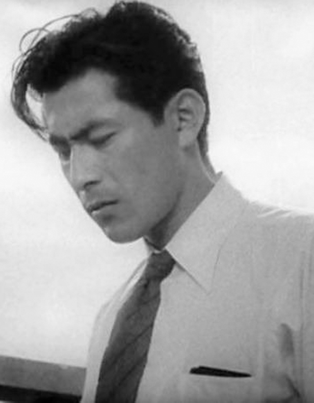
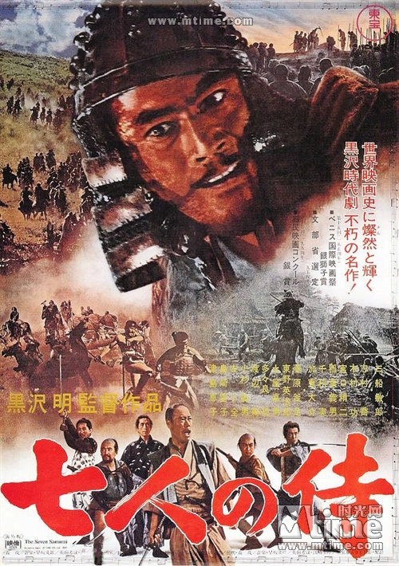
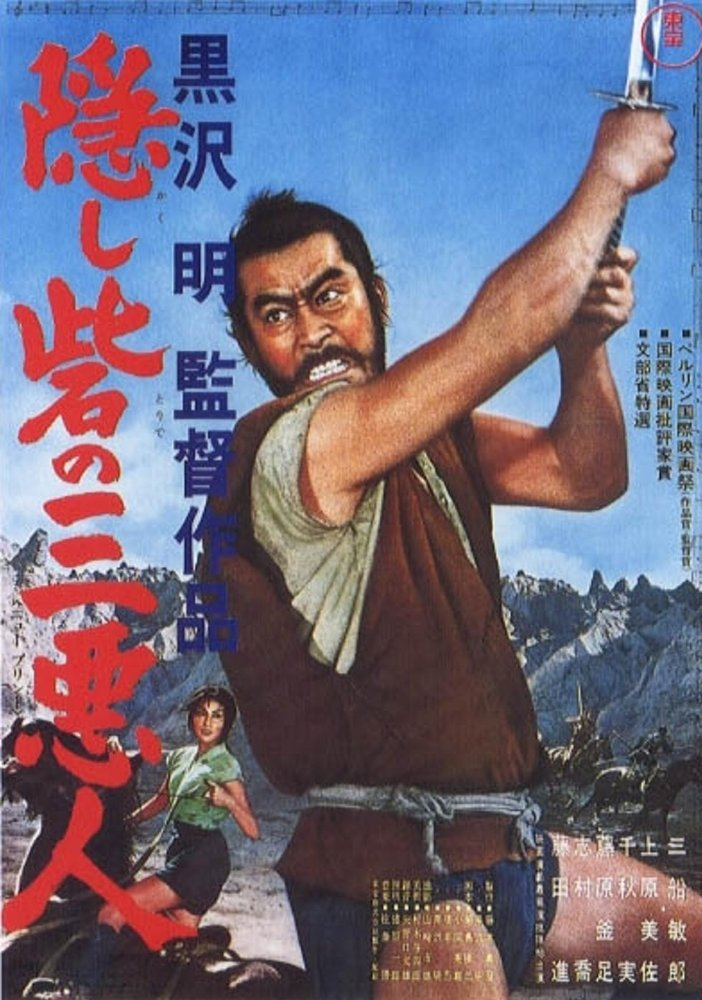
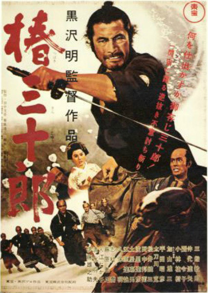
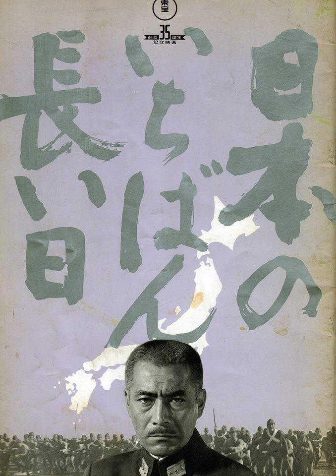
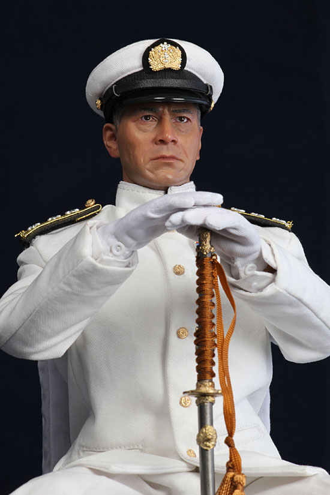

## 20年前的今天，出生于青岛的黑泽明御用演员三船敏郎逝世于日本

适合所有人的历史读物。每天了解一个历史人物、积累一点历史知识。三观端正，绝不戏说，欢迎留言。  

三船敏郎小传：世界的三船，一半是黑泽明、一半是山本五十六

【1997年12月24日】20年前的今天，生在中国、长在中国的日本电影巨星三船敏郎去世

三船敏郎（Toshiro Mifune）（1920年4月1日－1997年12月24日），出生于日本租借时期的中国青岛市。是世界知名的日本电影演员，曾经两度获得威尼斯国际电影节最佳男演员奖。他与黑泽明的合作被称作为“国际的黑泽，世界的三船”。

三船敏郎在与黑泽明合作的《罗生门》、《七武士》、《用心棒》、《椿三十郎》、《红胡子》等影片中，表现出色，赢得了巨大声誉。

与黑泽明分道扬镳后，出演了许多二战题材的战争电影。尤其是在电影《联合舰队司令长官——山本五十六》中，将山本五十六演绎得淋漓尽致 。

生平

1920年4月1日，三船敏郎出生于山东省青岛市。4岁时随父母迁往大连，1938年（18岁）高中毕业后，帮父亲经营照相馆。不久应征入伍，加入满洲陆军第一航空队，担任摄影师。

1946年，日本战败，26岁的三船敏郎第一次回到日本。举目无亲的三船敏郎，报考东宝电影公司，从此开启了他传奇的演艺生涯。尤其，他与黑泽明的合作被称作为“国际的黑泽，世界的三船”。

1997年12月24日，三船敏郎因多处肾脏器官衰竭逝世，享年77岁  。

【武士电影】

《罗生门》（1950年）

由黑泽明执导。故事的主要情节改编自日本作家芥川龙之介的小说《竹林中》和《罗生门》，叙述一个武士和妻子在远行途中被强盗拦截并捆绑，妻子被强盗强奸，武士又不明原因地死去的故事。电影通过多人对此事件的不同描述表达了“人言不可尽信”的涵义。

三船敏郎扮演剧中强盗。电影获得1951年威尼斯国际电影节金狮奖、意大利电影评论奖、奥斯卡荣誉奖（相当于今日的奥斯卡最佳外语片奖）等众多奖项。这是一部在日本电影史上，具有里程碑意义的作品，也被众人认为是史上最伟大的电影之一。

《七武士》（1954年）

黑泽明导演的代表作。曾被评为日本影史十大佳片的第一名，并被日本许多评论家认为是日本影史上的最高杰作。

史蒂芬斯皮尔伯格曾表示他在拍片遇到瓶颈时，本片是可以让自己回归初衷的四部电影之一（另外三部为《搜索者》、《阿拉伯的劳伦斯》与《风云人物》）。

《战国英豪》（1958年）

黑泽明执导。乔治·卢卡斯曾坦言，其于1977年执导的《星际大战》第四部曲即是参考此作品所创作出来的，其片头与片尾也是模仿自本片。

《用心棒》（1961年）

黑泽明执导。男主角三船敏郎获得了威尼斯电影节最佳男演员奖。1964年，意大利导演塞吉欧·李昂尼的西部片《荒野大镖客》就是翻拍自本片。

《椿三十郎》（1962年）

黑泽明导演，为1961年作品《用心棒》的续集，三船敏郎再度把三十郎这个侠客角色发挥得淋漓尽致。

《红胡子》（1965年）

黑泽明根据长篇小说《红胡子诊疗谭（赤ひげ診療譚）》改编拍摄。男主角三船敏郎因本片拿下1965年度威尼斯影展最佳男主角奖，一跃成为国际巨星，但自此不再与黑泽明合作。

黑泽明一生拍过的30部电影中，其中有16部由三船敏郎担纲演出。但是自本片后两人未再继续携手合作，成为日本电影史上一大悬案。每逢记者提及此问题，黑泽明总是面带微笑回复：“其实我和三船君并未闹僵，只不过能与三船君一同做的工作都已完成。也就是说，已经无事可做了。”

【战争电影】

《日本最长的一日》（1967年）

东宝电影公司创立第35年的纪念电影。本片获得日本电影旬报百大经典电影第38名。

所谓“最长的一日”就是在天皇宣称将要无条件投降的那一天。

《连合舰队司令长官 山本五十六》（1968年）

制作阵容在日片中绝无仅有，动用了当时日本几乎所有一级电影巨星拍摄，战争场面由圆谷英二的特摄模型表现，堪称史上最大的关于山本五十六大将的传记电影。

《日本海大海战》（1969）

叙述日俄战争，日本联合舰队和俄国波罗的海舰队的海上激烈对战。三船敏郎出演东乡平八郎。

《激动的昭和史 军阀》（1970年）

描述二战时期日本一代大军阀东条英机的故事，诠释日本内阁混乱和日本战败的真实历史，故事以美军投下原子弹而告终。

《二百三高地》（1980年）

内容以日俄战争，在中国旅顺，日军第三军司令乃木希典攻取此高地的故事。三船敏郎出演明治天皇。

