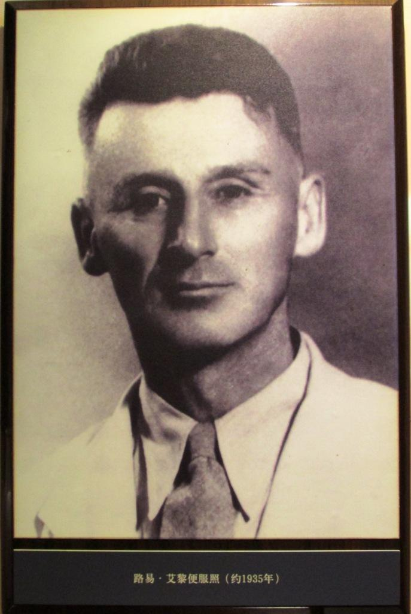
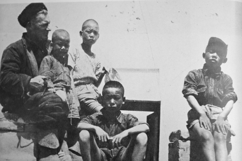

## 30年前的今天，北京培黎职业学院前身创始人、伟大的国际主义战士路易·艾黎去世

适合所有人的历史读物。每天了解一个历史人物、积累一点历史知识。三观端正，绝不戏说，欢迎留言。  

路易·艾黎小传：只因好奇心，一生献给了中国革命的新西兰友人

【1987年12月27日】30年前的今天，中国人民的老战士、老朋友、老战友路易·艾黎逝世

路易·艾黎（Rewi Alley，1897年12月2日－1987年12月27日），新西兰人，因为好奇来到中国，此后支持中国抗战，建立工业合作社，开办培黎学校，一生都留在了中国。

解放后，他写了大量书籍向外介绍新中国，并帮助中国与新西兰建交。邓小平称赞他是“中国人民的老战士、老朋友、老战友''。2009年由网民投票选出为“中国缘·十大国际友人”之一。

【和中国军人喝酒的新西兰人】

1897年12月2日，路易·艾黎出生于新西兰南岛，父亲是中学校长。

1916年，19岁的艾黎参军，被编入新西兰第二远征军，赴欧洲参加第一次世界大战。在战场上，艾黎首次近距离接触中国人，与由中国山东农民组成的劳工军团共同参加了在比利时的伊普尔战役。在一次换防轮休期，艾黎甚至和两名中国军人一起走进了酒吧。

回国后，他和一位同伙试图在荒山上建立农场，但未成功，但六年的艰苦劳作使他具备了非凡的耐力。

（青年时期的路易.艾黎）

【因为好奇来到中国】

1927年，30岁的艾黎对中国很好奇，决心到中国去看一看。4月21日，艾黎抵达中国的上海，当时正值四一二事件发生。艾黎原本只是想参观中国，但却终生留在了中国。

他在上海生活了10年。艾黎一开始担任虹口救火会的一名小队长，10个月后，升任消防处队长级的督察。1932年，出任上海公共租界工部局工业科首席工厂视察员。

任内经常到各工厂检查，当看到童工和包身工遭受的令人发指的折磨时，艾黎感到异常痛苦。艾黎对严重剥削工人并酿成事故的工厂主施压，但工厂主敷衍了事，艾黎也没有办法。

他从朋友借给他的《资本论》中受到启发：“我已经得出了结论，旧的制度必须推翻，我将永远尽力帮助把它推翻。”其间，他和美国籍爱尔兰裔传教士培黎成了好友。

（1935年的路易艾黎）

【支持中国革命的洋人】

1929年，艾黎利用假期参加中国华洋义赈会在绥远的赈灾工作。在开往绥远的火车上，艾黎结识了美国记者埃德加·斯诺，开始了二人延续半个世纪的友谊。

1932年末，经一位美国朋友介绍，艾黎结识了美国记者史沫特莱，经史沫特莱又结识了宋庆龄、鲁迅、冯雪峰、陈翰笙、黄华等中国左翼人士。

1935年底，艾黎在家中架设秘密电台，与长征途中的中国工农红军建立通信联系。艾黎的上海公共租界官员的身份，以及居住在租界内，使他从事革命工作时相对安全。

1936年，西安事变前夕，他冒险到山西太原，为中国共产党兑换中国工农红军在陕西缴获的地方钞票。1937年，抗日战争全面爆发后，艾黎将养子阿兰（段士谋）送到延安参加抗战。

（路易·艾黎和孤儿们）

【创建工业合作社】

1937年，抗日战争全面爆发后，艾黎和斯诺夫妇讨论后认为，“中国除非发现一个方法，动员劳力资源……建立工业根据地，否则必然是要失败的”。

1937年11月，胡愈之、林福裕、斯诺夫妇、艾黎等人在上海发起工业合作社运动，起草了《中国工业合作社运动》小册子，认为应利用中国大后方的工业资源和工人难民的人力资源，生产日用工业品和军需品。

该计划获得宋庆龄、周恩来和美国驻华大使的支持。在宋美龄要求孔祥熙必须尽快为“工合”开绿灯后，1938年8月5日，中国工业合作协会（简称“工合”）在汉口成立。

、史沫特莱(中)等国际友人在武昌.jpeg)

（1938年，周恩来与路易·艾黎(左一)、史沫特莱(中)等国际友人在武昌）

（路易·艾黎拍摄国统区支援抗战的合作社）

【遍及世界的工合】

1938年12月，工合迁到重庆，艾黎在重庆和全国十多个省发展“工合”组织，高峰期在全中国成立了2000多个工业合作社。

1939年2月，艾黎搭乘印度援华医疗队的车抵达延安，首次见到了毛泽东。

太平洋战争爆发后，美国组建了美国海军陆战队突击营，这支部队以“工合”（Gung-ho）为训练口号，运用八路军式的游击战术，曾在马金岛和瓜达尔卡纳尔岛大败日军。后来“工合”这个词扩大为美式英语中的俗语，衍伸出“起劲”、“卖力”及“热心”，甚至是“过分热心”的涵义。

【迁移2千公里的培黎学校】

1940年，43岁的艾黎在今陕西凤县创办“培黎工艺学校”，“培黎”是为纪念艾黎的好友，传教士培黎，也是取为黎明而培养之意。该校为合作社徒工及逃难的工农子弟开设。

1944年初，日军发动豫西战役，逼近潼关。当时的校长何克率60多名中国学生，翻山越岭2000余公里，到达甘肃山丹县，称为山丹培黎学校。在培黎学校，艾黎度过了将近10年，潜心教育。

1949年下半年，中国人民解放军攻占了山丹县。西北野战军司令员彭德怀邀艾黎到酒泉会面，赞扬了培黎学校的成绩及对解放军的支持。

（陕西凤县的艾黎旧居）

（甘肃山丹培黎学校）

【新中国的宣传者】

1951年初，艾黎到北京参加工合组织第一次全国会议。不久，山丹培黎学校由人民政府接管，外籍教师陆续离开。1953年，山丹培黎学校迁至兰州市安宁区，更名为兰州培黎石油学校，2006年升格为本科院校并更名为兰州城市学院。

艾黎决定留在中国，并开始在日记中记下新中国的见闻。1952年，这些日记得以出版，即艾黎的第一本书《有办法》。这本英文著作先后在新西兰再版三次，产生广泛影响。艾黎很快又写出《人民有力量》、《山丹》、《中国的故事》等著作。他在新西兰和中国出版了53部书，并翻译了许多中国古代著作。

（1960年,毛泽东主席与斯诺,路易·艾黎共进晚餐）

【中国人民的老战士】

“文革”爆发后，艾黎受到冲击。1968年8月31日，宋庆龄得知他的处境后，写来一份证明信。1972年，新西兰和中国建立大使级外交关系，艾黎为此做出不小的努力。

1977年12月2日，艾黎80岁生日，中国人民对外友好协会在人民大会堂为艾黎举办宴会，庆祝艾黎来华工作50周年。邓小平代表中共中央、中国政府和中国人民向路易·艾黎表示祝贺，尊称他为“中国人民的老战士、老朋友、老战友''。

1982年，北京市授予艾黎“北京市名誉市民”称号。同年被新西兰政府授予“英国女王社会服务勋章”。

（路易·艾黎（左）和宋庆龄）

【永远留在中国】

1983年，艾黎致信邓小平，恢复成立了中国工业合作协会。1983年5月，在北京建立了民办大学“民办人民科学文化大学”（1984年7月更名为培黎职业大学，1988年11月更名为北京培黎职业大学，2004年4月改为北京培黎职业学院）。不久，甘肃省山丹培黎学校也恢复了。

1987年12月2日，赵紫阳、李鹏到艾黎寓所为他祝贺90岁寿辰，新西兰总理也公开祝贺。1987年12月27日，他因脑血栓并发心功能衰竭在北京逝世，享年90岁。根据他的遗嘱，骨灰一半撒在山丹培黎学校原先的农场四坝滩，一半安放在山丹的墓地。邓小平为艾黎的墓碑题写了“伟大的国际主义战士永垂不朽”。

艾黎未留下任何遗产，他将自己收藏的文物全部捐给了山丹县。艾黎在遗嘱中表示：“希望将我的藏书放在一起，存于某个图书馆，以便得到使用”。1992年12月2日，中国人民对外友好协会将路易·艾黎的藏书转赠中国人民大学图书馆，中国人民大学成立了路易·艾黎纪念室。

（山丹培黎学校中艾黎与何克陵园）

（新西兰斯普林菲尔德的路易·艾黎纪念碑）

### 

